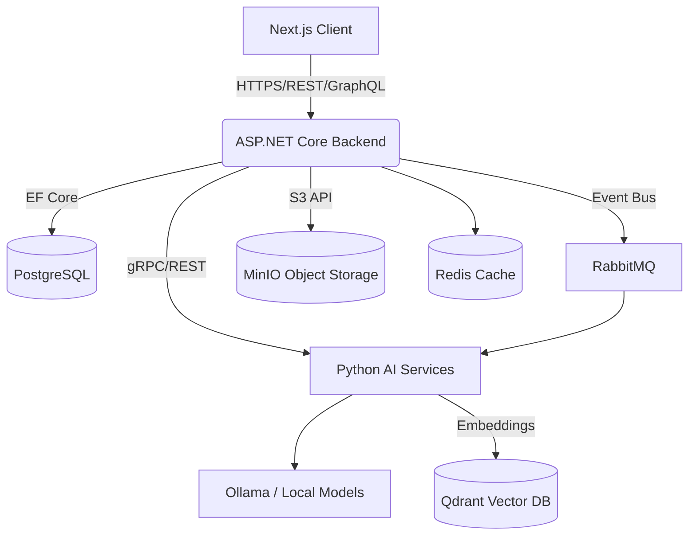
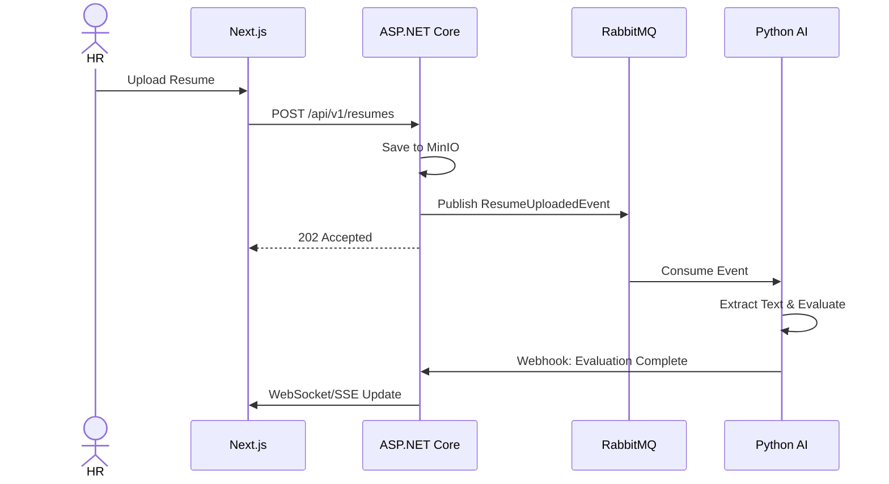

# FACULTYIQ ENTERPRISE ENGINEERING CONSTITUTION

> [!CAUTION]
> **IMMUTABLE DOCUMENT**
> This constitution governs every engineering, architectural, AI, research, and implementation decision across the FacultyIQ project. Everything produced in the future—including code, architecture, APIs, prompts, AI agents, database schemas, workflows, UI, documentation, and deployment—must comply with this constitution.

## DOCUMENT CONTROL
| Document ID | FACULTYIQ-CONST-001 |
|---|---|
| **Version** | 1.0.0 |
| **Status** | **APPROVED / BINDING** |
| **Scope** | Global Engineering, Architecture, Product, Research, UI/UX |

---

## 1. Purpose of this Constitution

The purpose of this Constitution is to serve as the absolute, non-negotiable master reference for all technical, product, and architectural decisions within the FacultyIQ organization. As FacultyIQ scales from a research-grade AI Recruitment Platform into a comprehensive Production SaaS Product, alignment across engineering nodes is paramount. This document prevents architectural drift, ensures deterministic outcomes across stochastic AI integrations, guarantees enterprise-grade security and maintainability, and enforces a unified, monolithic-to-microservice evolution path. It is the definitive law for all developers, architects, product managers, and AI researchers.

## 2. Vision

To become the undisputed global standard for AI-powered enterprise academic and faculty recruitment, operating with zero bias, absolute explainability, and unparalleled deterministic evaluation, fundamentally transforming how institutions identify, evaluate, and acquire world-class intellectual capital.

## 3. Mission

To engineer a fault-tolerant, scalable, and fully offline-capable AI recruitment platform that autonomously processes, structures, and evaluates highly complex multi-modal candidate profiles (resumes, video interviews, coding assessments) while adhering strictly to Evidence-First AI Principles and uncompromising enterprise software standards.

## 4. Engineering Philosophy

1. **Deterministic Foundations First**: Before invoking any non-deterministic system (LLMs, neural networks), all data must be structurally parsed, validated, and sanitized using deterministic algorithms.
2. **Fail Fast, Recover Autonomously**: Systems must detect anomalies at the perimeter. Invalid state must never propagate to the data layer. 
3. **Immutability of Audit Trails**: Every state change, every AI inference, and every user action is an immutable event.
4. **Ruthless Pragmatism over Hype**: Technologies are chosen for their stability, maintainability, and enterprise readiness, not for their novelty.
5. **Zero Trust Integration**: All system components (frontend, backend, AI runtimes, databases) must treat each other as potentially compromised and strictly validate all inter-process communications.

## 5. AI Philosophy

AI within FacultyIQ is treated as an unreliable copilot that must be continuously verified, corralled, and evaluated.
- **AI is an Optimizer, not a Database**: LLMs are used strictly for reasoning, semantic matching, and generation—never for factual recall or state management.
- **Constrained Generation**: All AI outputs must conform to strict JSON/Pydantic schemas and undergo validation before being ingested by the backend.
- **Model Agnosticism**: The platform must never be tightly coupled to a specific AI model. Abstraction layers must separate the application logic from the underlying LLM (e.g., Qwen 2.5, Llama 3.2).
- **Privacy by Default**: All sensitive faculty data is processed using local AI models (via Ollama) ensuring absolute data sovereignty and compliance.

## 6. Product Philosophy

FacultyIQ is a high-stakes enterprise tool. The product must exude trust, professionalism, and reliability. 
- **Frictionless Enterprise UX**: The interface must be deterministic, highly responsive, and accessible.
- **Transparency in AI Actions**: Users must always understand *why* the AI made a specific recommendation or evaluation. Explainable AI (XAI) is a non-negotiable product feature.
- **Data Density**: Enterprise users need high information density without cognitive overload. 

## 7. Software Design Philosophy

- **High Cohesion, Low Coupling**: Modules must encapsulate their domain logic entirely.
- **Interface Segregation**: Clients should not be forced to depend upon interfaces that they do not use.
- **Principle of Least Privilege**: Modules, services, and containers must operate with the absolute minimum permissions necessary.
- **Configuration over Hardcoding**: Magic numbers, URLs, and environment-specific toggles must reside in external configuration stores.

## 8. Architecture Philosophy



FacultyIQ adheres to a **Modular Monolith** architecture evolving towards **Event-Driven Microservices**.
- The Core Domain (ASP.NET Core 9) serves as the source of truth.
- AI Services (Python) operate as isolated, stateless workers asynchronously processing queues.
- Synchronous calls are reserved for immediate UI feedback; all heavy processing is asynchronous.

## 9. Documentation Philosophy

- **Code is the How, Architecture is the What, Documentation is the Why.**
- If a decision is not documented in an ADR (Architecture Decision Record), it did not happen.
- All APIs must be documented using OpenAPI/Swagger.
- All code modules must have explanatory docstrings/comments detailing edge cases and invariants.

## 10. Development Philosophy

- **Local First**: Every developer must be able to run the entire stack (Next.js, ASP.NET, Python AI, PostgreSQL, Redis, RabbitMQ, MinIO) locally via Docker Compose.
- **Test-Driven Design**: Write the interface and the test before the implementation.
- **Continuous Integration**: Main branch must always be in a deployable state.

## 11. Quality Philosophy

Quality is not a phase; it is an intrinsic property of the code.
- **Zero Broken Windows**: Technical debt must be addressed continuously.
- **100% Type Safety**: TypeScript must run in strict mode. C# must have nullable reference types enabled.
- **Automated Everything**: Linting, formatting, security scanning, and testing run on every commit.

## 12. Research Philosophy

As a research-grade platform, empirical evidence dictates adoption.
- New models (e.g., transitioning from Qwen 3B to a new architecture) require a formal A/B evaluation against a golden dataset.
- Research pipelines must be isolated from production pipelines to prevent data contamination.

## 13. Security Philosophy

- **Defense in Depth**: Security controls are layered (Network, Identity, Application, Data).
- **OWASP Top 10**: Strictly enforced mitigation for all standard web vulnerabilities.
- **PII / GDPR Compliance**: Resumes and interviews contain highly sensitive PII. Data must be encrypted at rest (MinIO/PostgreSQL) and in transit (TLS 1.3).

## 14. Scalability Philosophy

- **Statelessness**: Application servers (ASP.NET, Next.js, Python AI) must be 100% stateless. Session state resides in Redis.
- **Horizontal Scaling**: Traffic spikes (e.g., mass recruitment events) are handled by scaling out containers, not up.
- **Database Connection Pooling**: Must be explicitly configured to prevent connection exhaustion under load.

## 15. Maintainability Philosophy

- Code is read 10x more than it is written. Optimize for readability.
- Clever code is strictly forbidden. Boring, predictable code is mandated.
- Enforce strict folder structures and naming conventions globally.

## 16. Explainability Philosophy

- Every AI-driven evaluation must generate a deterministic trace linking the conclusion back to the original source data (e.g., "Score: 8/10. Evidence: Resume Line 43, Transcript Timestamp 04:12").
- Black-box decisions are unacceptable in recruitment scenarios.

## 17. AI Governance Principles

1. **Human-in-the-Loop (HITL)**: AI recommends; humans decide.
2. **Bias Mitigation**: Prompts and models must be regularly audited for gender, racial, and institutional bias.
3. **Auditability**: Every prompt and its corresponding completion must be logged with a unique trace ID.

## 18. Evidence First AI Principles

AI must not hallucinate qualifications. Before an AI generates an evaluation, it must first extract verbatim evidence from the provided context.
- **Step 1: Extraction**: Pull exact quotes/snippets.
- **Step 2: Verification**: Ensure quotes exist in the source text.
- **Step 3: Synthesis**: Generate the evaluation based *only* on the extracted evidence.

## 19. Deterministic Before LLM Principles

Do not use an LLM for a task that Regex, a parser, or a rules engine can solve.
- Extracting emails/phone numbers: Use Regex.
- Parsing dates: Use deterministic libraries.
- Evaluating sentiment/taxonomy: Use LLMs.

## 20. Offline First Principles

The core AI engine must be capable of running entirely disconnected from the internet.
- All models must be hosted locally via Ollama.
- No reliance on OpenAI, Anthropic, or external APIs for core processing.
- Ensures absolute data privacy for institutional clients.

## 21. Enterprise Coding Principles

- **No Magic Numbers**: Use Enums or Constants.
- **Early Returns**: Fail fast, reduce nesting (avoid arrowhead anti-pattern).
- **Immutability**: Prefer immutable data structures (e.g., C# records, Python frozen dataclasses, TS readonly).

## 22. Architecture Rules

- **Strict Layering**: The UI cannot talk directly to the Database. 
- **Gateway Pattern**: Next.js interacts with ASP.NET Core via defined API endpoints.
- **Asynchronous AI**: Next.js -> ASP.NET -> RabbitMQ -> Python AI. Never block the HTTP thread waiting for an LLM response.

## 23. Domain Driven Design Rules

- **Ubiquitous Language**: The codebase must reflect the business terminology (e.g., `Candidate`, `Evaluation`, `Institution`, `Requisition`).
- **Bounded Contexts**: Resume Parsing is a separate context from Interview Analysis. Do not share database tables across bounded contexts without an explicit API or Event layer.

## 24. Clean Architecture Rules

- **Entities**: Enterprise business rules.
- **Use Cases**: Application business rules.
- **Interface Adapters**: Controllers, Gateways, Presenters.
- **Frameworks and Drivers**: Web, DB, UI.
Dependencies must always point inward toward the Entities.

## 25. SOLID Principles Adoption

- **S**: Single Responsibility. A class should have one, and only one, reason to change.
- **O**: Open/Closed. Software entities should be open for extension, but closed for modification.
- **L**: Liskov Substitution. Subtypes must be substitutable for their base types.
- **I**: Interface Segregation. Many client-specific interfaces are better than one general-purpose interface.
- **D**: Dependency Inversion. Depend upon abstractions, not concretions.

## 26. Event Driven Principles

- Use **RabbitMQ** for decoupling the heavy AI processes.
- Events must be named in the past tense (e.g., `ResumeUploaded`, `InterviewProcessed`).
- Events must carry sufficient context (Payload) or a reference to retrieve the state (Event Carried State Transfer vs Event Notification).

## 27. Microservice Readiness Rules

While starting as a Modular Monolith, boundaries must be enforced:
- Do not use database joins across distinct bounded contexts.
- Communicate between modules via internal in-memory events (MediatR in C#) so they can easily be replaced by RabbitMQ later.

## 28. Modular Monolith Rules

- A single ASP.NET Core solution containing multiple isolated projects representing modules.
- Shared kernel is strictly limited to cross-cutting concerns (Authentication, Logging, Tracing).

## 29. API Design Principles

- RESTful semantics: POST for creation, PUT for idempotence, GET for read-only.
- Use standard HTTP status codes (200, 201, 400, 401, 403, 404, 500).
- All APIs must be versioned (e.g., `/api/v1/candidates`).
- Provide paginated responses for lists.

## 30. Database Principles

- **PostgreSQL**: Primary transactional store. Use UUIDv7 for primary keys to ensure temporal sorting and uniqueness.
- **Qdrant**: Vector database for semantic search. Store embeddings mapping back to PostgreSQL UUIDs.
- **Redis**: Caching and distributed locks.
- **Migrations**: Database schema changes must be version-controlled via Entity Framework Core Migrations.

## 31. Storage Principles

- **MinIO**: All unstructured data (Resumes PDF/DOCX, Video MP4, Audio) is stored here.
- Never store binary data in PostgreSQL. Store the MinIO object URI.
- Enforce strict bucket policies and presigned URLs for frontend access.

## 32. Prompt Engineering Principles

- **Versioning**: Prompts are code. They must be version-controlled in the repository, not stored in the database.
- **System Prompts**: Define the persona rigidly (e.g., "You are an expert HR evaluator...").
- **Few-Shot Prompting**: Always provide 1-2 examples of the desired output format (e.g., JSON) within the prompt.

## 33. Model Management Principles

- Standardize on `Qwen 2.5 3B` for reasoning, `Qwen2.5-Coder 3B` for coding evaluations, and `Llama 3.2 3B` for summarization.
- Models must be quantified to ensure they fit within standard enterprise GPU memory (e.g., 8GB-16GB VRAM).

## 34. Agent Design Principles

- Agents are state machines.
- Agents must have tools strictly typed and validated.
- Agents must never execute untrusted code without a secure sandbox (e.g., for coding evaluations).

## 35. AI Evaluation Principles

- Implement LLM-as-a-Judge pipelines for automated regression testing of prompt updates.
- Monitor metrics: Perplexity, Groundedness (Faithfulness to context), and formatting consistency.

## 36. Testing Philosophy

- **Unit Tests**: 80% coverage minimum. Test business logic in isolation.
- **Integration Tests**: Test database queries, Redis caching, and API endpoints against real (containerized) infrastructure.
- **E2E Tests**: Use Playwright for critical user journeys in Next.js.

## 37. Deployment Philosophy

- **Infrastructure as Code**: Define all environments in Docker Compose files.
- **Immutable Artifacts**: Docker images are built once and promoted across environments (Dev -> Staging -> Prod).
- **Environment Parity**: Dev, Staging, and Prod must be structurally identical.

## 38. Logging Philosophy

- Structured Logging only (JSON).
- Serilog (C#) and python-json-logger (Python).
- Required fields: `Timestamp`, `Level`, `TraceId`, `SpanId`, `Service`, `Message`.

## 39. Monitoring Philosophy

- Expose `/health` endpoints on every service.
- Monitor RED metrics: Rate, Errors, Duration.
- Use Prometheus and Grafana for telemetry visualization.

## 40. Configuration Philosophy

- Follow the 12-Factor App methodology.
- Store configuration in the environment.
- Use `.env` files for local development. Never commit `.env` to source control.


## 41. Naming Conventions

- **C# / Backend**: PascalCase for classes, methods, and properties. camelCase for local variables and parameters. Prefix interfaces with `I` (e.g., `ICandidateService`).
- **Python / AI**: snake_case for variables, functions, and modules. PascalCase for classes.
- **TypeScript / Frontend**: PascalCase for React components and types. camelCase for variables and functions.
- **PostgreSQL / DB**: snake_case for tables and columns. Pluralize table names (e.g., `candidates`).

## 42. Folder Structure Standards

### ASP.NET Core
```text
src/
  FacultyIQ.Domain/
  FacultyIQ.Application/
  FacultyIQ.Infrastructure/
  FacultyIQ.Presentation.API/
tests/
  FacultyIQ.Domain.Tests/
```

### Next.js
```text
src/
  app/
  components/
    ui/
    features/
  lib/
  hooks/
```

### Python
```text
src/
  facultyiq_ai/
    agents/
    prompts/
    services/
tests/
```

## 43. Branching Standards

- We use **Trunk-Based Development**.
- Branches must be short-lived (merged within 24 hours).
- Naming: `feature/ticket-123-short-desc`, `bugfix/ticket-456-short-desc`.
- All merges to `main` require a Pull Request, passing CI checks, and at least one code review.

## 44. Versioning Standards

- **Semantic Versioning (SemVer)**: `MAJOR.MINOR.PATCH`.
- MAJOR: Incompatible API changes.
- MINOR: Backward compatible functionality additions.
- PATCH: Backward compatible bug fixes.

## 45. Documentation Standards

- Code must be self-documenting through clear naming and small functions.
- Use Docstrings (Python), XML Comments (C#), and JSDoc (TypeScript) for public APIs and complex logic.
- Maintain a centralized `docs/` folder using Markdown for architecture overviews.

## 46. Diagram Standards

- All architectural diagrams must be written in **Mermaid.js** and embedded directly in Markdown files.
- Visio, Lucidchart, or binary image formats are strictly prohibited for architecture diagrams to ensure they are version-controlled alongside code.

## 47. Markdown Standards

- Use ATX-style headings (`#`, `##`).
- Limit line length to 100 characters for readability in raw text.
- Use standard GitHub Flavored Markdown (GFM).
- Include language identifiers for all code blocks (e.g., `python`).

## 48. Mermaid Standards

- Flowcharts should generally read Top-Down (`TD`) or Left-Right (`LR`).
- Sequence diagrams must clearly show the actor, frontend, API, message broker, and backend service.



## 49. Error Handling Standards

- **Never swallow exceptions.**
- Return structured problem details (RFC 7807) from APIs.
- Distinguish between client errors (4xx) and server errors (5xx).
- Use Result patterns (e.g., `Result<T, Error>`) instead of exceptions for expected business failures.

## 50. Exception Handling Rules

- Exceptions should be exceptional. Do not use exceptions for control flow.
- Catch exceptions at the highest appropriate level (e.g., a global exception handler middleware in ASP.NET Core).
- Log the full stack trace for 500-level errors, but never expose stack traces to the client.

## 51. Dependency Injection Rules

- Dependency Injection (DI) is mandatory across C#, Python, and React context where appropriate.
- Prefer Constructor Injection over Property or Method Injection.
- Do not register overly broad lifetimes (e.g., prefer Scoped over Singleton unless necessary).

## 52. Configuration Rules

- Configurations must be strongly typed (e.g., `IOptions<T>` in C#, Pydantic BaseSettings in Python).
- Fail fast on startup if a required configuration is missing.

## 53. Environment Variable Rules

- Prefix all environment variables with `FIQ_` (e.g., `FIQ_POSTGRES_CONNECTION_STRING`).
- Do not hardcode defaults for secrets in code.

## 54. Secrets Management

- Secrets (API Keys, DB Passwords) must never be committed to source control.
- Use AWS Secrets Manager, Azure Key Vault, or HashiCorp Vault in production.
- Use `.env.local` for local development.

## 55. Third Party Library Policy

- Every new dependency requires architectural approval.
- Prefer built-in libraries over third-party packages where feasible.
- Check licenses (MIT, Apache 2.0 preferred. GPL is strictly forbidden).

## 56. Package Management Rules

- C#: NuGet (`.csproj`). Pin versions explicitly.
- Python: `Poetry` or `uv`. `requirements.txt` must be pinned with hashes.
- Node.js: `npm` or `pnpm`. Commit the lockfile (`package-lock.json`).

## 57. Open Source Usage Policy

- FacultyIQ embraces open source but strictly prohibits copy-pasting code from unknown origins without review.
- Any open-source model used must allow commercial use (e.g., Llama 3.2, Qwen 2.5).

## 58. Performance Principles

- Response times for UI interactions must be < 200ms.
- Asynchronous processing tasks must be visible in the UI via status updates.
- Use Redis for caching frequently accessed, slow-changing data (e.g., institution taxonomies).

## 59. Memory Management Guidelines

- In C#, utilize `Span<T>` and `Memory<T>` for high-performance parsing to reduce garbage collection pressure.
- In Python, explicitly manage memory for large dataframes or AI tensors. Use `.detach()` and `.cpu()` in PyTorch when storing historical data.

## 60. GPU Utilization Guidelines

- Batch inference requests where possible to maximize GPU throughput.
- Unload unused models from VRAM automatically after a timeout period.
- Standardize on FP16 or Int8 quantization for deployment to optimize VRAM.

## 61. Local AI Model Guidelines

- Ollama is the standard runtime for local AI inference.
- Models must be defined via Modelfiles in the repository to ensure reproducible environments.
- Always set a system message and temperature=0.0 for deterministic evaluation tasks.

## 62. Ollama Usage Standards

- Do not expose the Ollama API directly to the internet. It must sit behind the Python AI service.
- Use streaming responses for long generations to provide early feedback, unless strict JSON validation is required.

## 63. Resume Intelligence Standards

- Resumes are highly unstructured.
- The pipeline: OCR/Text Extraction -> Structuring (LLM extraction to JSON) -> Validation (against original text) -> Scoring.
- The extracted JSON must conform to the `CandidateProfile` schema.

## 64. Interview Standards

- Video interviews must be transcribed using Whisper (local).
- Transcripts are diarized (Speaker 1, Speaker 2).
- The AI evaluates the transcript for communication skills, domain knowledge, and behavioral flags.
- MediaPipe/OpenCV may be used for eye-tracking/attention monitoring, but results must be heavily caveated and strictly optional to avoid bias.

## 65. Coding Evaluation Standards

- Code submissions must be executed in an isolated, ephemeral Docker container (sandbox).
- Qwen2.5-Coder 3B evaluates code quality, complexity (cyclomatic), and adherence to SOLID principles, not just correct execution.

## 66. Bloom Taxonomy Standards

- All technical evaluations must classify questions and candidate responses according to Bloom's Taxonomy (Remember, Understand, Apply, Analyze, Evaluate, Create).
- Higher-tier roles require evidence of "Analyze" and "Create".

## 67. Decision Engine Standards

- The Decision Engine aggregates scores from Resumes, Interviews, and Code.
- It does not make a binary Hire/No Hire decision. It outputs a `Confidence Score` and a `Risk Profile`.
- The final calculation must be a pure, deterministic mathematical function combining the individual AI scores, allowing for weight adjustments by the institution.

## 68. Explainable AI Standards

- Every score must have an accompanying `Justification` field.
- The Justification must reference specific inputs (e.g., "Line 12 of the code submission uses an O(N^2) algorithm when O(N log N) is possible").

## 69. Future Expansion Rules

- The platform is designed for Faculty Recruitment today but must support general Enterprise Recruitment tomorrow.
- Domain models must abstract the concept of `Institution` to `Organization`, and `Faculty` to `Candidate`.

## 70. Non-Negotiable Engineering Rules

1. No direct DB access from the UI.
2. No blocking the main thread for AI inference.
3. No secrets in source control.
4. No deploying without tests.
5. No bypassing the API Gateway.

## 71. Architecture Decision Record (ADR) Policy

- Any change that affects the architecture, adds a new dependency, or alters a data model requires an ADR.
- ADRs must follow the Michael Nygard format (Context, Decision, Status, Consequences).

## 72. Definition of Done

A feature is "Done" when:
- Code is written and adheres to the Constitution.
- Unit and Integration tests are passing.
- Code has been reviewed by at least one peer.
- Documentation (Swagger, Docstrings) is updated.
- Deployed successfully to the Staging environment.

## 73. Definition of Production Ready

- Passed all security and vulnerability scans.
- Load testing verifies performance under 10x expected peak load.
- Logging, monitoring, and alerting are fully configured.
- Runbooks for disaster recovery are updated.

## 74. Definition of Enterprise Ready

- Support for Single Sign-On (SAML/OIDC).
- Role-Based Access Control (RBAC) implemented.
- SOC2 and GDPR compliance audited.
- Data export and retention policies enforced.

## 75. Long-term Product Vision

FacultyIQ will evolve from an evaluation tool to a complete talent lifecycle platform, incorporating predictive attrition modeling, compensation parity analysis, and automated onboarding—all governed by the same strict, deterministic, and explainable AI principles defined herein.

## 76. Engineering Culture

- **Psychological Safety**: Blameless post-mortems. We attack problems, not people.
- **Continuous Learning**: Allocate 10% of time to research and prototyping.
- **Ownership**: You build it, you run it.

## 77. Conclusion

This Constitution is the bedrock of FacultyIQ. By adhering strictly to these principles—Evidence-First AI, Deterministic Foundations, Clean Architecture, and uncompromising enterprise quality—we ensure that FacultyIQ is not just another wrapper around an LLM, but a defensible, scalable, and trusted enterprise platform. 

This document is living but immutable in principle. Any proposed changes require executive architectural consensus. Proceed with discipline.

