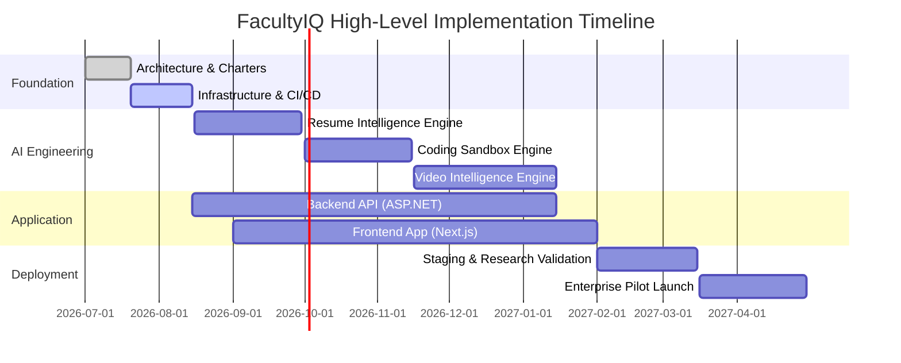

# FACULTYIQ PROJECT CHARTER

## APPROVAL FRAMEWORK
| Document Status | Version | Owner | Classification |
|---|---|---|---|
| **APPROVED / BINDING** | 1.0.0 | Chief Executive Officer | Public (Internal / Stakeholders) |

> [!CAUTION]
> **GOVERNING DOCUMENT**
> This Project Charter defines the formal mandate, strategic direction, and operational boundaries of the FacultyIQ platform. It serves as the absolute reference for investors, founders, researchers, and engineers. All downstream activities must align with this document.

---

## 1. Executive Summary

FacultyIQ is a research-driven enterprise software platform designed to revolutionize the academic and institutional recruitment landscape. Currently, the process of identifying, evaluating, and hiring world-class faculty and technical educators relies heavily on fragmented workflows, manual resume parsing, subjective interview assessments, and disconnected coding evaluations. This results in significant institutional overhead, systemic bias, and a poor candidate experience. 

FacultyIQ introduces an integrated, offline-capable, AI-powered ecosystem that autonomously processes multi-modal candidate profiles. By leveraging advanced local Large Language Models (LLMs), Computer Vision, and deterministic execution sandboxes, FacultyIQ systematically evaluates resumes, video interviews, and coding assessments. The platform adheres strictly to "Evidence-First" AI principles, ensuring that every evaluation is explainable, transparent, and grounded in deterministic data. As it evolves from a research foundation into a full-fledged Enterprise SaaS product, FacultyIQ will become the definitive standard for institutional talent acquisition.

---

## 2. Vision Statement

### Long-Term Vision
To fundamentally transform how the world identifies and acquires intellectual capital by providing a zero-bias, highly explainable, and universally accessible AI evaluation platform.

### Five-Year Vision
To become the dominant recruitment infrastructure for North American and European universities, seamlessly integrating with existing Learning Management Systems (LMS) and Human Resource Information Systems (HRIS) to automate the entire faculty talent lifecycle.

### Ten-Year Vision
To expand beyond academia into global enterprise recruitment, establishing FacultyIQ as the underlying intelligence layer for Fortune 500 hiring, standardizing how human capability is measured across disciplines globally.

### Future Aspirations & Global Impact
By removing systemic human bias from the recruitment pipeline, FacultyIQ aims to democratize access to elite academic and enterprise roles, ensuring that talent is identified solely on the merit of evidence, pedagogical capability, and technical prowess.

---

## 3. Mission Statement

### Mission
To engineer a fault-tolerant, fully explainable AI recruitment platform that autonomously evaluates multi-modal candidate data while adhering strictly to enterprise-grade security and deterministic architectural standards.

### Core Objectives
1. Eliminate subjective bias in technical and pedagogical evaluations.
2. Reduce the time-to-hire for academic institutions by 80%.
3. Provide absolute transparency in AI decision-making.

### Alignment
This mission supports the long-term vision by building the trust necessary for institutions to adopt AI in high-stakes recruitment decisions. Without explainability and offline privacy, the vision of global adoption is impossible.

---

## 4. Problem Statement

The current faculty recruitment process is structurally broken across multiple dimensions:

- **Bias**: Human evaluators inherently possess unconscious biases regarding academic pedigree, gender, and demographics.
- **Manual Effort**: Search committees spend hundreds of hours manually reviewing unstructured CVs and parsing cover letters.
- **Inconsistent Evaluations**: A candidate's rating often depends more on the mood of the evaluator and the time of day than on the candidate's actual qualifications.
- **Lack of Transparency**: Rejected candidates rarely receive actionable feedback. Decisions are hidden behind closed doors.
- **Difficulty Assessing Teaching Ability**: Traditional interviews fail to systematically measure pedagogical effectiveness or adherence to educational frameworks like Bloom's Taxonomy.
- **Difficulty Assessing Coding Skills**: Technical evaluations are often disconnected from the primary HR system and rely on arbitrary LeetCode-style questions rather than practical architectural thinking.
- **Institutional Challenges**: Universities face massive compliance, privacy, and data sovereignty hurdles when attempting to adopt cloud-based AI recruitment tools.
- **Scalability Limitations**: A single job posting can attract thousands of global applicants. Human committees simply cannot scale to evaluate everyone fairly.

---

## 5. Proposed Solution

FacultyIQ is a comprehensive ecosystem designed to resolve these pain points through a **Modular Monolith** architecture driven by localized, offline-first AI.

### Major Subsystems
- **Resume Intelligence Engine**: Ingests unstructured PDFs/DOCXs, uses OCR, and applies LLM-driven deterministic extraction to build structured JSON profiles.
- **Video Interview Engine**: Processes video submissions, uses Whisper for local transcription, diaraizes speakers, and evaluates communication and pedagogical skills.
- **Coding Evaluation Sandbox**: An ephemeral Docker-based sandbox that executes candidate code safely, analyzing performance, Big-O complexity, and SOLID principle adherence.
- **Decision Engine**: Aggregates scores across all modalities to generate a holistic, explainable `Risk Profile` and `Confidence Score`.
- **Explainability Layer**: Ensures every AI conclusion is mapped directly to a verifiable quote, timestamp, or line of code from the candidate's submission.

AI does not make the final hiring decision; it acts as an ultra-efficient, perfectly consistent, and unbiased copilot that surfaces the most qualified individuals for human review.

---

## 6. Business Objectives

### Short-Term (Months 1-6)
- Finalize the core system architecture and AI pipelines.
- Deliver a functional prototype capable of evaluating Resumes and Code offline.
- Validate the "Evidence-First" AI methodology through internal research.

### Medium-Term (Months 6-18)
- Deploy Pilot programs with 3 partner universities.
- Achieve a 95% accuracy rate in automated resume extraction.
- Publish initial findings on AI bias mitigation in academic recruitment.

### Long-Term (Months 18-36)
- Transition from a standalone research platform to a multi-tenant Enterprise SaaS.
- Achieve SOC2 and GDPR compliance.

### Commercial & Strategic
- Establish recurring revenue models based on evaluation volume.
- Build integrations with major ATS (Applicant Tracking Systems) like Workday and Greenhouse.

---

## 7. Success Criteria

| KPI | Target | Measurement Strategy |
|---|---|---|
| **Recruitment Accuracy** | > 95% | Human-in-the-loop validation of AI scores. |
| **AI Response Latency** | < 15s per Resume | APM telemetry (Prometheus/Grafana). |
| **Recruiter Productivity** | 80% Time Reduction | A/B testing manual vs. AI-assisted screening. |
| **System Availability** | 99.9% Uptime | Synthetic monitoring. |
| **Evaluation Consistency** | < 2% Variance | Running the exact same profile 100 times through the local LLM at temp=0.0. |

---

## 8. Scope

### In Scope
- Offline-first AI processing (Ollama).
- Resume parsing (PDF/Text).
- Video transcription and text-based evaluation.
- Secure coding sandboxes.
- Web-based Dashboard (Next.js) and Backend (ASP.NET Core).

### Out of Scope
- Real-time live interviewing avatars.
- Payroll and benefits management.
- Cloud-dependent LLM evaluation (e.g., OpenAI API) for core PII data.

### Future Scope
- Predictive attrition analytics.
- Automated onboarding plan generation.
- Commercial API ecosystem.

---

## 9. Stakeholders

| Stakeholder | Responsibilities | Needs | Expected Outcomes |
|---|---|---|---|
| **Founder / Execs** | Strategic direction, funding, partnerships. | Fast time-to-market, defensible IP. | A highly scalable, profitable enterprise platform. |
| **Recruiters / HR** | Managing requisitions, communicating with candidates. | Tooling to reduce manual resume sorting. | 80% reduction in time-to-hire. |
| **Interview Panels** | Final decision making. | Summarized, evidence-backed candidate briefs. | Higher quality final-round candidates. |
| **Candidates** | Submitting artifacts (resumes, code, video). | Fair, unbiased evaluation and transparency. | Constructive feedback on rejections. |
| **System Admins** | Deploying and maintaining the system. | Clear documentation, easy Docker deployment. | Low maintenance overhead, high stability. |

---

## 10. Product Principles

1. **Evidence First**: AI cannot hallucinate skills. Every claim must have a citation.
2. **Offline First**: PII and sensitive candidate data never leave the institutional firewall.
3. **Transparency**: The system must expose the exact prompts and models used to evaluate a candidate.
4. **Fairness**: Routine algorithmic audits must be conducted to prove zero demographic bias.
5. **Human Oversight**: The AI recommends; the human decides.
6. **Security by Design**: Zero-trust architecture between frontend, backend, and AI workers.
7. **Extensibility**: The system must easily support new evaluation modalities in the future.

---

## 11. Core Values

- **Technical Excellence**: We do not take shortcuts. We build enterprise-grade, deterministic software.
- **Trust**: We operate in a high-stakes domain (people's careers). Trust is our primary currency.
- **Research-Driven**: We validate our assumptions empirically before writing product code.
- **User Centricity**: The interface must obscure the immense complexity of the AI pipeline, presenting simple, actionable insights.

---

## 12. Project Governance

- **Decision Hierarchy**: CEO > CTO/Architect > Engineering Leads.
- **Architecture Ownership**: All architecture decisions require an approved Architecture Decision Record (ADR).
- **Code Ownership**: Trunk-based development. Code cannot be merged without a PR and passing CI/CD tests.
- **Risk Management**: Bi-weekly risk review meetings evaluating technical and business threats.

---

## 13. High-Level Timeline

---

## 14. Deliverables

1. **Architecture & Standards**: Project Charter, Engineering Constitution, Documentation Style Guide.
2. **Software Assets**: Next.js Frontend, ASP.NET Core Backend, Python AI Services.
3. **AI Models**: Quantized Ollama models (`Qwen 2.5`, `Llama 3.2`) configured with specific Modelfiles.
4. **Deployment Assets**: Docker Compose networks, Kubernetes manifests (future).
5. **Research Outputs**: Validation reports on AI evaluation accuracy vs. human baselines.

---

## 15. Risks

| Risk Category | Risk Description | Probability | Impact | Mitigation Strategy |
|---|---|---|---|---|
| **Technical** | Local LLMs (Ollama) fail to process complex JSON deterministically. | Medium | High | Use constrained generation (Instructor/Outlines) and strict parsing fallbacks. |
| **Security** | Coding sandbox escape by malicious candidate code. | Low | Critical | Isolate Docker containers without network access; enforce strict resource limits. |
| **Business** | Institutions refuse to trust AI for hiring decisions. | High | High | Emphasize "Evidence-First" XAI (Explainable AI) and Human-in-the-Loop workflows. |
| **Operational** | VRAM constraints limit parallel evaluation throughput. | Medium | Medium | Implement RabbitMQ queueing and scale AI workers horizontally across multiple GPUs. |

---

## 16. Assumptions

- **Hardware**: Target deployment environments have access to at least 16GB-24GB VRAM (e.g., NVIDIA RTX 3090/4090 or enterprise equivalents) for local AI execution.
- **Offline Mode**: Institutions demand complete data sovereignty; relying on OpenAI/Anthropic APIs is structurally unacceptable for core PII.
- **Software**: Modern container orchestration (Docker/K8s) is acceptable to the client's IT department.

---

## 17. Constraints

- **AI Models**: Must use open-weights models that permit commercial use (e.g., Llama 3.2, Qwen 2.5).
- **Time**: Prototype must be ready for validation within 6 months to secure pilot partnerships.
- **Budget**: Heavy optimization of open-source tooling is required before committing to expensive enterprise licenses.

---

## 18. Strategic Roadmap

1. **Architecture Phase**: Establish Constitutions, Standards, and ADRs.
2. **Development Phase**: Build the core Modular Monolith and initial AI engines.
3. **Validation Phase**: Run internal datasets (historical resumes/interviews) through the engine and compare with known human outcomes.
4. **Pilot Phase**: Deploy on-premise for 3 early-adopter universities.
5. **Production Phase**: Refine the UI/UX based on recruiter feedback; harden the system for scale.
6. **Enterprise Phase**: Migrate to a cloud-based, multi-tenant SaaS architecture (for clients who do not require strict air-gapped on-premise deployments).

---

## 19. Future Vision

- **AI Marketplace**: Allowing institutions to upload custom evaluation models tuned to their specific pedagogy.
- **LMS Integrations**: Automatically syncing hired faculty into Canvas, Blackboard, or Moodle.
- **Enterprise SaaS**: Branching FacultyIQ into "EnterpriseIQ" for standard corporate hiring (Software Engineers, PMs, Executives).

---

## 20. Architecture Summary

- **Frontend**: Next.js, React, TailwindCSS.
- **Backend**: ASP.NET Core 9 (Modular Monolith), EF Core.
- **AI Services**: Python (FastAPI/Celery), Ollama (Qwen 2.5 3B).
- **Infrastructure**: PostgreSQL (Relational), Redis (State), MinIO (Blob), RabbitMQ (Events).

---

## 21. Project Success Definition

- **Engineering**: Code is maintainable, tested (80% coverage), and deployments are fully automated.
- **Research**: The AI accurately identifies the top 10% of candidates with statistical parity to human experts, but 100x faster.
- **Business**: Secure 3 pilot institutions within 12 months.
- **User**: Recruiters report an overwhelmingly positive NPS score due to massive time savings.

---

## 22. Approval Framework

This document must be formally reviewed and approved by the founding and architectural leadership. Any future amendments require a Pull Request and sign-off from the Project Owner.

| Role | Name/Title | Date | Signature |
|---|---|---|---|
| **Author / Project Owner** | Chief Executive Officer | 2026-07-19 | *Approved via PR* |
| **Technical Reviewer** | Principal Architect | 2026-07-19 | *Approved via PR* |
| **Product Reviewer** | Chief Product Officer | 2026-07-19 | *Approved via PR* |

***End of Document***

