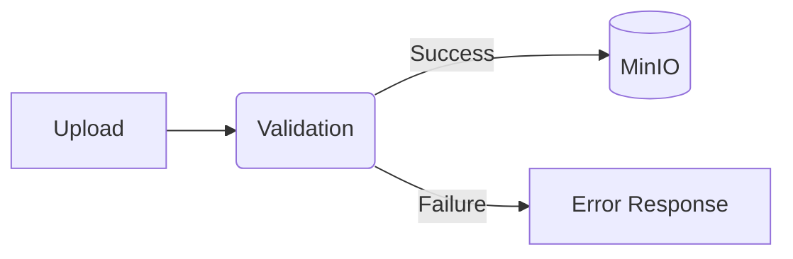
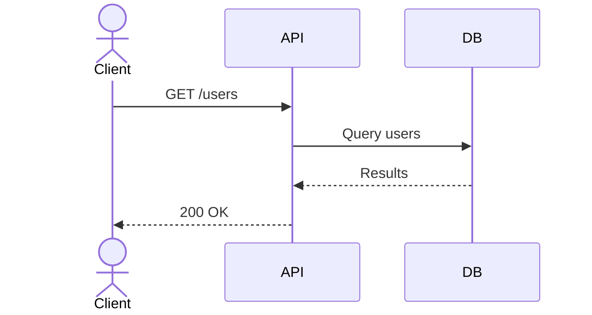
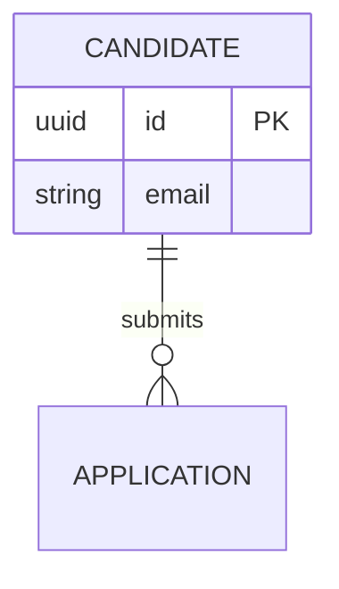

# FACULTYIQ DOCUMENTATION STYLE GUIDE

## DOCUMENT CONTROL
| Document ID | FACULTYIQ-DOC-STD-001 |
|---|---|
| **Version** | 1.0.0 |
| **Status** | **APPROVED / BINDING** |
| **Scope** | Global Engineering, Architecture, Product, Research, UI/UX |

> [!CAUTION]
> **MANDATORY COMPLIANCE**
> This is the official engineering documentation standard for FacultyIQ. Every Markdown document, API specification, Architecture Decision Record (ADR), AI module spec, and database schema definition within this repository must adhere strictly to these conventions.

---

## 1. Purpose

The purpose of this Style Guide is to enforce uniformity, readability, and structural predictability across all FacultyIQ technical documentation. Consistent documentation reduces cognitive load, accelerates onboarding, minimizes ambiguity in architectural interpretation, and ensures that the transition from a research-grade platform to a production enterprise SaaS product is seamless. By standardizing formatting, tone, diagrams, and templates, we ensure that every document reads as if it were authored by a single, highly disciplined engineering organization.

## 2. Scope

This guide applies to:
- All `.md` and `.mdx` files within the FacultyIQ repository.
- Architecture Decision Records (ADRs).
- API Specifications (including Swagger/OpenAPI annotations that generate documentation).
- Database schemas and migration documentation.
- AI Agent, Model, and Prompt specifications.
- Research papers, hypotheses, and evaluation metrics documentation.
- Code comments and docstrings that form the basis of generated documentation.

## 3. Documentation Principles

1. **Single Source of Truth**: Never duplicate information. Reference it. If an architecture diagram exists in `ARCHITECTURE.md`, do not redraw it in a feature PRD. Link to it.
2. **Docs as Code**: Documentation lives in the repository alongside the code it describes. It is versioned, reviewed, and deployed via the same CI/CD pipelines.
3. **Optimized for Skimming**: Engineers do not read documentation linearly; they scan for answers. Use headers, bullet points, bold text, and tables aggressively to surface critical information.
4. **Implementation over Theory**: Unless it is a research document, all documentation must directly aid implementation, testing, or deployment. 
5. **Living but versioned**: Documentation must evolve with the code. A Pull Request that alters system behavior without updating corresponding documentation must be rejected.

## 4. Writing Principles

- **Precision**: Use exact terminology. Do not say "the user." Say "the Institution Admin" or "the Candidate." Do not say "the database." Say "PostgreSQL `candidates` table."
- **Clarity**: Prefer short sentences. Aim for an 8th-grade reading level, even for complex technical concepts. 
- **Consistency**: Use the exact terms defined in the Terminology Dictionary (Chapter 29). Never use synonyms for established domain entities (e.g., do not alternate between "Applicant" and "Candidate").
- **Neutral Tone**: Avoid marketing speak, hyperbole, or motivational fluff. Omit words like "cutting-edge", "revolutionary", or "seamless". Stick to facts and mechanics.
- **Technical Accuracy**: Ensure every code snippet, schema, and API endpoint documented is structurally correct and compiles/parses in isolation.
- **Implementation Focus**: The writing must answer "How do I build this?", "How does this fail?", and "How is this monitored?".

---

## 5. Markdown Standards

- **Heading hierarchy**: Strictly enforce `H1` to `H5`. Do not skip levels (e.g., jumping from `H1` to `H3` is prohibited).
- **Lists**: Use `-` for unordered lists. Use `1.` for ordered lists. Sub-lists must be indented by exactly 4 spaces.
- **Tables**: Use GFM (GitHub Flavored Markdown) tables. All tables must have headers. Align columns using `:` if specific alignment is required.
- **Code blocks**: Always use fenced code blocks with the appropriate language identifier (e.g., ```typescript).
- **Notes/Warnings/Tips/Quotes**: Use blockquotes `>` for quotes. Use GitHub alert syntax `> [!NOTE]`, `> [!WARNING]`, `> [!IMPORTANT]`, `> [!TIP]`, `> [!CAUTION]` for callouts.
- **Hyperlinks**: Use descriptive link text. Never use "Click here". Instead: `[See the Candidate API](#12-api-documentation-standard)`.
- **Internal links**: Use relative paths for internal repository links to ensure they work offline or across branches.

---

## 6. Heading Standards

- `# H1`: **Document Title.** Used exactly once per file, at the very top. (e.g., `# API Reference`)
- `## H2`: **Major Sections.** Used for primary chapters or major divisions. (e.g., `## Authentication`)
- `### H3`: **Sub-sections.** Used for dividing major sections into logical components. (e.g., `### JWT Tokens`)
- `#### H4`: **Granular Details.** Used for specific components, endpoints, or rules. (e.g., `#### Token Expiration`)
- `##### H5`: **Edge Cases/Notes.** Rarely used, reserved for specific inline callouts.

---

## 7. Table Standards

All tables must have a clear header and use consistent column naming.

### Requirements Table Example
| Req ID | Description | Priority | Target Sprint | Status |
|---|---|---|---|---|
| REQ-01 | Candidates must upload PDFs up to 5MB. | High | Sprint 4 | **Done** |

### API Table Example
| Method | Endpoint | Description | Auth Required |
|---|---|---|---|
| `GET` | `/api/v1/candidates` | List candidates | Yes (Admin) |

### AI Model Table Example
| Model Name | Task | Context Window | VRAM Reqs | Fallback |
|---|---|---|---|---|
| `Qwen 2.5 3B` | Extraction | 8k | 8GB | None |

---

## 8. Mermaid Diagram Standards

Mermaid is the ONLY approved diagramming tool.

- **Flowcharts**: `graph TD` (Top-Down) or `graph LR` (Left-Right).
- **Sequence Diagrams**: Must include `actor` and `participant`.
- **Class Diagrams**: Use strictly for core Domain Entities.
- **Entity Relationship Diagrams**: Use `erDiagram`.
- **Architecture Diagrams**: Represent macro-services and infrastructure.

### Flowchart Example


### Sequence Diagram Example


### ER Diagram Example


---

## 9. Architecture Diagram Rules

1. **Spacing**: Keep nodes visually distinct. Group related nodes inside `subgraph`.
2. **Naming**: Nodes must clearly state the technology and role (e.g., `API[ASP.NET Core API]`).
3. **Layering**: UI -> Gateway -> App Services -> Message Broker -> AI/Workers -> Databases.
4. **Arrow conventions**: Solid lines `-->` for synchronous calls. Dotted lines `-.->` for asynchronous events.
5. **Database representation**: Use cylindrical nodes `[(DatabaseName)]`.
6. **External systems**: Represent as distinct subgraphs or with a specific styling class to indicate they are out-of-bounds.
7. **Queues**: Represent using standard nodes, clearly labeled (e.g., `Q[RabbitMQ]`).

---

## 10. Code Block Standards

- Must specify language (e.g., `json`, `csharp`, `python`, `typescript`, `sql`, `bash`, `powershell`).
- Indentation is strictly 4 spaces for C#/Python, 2 spaces for TS/JS/JSON/YAML.

### JSON Example
```json
{
  "candidateId": "c8a4f1a2-1e9a-4c9f-8a0b-1f1f9c8f9b9a",
  "status": "EVALUATED"
}
```

### C# Example
```csharp
public async Task<Result> ProcessCandidateAsync(Guid candidateId)
{
    // Business logic
}
```

---

## 11. Image Standards

- Only used when Mermaid cannot suffice (e.g., UI Mockups).
- **Captions**: Must follow immediately below the image as italicized text: `*Figure 1: Dashboard UI Mockup*`.
- **Alt text**: Must accurately describe the image for screen readers and search.
- **Resolution**: High-DPI (Retina) PNG or WebP formats preferred. Max width 800px.
- **Placement**: Center-aligned.


---

## 12. API Documentation Standard

Every API Endpoint must follow this exact template:

### `POST /api/v1/evaluations`
**Purpose**: Submits a candidate profile for AI evaluation.
**Auth**: Bearer Token (Role: `Admin`, `Recruiter`)
**Headers**:
- `Content-Type: application/json`
- `X-Correlation-ID: <uuid>`

**Request Schema**:
```json
{
  "resumeId": "uuid",
  "jobRequisitionId": "uuid"
}
```

**Response (202 Accepted)**:
```json
{
  "evaluationJobId": "uuid",
  "status": "PENDING"
}
```

**Error Codes**:
- `400 Bad Request`: Invalid UUIDs.
- `404 Not Found`: Resume or Requisition does not exist.
- `429 Too Many Requests`: Rate limit exceeded.

---

## 13. Database Documentation Standard

Every database table must follow this template:

### Table: `candidates`
**Purpose**: Stores core candidate profile information.
**Schema**: `public`

| Column | Type | Constraints | Description |
|---|---|---|---|
| `id` | `uuid` | PK, Default `uuid_generate_v7()` | Primary Identifier |
| `email` | `varchar(255)` | UNIQUE, NOT NULL | Contact email |
| `created_at` | `timestamptz` | NOT NULL, Default `now()` | Audit timestamp |

**Indexes**:
- `idx_candidates_email` on `email` (BTREE)

**Relationships**:
- 1:N with `evaluations.candidate_id`

---

## 14. AI Documentation Standard

Every AI model integration must document:

### Module: ResumeExtractor
- **Purpose**: Parses unstructured resume text into a structured `CandidateProfile` JSON.
- **Model**: `Qwen 2.5 3B` (via Ollama)
- **Prompt**: Located in `src/facultyiq_ai/prompts/resume_extraction_v2.txt`.
- **Inputs**: Raw Markdown text from PDF OCR.
- **Outputs**: Strictly typed JSON adhering to Pydantic schema `CandidateProfile`.
- **Context Limit**: 8192 tokens.
- **Fallback**: If JSON parsing fails 3 times, model defaults to Human Review Queue.
- **Evaluation**: Must maintain > 95% key-value extraction accuracy against golden dataset `eval_set_v1`.

---

## 15. Agent Documentation Standard

### Agent: CodingEvaluatorAgent
- **Responsibilities**: Execute user-submitted code in a sandbox, capture stdout/stderr, and analyze algorithmic complexity.
- **Dependencies**: Docker SDK, Qwen2.5-Coder 3B.
- **Inputs**: Code snippet (string), Language enum.
- **Outputs**: `EvaluationScore` object containing execution result and Big-O estimate.
- **Error Handling**: Hard timeout at 10 seconds. Kills Docker container on timeout. Returns Score 0.

---

## 16. Service Documentation Standard

Every microservice or domain module must have a `README.md` at its root detailing:
1. Ownership (Team/Person)
2. Build instructions
3. Run instructions (Docker compose)
4. Environment Variables required.

---

## 17. Repository Documentation Standard

The root `README.md` must contain:
- Quickstart guide.
- System prerequisites.
- Link to this Constitution and Style Guide.
- Branching policy summary.

---

## 18. Folder Documentation Standard

Any folder containing significant architectural boundaries (e.g., `src/FacultyIQ.Infrastructure`) must contain a `README.md` explaining why the folder exists and what classes belong inside it.

---

## 19. Configuration Documentation Standard

Configurations must be documented in a central `CONFIG.md` detailing every environment variable across all services, its default value, and its purpose.

---

## 20. Security Documentation Standard

Security architectures (e.g., JWT flow, RBAC policies, network isolation in Docker) must be documented in `SECURITY.md`. Must include a Threat Model diagram (Mermaid).

---

## 21. Logging Documentation Standard

Define standard Serilog properties.
- `TraceId`: For distributed tracing.
- `UserId`: For auditing.
- `TenantId`: For multi-tenant isolation.

---

## 22. Testing Documentation Standard

Tests must be divided into:
- `Unit`: Fast, no I/O.
- `Integration`: DB/Redis/MinIO required.
- `E2E`: Full browser execution via Playwright.

---

## 23. Deployment Documentation Standard

Document the deployment pipeline from `git push` to production deployment, including GitHub Actions steps, Docker registry pushes, and Kubernetes/Compose updates.

---

## 24. Research Documentation Standard

Research spikes (e.g., evaluating a new OCR engine) must result in a document outlining:
- Hypothesis.
- Methodology.
- Datasets used.
- Results (Metrics).
- Conclusion/Recommendation.

---

## 25. ADR Documentation Standard

**Title**: ADR-[00X]: [Short Title]
**Date**: YYYY-MM-DD
**Status**: [Draft | Proposed | Approved | Rejected | Deprecated]

### Context
Why are we making this decision? What is the problem?

### Decision
What is the specific architectural choice we are committing to?

### Alternatives Considered
What else did we look at and why did we reject it?

### Consequences
What are the trade-offs? What becomes harder? What becomes easier?

---

## 26. Versioning Rules

- **SemVer** for Code.
- **Documentation Versions**: Use date-based tags in the header or `vX.Y.Z` matching the codebase release.
- **Status Tags**: Clearly mark documents as `Draft`, `Approved`, `Deprecated`, or `Archived` at the top.

---

## 27. Cross Reference Rules

- Do not copy-paste definitions.
- Use explicit relative paths: `See the [Architecture Decision Record](../adrs/001-use-postgresql.md)`.
- Treat documentation as a relational graph.

---

## 28. Naming Standards

- **Files**: `lowercase-with-hyphens.md`
- **Folders**: `lowercase-with-hyphens/`
- **Classes/Interfaces**: See Engineering Constitution.
- **ADRs**: `001-initial-architecture.md` (3-digit zero-padded index).

---

## 29. Terminology Dictionary

- **Institution**: A university or academic body using FacultyIQ.
- **Candidate**: A person applying for a faculty position.
- **Requisition**: A job opening/posting.
- **Evaluation**: The AI-generated analysis of a candidate's artifacts.
- **Artifact**: A resume, video transcript, or code submission.
- **Decision Engine**: The algorithmic ruleset that aggregates Evaluation scores.

---

## 30. Quality Checklist

Before merging a documentation PR, verify:
- [ ] Completeness: Does it answer who, what, why, and how?
- [ ] Consistency: Does it use correct Terminology?
- [ ] Architecture Alignment: Does it violate the Constitution?
- [ ] Formatting: Are all Markdown rules followed?
- [ ] Cross References: Are links unbroken?

---

## 31. Documentation Lifecycle

1. **Draft**: Initial writing. Open PR.
2. **Review**: Peer review by Architecture/Engineering.
3. **Approval**: Merged to main.
4. **Maintenance**: Continually updated alongside code.
5. **Retirement**: Marked `Deprecated` if no longer valid. Moved to `/archive`.

---

## 32. Future Expansion

When adding new documentation types (e.g., Runbooks for SRE), create a new chapter in this Style Guide defining the template and standards for that document type *before* creating the documents themselves. Maintain the ecosystem's integrity above all else.


