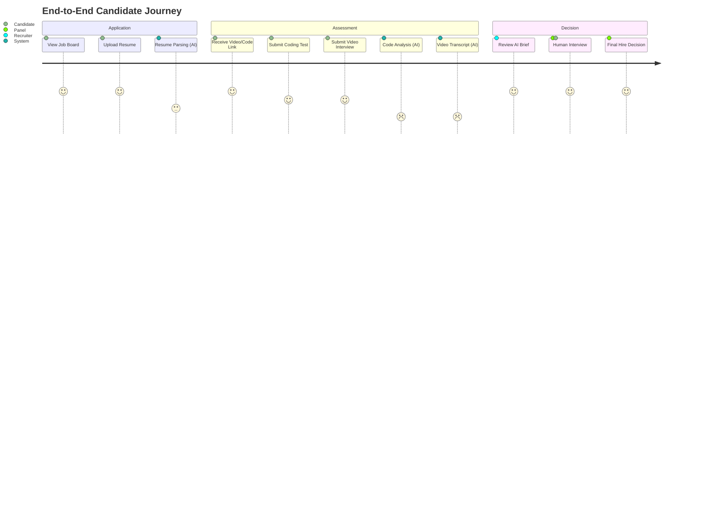
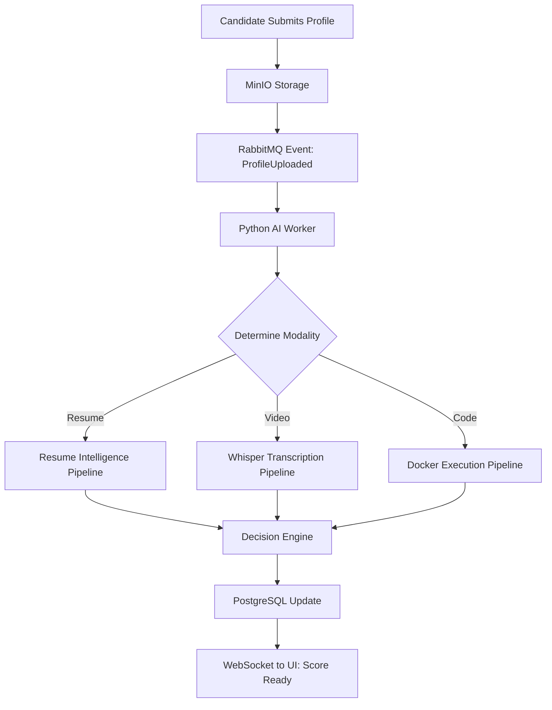
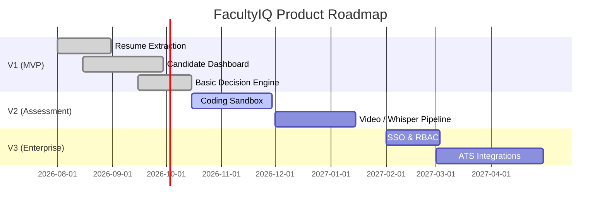

# FACULTYIQ PRODUCT REQUIREMENTS DOCUMENT (PRD)

## 24. REVISION HISTORY

| Version | Status | Author | Reviewers | Approval | Change Log |
|---|---|---|---|---|---|
| **1.0.0** | **APPROVED** | Chief Product Officer | Principal Software Architect, AI Research Lead | CEO | Initial Master PRD Creation |

> [!IMPORTANT]
> **GOVERNING PRODUCT DEFINITION**
> This Product Requirements Document defines the *What* and the *Why* of the FacultyIQ platform. It is the authoritative reference for engineers, architects, designers, QA, and AI researchers. It operates in tandem with the System Requirements Specification (SRS) and the Architecture documentation.

---

## 1. Executive Summary

### Purpose
FacultyIQ is an enterprise AI-powered faculty recruitment platform engineered to eradicate bias, automate manual screening, and provide deep, explainable insights into candidate capability. It bridges the gap between traditional applicant tracking systems and highly specialized technical/pedagogical assessments.

### Business Value
The platform reduces time-to-hire by 80%, mitigates legal and institutional risk by ensuring deterministic, zero-bias candidate evaluation, and consolidates fragmented toolchains (resume screening, video interviews, coding assessments) into a unified, secure, offline-capable environment.

### Market Opportunity
Universities, colleges, and enterprise learning organizations struggle with high volumes of applicants and lack standardized mechanisms to evaluate both subject matter expertise and pedagogical ability simultaneously. With the rise of compliance-driven data sovereignty requirements, an offline-first AI recruitment platform represents a massive blue-ocean opportunity.

### Vision & Future Direction
Starting as an academic recruitment platform, FacultyIQ will scale into a multi-tenant Enterprise SaaS solution, standardizing the evaluation of complex human capital across Fortune 500 companies and government institutions.

---

## 2. Product Vision

### Long-Term Vision
To be the absolute standard for evidence-first human capital evaluation, where hiring decisions are made strictly on verifiable capability rather than pedigree, demographic, or human bias.

### Five-Year Roadmap
Dominate the North American and European academic market. Achieve deep integration with major LMS (Canvas, Blackboard) and HRIS (Workday, SAP) systems, establishing the standard data schema for the "Verified Educator Profile."

### Ten-Year Roadmap
Expand into global enterprise talent acquisition (EnterpriseIQ). Become the foundational evaluation engine for technical roles, management, and executive leadership, governed by explainable AI policies.

### Future Ecosystem
An open platform where institutions can plug in custom evaluation rubrics, third-party AI models (AI Marketplace), and domain-specific assessment tools, all orchestrated by the FacultyIQ Decision Engine.

---

## 3. Product Mission

### Mission Statement
To engineer the most trustworthy, deterministic, and scalable recruitment intelligence platform, treating human evaluation with the highest standards of evidence and privacy.

### Business Goals
- Secure 10 university pilot programs within 18 months.
- Achieve $5M ARR within 36 months via Enterprise SaaS.

### Technology Goals
- Maintain 99.99% availability.
- Process multi-modal evaluations entirely via localized Ollama deployments.

### Research Goals
- Prove mathematically that FacultyIQ's evaluation engine has zero disparate impact across demographic cohorts.

### Customer Goals
- Deliver an unparalleled candidate experience characterized by transparency and constructive feedback.
- Give HR professionals 80% of their time back for high-value strategic decision-making.

---

## 4. Market Analysis

### Current Recruitment Systems
Traditional Applicant Tracking Systems (ATS) act primarily as databases (e.g., Workday, Greenhouse). They do not evaluate candidates; they merely store them. 

### Traditional Faculty Recruitment
Highly manual. Search committees spend hundreds of hours reviewing unstructured PDFs. Evaluation rubrics are rarely applied consistently.

### Online Hiring & Assessment
Platforms like HackerRank or HireVue focus heavily on corporate roles. HackerRank excels at isolated algorithms but fails at pedagogical evaluation. HireVue uses black-box AI for sentiment analysis, which is highly biased and often rejected by academic institutions.

### Academic Recruitment Challenges
- Evaluating *how* someone teaches is historically impossible to automate.
- Faculty roles require assessing research history, teaching capability, and (often) coding/technical skills simultaneously.

### Industry & Future AI Trends
The market is shifting away from cloud-dependent LLMs due to privacy/GDPR concerns. There is a massive trend toward SLMs (Small Language Models) run locally. "Explainable AI" (XAI) is transitioning from a buzzword to a strict legal requirement (e.g., EU AI Act).

---

## 5. Competitive Analysis

| Competitor | Strengths | Weaknesses | Differentiators | Market Position |
|---|---|---|---|---|
| **HireVue** | Market share, polished UI | Black-box AI, heavy bias concerns, no coding assessments | FacultyIQ provides strictly deterministic XAI | Enterprise Corporate |
| **HackerRank** | Strong coding sandbox, vast question bank | Only tests coding, no pedagogical testing, no resumes | FacultyIQ integrates teaching + coding + resumes | Tech Corporate |
| **TestGorilla** | Broad assessment types | Shallow tests, easily cheated, cloud-only | FacultyIQ is offline-first and specifically tuned | SMB General Hiring |
| **Greenhouse** | Great ATS workflows | Zero AI evaluation, just a database | FacultyIQ acts as the AI intelligence layer | Enterprise ATS |
| **FacultyIQ** | Local AI, Bloom's Taxonomy, Evidence-First | New entrant, lacks ATS integrations initially | Deep academic focus, fully localized AI | Academic & Research |

### SWOT Analysis
- **Strengths**: Offline-capable, zero data privacy risk, deterministic explainability.
- **Weaknesses**: Requires significant on-prem hardware (GPUs) for initial deployments.
- **Opportunities**: EU AI Act makes cloud-based competitors unviable in Europe.
- **Threats**: Rapid LLM advancements might allow competitors to build competing features quickly.

---

## 6. Product Goals

1. **Business**: Validate the product-market fit in higher education by converting 3 pilot institutions to paid SaaS tiers within 2 years.
2. **Engineering**: Build a Modular Monolith capable of processing 10,000 candidate profiles per day with zero downtime.
3. **Research**: Publish peer-reviewed research on the efficacy of LLM-as-a-Judge in faculty hiring.
4. **Academic**: Align all technical evaluations with Bloom's Taxonomy.
5. **Commercial**: Ensure the core AI architecture is heavily abstracted so transitioning to Enterprise SaaS requires zero backend rewrites.

---

## 7. Product Scope

### In Scope
- Resume parsing and structured extraction via LLMs.
- Video interview transcription (Whisper) and pedagogical evaluation.
- Ephemeral Docker sandboxes for code execution and SOLID principle evaluation.
- Decision Engine for score aggregation.
- Recruiter Dashboard and Candidate Portal.

### Out of Scope
- Sourcing candidates (job boards, LinkedIn scraping).
- Processing payroll, benefits, or background checks.
- Real-time video conferencing (e.g., Zoom replacement).

### Future Scope (Enterprise Scope)
- Predictive attrition modeling based on candidate profile.
- Automated diversity and inclusion compliance reporting.
- Public AI Plugin Marketplace.

---

## 8. Target Customers

### Target Audience
1. **Universities & Engineering Colleges**: Need to evaluate hundreds of adjuncts and tenure-track professors.
2. **Medical Colleges**: Need to evaluate clinical instructors.
3. **Corporate Learning Organizations**: Companies like Pluralsight, Coursera, or internal enterprise bootcamps hiring technical instructors.

### Pain Points
- "We spend 3 weeks just narrowing 500 applicants down to 50."
- "We hired a professor who knew C++, but they couldn't teach it to freshmen."
- "We cannot legally upload candidate PII to OpenAI."

### Expected Value
An absolute, mathematically defensible ranking of the top 10% of candidates based on holistic capabilities, processed entirely behind the institution's firewall.

---

## 9. User Personas

### 1. Recruiter / HR Manager (Primary)
- **Bio**: Overworked, non-technical HR professional.
- **Goals**: Move candidates through the pipeline quickly. Ensure compliance.
- **Pain Points**: Doesn't understand the technical requirements of the roles they are hiring for.
- **Success Criteria**: Dashboard clearly highlights top candidates with plain-English justifications.

### 2. Department Head / Interview Panel (Secondary)
- **Bio**: Highly technical (e.g., Dean of Computer Science).
- **Goals**: Hire the absolute best technical talent.
- **Pain Points**: Hates wasting time interviewing candidates who look good on paper but can't code.
- **Success Criteria**: Deep technical dive into the candidate's coding assessment and architectural logic.

### 3. Candidate (User)
- **Bio**: Applying for an academic role. Anxious, pressed for time.
- **Goals**: Complete the application smoothly, get a fair chance.
- **Pain Points**: Black-box rejections with no feedback. Glitchy interview portals.
- **Success Criteria**: Frictionless upload, clear instructions, constructive feedback upon rejection.

### 4. System Administrator
- **Bio**: IT Pro managing university infrastructure.
- **Goals**: Deploy securely, maintain uptime, prevent data breaches.
- **Success Criteria**: Easy Docker Compose deployment. Clear environment variables. No reliance on external APIs.

---

## 10. User Journey

---

## 11. Product Features

### F-01: Authentication & Authorization
- **Purpose**: Secure access to the platform via RBAC.
- **Business Value**: Essential for data privacy and SOC2 compliance.
- **Priority**: P0 (Must Have).
- **Dependencies**: None.

### F-02: Candidate Management & Dashboard
- **Purpose**: Kanban-style board to track candidates through stages (Applied, Screened, Assessed, Interviewing, Hired).
- **Business Value**: Replaces spreadsheets. Core ATS functionality.
- **Priority**: P0.

### F-03: Resume Intelligence Engine
- **Purpose**: Ingest PDFs/DOCXs, OCR, and extract entities (Education, Experience, Skills) into structured JSON using local LLMs.
- **Acceptance Criteria**: Must extract data accurately 95% of the time. Must map skills to the internal taxonomy.

### F-04: Coding Assessment Sandbox
- **Purpose**: Ephemeral Docker containers to execute user code in C#, Python, JavaScript.
- **Future Enhancements**: AST (Abstract Syntax Tree) analysis for design pattern detection.

### F-05: Adaptive Video Interview
- **Purpose**: Candidate records a 5-minute teaching demonstration. System transcribes and analyzes pedagogical structure.

### F-06: Bloom's Taxonomy Evaluator
- **Purpose**: AI analyzes candidate responses and categorizes the depth of knowledge (Remembering vs. Creating).

### F-07: Decision Engine & Explainability UI
- **Purpose**: Aggregates all scores. Provides a detailed UI showing *exactly* which resume line or video timestamp contributed to the score.
- **Acceptance Criteria**: Every AI score must have a clickable citation linking to source evidence.

---

## 12. Functional Requirements

| ID | Description | Priority | Feature Link | Acceptance Criteria |
|---|---|---|---|---|
| **FR-001** | The system must allow HR users to create Requisitions. | P0 | F-02 | User can save Requisition with Title, Description, and required Skills. |
| **FR-002** | The system must extract text from uploaded PDF resumes. | P0 | F-03 | Text is successfully extracted handling multi-column layouts. |
| **FR-003** | The system must pass extracted resume text to the local LLM. | P0 | F-03 | LLM returns a strictly formatted JSON CandidateProfile. |
| **FR-004** | The coding sandbox must terminate execution after 10 seconds. | P0 | F-04 | Container is force-killed (SIGKILL); user receives Timeout error. |
| **FR-005** | The AI must cite the source text for every evaluation score. | P0 | F-07 | JSON payload includes `evidence_quote`. |

---

## 13. Non-Functional Requirements

- **Performance**: API responses for UI interactions must be < 200ms. AI async processing must complete within 2 minutes per candidate.
- **Security**: Data encrypted at rest (AES-256) and in transit (TLS 1.3). No external API calls for core PII.
- **Reliability**: Asynchronous AI tasks must automatically retry on failure (3 attempts) using RabbitMQ DLQ (Dead Letter Queues).
- **Scalability**: Python AI workers must scale horizontally based on RabbitMQ queue depth.
- **Explainability**: Black-box scores (e.g., "Score: 85") without a textual justification are strictly prohibited by the architecture.
- **Privacy**: The system must support complete "Right to be Forgotten" (GDPR), purging all candidate data, videos, and DB records upon request.

---

## 14. User Stories

### Candidate Management
- **US-001**: As a Recruiter, I want to view all applicants for a specific Requisition in a list, so that I can see the pipeline at a glance.
- **US-002**: As an Admin, I want to configure custom evaluation weights (e.g., 60% Code, 40% Teaching), so that the Decision Engine aligns with our departmental goals.

### AI Assessment
- **US-003**: As a Department Head, I want to see the exact lines of code the AI flagged as "Poor Architecture", so that I can verify the AI's judgment.
- **US-004**: As a Candidate, I want to test my microphone and camera before starting the adaptive video interview, so that I am not penalized for technical issues.

---

## 15. Acceptance Criteria

*(Representative sample for US-003)*
1. Given an evaluated code submission, when the user clicks the "Architecture Risk" tag, then the UI scrolls to the exact line of code.
2. Given a penalized score, the system must display the AI-generated justification text.
3. If the AI cannot generate a specific citation, the score must default to "Requires Human Review".

---

## 16. Product Workflows

---

## 17. UX Principles

1. **Minimal Cognitive Load**: Recruiters are not AI researchers. The UI must hide the prompt engineering and present clear business insights.
2. **AI Transparency**: Any AI-generated data must be visually distinct (e.g., subtle purple borders or spark icons) so users never confuse AI output with human-entered data.
3. **Error Recovery**: If an AI pipeline fails, the UI must gracefully allow the recruiter to trigger a manual retry or override the assessment manually.

---

## 18. Success Metrics

### Business Metrics
- **Time-to-Hire**: Decrease from industry average of 42 days to 14 days.
- **Recruiter Capacity**: Increase requisitions managed per recruiter from 15 to 40.

### AI & Engineering Metrics
- **Extraction Accuracy**: 98% precision on Resume JSON mapping.
- **Hallucination Rate**: < 1% (Measured by Quote Verification constraints).
- **Sandbox Execution Time**: Average 2.5s per code run.

---

## 19. Product Risks

| Risk | Description | Mitigation Plan |
|---|---|---|
| **AI Bias** | LLMs historically favor certain linguistic styles. | Strict adherence to Evidence-First processing; blind audits of evaluation outcomes. |
| **Candidate Friction** | Candidates refuse to do video or coding tests. | Ensure UI is beautiful, fast, and limits assessments to < 30 minutes total. |
| **GPU Costs** | Local inference requires heavy VRAM. | Quantize models to INT8/INT4. Batch processing asynchronously during off-peak hours. |

---

## 20. Product Roadmap

---

## 21. Future Opportunities

- **AI Marketplace**: Enable third-party ed-tech companies to deploy their proprietary evaluation prompts as Plugins into the FacultyIQ ecosystem.
- **Government Deployments**: Local-first architecture makes this perfect for high-security clearance government agency hiring.
- **Predictive Analytics**: Using historical hire data to predict which candidates are most likely to achieve tenure.

---

## 22. Product Glossary

- **Decision Engine**: The algorithmic core that aggregates subjective AI scores into a deterministic ranking.
- **Evidence-First AI**: The overriding product philosophy that bans generative AI from making claims without direct citations.
- **Requisition**: A specific job opening requiring a specific set of skills.
- **Artifact**: A piece of candidate evidence (Resume, Video, Code).

---

## 23. Traceability Matrix

| Business Goal | Feature | Functional Req | User Story |
|---|---|---|---|
| Eliminate Bias | F-07: Explainability UI | FR-005: AI Citations | US-003: View exact code lines |
| 80% Time Reduction | F-03: Resume Intelligence | FR-003: LLM JSON Extraction | US-001: View candidates at a glance |
| Data Sovereignty | F-04: Coding Sandbox | FR-004: Local container execution | US-004: Admin deploys offline |

***END OF PRODUCT REQUIREMENTS DOCUMENT***

