# SYSTEM ARCHITECTURE DOCUMENT (SAD)

## DOCUMENT CONTROL
| Document ID | FACULTYIQ-SAD-001 |
|---|---|
| **Version** | 1.0.0 |
| **Status** | **APPROVED / BINDING** |
| **Classification** | Enterprise Confidential |
| **Owner** | Enterprise Architecture Board |

> [!CAUTION]
> **GOVERNING ARCHITECTURAL CONTRACT**
> This document defines how the FacultyIQ platform is architected. Every future engineering, deployment, database, security, and AI decision must comply with the rules, layers, and boundaries established herein. Any deviation requires formal review and approval by the FacultyIQ Enterprise Architecture Board.

---

## 1 Executive Summary

### 1.1 Document Purpose
This System Architecture Document (SAD) serves as the authoritative technical blueprint for the FacultyIQ enterprise recruitment platform. It bridges the gap between functional requirements—defined in the [Software Requirements Specification (SRS)](file:///p:/NIT/02_SOFTWARE_REQUIREMENTS_SPECIFICATION.md)—and the concrete physical codebase, defining structural guidelines, dependency rules, deployment configurations, and data lifecycles.

### 1.2 System Scope & Mission
FacultyIQ is engineered to address the critical bottlenecks, inherent human biases, and compliance concerns in academic and faculty recruitment. Its mission is to deliver an **evidence-first, offline-capable, explainable evaluation pipeline** that processes candidates' resumes, video teaching demonstrations, and coding tasks. By running locally quantized models, it provides data privacy (GDPR compliance) and operates behind institutional firewalls without leaking Personally Identifiable Information (PII) to public cloud endpoints.

### 1.3 Architectural Synthesis
The platform uses a **Modular Monolith** pattern in Phase 1 to minimize deployment overhead while maintaining strict logical boundaries. Heavy multi-modal operations (such as transcription, semantic search, and code evaluation) run asynchronously via a Python-based AI worker cluster, decoupled using RabbitMQ. The core business rules and state management are orchestrated by an ASP.NET Core 9 backend, persisting state to PostgreSQL, Redis, Qdrant, and MinIO.

---

## 2 Architectural Goals

The FacultyIQ platform is built to achieve the following overarching technical objectives:

1. **Absolute Data Sovereignty**: Ensure all candidate PII, transcripts, and evaluation data can be processed entirely offline within the institution's private cloud or on-premise hardware.
2. **Deterministic Evaluation**: Suppress LLM hallucinations by forcing the AI layers to execute extraction and verification steps prior to synthesis, backing every score with verbatim evidence citations.
3. **Microservice Readiness**: Enforce strict logical modularity, prohibiting cross-module database joins or tight couplings, allowing the system to scale out into separate microservices seamlessly.
4. **Resiliency & Fault Isolation**: Prevent failures in heavy AI processing (e.g., transcription or video analysis timeouts) from impacting core web interactions, dashboard CRUD operations, or candidate applications.
5. **High Auditable Visibility**: Expose comprehensive logs, tracing spans, and performance metrics across system boundary lines, ensuring the recruitment panels can audit the justification for every algorithmic rank.

---

## 3 Quality Attributes

### 3.1 Scalability
- **Metric**: Support up to 10,000 active applicant uploads and 100 concurrent evaluator dashboard users per node, with horizontal scaling capabilities.
- **Mechanism**: The presentation and core API layers are completely stateless, using Redis for session data and cache structures. Python AI workers scale horizontally based on RabbitMQ queue depths.
- **Trade-off**: Sharding/horizontal partitioning of PostgreSQL is deferred to Phase 2; horizontal scaling in Phase 1 relies on read replicas and vector-database routing in Qdrant.

### 3.2 Reliability
- **Metric**: Achieve a 99.9% uptime for core API endpoints. Ensure zero data loss for uploaded resumes and videos.
- **Mechanism**: RabbitMQ acts as a durable, persistent broker. Polly retry policies with exponential backoff govern internal communication. Dead Letter Queues (DLQs) catch corrupted parsing tasks, isolating them for manual admin processing.

### 3.3 Availability
- **Metric**: Core candidate application forms must remain online and functional even if the GPU inference workers are down or overloaded.
- **Mechanism**: Candidate application submissions are instantly written to PostgreSQL and MinIO, and a light event is emitted to RabbitMQ. The UI returns a "202 Accepted" status. If the AI worker is unavailable, tasks remain safely queued in RabbitMQ.

### 3.4 Maintainability
- **Metric**: Maintain a clean architecture code health score (>90%) and keep test coverage above 85% for business use cases.
- **Mechanism**: Enforce the Dependency Rule—outer layers depend on inner layers, never vice versa. Run SonarQube and custom architecture-linter tests in the CI/CD pipeline to reject imports that violate layering rules.

### 3.5 Security
- **Metric**: Zero leakage of candidate PII; SOC-2 and GDPR compliance.
- **Mechanism**: Authenticate via JWT tokens with Role-Based Access Control (RBAC). Hash all passwords using Argon2id. Encrypt files in MinIO with AES-256 and store sensitive database columns (e.g., candidate phone numbers) using column-level encryption. Sandbox untrusted code submissions in ephemeral Docker containers.

### 3.6 Performance
- **Metric**: API response time < 200ms for 95% of dashboard operations. Max processing duration of 2 minutes per candidate for multi-modal parsing.
- **Mechanism**: Use Redis cache for static lookups and department rubrics. Process heavy jobs asynchronously in background workers, streaming transcription files and database writes.

### 3.7 Offline Capability
- **Metric**: 100% functionality of the recruitment pipeline without outbound WAN connectivity.
- **Mechanism**: Use locally hosted Ollama containers hosting quantized variants of `Qwen2.5 3B`, `Qwen2.5-Coder 3B`, and `Llama3.2 3B`. Run Whisper transcription and OpenCV video analysis locally on dedicated GPU worker instances.

### 3.8 Explainability
- **Metric**: 100% of AI-generated scores must carry an associated trace ID and an extraction citation list.
- **Mechanism**: The database schema forces all evaluations to store JSON-structured lists of `evidence_quote` strings containing source text segments and file/video timestamp offsets.

### 3.9 Auditability
- **Metric**: Maintain immutable audit logs for all security, score override, and administrative changes.
- **Mechanism**: Use a dedicated, append-only `AuditLog` table in PostgreSQL. Changes to candidate scores by Department Deans must log the actor, timestamp, reason, and original vs. new values.

### 3.10 Observability
- **Metric**: Distributed tracing across ASP.NET Core, RabbitMQ, and Python AI workers.
- **Mechanism**: Integrate OpenTelemetry standards, generating W3C trace contexts passed in HTTP headers and RabbitMQ message metadata. Export trace spans to Jaeger/Zipkin and metrics to Prometheus.

### 3.11 Extensibility
- **Metric**: Developers must be able to add a new assessment modality (e.g., portfolio review) without altering core recruitment state engines.
- **Mechanism**: Register assessment plugins via a Strategy and Mediator pattern, communicating over decoupled integration events.

---

## 4 Architectural Principles

| Principle | Description | Compliance in FacultyIQ |
|---|---|---|
| **Clean Architecture** | Inward-pointing dependency flow. Domain at the core, followed by Application, Infrastructure, and Presentation. | Inner domain entities have zero external package references. Database and AI drivers live strictly in the Infrastructure layer. |
| **SOLID** | Five object-oriented design principles maximizing modularity. | Strictly enforced via Interface Segregation (e.g., separating `ICandidateReader` from `ICandidateWriter`) and Dependency Inversion. |
| **Domain-Driven Design** | Architecture matches the business domain language and models. | Bounded contexts dictate database contexts. Entities enforce business invariants using internal domain events. |
| **Hexagonal Architecture** | Decoupling application core from database, UI, and external services via ports and adapters. | Interfaces (Ports) reside in the Application layer, and concrete implementations (Adapters) live in Infrastructure. |
| **Dependency Rule** | Source code dependencies can only point inward. | The domain knows nothing about the database, EF Core, Python, or Ollama. |
| **Evidence-First AI** | LLM must extract raw evidence before synthesizing ratings. | Prompts are structured to enforce two-stage output: `Extraction` and `Synthesis`. Synthetic results must map directly to an extracted quote. |
| **Deterministic Before LLM** | Do not use AI where a rules engine or regex suffices. | System validates file types, extracts basic metadata (emails, names), and calculates simple test metrics using deterministic algorithms before invoking LLMs. |
| **Offline First** | The system must operate fully within an air-gapped network. | Uses local models deployed via Docker Compose to local NVIDIA GPUs, requiring zero external web API calls. |

---

## 5 System Context Diagram

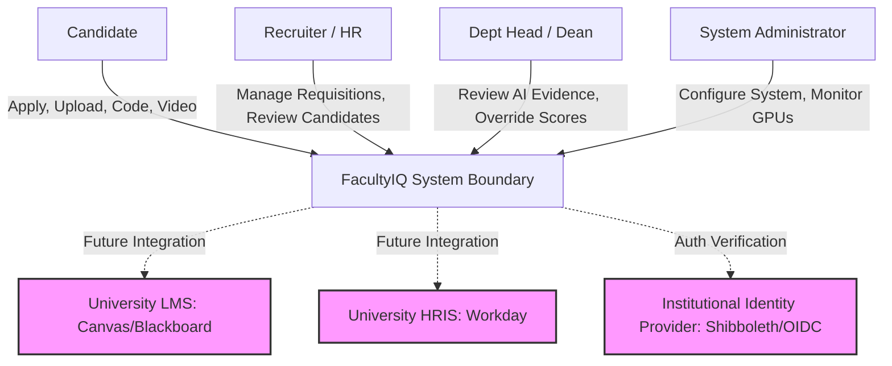

---

## 6 High-Level Architecture

The container topology shows how the Presentation layer interacts with the backend and how processing is distributed to the Python AI environment.

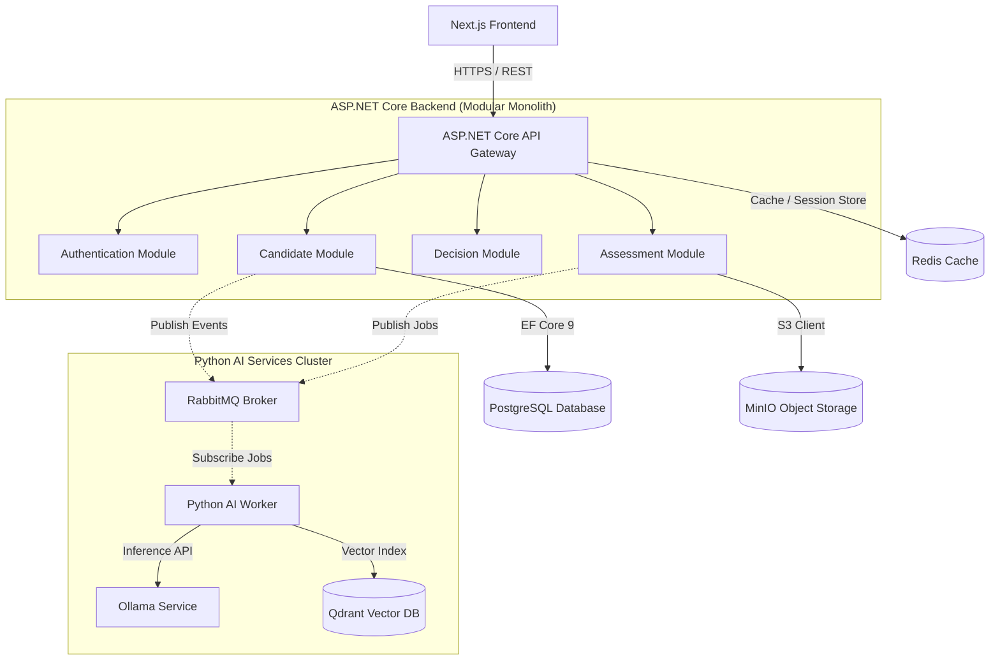

---

## 7 Architecture Layers

```
+-------------------------------------------------------------+
|                   Presentation Layer (Next.js)              |
+-------------------------------------------------------------+
                              |
                              v [HTTPS / JSON]
+-------------------------------------------------------------+
|                   API Layer (ASP.NET Core Controllers)      |
+-------------------------------------------------------------+
                              |
                              v [Inward Dependency Flow]
+-------------------------------------------------------------+
|           Application Layer (Commands, Queries, DTOs)       |
+-------------------------------------------------------------+
                              |
                              v
+-------------------------------------------------------------+
|               Domain Layer (Entities, Value Objects)        |
+-------------------------------------------------------------+
                              ^
                              | [Dependency Inversion]
+-------------------------------------------------------------+
|   Infrastructure Layer (EF Core, MinIO S3, RabbitMQ Client) |
+-------------------------------------------------------------+
```

### 7.1 Presentation Layer
- **Responsibilities**: Render the user interfaces, manage client-side state, coordinate file uploads to intermediate buffers, and display explainability visualizations.
- **Allowed Dependencies**: Standard Web APIs exposed by the API layer.
- **Forbidden Dependencies**: Direct connections to PostgreSQL, Qdrant, MinIO, or RabbitMQ.

### 7.2 API Layer
- **Responsibilities**: Route incoming HTTP requests, validate request bodies, handle CORS and SSL termination, check authentication tokens, and map HTTP status codes.
- **Allowed Dependencies**: Application Layer, Domain Layer.
- **Forbidden Dependencies**: Concrete database drivers, direct filesystem manipulation, external SMTP servers.

### 7.3 Application Layer
- **Responsibilities**: Orchestrate business use cases, coordinate transaction scopes (Unit of Work), manage validation rules (FluentValidation), and map entities to DTOs.
- **Allowed Dependencies**: Domain Layer, abstractions of Infrastructure (Interfaces like `IUserRepository` or `IMessageBus`).
- **Forbidden Dependencies**: Entity Framework Core direct types, concrete queue publishers, direct AI libraries.

### 7.4 Domain Layer
- **Responsibilities**: Represent core business models, validate entity states, and publish domain events.
- **Allowed Dependencies**: None (Pure code, no external packages except basic domain helpers).
- **Forbidden Dependencies**: Application, API, Infrastructure, or any external framework.

### 7.5 Infrastructure Layer
- **Responsibilities**: Implement data access (EF Core DbContext), configure database mapping, manage MinIO S3 storage connections, serialize/publish messages to RabbitMQ, and route vector queries to Qdrant.
- **Allowed Dependencies**: Domain Layer (to materialize entities), Application Layer (interfaces to implement).
- **Forbidden Dependencies**: Presentation Layer, direct API controller classes.

### 7.6 AI Services Layer (Python)
- **Responsibilities**: Run deep learning models, transcribe video files via Whisper, execute OpenCV filters, parse resumes, execute code sandboxing, and index embeddings in Qdrant.
- **Allowed Dependencies**: RabbitMQ (to retrieve tasks), MinIO (to download raw artifacts), Qdrant (to write vector payloads).
- **Forbidden Dependencies**: PostgreSQL direct connections, ASP.NET Core memory caches.

---

## 8 Module Architecture

FacultyIQ's Modular Monolith enforces isolation between 15 distinct functional modules. Each module maintains its own logical context, schemas, and events.

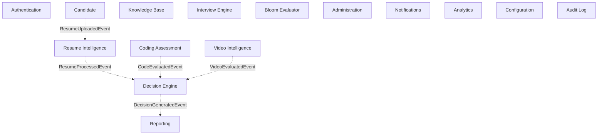

### 8.1 Authentication Module
- **Purpose**: Manage system identities, roles, and session tokens.
- **Interfaces**: `IAuthService`, `ITokenGenerator`.
- **Events Published**: `UserLoggedIn`, `PasswordChanged`.
- **Dependencies**: Configuration.

### 8.2 Candidate Module
- **Purpose**: Maintain candidate registrations, application details, and status queues.
- **Interfaces**: `ICandidateRepository`, `IApplicationService`.
- **Events Published**: `CandidateApplied`, `ResumeUploaded`.
- **Dependencies**: Authentication.

### 8.3 Resume Intelligence Module
- **Purpose**: Parse raw resumes and extract qualifications using evidence-first AI.
- **Interfaces**: `IResumeExtractor`, `IResumeRepository`.
- **Events Published**: `ResumeProcessed`, `ExtractionFailed`.
- **Dependencies**: Candidate.

### 8.4 Knowledge Base Module
- **Purpose**: Index and retrieve department hiring rubrics via semantic vectors.
- **Interfaces**: `IKnowledgeStore`, `IVectorRetriever`.
- **Events Published**: `RubricIndexed`, `RubricDeleted`.
- **Dependencies**: Configuration.

### 8.5 Interview Engine Module
- **Purpose**: Generate dynamic, context-specific questions mapped to job requisitions.
- **Interfaces**: `IQuestionGenerator`, `IInterviewScheduler`.
- **Events Published**: `QuestionsGenerated`, `InterviewSessionStarted`.
- **Dependencies**: Resume Intelligence, Candidate.

### 8.6 Coding Assessment Module
- **Purpose**: Orchestrate and execute candidate code inside a restricted container sandbox.
- **Interfaces**: `ISandboxExecutor`, `ICodeValidator`.
- **Events Published**: `CodeSubmitted`, `CodeEvaluated`.
- **Dependencies**: Candidate.

### 8.7 Video Intelligence Module
- **Purpose**: Extract transcripts and evaluate pedagogical signals from candidate video responses.
- **Interfaces**: `ITranscriber`, `IPedagogicalAnalyzer`.
- **Events Published**: `VideoTranscribed`, `VideoEvaluated`.
- **Dependencies**: Candidate.

### 8.8 Bloom Evaluator Module
- **Purpose**: Map candidate responses to the levels of Bloom's Taxonomy.
- **Interfaces**: `IBloomClassifier`.
- **Events Published**: `BloomLevelClassified`.
- **Dependencies**: Resume Intelligence, Interview Engine.

### 8.9 Decision Engine Module
- **Purpose**: Apply configurable weight parameters to aggregate individual scores into a composite rank.
- **Interfaces**: `IDecisionAggregator`, `IRankingEngine`.
- **Events Published**: `DecisionGenerated`, `RankingUpdated`.
- **Dependencies**: Resume Intelligence, Coding Assessment, Video Intelligence.

### 8.10 Reporting Module
- **Purpose**: Compile PDF files and interactive visualizations illustrating candidates' performance evidence.
- **Interfaces**: `IPdfReportGenerator`, `IReportExporter`.
- **Events Published**: `ReportGenerated`.
- **Dependencies**: Decision Engine, Candidate.

### 8.11 Administration Module
- **Purpose**: Handle global configurations, system tenant switches, and user updates.
- **Interfaces**: `ISystemConfigManager`.
- **Events Published**: `SystemConfigUpdated`.
- **Dependencies**: None.

### 8.12 Notifications Module
- **Purpose**: Dispatch alerts, system notices, and candidate links via SMTP.
- **Interfaces**: `IEmailSender`, `INotificationDispatcher`.
- **Events Published**: `NotificationDispatched`.
- **Dependencies**: None.

### 8.13 Analytics Module
- **Purpose**: Compute pipeline metrics, processing latencies, and conversion funnels.
- **Interfaces**: `IPipelineAggregator`.
- **Events Published**: None.
- **Dependencies**: Candidate, Decision Engine.

### 8.14 Configuration Module
- **Purpose**: Manage global variables, model filenames, and VRAM mapping settings.
- **Interfaces**: `IConfigStore`.
- **Events Published**: None.
- **Dependencies**: None.

### 8.15 Audit Module
- **Purpose**: Log immutable tracks of administrative actions and score adjustments.
- **Interfaces**: `IAuditLogger`.
- **Events Published**: None.
- **Dependencies**: None.

---

## 9 Backend Architecture

The backend is built using ASP.NET Core 9. It enforces structured dependencies and asynchronous task processing.

```
+--------------------------------------------------------------+
|                    ASP.NET Core HTTP Request                 |
+--------------------------------------------------------------+
                               |
                               v
+--------------------------------------------------------------+
|                     Global Exception Middleware              |
+--------------------------------------------------------------+
                               |
                               v
+--------------------------------------------------------------+
|                     JWT Authentication & AuthZ               |
+--------------------------------------------------------------+
                               |
                               v
+--------------------------------------------------------------+
|                 FluentValidation Action Filter               |
+--------------------------------------------------------------+
                               |
                               v
+--------------------------------------------------------------+
|                 Minimal API Endpoint / Controller            |
+--------------------------------------------------------------+
                               |
                               v
+--------------------------------------------------------------+
|                     Application Service                      |
+--------------------------------------------------------------+
                               |
                               v
+--------------------------------------------------------------+
|                EF Core Repository / Unit of Work             |
+--------------------------------------------------------------+
```

### 9.1 Dependency Injection Lifecycle
ASP.NET Core DI enforces explicit lifecycle controls:
- **Transient**: Used for lightweight, stateless domain services and utility handlers.
- **Scoped**: Bound to the lifetime of the HTTP request or the background queue execution scope. All repositories and the EF Core `DbContext` are registered as Scoped.
- **Singleton**: Reserved for caching managers, RabbitMQ channel factories, and configuration state classes.

### 9.2 Middleware Pipeline
1. **CorrelationIdMiddleware**: Generates or forwards a `X-Correlation-ID` header.
2. **GlobalExceptionMiddleware**: Catches unhandled exceptions and maps them to RFC 7807 Problem Details.
3. **OpenTelemetryMiddleware**: Starts trace spans matching HTTP request metadata.
4. **SecurityHeadersMiddleware**: Injects CSP, HSTS, X-Content-Type-Options.
5. **Authentication & Authorization**: Decodes JWT and validates claims.

### 9.3 Minimal APIs vs. Controllers
- **Minimal APIs**: Chosen for high-throughput, low-overhead data ingest routes (e.g., streaming file uploads or health checks).
- **Controllers**: Used for complex CRUD dashboards where model binders, filters, and standard action results provide cleaner organization.

### 9.4 Caching Implementation
Use a two-tier caching framework:
- **Tier 1 (In-Memory)**: High-speed local cache for transient configuration parameters and user roles (using `IMemoryCache`).
- **Tier 2 (Distributed)**: Redis cluster backing shared structures, session tokens, and department rubrics.

### 9.5 Global Exception Handler Template
```csharp
public class GlobalExceptionMiddleware
{
    private readonly RequestDelegate _next;
    private readonly ILogger<GlobalExceptionMiddleware> _logger;

    public GlobalExceptionMiddleware(RequestDelegate next, ILogger<GlobalExceptionMiddleware> logger)
    {
        _next = next;
        _logger = logger;
    }

    public async Task InvokeAsync(HttpContext context)
    {
        try
        {
            await _next(context);
        }
        catch (Exception ex)
        {
            _logger.LogError(ex, "An unhandled exception occurred during transaction trace {TraceId}", context.TraceIdentifier);
            await HandleExceptionAsync(context, ex);
        }
    }

    private static Task HandleExceptionAsync(HttpContext context, Exception exception)
    {
        context.Response.ContentType = "application/problem+json";
        context.Response.StatusCode = exception switch
        {
            ValidationException => StatusCodes.Status400BadRequest,
            UnauthorizedAccessException => StatusCodes.Status401Unauthorized,
            KeyNotFoundException => StatusCodes.Status404NotFound,
            _ => StatusCodes.Status500InternalServerError
        };

        var problemDetails = new ProblemDetails
        {
            Title = exception.GetType().Name,
            Detail = exception.Message,
            Status = context.Response.StatusCode,
            Instance = context.Request.Path
        };

        return context.Response.WriteAsJsonAsync(problemDetails);
    }
}
```

---

## 10 AI Architecture Overview

FacultyIQ uses local, small language models to preserve security boundaries and run air-gapped without relying on third-party cloud engines.

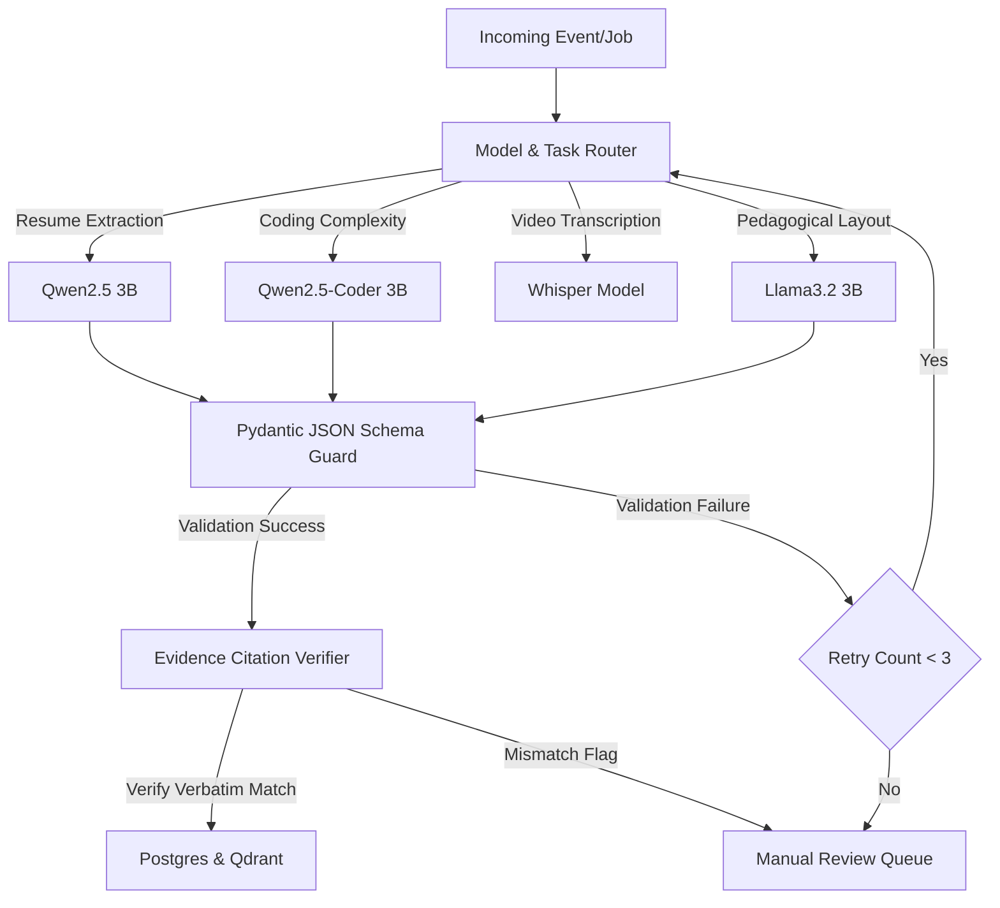

### 10.1 Model Allocation Matrix
| Model Name | Task | Context Window | VRAM Required | Primary Backend |
|---|---|---|---|---|
| `Qwen 2.5 3B` | Entity Extraction, Resume parsing | 128k | ~4.5 GB | Ollama API |
| `Qwen 2.5-Coder 3B` | Coding evaluation, algorithm analysis | 32k | ~4.5 GB | Ollama API |
| `Llama 3.2 3B` | Synthesis and evaluation reasoning | 128k | ~4.2 GB | Ollama API |
| `Whisper-base` | Audio track transcription | N/A | ~1.5 GB | Faster-Whisper |

### 10.2 Evidence-First Verification Engine
For every evaluated score, the system executes two distinct steps:
1. **Extraction Step**: The model extracts qualifications as raw JSON containing a `quote` property which must match verbatim in the source artifact text.
2. **Verification Step**: The system runs a programmatic check (using exact string matching or fuzzy matching with a high similarity threshold) to confirm the extracted quote exists in the candidate's source resume text. If verification fails, the system logs the failure and routes the candidate to the Human Review Queue instead of saving a potentially hallucinated evaluation.

---

## 11 Communication Architecture

Communication patterns isolate heavy, stochastic AI workloads from user-facing API threads.

```
Synchronous Pipeline:
User Request ------[HTTP POST /api/v1/resumes]------> API Gateway
                                                        |
                                                        v (Saves to MinIO)
User Response <-------[202 Accepted + JobID]----------- API Gateway

Asynchronous Pipeline:
API Gateway ----------[Publish: ResumeUploaded]-------> RabbitMQ Broker
                                                            |
                                                            v
Python Worker <-------[Consume Job & Parse]------------ RabbitMQ Queue
                                                            |
                                                            v
PostgreSQL <----------[Write Extraction Scores]--------- Python Worker
                                                            |
                                                            v
Client Browser <------[WebSocket: EvaluationFinished]--- API Gateway
```

### 11.1 Message Structure: `ResumeUploadedIntegrationEvent`
```json
{
  "eventId": "c7a8f1a3-2d9b-4e9f-8a0b-2f1f9c8f9b9b",
  "correlationId": "8f8b8c8d-8e8f-4a4b-9c9d-9e9f9a9b9c9d",
  "timestamp": "2026-07-19T14:10:00Z",
  "candidateId": "3fa85f64-5717-4562-b3fc-2c963f66afa6",
  "resumeId": "e1a1f1b2-1e9a-4c9f-8a0b-1f1f9c8f9b9a",
  "bucketName": "resumes",
  "objectKey": "2026/07/19/e1a1f1b2.pdf"
}
```

### 11.2 Retry Policy & DLQ Orchestration
- **Retry Count**: Max 3 programmatic retry attempts for transient worker failures.
- **Backoff**: Exponential backoff (initial delay: 5s, backoff factor: 2.0).
- **Dead Letter Queue (DLQ)**: If the retry budget is exhausted, the broker routes the message to `evaluation.failed.dlq`. An alert is sent to the system monitoring console, and the candidate profile's state transitions to `RequiresReview`.

---

## 12 Data Architecture

The data ecosystem separates relational data, unstructured files, and vector indices.

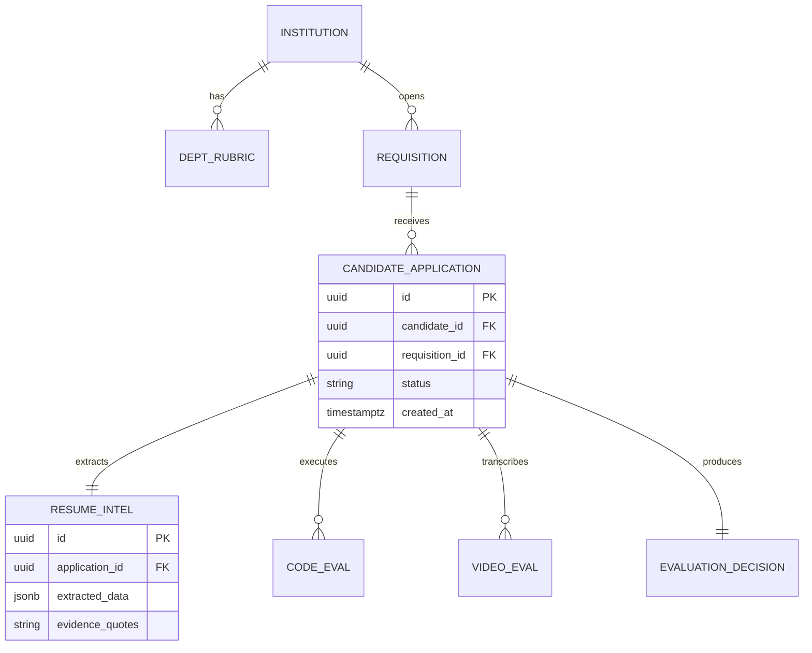

### 12.1 Vector Database Schema (Qdrant)
- **Collection**: `department_rubrics`
- **Vector Dimensions**: 384 (using local `all-MiniLM-L6-v2` embedding model).
- **Similarity Metric**: Cosine Similarity.
- **Payload Schema**:
  ```json
  {
    "department_id": "uuid",
    "requisition_id": "uuid",
    "rubric_section": "string",
    "rubric_text": "string"
  }
  ```

### 12.2 MinIO Storage Layout
- `/resumes/{candidate_id}/{resume_id}.pdf` (Read-only after upload).
- `/transcripts/{candidate_id}/{video_id}.json` (Generated by AI worker).
- `/videos/{candidate_id}/{video_id}.mp4` (Encrypted at rest).

---

## 13 Security Architecture

The platform uses a zero-trust model for security. The execution of untrusted code is sandboxed to isolate potential risks.

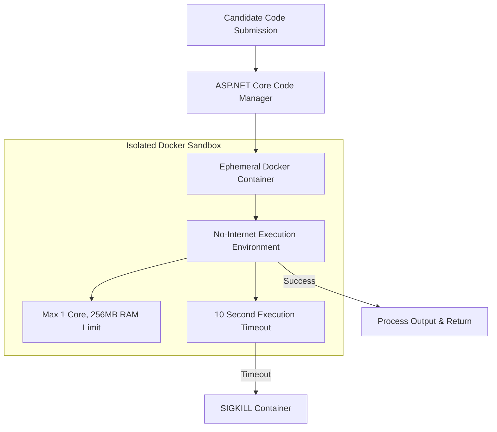

### 13.1 Authentication & RBAC Policy
- **Hashing**: Argon2id with a salt length of 16 bytes and a minimum of 3 iterations.
- **Token Type**: JWT (HMAC-SHA256, 15-minute lifespan). Refresh tokens are stored as HTTP-only secure cookies with a 7-day lifespan.
- **RBAC Roles**:
  - `Admin`: Full configuration, model routing updates, system logs.
  - `Recruiter`: Create requisitions, review candidates, manage statuses.
  - `DeptHead`: Review rubrics, view evaluations, override scores.
  - `Candidate`: Upload files, run assigned code tests, submit videos.

---

## 14 Infrastructure Architecture

A multi-container setup isolates components and provides dedicated hardware resources for the Python AI workers.

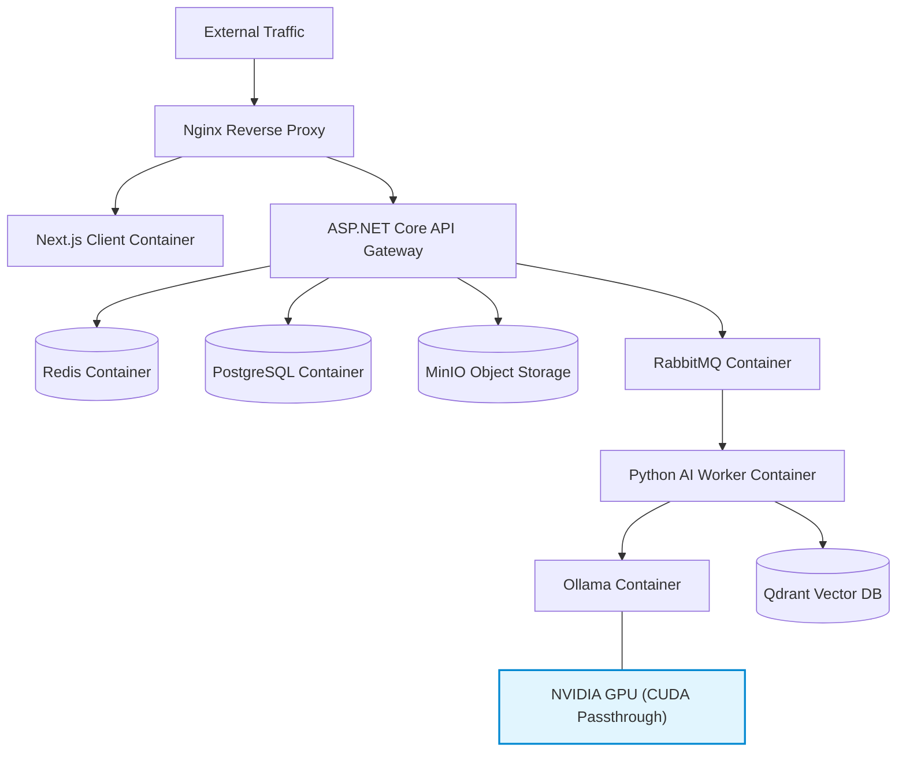

### 14.1 Network Topologies
- **External Network**: Only the Nginx Reverse Proxy is exposed to the institution's intranet.
- **Internal Network**: The API gateway, databases, and AI workers communicate on a closed, internal Docker network (`facultyiq_backend_net`).
- **GPU Passthrough**: Docker compose mounts host GPU resources via the CUDA toolkit to enable fast inference times.

---

## 15 Deployment Architecture

Deployments prioritize air-gapped on-premise environments, running without external network dependencies.

```
Air-Gapped Secure Network Boundary (Institutional Firewall)
+-------------------------------------------------------------+
|                                                             |
|   +---------------+     +--------------+     +----------+   |
|   |   Nginx IP    | --> | ASP.NET Core | --> | Postgres |   |
|   | (Reverse Proxy)|     | API Gateway  |     | Database |   |
|   +---------------+     +--------------+     +----------+   |
|           |                    |                   |        |
|           v                    v                   v        |
|   +---------------+     +--------------+     +----------+   |
|   |  Next.js UI   |     |  RabbitMQ    |     | Qdrant & |   |
|   |  (Stateless)  |     |  Message Bus |     | MinIO    |   |
|   +---------------+     +--------------+     +----------+   |
|                                |                            |
|                                v                            |
|                         +--------------+                    |
|                         |  Python AI   |                    |
|                         | (Local GPU)  |                    |
|                         +--------------+                    |
|                                |                            |
|                                v                            |
|                         +--------------+                    |
|                         | Ollama Local |                    |
|                         +--------------+                    |
|                                                             |
+-------------------------------------------------------------+
```

### 15.1 Air-Gapped Deployments
- **Image Strategy**: Pre-package and compress all Docker images into `.tar` files. Load them on-site using standard `docker load`.
- **Model Storage**: Pre-load model weights (Qwen, Llama, Whisper) directly into the offline Ollama container image during build time, preventing on-premise download requests.

---

## 16 Scalability Strategy

The system scales horizontally by separating state from execution logic.

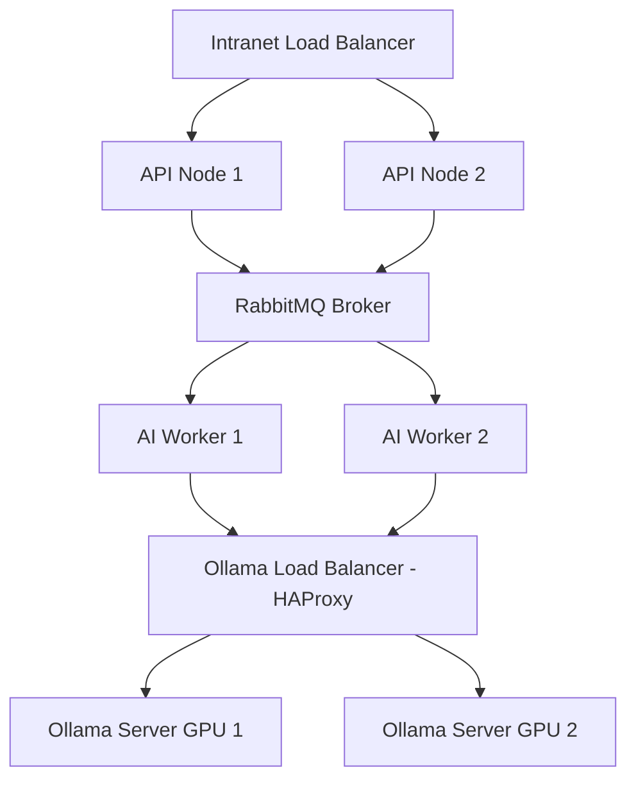

### 16.2 Thread and Node Scaling
- **Stateless API Scale**: API nodes scale out using simple round-robin routing behind a local reverse proxy.
- **AI Task Scaling**: Add workers dynamically based on RabbitMQ queue depths.
- **Database Partitioning**: Table partitioning by `requisition_id` separates old applicant cohorts from active applications.

---

## 17 Reliability Strategy

Polly policies isolate and mitigate transient downstream failures.

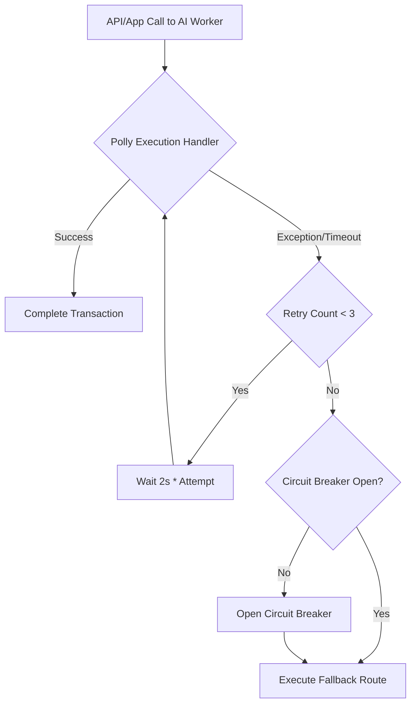

### 17.2 Resiliency Definitions
- **Circuit Breakers**: Configured on routes connecting to the AI services. If inference response time exceeds 10 seconds for 5 consecutive attempts, the breaker opens, forcing the system to route new jobs directly to the fallback parsing queue.
- **Compensating Transactions**: If an evaluation fails mid-transaction after updating PostgreSQL, a compensation task runs to delete the related vector entries in Qdrant and reset the status field of the application.

---

## 18 Performance Architecture

```
Cache Resolution Pipeline:
Request ----> Look in Redis Cache ----> Found? --[Yes]--> Return DTO
                  |
                 [No]
                  v
           Fetch from Postgres Database
                  |
                  v
           Write to Redis Cache & Return DTO
```

### 18.1 Key Configurations
- **Lazy Loading**: Disabled by default in EF Core to avoid N+1 query patterns. Prefer explicit projections: `.Select(c => new CandidateDto { ... })`.
- **Streaming Responses**: Enable gRPC streaming for large audio processing batches.
- **Connection Pools**: Configure PostgreSQL connection pooling using `Npgsql.Pooling` with a max pool size limit set to 100 per API replica node.

---

## 19 Observability Architecture

The OpenTelemetry collector routes traces and metrics to monitoring backends.

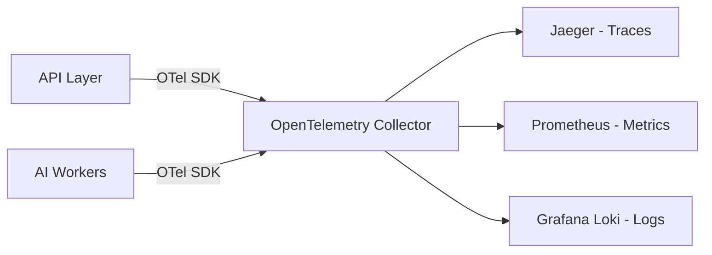

### 19.1 Log Schema (Serilog Example)
```json
{
  "Timestamp": "2026-07-19T14:15:22.123Z",
  "Level": "Information",
  "MessageTemplate": "Processed resume for candidate {CandidateId} in {ElapsedMs}ms",
  "Properties": {
    "CandidateId": "3fa85f64-5717-4562-b3fc-2c963f66afa6",
    "ElapsedMs": 1420,
    "SourceContext": "FacultyIQ.ResumeIntelligence.ResumeParser",
    "CorrelationId": "8f8b8c8d-8e8f-4a4b-9c9d-9e9f9a9b9c9d",
    "UserId": "1c7a8f1a-2d9b-4e9f-8a0b-2f1f9c8f9b9a"
  }
}
```

---

## 20 Monitoring Architecture

System dashboards track hardware usage, database connections, and queue queues.

```
Monitoring Dashboard Layout
+--------------------------+--------------------------+
|  GPU VRAM / Temp Stats   |  RabbitMQ Queue Depth   |
|  [||||||||||.....] 65%   |  Pending: 12  DLQ: 0     |
+--------------------------+--------------------------+
|  Postgres Conn Pool      |  Inference Latencies     |
|  Active: 22 / Idle: 18   |  P95: 12.4s / P99: 18.2s |
+--------------------------+--------------------------+
```

### 20.1 Alerting Parameters
- **GPU VRAM Utilization**: Send a high-priority alert if GPU VRAM exceeds 95% for more than 5 consecutive minutes.
- **Queue Backup Alert**: Trigger notification if the count of messages in `evaluation.pending` remains greater than 100 for more than 10 minutes.

---

## 21 Folder Structure

```
facultyiq-root/
│
├── docker-compose.yml              # Base services orchestration file
├── README.md                       # High-level repo overview
├── CONFIG.md                       # Environment variables master reference
│
├── src/
│   ├── FacultyIQ.Web/              # Next.js / TypeScript Frontend
│   │   ├── components/             # Reusable UI parts (ShadCN)
│   │   ├── pages/                  # Route layouts
│   │   └── package.json
│   │
│   ├── FacultyIQ.Core/             # ASP.NET Core Clean Architecture layers
│   │   ├── FacultyIQ.Domain/       # Core domain entities, events
│   │   │   ├── Entities/
│   │   │   └── Events/
│   │   │
│   │   ├── FacultyIQ.Application/  # Business scenarios, command handlers
│   │   │   ├── Interfaces/
│   │   │   └── Handlers/
│   │   │
│   │   ├── FacultyIQ.Infrastructure/# Concrete DB, queue implementations
│   │   │   ├── Data/               # EF Core context, DB migrations
│   │   │   ├── Messaging/          # RabbitMQ integration publishers
│   │   │   └── Storage/            # MinIO clients
│   │   │
│   │   └── FacultyIQ.API/          # HTTP request handlers & middleware
│   │       ├── Controllers/
│   │       └── Program.cs
│   │
│   └── FacultyIQ.AI/               # Python AI pipeline codebase
│       ├── worker.py               # Task processor entrypoint
│       ├── models/                 # Model management and routing configurations
│       ├── prompts/                # Versioned prompt text templates
│       ├── pipelines/              # Transcription, parsing execution flows
│       └── requirements.txt
│
└── tests/                          # Automated testing directories
    ├── FacultyIQ.UnitTests/
    ├── FacultyIQ.IntegrationTests/
    └── FacultyIQ.E2ETests/
```

---

## 22 Design Patterns

### 22.1 Repository and Unit of Work Pattern (C# Example)
```csharp
public interface IRepository<T> where T : class
{
    Task<T?> GetByIdAsync(Guid id);
    Task AddAsync(T entity);
    void Update(T entity);
    void Delete(T entity);
}

public interface IUnitOfWork : IDisposable
{
    IRepository<Candidate> Candidates { get; }
    Task<int> CompleteAsync();
}

public class UnitOfWork : IUnitOfWork
{
    private readonly FacultyIQDbContext _context;
    public IRepository<Candidate> Candidates { get; }

    public UnitOfWork(FacultyIQDbContext context)
    {
        _context = context;
        Candidates = new Repository<Candidate>(_context);
    }

    public async Task<int> CompleteAsync()
    {
        return await _context.SaveChangesAsync();
    }

    public void Dispose() => _context.Dispose();
}
```

### 22.2 Strategy Pattern (AI Model Selector Example)
```csharp
public interface IInferenceStrategy
{
    Task<string> ExecuteInferenceAsync(string prompt, string systemInstruction);
}

public class OllamaInferenceStrategy : IInferenceStrategy
{
    private readonly HttpClient _client;
    public OllamaInferenceStrategy(HttpClient client) => _client = client;

    public async Task<string> ExecuteInferenceAsync(string prompt, string systemInstruction)
    {
        // Executes local POST call to Ollama endpoint
        return "result";
    }
}
```

---

## 23 Architectural Decision Records

The platform is guided by the following key architectural decisions:

- **ADR-001: Modular Monolith Framework**
  - *Context*: Balance system performance against team operational complexity.
  - *Decision*: Build the core application as a Modular Monolith in C# rather than distributed microservices from day one.
  - *Trade-off*: Monolith deployments are easier to manage, but cross-module calls must be decoupled using internal events to ease future microservice extraction.

- **ADR-002: Offline-First Local AI Processing**
  - *Context*: Protect candidate PII and ensure GDPR compliance.
  - *Decision*: Host quantized LLMs locally via Ollama. Do not use external APIs.
  - *Trade-off*: Lowers latency costs and preserves data privacy, but requires dedicated on-premise GPU hardware.

- **ADR-003: Postgres + Redis + Qdrant Storage**
  - *Context*: Manage relational candidate records, high-speed lookup states, and semantic vector data.
  - *Decision*: Use PostgreSQL for transactional data, Redis for transient caching, and Qdrant for embedding vectors.
  - *Trade-off*: Improves performance and query flexibility, but increases operational overhead.

---

## 24 Failure Scenarios

| Critical Event | Impact | Immediate Mitigation Action | Recovery Workflow |
|---|---|---|---|
| **GPU/Ollama Crash** | All active AI evaluations stall. | RabbitMQ keeps events safely queued; UI displays an "Evaluation Pending" status. | Auto-restart Ollama daemon; trigger horizontal failover to backup GPU nodes. |
| **Postgres Database Loss** | Core API layer fails and rejects writes. | Terminate API connections; route incoming transactions to read-only mode. | Restore DB state from point-in-time backups; re-process events since backup time. |
| **RabbitMQ Queue Loss** | Async events cannot be published. | Write upload events directly to local disk queues; log errors to the console. | Re-establish broker cluster; replay missed upload events from audit logs. |
| **MinIO Storage Down** | File uploads and downloads fail. | Reject new candidate resume uploads with a "Storage Down" notification. | Re-mount disk volumes; verify storage hashes against Postgres database records. |

---

## 25 Sequence Diagrams

### 25.1 Candidate Upload Sequence
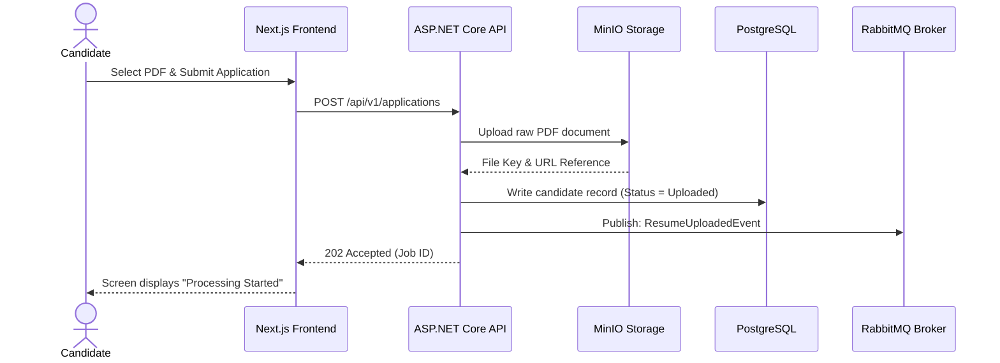

### 25.2 Resume Analysis Sequence
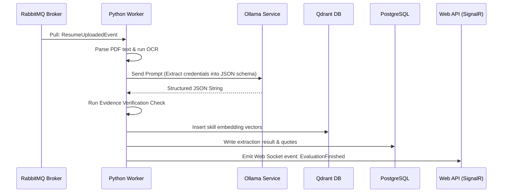

### 25.3 Coding Evaluation Sequence
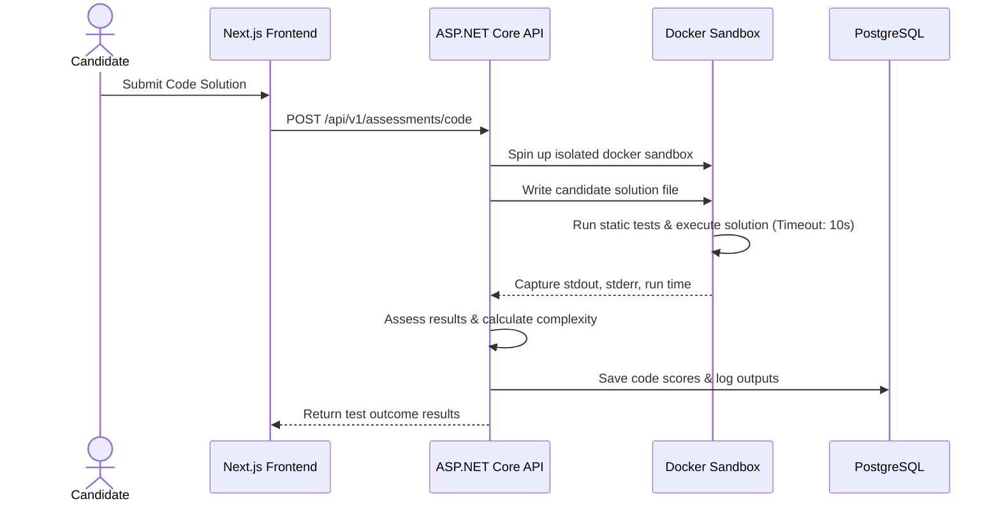

---

## 26 State Diagrams

### 26.1 Candidate Lifecycle
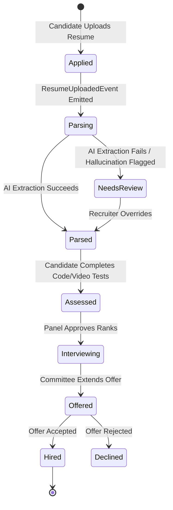

### 26.2 Assessment Lifecycle
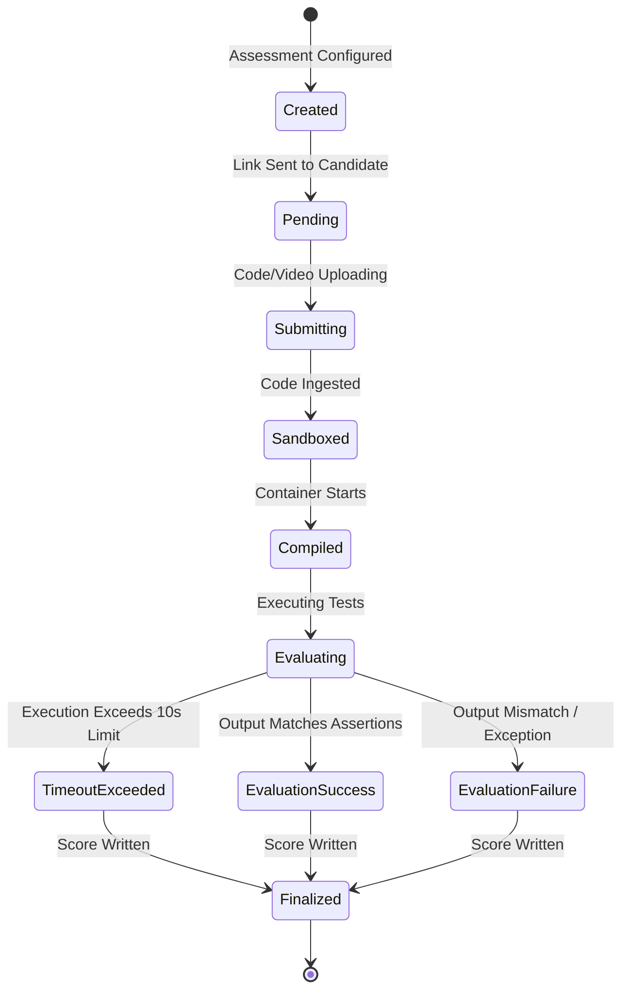

---

## 27 Architecture Validation Checklist

Before code changes are merged, validation verification must occur:

- [ ] **Dependency Rules Checked**: Verify that `FacultyIQ.Domain` has zero references to EF Core, Redis, or external APIs.
- [ ] **Thread Integrity Validated**: Confirm that no synchronous calls block waiting for AI models. All pipeline runs must be event-driven.
- [ ] **Model Version Control Matched**: Ensure the prompt files are updated in `src/FacultyIQ.AI/prompts` and checked into Git.
- [ ] **Container Port Configurations Verified**: Verify that the Docker compose file isolates database ports within the internal network.
- [ ] **SQL Query Optimization Verified**: Confirm that any new DB query does not cause N+1 query patterns.

---

## 28 Future Evolution

```
Phase 1: Modular Monolith
[Next.js Client] ---> [ASP.NET Core Web API App] ---> [Postgres DB]
                             |
                             v
                       [RabbitMQ Bus] ---> [Python AI Workers]

Phase 2: Microservice Extraction
[Next.js Client] ---> [API Gateway Routing Layer]
                             |
            +----------------+----------------+
            |                                 |
            v                                 v
   [Candidate Service]                [Assessment Service]
            |                                 |
     [Postgres DB 1]                   [Postgres DB 2]
            |                                 |
            +----------> [Event Bus] <--------+
                             |
                             v
                     [AI Processing cluster]
```

### 28.1 Extraction to Microservices
1. **Database Separation**: Split database contexts into dedicated physical databases (e.g., candidate DB and assessment DB).
2. **Gateway Orchestration**: Introduce an API Gateway (such as YARP or Ocelot) to route client calls dynamically.
3. **Event Bus Migration**: Shift internal commands from MediatR to RabbitMQ, converting modules into fully independent services.

---

## 29 Glossary

- **Institution**: A university or academic body using FacultyIQ.
- **Candidate**: A person applying for a faculty position.
- **Requisition**: A job opening/posting containing requirements.
- **Evaluation**: The AI-generated analysis of a candidate's uploaded files, videos, or code submissions.
- **Artifact**: A source file, video transcript, or code file submitted by a candidate.
- **Decision Engine**: The engine that aggregates scores based on configured rubrics and weights.
- **Evidence-First AI**: The principle requiring LLMs to extract verbatim source quotes before analyzing them, preventing hallucinations.
- **Ollama**: A local service used to run quantized LLMs on site.
- **Qdrant**: A vector database used to store embeddings and perform semantic search queries.

---

## 30 Revision History

| Version | Date | Status | Author | Approvals | Summary of Changes |
|---|---|---|---|---|---|
| **1.0.0** | 2026-07-19 | **APPROVED** | Enterprise Architect | Architecture Board | Initial Master System Architecture Document creation. |
