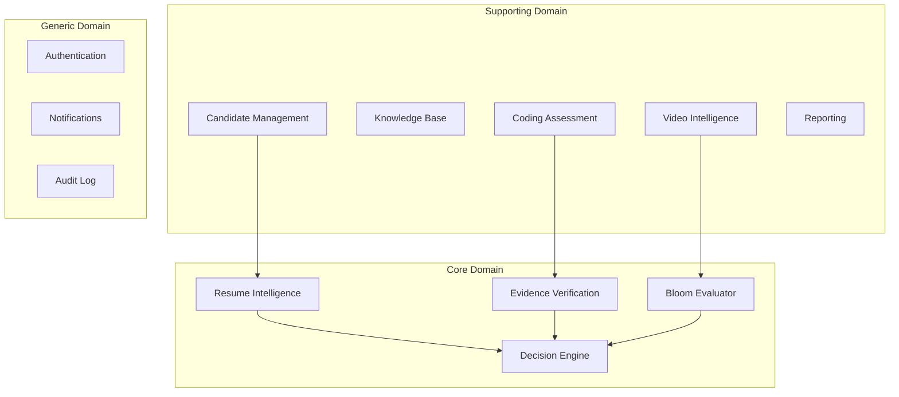
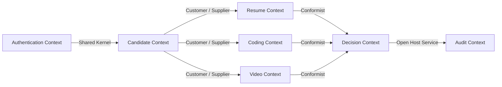
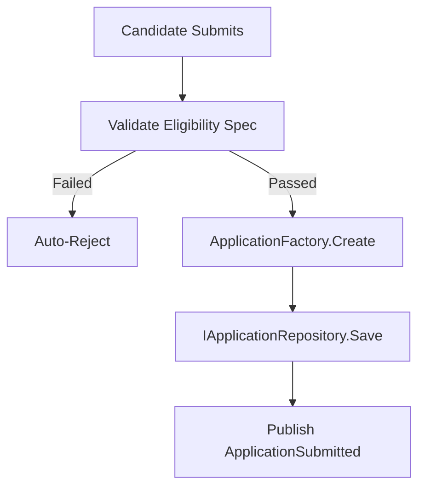
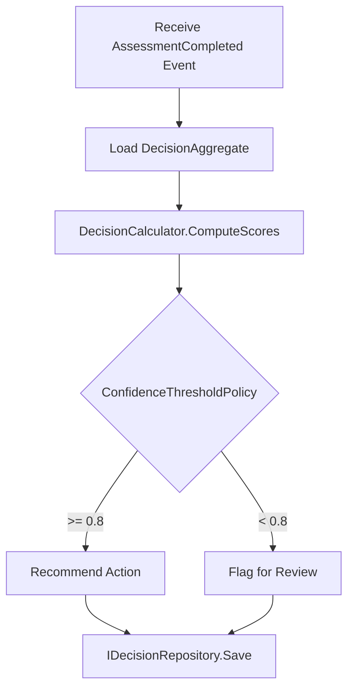
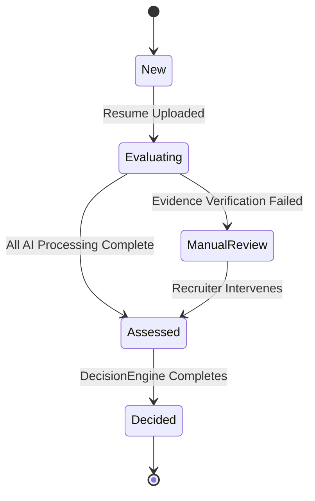

# DOMAIN-DRIVEN DESIGN SPECIFICATION (DDD)

## DOCUMENT CONTROL
| Document ID | FACULTYIQ-DDD-001 |
|---|---|
| **Version** | 1.0.0 |
| **Status** | **APPROVED / BINDING** |
| **Classification** | Enterprise Confidential |
| **Owner** | Domain Architecture Board |

> [!CAUTION]
> **AUTHORITATIVE BUSINESS SPECIFICATION**
> This document is the single source of truth for the FacultyIQ business model. All future code, API definitions, database designs, agent orchestrations, and workflows must perfectly align with the aggregates, entities, and bounded contexts defined in this document. Do not create new domain entities in the codebase without first updating this specification.

---

## 1 Introduction

### 1.1 Purpose
The purpose of this specification is to bridge the gap between FacultyIQ's complex business requirements—as defined in the SRS and PRD—and the software implementation. By applying Domain-Driven Design (DDD) principles, we create a technology-agnostic business model that protects the core evaluation logic from infrastructural concerns.

### 1.2 Scope
This document covers the entire business domain of FacultyIQ: candidate evaluation, evidence extraction, AI-powered reasoning, deterministic score aggregation, and institutional rubric management. It does not dictate database choices or infrastructure setup (these belong in the System Architecture Document).

### 1.3 Audience
This document is written for Software Architects, Principal Engineers, Domain Experts, Product Managers, and AI Researchers.

### 1.4 Relationship with System Architecture
The System Architecture Document (SAD) explains *how* the system runs (e.g., ASP.NET Core, Python, RabbitMQ). This DDD document explains *what* the system is building (e.g., Candidate Aggregates, Decision Engines, Evidence Verifications).

---

## 2 Why Domain-Driven Design

### 2.1 Business Complexity
Faculty recruitment is uniquely complex. It requires the simultaneous evaluation of pedagogical ability, subject matter expertise (e.g., coding), and historical experience (resumes). Modeling this without strict bounded contexts leads to a "Big Ball of Mud" where candidate identity logic intertwines with AI evaluation logic.

### 2.2 AI Complexity
AI introduces non-determinism. By strictly modeling `Evidence` as a distinct entity and `ConfidenceScore` as a Value Object, DDD forces the software to contain AI behavior within predictable, auditable transactional boundaries.

### 2.3 Long-Term Maintainability
FacultyIQ will eventually evolve into a multi-tenant Enterprise SaaS. By designing bounded contexts today, the platform is inherently prepared to be split into distributed microservices tomorrow without rewriting business logic.

---

## 3 Business Overview

### 3.1 Core Domains
The business capabilities that give FacultyIQ its primary competitive advantage:
- **Resume Intelligence**: Deterministic extraction of candidate history.
- **Decision Engine**: Rule-based score aggregation and ranking.
- **Evidence Verification**: The deterministic grounding of AI outputs.

### 3.2 Supporting Domains
Capabilities that are necessary but not the main differentiator:
- **Candidate Management**: ATS-style tracking and application submission.
- **Knowledge Base**: Storing and retrieving institutional rubrics.
- **Interview Delivery**: Sandboxing code and capturing video.

### 3.3 Generic Domains
Commoditized capabilities that could theoretically be off-the-shelf:
- **Authentication**: JWT, SSO, RBAC.
- **Notifications**: Email and internal messaging.
- **Audit**: Immutable logging of actions.

---

## 4 Ubiquitous Language

*The absolute dictionary for all discussions, code, and APIs.*

| Term | Business Meaning | Usage Rules |
|---|---|---|
| **Candidate** | A human applying for an academic position. | Never use "User" or "Applicant". |
| **Recruiter** | An HR professional managing the recruitment pipeline. | Never use "Admin" for this role. |
| **Assessment** | A specific test presented to a Candidate (e.g., Coding, Video). | Distinct from an "Evaluation". |
| **Interview** | The overarching process comprising multiple Assessments. | A Candidate completes an Interview. |
| **Resume** | The physical PDF or DOCX file uploaded by the Candidate. | Never use "CV". |
| **Evidence** | A verified, verbatim quote from an Artifact proving a capability. | AI must generate this. |
| **Knowledge Base** | The vector storage of institutional hiring rubrics. | Used for retrieval-augmented generation. |
| **Bloom Level** | The cognitive difficulty level according to Bloom's Taxonomy. | (Remembering, Understanding, Applying...) |
| **Teaching Evaluation** | The assessment of pedagogical skill via video transcription. | |
| **Decision** | The final compiled determination on a Candidate's viability. | Generated by the Decision Engine. |
| **Recommendation** | An AI-suggested action (Hire, Review, Reject). | Humans approve Recommendations. |
| **Confidence Score** | A numeric representation of the AI's certainty (0.0 to 1.0). | |
| **Skill** | A discrete capability required by a Requisition. | |
| **Requisition** | A formal job opening. | Never use "JobPost". |
| **Evidence Graph** | The relationships linking a Score to a piece of Evidence. | |
| **Artifact** | Any file submitted by a Candidate (Resume, Code, Video). | |

---

## 5 Domain Map

---

## 6 Bounded Contexts

### 6.1 Authentication Context
- **Purpose**: Manage identity and system access.
- **Dependencies**: None.

### 6.2 Candidate Context
- **Purpose**: Manage the lifecycle of an application and candidate details.
- **Business Rules**: A candidate cannot apply to the same Requisition twice in 6 months.

### 6.3 Resume Context
- **Purpose**: Isolate the logic of parsing PDFs and structuring experience.
- **Outputs**: `CandidateProfile` JSON and `Evidence` quotes.

### 6.4 Knowledge Context
- **Purpose**: Maintain the department rubrics as queryable vectors.

### 6.5 Interview Context
- **Purpose**: Generate and schedule dynamic questions based on the Knowledge Context and Resume Context.

### 6.6 Coding Context
- **Purpose**: Manage ephemeral sandbox executions and code evaluations.
- **Inputs**: `CodeSubmission`. **Outputs**: `EvaluationScore`.

### 6.7 Video Intelligence Context
- **Purpose**: Manage Whisper transcriptions and pedagogical analysis.

### 6.8 Bloom Context
- **Purpose**: Classify generated questions and candidate answers on the Bloom Taxonomy scale.

### 6.9 Decision Context
- **Purpose**: Aggregate all Assessment and Resume scores into a final ranking.

### 6.10 Reporting Context
- **Purpose**: Compile decision data into explainable UI outputs and PDFs.

### 6.11 Audit Context
- **Purpose**: Maintain an immutable ledger of human overrides and system faults.

---

## 7 Context Map

---

## 8 Entities

### Entity: `Candidate`
- **Purpose**: The core individual applying for a role.
- **Identity**: `Guid Id`
- **Attributes**: `Name`, `Email`, `Status`
- **Lifecycle**: Created -> ProfileCompleted -> Assessed -> Decided.

### Entity: `Requisition`
- **Purpose**: The job opening driving the evaluation parameters.
- **Attributes**: `Title`, `DepartmentId`, `RequiredSkills`

### Entity: `Application`
- **Purpose**: The specific submission joining a Candidate to a Requisition.
- **Relationships**: 1:1 with `Decision`, 1:N with `Artifact`.

### Entity: `Artifact`
- **Purpose**: An abstract representation of uploaded files.
- **Business Rules**: Artifacts are immutable once uploaded.

### Entity: `Evidence`
- **Purpose**: A verbatim string extracted by AI proving a capability.
- **Attributes**: `Quote`, `SourceLineNumber`, `SourceTimestamp`

### Entity: `Decision`
- **Purpose**: The final calculation of a Candidate's viability.
- **Validation Rules**: Cannot be generated unless all required Assessments are in a `Completed` state.

---

## 9 Value Objects

*Value Objects have no identity. They are defined entirely by their attributes and are immutable.*

### VO: `Email`
- **Validation**: Regex format validation. Must not be empty.

### VO: `ConfidenceScore`
- **Properties**: `decimal Value` (0.00 to 1.00).
- **Business Rule**: Any score < 0.85 requires the `HumanReviewRequired` flag on the Aggregate to be set to true.

### VO: `BloomLevel`
- **Properties**: `Level` (Enum: Remembering, Understanding, Applying, Analyzing, Evaluating, Creating).

### VO: `SkillScore`
- **Properties**: `string SkillName`, `int Score` (1-10), `Evidence Citation`.

### VO: `DocumentReference`
- **Properties**: `string BucketName`, `string ObjectKey`, `long SizeBytes`.

---

## 10 Aggregates

*An Aggregate is a cluster of domain objects treated as a single unit for data changes.*

### Aggregate Root: `ApplicationAggregate`
- **Root**: `Application`
- **Entities**: `Artifact`, `Assessment`
- **Value Objects**: `ApplicationStatus`
- **Consistency Rules**: An Application cannot transition to `Evaluating` until at least one `Artifact` (Resume) is attached.

### Aggregate Root: `DecisionAggregate`
- **Root**: `Decision`
- **Entities**: `Evidence`, `ScoreAdjustment`
- **Value Objects**: `ConfidenceScore`, `Recommendation`
- **Invariants**: The sum of weights applied to Assessment scores must exactly equal 1.0 (100%).

---

## 11 Domain Services

*Stateless services for business logic that does not naturally fit within an Entity.*

### Service: `ResumeAnalyzer`
- **Responsibility**: Orchestrates the passing of a PDF `Artifact` to the AI engine and structures the resulting `Evidence`.

### Service: `DecisionCalculator`
- **Responsibility**: Applies departmental rubrics and weighting policies to raw `SkillScore` objects to compute the final `Decision`.

### Service: `EvidenceBuilder`
- **Responsibility**: Validates that an AI-generated quote actually exists within the original Artifact text.

---

## 12 Domain Events

### Event: `ApplicationSubmitted`
- **Payload**: `ApplicationId`, `CandidateId`, `RequisitionId`.
- **Publisher**: `Candidate Context`
- **Subscribers**: `Resume Context`, `Notification Context`.

### Event: `ResumeParsed`
- **Payload**: `ApplicationId`, `ExtractedSkills` (JSON).
- **Business Meaning**: The AI has successfully converted unstructured text into structured capability arrays.

### Event: `EvaluationFailed`
- **Payload**: `ApplicationId`, `Reason`.
- **Failure Handling**: Routes the application into a manual review queue in the UI.

---

## 13 Domain Policies

### Policy: `BiasPreventionPolicy`
- **Rule**: If an AI model returns demographic information (age, gender, ethnicity) during extraction, the extraction is discarded, an audit log is generated, and the process is retried with a stricter prompt.

### Policy: `ConfidenceThresholdPolicy`
- **Rule**: If the aggregated `ConfidenceScore` of a `Decision` is below 0.80, the system overrides the AI's "Reject" or "Hire" recommendation with "Review Required".

---

## 14 Business Rules

- **BR-001**: A Candidate cannot modify an Artifact once the status transitions to `Evaluating`.
- **BR-002**: Every AI-generated `SkillScore` MUST be accompanied by at least one `Evidence` citation.
- **BR-003**: Code Sandboxes must forcefully terminate any process exceeding 10 seconds.
- **BR-004**: Department Heads possess the unilateral authority to overwrite an AI `Decision`, but doing so forces an Audit Record to be written specifying the justification.

---

## 15 Repositories

### Interface: `IApplicationRepository`
- **Responsibilities**: Load and save `ApplicationAggregate` roots.
- **Queries**: `GetActiveApplicationsByRequisition(Guid requisitionId)`

### Interface: `IDecisionRepository`
- **Responsibilities**: Persist the final scores and evidence traces.
- **Commands**: `SaveDecisionAsync(Decision decision)`

---

## 16 Factories

### Factory: `ApplicationFactory`
- **Purpose**: Ensures that when an Application is created, it is initialized with the correct `ApplicationStatus.New` and valid `RequisitionId`.

### Factory: `DecisionFactory`
- **Purpose**: Constructs a `Decision` by pulling the `Requisition` weighting rules and multiplying them against the raw Assessment scores.

---

## 17 Specifications

*Specifications encapsulate business rules for validation or querying.*

### Specification: `IsEligibleForInterviewSpecification`
- **Rule**: The candidate's `ResumeScore` must be >= the Requisition's `MinimumResumeScore`, OR the `HumanOverride` flag must be true.

### Specification: `IsEvidenceValidSpecification`
- **Rule**: Performs a Levenshtein distance check between the AI's `Quote` and the `SourceDocumentText`. Returns true if similarity > 98%.

---

## 18 Workflows

### Candidate Application Workflow

### Assessment Evaluation Workflow

---

## 19 State Models

### Application State Machine

---

## 20 Business Invariants

1. **Evidence Integrity**: An AI Score cannot exist without matching Source Evidence.
2. **Immutable History**: Once a Decision is reached, the scores comprising that decision cannot be altered by the system.
3. **Traceability**: Every system decision must trace back to a specific Requisition's weighting configuration at the exact time the decision was made.

---

## 21 Domain Validation Rules

- **Entity Validation**: A `Candidate` email must be formatted correctly.
- **Aggregate Validation**: An `Application` cannot have duplicate `Assessment` types (e.g., two Coding Assessments for the same Requisition).
- **Cross-Context Validation**: If the `Candidate Context` deletes a candidate profile under GDPR rules, the `Decision Context` must anonymize the scores.

---

## 22 Anti-Corruption Layers (ACL)

### LMS Integration ACL
- **Purpose**: Translates generic LTI/LMS evaluation metrics from University Systems into FacultyIQ `SkillScore` Value Objects.
- **Mechanism**: The ACL prevents LMS-specific data structures from polluting the pristine FacultyIQ Domain Model.

---

## 23 CQRS Readiness

FacultyIQ's DDD approach inherently supports Command Query Responsibility Segregation (CQRS):
- **Command Stack**: Domain Entities process business logic and emit Domain Events. (e.g., `UpdateCandidateScoreCommand`).
- **Query Stack**: The system can build denormalized Read Models directly from Domain Events, allowing the UI to query complex candidate ranking dashboards without loading heavy Domain Aggregates.

---

## 24 Microservice Evolution

Because bounded contexts communicate via `Domain Events` rather than direct object references, transitioning from the current Modular Monolith to Microservices requires minimal domain refactoring.
1. The `Candidate Context` and `Decision Context` are decoupled.
2. In a future microservices split, `CandidateId` simply acts as the correlation ID across distributed systems.

---

## 25 Traceability Matrix

| Business Capability | Bounded Context | Aggregate | Entity/VO | Domain Service |
|---|---|---|---|---|
| Resume Parsing | Resume Context | `Application` | `Artifact` | `ResumeAnalyzer` |
| Scoring | Decision Context | `Decision` | `SkillScore` | `DecisionCalculator` |
| Rubric Lookup | Knowledge Context | `Rubric` | `DocumentRef` | `KnowledgeRetrieval` |

---

## 26 Glossary

- **ACL**: Anti-Corruption Layer. A pattern isolating the domain model from external system changes.
- **Aggregate**: A transactional boundary wrapping multiple entities.
- **Bounded Context**: The explicit boundary within which a particular domain model is strictly defined and applicable.
- **Invariant**: A business rule that must always be mathematically or logically true for the data to be valid.

---

## 27 Revision History

| Version | Date | Status | Author | Approvals | Summary of Changes |
|---|---|---|---|---|---|
| **1.0.0** | 2026-07-19 | **APPROVED** | Domain Architect | Architecture Board | Initial Master Domain-Driven Design creation. |
