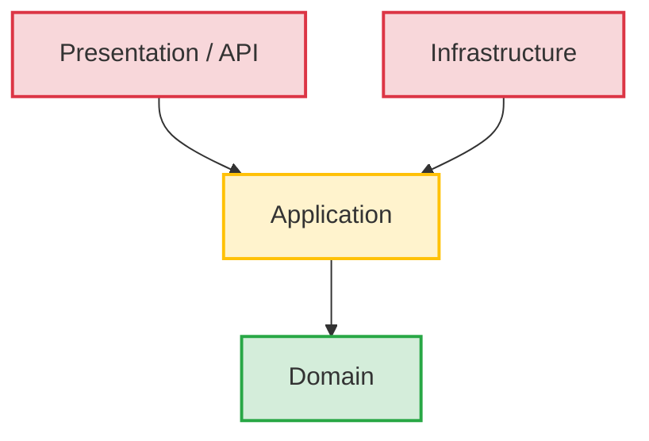
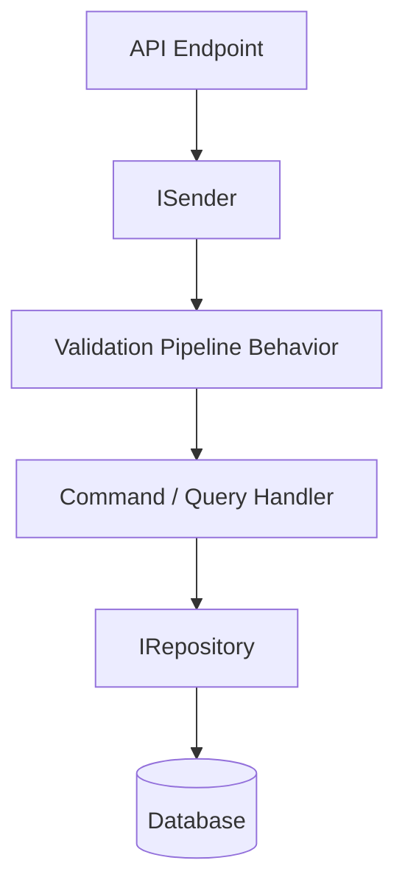
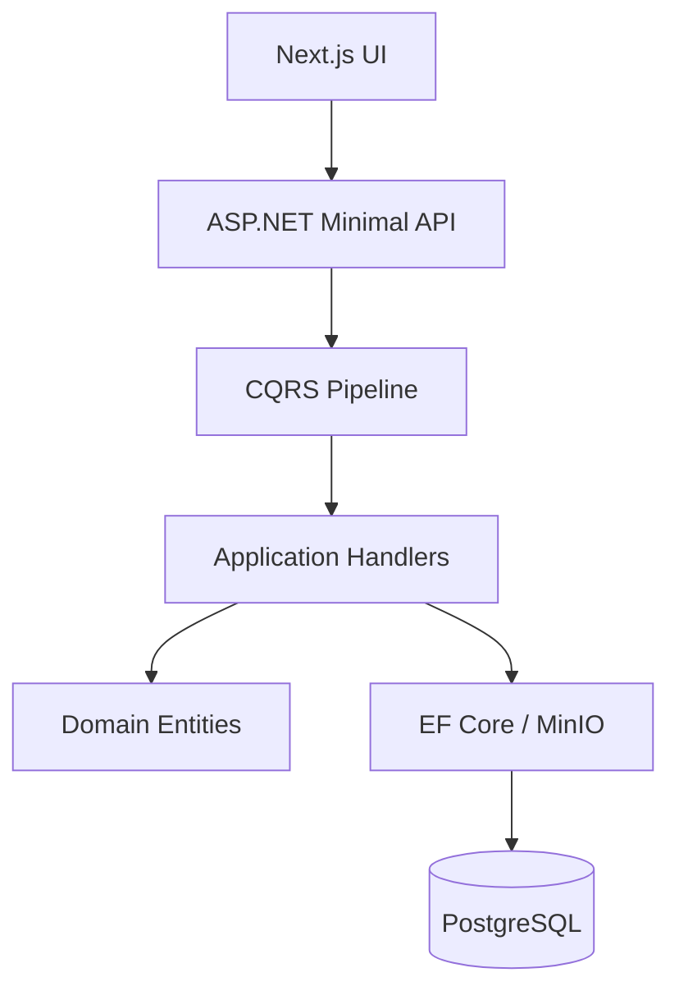

# CLEAN ARCHITECTURE IMPLEMENTATION STANDARD

## DOCUMENT CONTROL
| Document ID | FACULTYIQ-ARCH-002 |
|---|---|
| **Version** | 1.0.0 |
| **Status** | **APPROVED / BINDING** |
| **Classification** | Enterprise Confidential |
| **Owner** | Engineering Architecture Board |

> [!CAUTION]
> **MANDATORY ENGINEERING STANDARD**
> This document is the definitive engineering implementation guide for FacultyIQ. Every C# project, Python service, AI module, repository, API, background worker, and integration MUST comply with this document. Code that violates these principles MUST NOT pass pull request reviews.

---

## 1 Introduction

### 1.1 Purpose
The purpose of this document is to explicitly define *how* the FacultyIQ platform is implemented in code. It translates the abstract concepts from the Domain-Driven Design (DDD) specification and the System Architecture Document (SAD) into concrete projects, folders, classes, and interfaces.

### 1.2 Scope
This standard covers the primary ASP.NET Core 9 backend (Modular Monolith) and the Python AI services. It dictates dependency rules, CQRS implementations, database persistence patterns, and validation strategies.

### 1.3 Audience
Software Engineers, Technical Leads, AI Developers, and automated AI coding assistants writing code for FacultyIQ.

### 1.4 Relationship with Other Documents
- **SAD**: Dictates *what* containers and databases exist.
- **DDD**: Dictates *what* the business rules are.
- **This Document**: Dictates *where* to put the code and *how* to write it.

---

## 2 Why Clean Architecture

### 2.1 Benefits
Clean Architecture isolates the core business logic (Domain) from the delivery mechanisms (Web APIs) and infrastructure details (Databases, AI Models). 
- **Enterprise Suitability**: Protects high-value recruitment logic from framework churn.
- **Offline AI Suitability**: Abstracts Ollama/Whisper calls behind interfaces, allowing seamless swapping to cloud providers later if privacy rules change.
- **Maintainability**: Makes finding, fixing, and extending features predictable.
- **Testability**: Pure domain classes can be unit-tested in milliseconds without database mocks.

### 2.2 Trade-offs
- Increased initial file count and structural boilerplate.
- Steeper learning curve for junior developers accustomed to "Fat Controller" architectures.

### 2.3 Alternatives
- **N-Tier (Data-Centric)**: Rejected because it makes the database the center of the application, violating DDD principles.
- **Vertical Slice**: Considered, but rejected for Phase 1 as strict physical layers enforce better discipline for the future microservices migration.

---

## 3 Dependency Rule

The core principle of FacultyIQ's architecture is the **Dependency Rule**: Source code dependencies must *only* point inward toward the Domain.



### 3.1 Allowed Dependencies
- `Infrastructure` project -> `Application` project.
- `Application` project -> `Domain` project.
- `API` project -> `Application` & `Infrastructure` (only for DI wire-up).

### 3.2 Forbidden Dependencies
- `Domain` MUST NOT reference `Application`, `Infrastructure`, or `API`.
- `Domain` MUST NOT reference Entity Framework Core or JSON serialization attributes.
- `Application` MUST NOT reference `Infrastructure` directly. It relies on Interfaces.

---

## 4 Layered Architecture

### 4.1 Domain Layer (`FacultyIQ.Domain`)
- **Purpose**: Holds enterprise business rules (Entities, Value Objects).
- **Dependencies**: None. Pure C#.
- **Forbidden**: Databases, HTTP, external libraries.

### 4.2 Application Layer (`FacultyIQ.Application`)
- **Purpose**: Application business rules. Orchestrates use cases.
- **Responsibilities**: CQRS Commands/Queries, MediatR handlers, FluentValidation rules, DTOs.
- **Dependencies**: `FacultyIQ.Domain`.

### 4.3 Infrastructure Layer (`FacultyIQ.Infrastructure`)
- **Purpose**: Implementation details.
- **Responsibilities**: EF Core DbContext, PostgreSQL connections, MinIO S3 clients, RabbitMQ publishers, Qdrant vector clients.
- **Dependencies**: `FacultyIQ.Application`, `FacultyIQ.Domain`.

### 4.4 API Layer (`FacultyIQ.Api`)
- **Purpose**: The delivery mechanism.
- **Responsibilities**: Minimal APIs, Swagger, Controllers, JWT Auth middleware.
- **Dependencies**: `FacultyIQ.Application`, `FacultyIQ.Infrastructure`.

### 4.5 AI Integration Layer (`FacultyIQ.AI`)
- **Purpose**: Python services processing heavy machine learning tasks.
- **Responsibilities**: Calling Ollama, Whisper, parsing PDFs, emitting events.
- **Dependencies**: RabbitMQ (Pika), Qdrant Python Client, MinIO.

---

## 5 Solution Structure

The Visual Studio Solution (`FacultyIQ.sln`) must be structured exactly as follows:

```text
FacultyIQ.sln
│
├── src/
│   ├── FacultyIQ.Domain/           # Core Entities & Interfaces
│   ├── FacultyIQ.Application/      # Use Cases (CQRS)
│   ├── FacultyIQ.Infrastructure/   # DB, Queues, External APIs
│   ├── FacultyIQ.Api/              # Web Host, Endpoints
│   ├── FacultyIQ.SharedKernel/     # Common Exceptions, Result Pattern
│   └── FacultyIQ.AI/               # Python AI pipeline codebase
│
└── tests/
    ├── FacultyIQ.Domain.UnitTests/
    ├── FacultyIQ.Application.UnitTests/
    ├── FacultyIQ.Infrastructure.IntegrationTests/
    └── FacultyIQ.Api.E2ETests/
```

---

## 6 Folder Standards

### `FacultyIQ.Application` Folder Structure
- `/Commands`: MediatR command records and handlers.
- `/Queries`: MediatR query records and handlers.
- `/DTOs`: Data Transfer Objects.
- `/Validators`: FluentValidation classes for Commands/Queries.
- `/Mappings`: AutoMapper or manual mapping extensions.
- `/Interfaces`: Ports that Infrastructure must implement (e.g., `ICandidateRepository`).

### `FacultyIQ.Domain` Folder Structure
- `/Entities`: Aggregate roots and standard entities.
- `/ValueObjects`: Immutable concepts (e.g., `SkillScore`).
- `/Events`: Domain events (e.g., `CandidateRegisteredDomainEvent`).
- `/Exceptions`: Domain-specific exceptions.

### `FacultyIQ.Infrastructure` Folder Structure
- `/Persistence`: EF Core `DbContext`, Migrations, Configurations.
- `/Repositories`: Concrete implementations of domain repository interfaces.
- `/Messaging`: RabbitMQ connection factories and publishers.
- `/Storage`: MinIO client wrappers.
- `/AI`: Concrete adapters for Python/Ollama integration.

---

## 7 Dependency Injection Strategy

FacultyIQ strictly uses **Constructor Injection**. Property injection or Service Locator patterns are strictly forbidden.

### 7.1 Lifetime Rules
- **Transient**: Stateless utility classes, MediatR handlers.
- **Scoped**: EF Core `DbContext`, Repositories, Unit of Work (lives for the HTTP request).
- **Singleton**: Memory Caches, Configuration Options, RabbitMQ Connection Factories.

### 7.2 Registration Pattern
Use extension methods to keep `Program.cs` clean:
```csharp
public static class DependencyInjection
{
    public static IServiceCollection AddInfrastructure(this IServiceCollection services, IConfiguration config)
    {
        services.AddScoped<ICandidateRepository, CandidateRepository>();
        services.AddSingleton<IRabbitMqPublisher, RabbitMqPublisher>();
        // ...
        return services;
    }
}
```

### 7.3 Options Pattern
Strongly typed configuration bindings MUST be used. Do not inject `IConfiguration` directly into services.

---

## 8 Domain Layer

The Domain Layer must be pure C# without external dependencies.

### 8.1 Entities & Aggregates
Entities must encapsulate their state. Properties must have `private set` setters.
```csharp
public class Candidate : AggregateRoot
{
    public Guid Id { get; private set; }
    public EmailAddress Email { get; private set; }
    public CandidateStatus Status { get; private set; }

    private Candidate() { } // EF Core requires a parameterless constructor

    public static Candidate Create(EmailAddress email)
    {
        var candidate = new Candidate
        {
            Id = Guid.NewGuid(),
            Email = email,
            Status = CandidateStatus.New
        };
        candidate.AddDomainEvent(new CandidateCreatedEvent(candidate.Id));
        return candidate;
    }
}
```

### 8.2 Domain Events
Use Domain Events to decouple side effects. They are dispatched *before* the transaction commits.

---

## 9 Application Layer

The Application layer defines the "Use Cases" via CQRS (Command Query Responsibility Segregation).

### 9.1 CQRS Flow



### 9.2 Command Handler Example
```csharp
public record SubmitApplicationCommand(Guid CandidateId, Guid RequisitionId) : IRequest<Result<Guid>>;

public class SubmitApplicationCommandHandler : IRequestHandler<SubmitApplicationCommand, Result<Guid>>
{
    private readonly IApplicationRepository _repository;
    private readonly IUnitOfWork _unitOfWork;

    public SubmitApplicationCommandHandler(IApplicationRepository repository, IUnitOfWork unitOfWork)
    {
        _repository = repository;
        _unitOfWork = unitOfWork;
    }

    public async Task<Result<Guid>> Handle(SubmitApplicationCommand request, CancellationToken cancellationToken)
    {
        var application = Application.Create(request.CandidateId, request.RequisitionId);
        await _repository.AddAsync(application);
        await _unitOfWork.SaveChangesAsync(cancellationToken);
        return Result<Guid>.Success(application.Id);
    }
}
```

---

## 10 Infrastructure Layer

This layer implements the interfaces defined in the Application layer.

### 10.1 Entity Framework Core
- Configuration must be done via `IEntityTypeConfiguration<T>` in the `Infrastructure/Persistence/Configurations` folder.
- Do NOT use Data Annotations (`[Table]`, `[Column]`) on Domain Entities.

### 10.2 External Services
- RabbitMQ logic resides here.
- MinIO integration resides here.
- Ollama API HTTP clients reside here (for C# synchronous calls) or in the Python worker layer.

---

## 11 API Layer

The API layer is exclusively responsible for HTTP transport.

### 11.1 Minimal APIs
FacultyIQ prefers Minimal APIs for high-performance routes. Place endpoints in static classes organized by domain (e.g., `CandidateEndpoints.cs`).

### 11.2 Standard Response Model
Endpoints must return standard HTTP status codes or RFC 7807 Problem Details on failure.
```csharp
app.MapPost("/api/candidates", async (CreateCandidateCommand command, ISender sender) =>
{
    var result = await sender.Send(command);
    return result.IsSuccess ? Results.Ok(result.Value) : Results.BadRequest(result.Error);
});
```

---

## 12 AI Layer

The Python AI Layer operates as a decoupled worker cluster.

### 12.1 Implementation Standards
- **Framework**: Use FastAPI for internal worker health checks, and `pika` for RabbitMQ consumption.
- **Model Routing**: Dynamically route context-heavy queries to `Qwen2.5 3B` and code-specific queries to `Qwen2.5-Coder 3B`.
- **Validation**: All LLM outputs MUST be parsed through Pydantic models. If Pydantic validation fails, trigger the retry policy.

```python
class SkillExtraction(BaseModel):
    skill_name: str
    evidence_quote: str
    confidence: float

# Strict validation forces the LLM into deterministic outputs
```

### 12.2 Evidence Graph Integration
Python workers must cross-reference `evidence_quote` strings against the original raw text. If the string distance exceeds the allowed tolerance, discard the extraction as a hallucination.

---

## 13 Worker Layer

Background tasks inside ASP.NET Core use `IHostedService` or `BackgroundService`.

### 13.1 Retry Policies and Dead Letter Queues
Use RabbitMQ Dead Letter Exchanges (DLX) for messages that fail processing 3 times. Do not loop infinitely.

---

## 14 Shared Kernel

Contains concepts that span across bounded contexts but do not contain business logic.
- `Result<T>` pattern for avoiding exceptions in control flow.
- Core Exceptions (`NotFoundException`, `ValidationException`).
- System-wide constants.

---

## 15 Repository Pattern

- Repositories must ONLY deal with Aggregate Roots. Do not create a repository for a child entity.
- Do not expose `IQueryable<T>` from repositories; this leaks database execution logic into the application layer. Expose `Task<IEnumerable<T>>` or `Task<IReadOnlyList<T>>`.

---

## 16 CQRS Readiness

FacultyIQ uses MediatR.
- **Commands**: Modify state. Must not return large payloads (only IDs or success status).
- **Queries**: Retrieve state. Must not modify state. Safe to bypass the repository and use Dapper for complex, read-heavy dashboards if EF Core performance is insufficient.

---

## 17 Validation Strategy

### 17.1 FluentValidation
Validate Commands and Queries using FluentValidation.
```csharp
public class SubmitApplicationCommandValidator : AbstractValidator<SubmitApplicationCommand>
{
    public SubmitApplicationCommandValidator()
    {
        RuleFor(x => x.CandidateId).NotEmpty();
        RuleFor(x => x.RequisitionId).NotEmpty();
    }
}
```
Register a MediatR Pipeline Behavior to automatically intercept invalid requests and throw a `ValidationException` before the handler executes.

---

## 18 Exception Handling

All exceptions must be caught by a global middleware and mapped to proper HTTP status codes.

| Exception Type | HTTP Status Code | RFC 7807 Title |
|---|---|---|
| `ValidationException` | 400 Bad Request | Validation Error |
| `NotFoundException` | 404 Not Found | Resource Not Found |
| `UnauthorizedAccessException` | 401 Unauthorized | Unauthorized |
| `InvalidDomainStateException` | 422 Unprocessable Entity | Business Rule Violation |
| Unhandled `Exception` | 500 Server Error | Internal Server Error |

---

## 19 Mapping Strategy

- Prefer explicit, manual mapping (extension methods or static mappers) over AutoMapper for performance-critical code.
- Example: `public static CandidateDto ToDto(this Candidate candidate)`

---

## 20 Persistence Strategy

- **Transactions**: Commands that modify multiple aggregates must use an `IUnitOfWork` to commit changes atomically.
- **Soft Delete**: Never hard-delete candidates. Implement an `IsDeleted` flag and use EF Core Global Query Filters.
- **Audit Fields**: Every entity must implement `IAuditableEntity` (`CreatedAt`, `CreatedBy`, `LastModifiedAt`, `LastModifiedBy`).

---

## 21 Security Architecture

- **JWT Auth**: Tokens must be signed with RSA or strong HMAC keys.
- **Claims**: Use standard claims (`sub`, `email`, `role`).
- **OWASP**: Ensure EF Core parameters prevent SQL injection. Ensure XSS protection on UI dashboards.

---

## 22 Configuration Strategy

- **Environment Variables**: Use `appsettings.json` for local development, and Environment Variables for Docker/Production.
- **Secrets**: Never commit secrets. Use Docker secrets or Azure Key Vault equivalent.

---

## 23 Logging Strategy

- **Serilog**: Must output JSON formatted logs for ingestion into ELK/Loki.
- **Correlation IDs**: Log templates MUST include `{CorrelationId}` for distributed tracing.

---

## 24 Testing Strategy

- **Unit Tests**: Test Domain Entities and Application Handlers. Mock Repositories using NSubstitute or Moq.
- **Integration Tests**: Test Repositories against a real PostgreSQL container (using Testcontainers).
- **AI Tests**: Python logic must mock Ollama endpoints to ensure Pydantic guards behave correctly on bad outputs.

---

## 25 Coding Standards

- **Naming**: `PascalCase` for classes/methods. `camelCase` for variables. `_camelCase` for private fields.
- **Nullability**: `<Nullable>enable</Nullable>` MUST be turned on.
- **Async/Await**: Append `Async` to asynchronous methods. Use `CancellationToken` in all IO-bound methods.

---

## 26 Performance Guidelines

- **Asynchronous Code**: Never use `.Result` or `.Wait()`. It causes thread-pool starvation.
- **Connection Pooling**: Npgsql connection pooling must be enabled.

---

## 27 Anti-Patterns

- **Fat Controllers**: Controllers must only receive requests, route to MediatR, and return HTTP results.
- **Anemic Domain Model**: Entities that are just bags of getters and setters are forbidden. Behavior must be inside the entity.
- **Business Logic in Infrastructure**: The database layer must only fetch and store data.

---

## 28 Migration to Microservices

By strictly enforcing the Clean Architecture dependency rule and avoiding database cross-joins between domains, FacultyIQ can easily split into independent microservices by placing an API Gateway (e.g., YARP) in front of separated Web APIs.

---

## 29 Architecture Validation Checklist

- [ ] Does the Domain reference EF Core? (If yes, fail PR).
- [ ] Are controllers executing business logic? (If yes, fail PR).
- [ ] Is input validated via FluentValidation?
- [ ] Are exceptions mapped globally?

---

## 30 Appendices

### 30.1 Reference Architecture Map


### 30.2 Revision History
| Version | Date | Status | Author | Approvals |
|---|---|---|---|---|
| **1.0.0** | 2026-07-19 | **APPROVED** | Chief Architect | Architecture Board |
