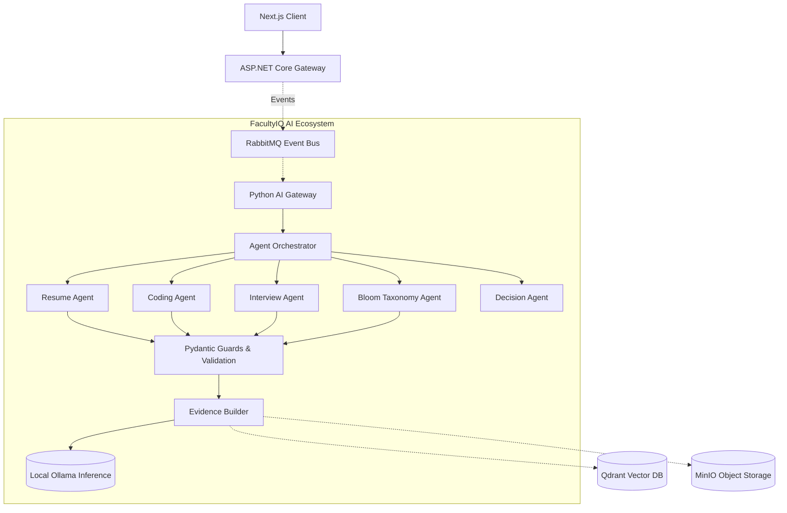
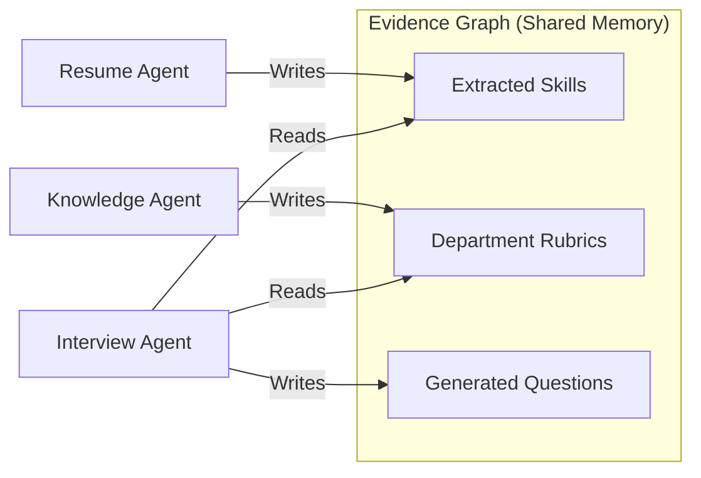
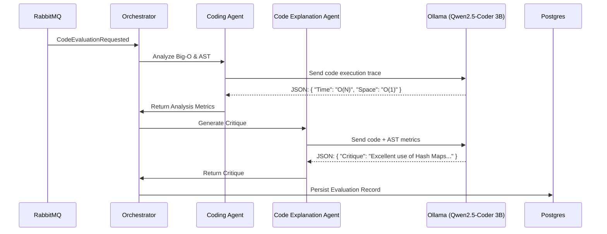
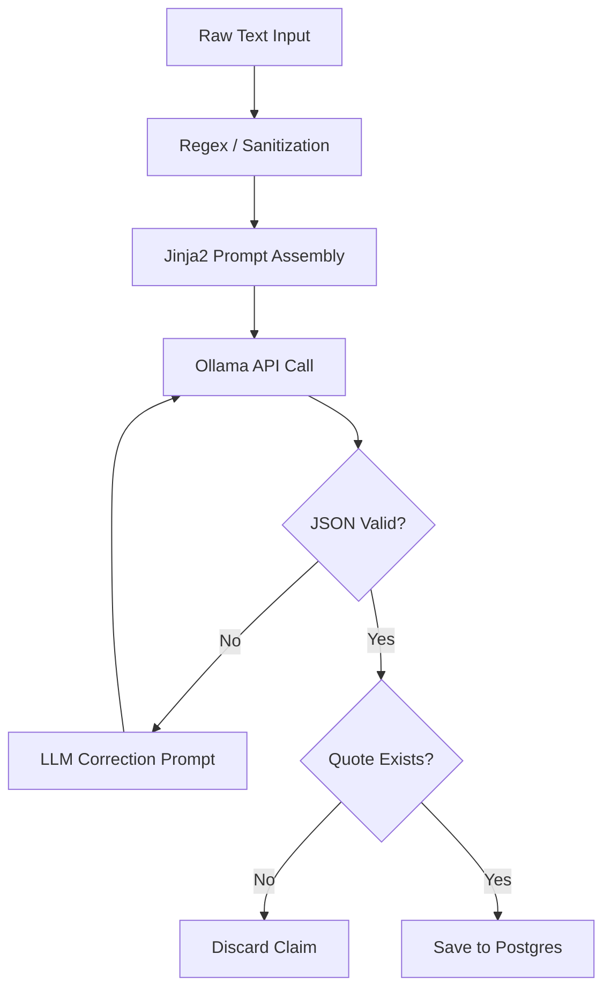

# AI ARCHITECTURE SPECIFICATION

## DOCUMENT CONTROL
| Document ID | FACULTYIQ-AI-001 |
|---|---|
| **Version** | 1.0.0 |
| **Status** | **APPROVED / BINDING** |
| **Classification** | Enterprise Confidential |
| **Owner** | AI Architecture Board |

> [!CAUTION]
> **GOVERNING AI CONTRACT**
> This document defines how the FacultyIQ AI ecosystem is orchestrated. Every AI service, Python module, local inference setup, prompt template, and evaluation pipeline must conform strictly to these specifications. Deviations (such as calling external cloud APIs for PII data or bypassing Pydantic validations) are strictly prohibited.

---

## 1 Executive Summary

### 1.1 Purpose
The FacultyIQ AI Architecture defines the structural blueprint for a local, privacy-first, multi-agent AI system. It outlines how Small Language Models (SLMs) and traditional machine learning pipelines collaborate to evaluate highly subjective human capital artifacts (resumes, coding tests, teaching videos) using deterministic bounds.

### 1.2 AI Vision
To build the most trustworthy and explainable AI recruitment engine in existence. We reject the "black box" paradigm. Instead, we embrace a "Human-in-the-Loop" architecture where AI acts as a tireless, ultra-fast evidence extractor, presenting its citations to human decision-makers.

### 1.3 Goals
- **Enterprise Goals**: Reduce evaluation time by 80% while ensuring zero data leakage to public cloud providers (e.g., OpenAI, Anthropic) via an offline-first deployment topology.
- **Research Goals**: Prove that an ensemble of specialized, locally hosted SLMs (like Qwen2.5 3B) can outperform generalized monolithic models when constrained by strict prompt templates and evidence graphs.

---

## 2 AI Philosophy

### 2.1 Evidence First
Models are explicitly forbidden from hallucinating capabilities. An AI's synthesis must be directly grounded in a verbatim extraction from the source artifact.

### 2.2 Deterministic Before LLM
Regex, parsers, and AST (Abstract Syntax Tree) analyzers handle data extraction where rules apply. LLMs are invoked solely for semantic reasoning, taxonomy mapping, and unstructured text parsing.

### 2.3 Offline First
The core pipeline runs in an air-gapped environment using local Ollama containers and GPU passthroughs, ensuring total institutional data sovereignty.

### 2.4 Modularity & Scalability
Agents are stateless and independently scalable. If the Resume queue is backed up, the orchestrator scales up Resume Agents without scaling Interview Agents.

---

## 3 AI System Overview

The AI Ecosystem operates entirely asynchronously, listening to the RabbitMQ event bus and writing state updates back to PostgreSQL and the Qdrant vector database.



---

## 4 AI Layer Architecture

### 4.1 AI Gateway Layer
Responsible for receiving tasks from RabbitMQ, authenticating internal requests, and distributing workloads to the Orchestrator.

### 4.2 Orchestration & Agent Layer
Responsible for executing Directed Acyclic Graphs (DAGs) of AI tasks. Maintains the `AgentOrchestrator` which manages the lifecycle of specialized agents.

### 4.3 Validation & Evidence Layer (Pydantic)
The critical safety boundary. All raw string outputs from the Inference Layer are parsed into strict JSON/Pydantic schemas. 

### 4.4 Inference Engine Layer (Ollama)
The physical execution layer. Manages HTTP connections to the local Ollama daemon, allocating VRAM pools to specific quantized models.

### 4.5 Knowledge Layer
Manages vector chunking, embedding generation (Sentence Transformers), and query retrieval from FAISS/Qdrant.

---

## 5 AI Gateway

### 5.1 Responsibilities
The AI Gateway exposes internal FastAPI endpoints and RabbitMQ consumer loops. It acts as the traffic cop for the Python ecosystem.

### 5.2 Model Selection & Versioning
It explicitly maps intent to the local model registry. It dynamically injects the system prompt, configuration parameters (Temperature: 0.1, Top-P: 0.9), and manages timeouts.

### 5.3 Circuit Breakers
If Ollama fails to respond within 30 seconds for 3 consecutive calls, the Gateway triggers an open circuit breaker, returning an `InferenceDegraded` error to the ASP.NET backend.

---

## 6 Multi-Agent Architecture

FacultyIQ utilizes a Multi-Agent architecture to overcome the context window limitations and reasoning degradation inherent in smaller models.

### 6.1 Advantages
By splitting a massive evaluation into narrow domains, we can use ultra-efficient 3B parameter models that run on standard enterprise hardware rather than requiring arrays of H100 GPUs.

### 6.2 Agent Collaboration
Agents do not communicate directly. They communicate via the `Evidence Graph`. The Resume Agent writes to the graph, and the Interview Agent reads from the graph.



---

## 7 Agent Catalog

### 7.1 Resume Agent
- **Purpose**: Extract structured capabilities and timeline data from unstructured CV PDFs.
- **Model Assignment**: `Qwen2.5 3B`
- **Inputs**: OCR text string.
- **Outputs**: `CandidateProfile` JSON array.
- **Failure Mode**: Non-parseable JSON routes candidate to Manual Review.

### 7.2 Knowledge (RAG) Agent
- **Purpose**: Retrieve and rank the most relevant institutional hiring rubrics for a given requisition.
- **Model Assignment**: `Llama3.2 3B`
- **Dependencies**: Qdrant Vector DB.

### 7.3 Interview Agent
- **Purpose**: Dynamically formulate highly technical or pedagogical interview questions based on the candidate's Resume Evidence.
- **Model Assignment**: `Llama3.2 3B`

### 7.4 Coding Agent
- **Purpose**: Execute AST analysis and measure Big-O complexity of candidate sandboxed code.
- **Model Assignment**: `Qwen2.5-Coder 3B`
- **Inputs**: Raw code string, stdout/stderr.

### 7.5 Code Explanation Agent
- **Purpose**: Generate a human-readable critique of the candidate's code structure, highlighting DRY/SOLID violations.
- **Model Assignment**: `Qwen2.5-Coder 3B`

### 7.6 Bloom Taxonomy Agent
- **Purpose**: Classify generated questions and candidate responses on the Bloom cognitive scale (Remembering to Creating).
- **Model Assignment**: `Llama3.2 3B`

### 7.7 Decision Agent
- **Purpose**: Synthesize all gathered Evidence and SkillScores into a final, human-readable recommendation justification.
- **Model Assignment**: `Qwen2.5 3B`

---

## 8 Agent Orchestration Engine

The Python `WorkflowEngine` executes predefined DAGs (Directed Acyclic Graphs).

### 8.1 Example: Conditional Workflow
If the Candidate has submitted code -> trigger `CodingAgent`. 
Wait for `CodingAgent` -> Trigger `CodeExplanationAgent`.

### 8.2 Failure Recovery
If an Agent exhausts its retry budget (max 3), the WorkflowEngine halts the DAG, commits the partial Evidence Graph to Postgres, and flags the workflow status as `Suspended_Requires_Human`.

---

## 9 AI Workflow Architecture

### 9.1 Coding Evaluation Sequence



---

## 10 AI Gateway APIs

The Python FastAPI backend exposes internal interfaces for sync/async operations.

### 10.1 POST `/api/v1/workflows/resume`
- **Content-Type**: `application/json`
- **Payload**: `{ "candidateId": "uuid", "artifactUrl": "minio://..." }`
- **Response**: `202 Accepted`

### 10.2 Error Handling
All FastAPI routes implement exception handlers mapping to standard HTTP status codes, accompanied by detailed JSON traces.

---

## 11 Prompt Management

Prompts are treated as code.

### 11.1 Repository Structure
Prompts live in `src/FacultyIQ.AI/prompts/`. They are written in Jinja2 templating syntax.

### 11.2 Dynamic Assembly
```jinja2
SYSTEM INSTRUCTION:
You are an expert technical recruiter analyzing a resume.
Extract the candidate's skills into the strict JSON schema provided.

EVIDENCE RULES:
You must provide a verbatim quote from the text for every skill.

CANDIDATE TEXT:
{{ candidate_text }}

RUBRIC:
{{ department_rubric }}
```

---

## 12 Context Engineering

Because SLMs (3B parameters) have limited context reasoning capacity, Token Budget Management is strictly enforced.

### 12.1 Context Compression
If a resume OCR output exceeds 8,000 tokens, the `ContextBuilder` triggers a summarization/chunking pipeline before passing the text to the `ResumeAgent`.

---

## 13 Evidence Graph

### 13.1 Purpose
To prevent LLM hallucination, FacultyIQ constructs a cryptographic-like chain of evidence.

### 13.2 Schema
```json
{
  "claim": "Proficient in React and Next.js",
  "confidenceScore": 0.95,
  "sourceArtifactId": "uuid",
  "verbatimQuote": "Led frontend migration to Next.js using React hooks.",
  "validationStatus": "VERIFIED_EXACT_MATCH"
}
```
If `validationStatus` fails the programmatic string-matching phase, the claim is dropped from the Decision Engine's context.

---

## 14 Inference Pipeline



---

## 15 Confidence Engine

### 15.1 Scoring Strategy
The Inference Pipeline attaches a 0.0 to 1.0 confidence score to generated classifications based on model logprobs (if supported) and rule-based heuristics.

### 15.2 Thresholds
- **> 0.85**: Auto-accept the AI's evidence.
- **0.60 - 0.84**: Accept, but flag `HumanReview` required in the UI.
- **< 0.60**: Discard the output and halt the workflow.

---

## 16 Explainability Framework

When the ASP.NET Core UI displays a Candidate Score, the API retrieves the Reason Chain from the Evidence Graph. The Recruiter can click any score and visually see the exact line in the PDF or the exact timestamp in the video where the model derived its conclusion.

---

## 17 Knowledge Architecture

### 17.1 Qdrant Vector Storage
- **Model**: `all-MiniLM-L6-v2` runs locally via SentenceTransformers.
- **Chunking**: Department Rubrics are chunked at 512 tokens with a 50-token overlap.
- **Retrieval**: Hybrid retrieval using Cosine Similarity alongside exact keyword matching.

---

## 18 Model Routing

### 18.1 Routing Rules
The `ModelRouter` maps specific task types to designated models, ensuring specialized tasks hit specialized SLMs.
- `TaskType.CODE_ANALYSIS` -> Route to `Qwen2.5-Coder 3B`.
- `TaskType.ENTITY_EXTRACTION` -> Route to `Qwen2.5 3B`.
- `TaskType.REASONING_CLASSIFICATION` -> Route to `Llama3.2 3B`.

---

## 19 AI Memory Strategy

### 19.1 Workflow Memory
State is maintained temporarily in Redis during active DAG execution. Once the DAG completes, memory is flushed and committed permanently to Postgres.

---

## 20 Safety & Guardrails

### 20.1 PII and Leakage
Because all models are run locally (Offline-First), data leakage to external APIs is impossible. 

### 20.2 Prompt Injection
All user inputs (Candidate Code, Resume Text) are wrapped in strict delimiters (`=== TEXT ===`) and processed using structured generation parameters.

---

## 21 Evaluation Framework

### 21.1 Offline Benchmarks
Every time a Jinja2 prompt or Ollama model version is updated, the `pytest` evaluation suite runs against a Golden Dataset of 500 resumes.
- **Precision Target**: > 95%
- **Hallucination Rate Target**: < 1%

---

## 22 AI Observability

### 22.1 Telemetry
- The Python workers use `OpenTelemetry` to generate spans.
- Tracked Metrics: `InferenceLatency`, `TokenCountIn`, `TokenCountOut`, `GPUUtilization`.
- Prometheus scrapes `/metrics` from the FastAPI worker instances.

---

## 23 Failure Recovery

### 23.1 GPU Exhaustion
If the Ollama daemon returns HTTP 503 (Resource Exhausted) or inference hangs, the API gateway triggers an exponential backoff retry. Messages remain durable in RabbitMQ until VRAM frees up.

---

## 24 Security

### 24.1 API Security
Internal AI APIs require an internal M2M (Machine-to-Machine) JWT generated by the ASP.NET Core gateway.

### 24.2 Model Isolation
The Docker container running Ollama has no outbound internet access. It cannot download models at runtime; weights are baked in during the build phase.

---

## 25 Future Evolution

1. **Vision Models**: Upgrading the Video Intelligence pipeline to use LLaVA or Qwen-VL to evaluate candidates' body language and whiteboard usage.
2. **Federated AI**: Allowing multiple universities to train global rubrics securely without sharing underlying applicant PII.

---

## 26 AI Architecture Decision Records

- **ADR-AI-001: Local Models Only**
  - *Decision*: Reject OpenAI/Anthropic in favor of local Ollama deployments.
  - *Context*: Universities require GDPR compliance and absolute data privacy.
- **ADR-AI-002: Pydantic Validation Bounds**
  - *Decision*: Force all LLM output into JSON, validated by Pydantic.
  - *Context*: Raw text parsing is brittle. If output fails JSON schema, it fails the job.

---

## 27 Traceability Matrix

| Business Goal | AI Capability | Agent | Model |
|---|---|---|---|
| Bias-Free Eval | Rubric Matching | Knowledge Agent | `Llama3.2 3B` |
| Fast Tech Screens | Sandboxed AST | Coding Agent | `Qwen2.5-Coder 3B` |
| Automate Resumes | Extractor | Resume Agent | `Qwen2.5 3B` |

---

## 28 Glossary

- **Evidence Graph**: A cryptographic-like mapping of assertions to verbatim source text.
- **Ollama**: A lightweight daemon for serving quantized models locally.
- **SLM**: Small Language Model (e.g., 3B to 8B parameters), optimized for narrow tasks.

---

## 29 Revision History

| Version | Date | Status | Author | Approvals |
|---|---|---|---|---|
| **1.0.0** | 2026-07-19 | **APPROVED** | Chief AI Officer | AI Architecture Board |
