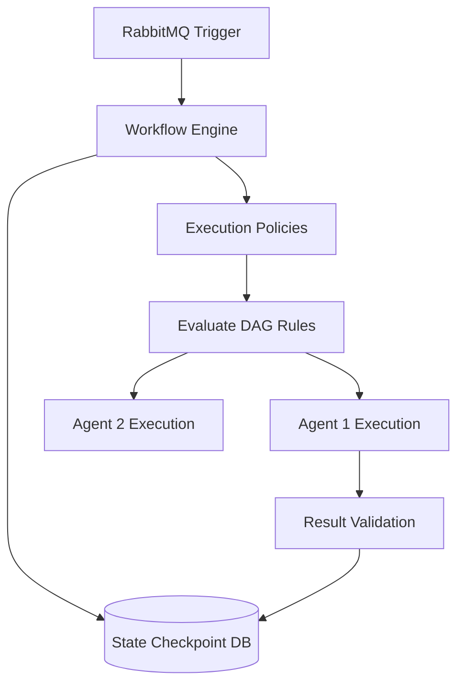
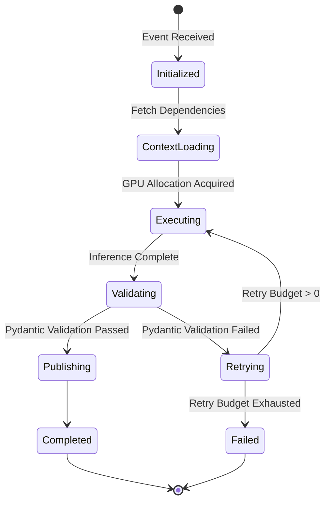
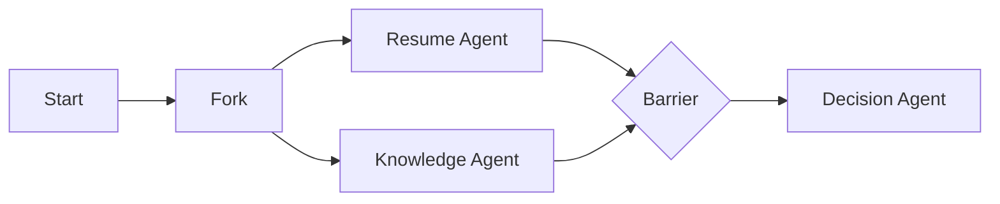
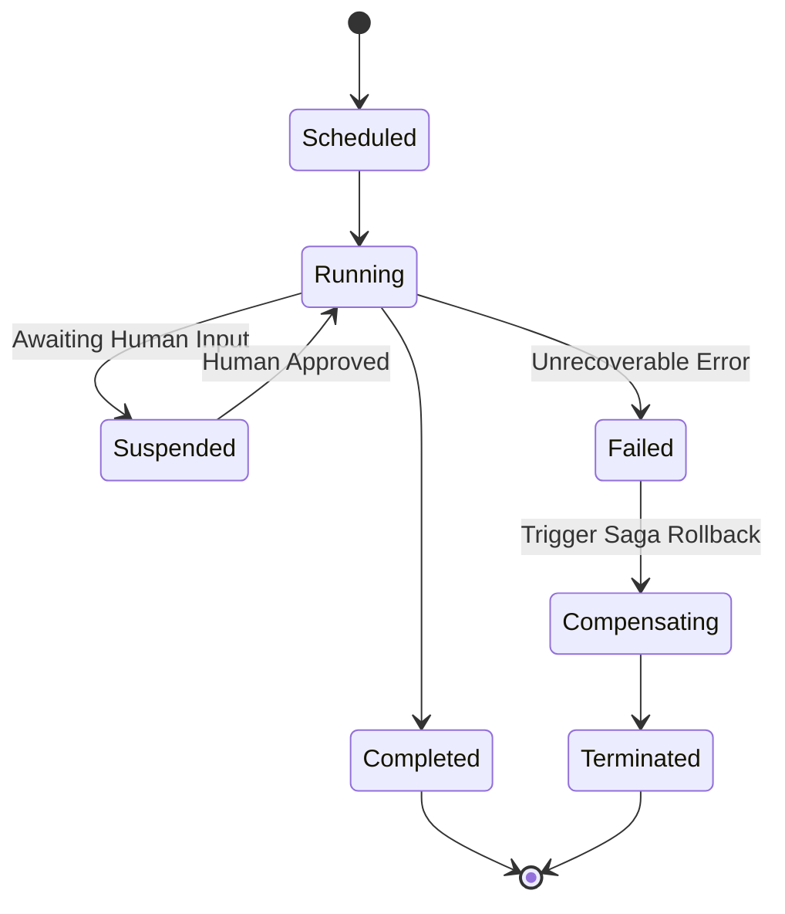

# AGENT ORCHESTRATION AND WORKFLOW ARCHITECTURE

## DOCUMENT CONTROL
| Document ID | FACULTYIQ-ORCH-001 |
|---|---|
| **Version** | 1.0.0 |
| **Status** | **APPROVED / BINDING** |
| **Classification** | Enterprise Confidential |
| **Owner** | AI Platform Engineering Board |

> [!CAUTION]
> **AUTHORITATIVE ORCHESTRATION SPECIFICATION**
> This document is the definitive blueprint for how FacultyIQ AI Agents are orchestrated. Every AI workflow, state machine, retry mechanism, checkpoint system, and inter-agent communication event MUST conform to this specification.

---

## 1 Executive Summary

### 1.1 Purpose
The Agent Orchestration Architecture defines the exact execution models enabling independent Small Language Models (SLMs) to collaborate on complex human-capital evaluations.

### 1.2 Goals
- Guarantee **Execution Idempotency** across all Agent workflows.
- Provide **Saga-Ready** rollback and compensation if a multi-agent workflow halts.
- Ensure **State Survivability** through durable checkpointing in PostgreSQL.

### 1.3 Design Philosophy
AI inference is inherently flaky (timeouts, GPU OOM errors, hallucination rejections). Therefore, the Orchestration Engine treats every Agent execution as an unreliable remote procedure call (RPC). Workflow progression strictly relies on persistent Event Sourcing rather than in-memory volatile state.

---

## 2 Why Multi-Agent Systems

### 2.1 Advantages
- **Fault Isolation**: A failure in the `CodingAgent` does not crash the `ResumeAgent`.
- **Parallelism**: AST code analysis and Resume parsing occur concurrently.

### 2.2 Comparison with Monolithic AI
A single monolithic prompt asking an LLM to "evaluate the candidate" exceeds context windows, dilutes attention mechanisms, and fails cleanly. The Multi-Agent orchestration forces discrete, testable bounds.

---

## 3 Agent Orchestrator Overview

The **Agent Orchestrator** is a Python-based distributed worker service listening to RabbitMQ. 

### 3.1 Responsibilities
- **Workflow Scheduling**: Determines the DAG (Directed Acyclic Graph) of agent invocations.
- **Context Distribution**: Pulls necessary Evidence from Qdrant/Postgres and injects it into the Agent's working memory.
- **Recovery**: Handles exponential backoffs and dead-letter queues (DLQ).

---

## 4 Workflow Engine Architecture

The Workflow Engine operates entirely on a State Machine pattern.



---

## 5 Agent Lifecycle

Every agent strictly adheres to the following state machine.



---

## 6 Workflow Lifecycle

A Workflow is a container for multiple Agent Lifecycles.

### 6.1 Checkpointing
Every time an Agent completes a transition to `Publishing`, the Workflow Engine writes a snapshot to PostgreSQL. If the worker node dies, another node resumes from the exact Checkpoint.

### 6.2 Cancellation
If a candidate is rejected midway through a pipeline (e.g., Coding test fails completely), the Workflow Engine issues a `CancelWorkflowCommand`, terminating all downstream Agent scheduling.

---

## 7 Agent Registry

### 7.1 Resume Agent
- **Dependencies**: MinIO (for PDF).
- **Events Consumed**: `ResumeUploaded`.
- **Events Produced**: `ResumeParsed`, `ResumeParsingFailed`.
- **Version**: 1.0.

### 7.2 Decision Agent
- **Dependencies**: Complete Evidence Graph.
- **Events Consumed**: `AllAssessmentsCompleted`.
- **Events Produced**: `DecisionGenerated`.

*(Note: See Chapter 7 of the AI Architecture Document for specific Model Assignments like Qwen2.5 3B).*

---

## 8 Communication Architecture

All Inter-Agent communication is asynchronous via **RabbitMQ Topic Exchanges**.

### 8.1 Delivery Guarantees
- **At-Least-Once Delivery**: Consumers MUST acknowledge messages only *after* checkpointing local state.
- **Idempotency**: Consumers MUST check the `eventId` against the `ProcessedEvents` table before executing to prevent double-processing on replay.

---

## 9 Event Catalog

### Event: `ResumeParsed`
- **Publisher**: `ResumeAgent`
- **Subscribers**: `WorkflowEngine`, `DecisionAgent`
- **Payload Schema**:
  ```json
  {
    "candidateId": "uuid",
    "skills": ["C#", "Python"],
    "evidenceRefs": ["uri1", "uri2"]
  }
  ```
- **Retry Policy**: Dead Letter after 3 failures.
- **Business Meaning**: The candidate's background has been successfully mapped to structured capabilities.

---

## 10 Workflow Definitions

### 10.1 Coding Evaluation Workflow
- **Purpose**: End-to-end evaluation of a candidate's code submission.
- **Execution Steps**:
  1. Triggered by `CodingCompleted` event from the API.
  2. Spawn `CodingAgent` to evaluate AST/Big-O.
  3. Wait for `CodingAgent` completion.
  4. Spawn `CodeExplanationAgent` using metrics from step 2.
  5. Publish `AssessmentEvaluated`.

---

## 11 Parallel Execution

Workflows utilize `Barrier Execution` for joining parallel branches.


The Workflow Engine will block at the `Join` barrier until both AgentA and AgentB emit `Completed` statuses.

---

## 12 Sequential Execution

Sequential pipelines use explicit dependencies. 
- **Blocking Rule**: `Agent N+1` SHALL NOT begin context loading until `Agent N` has written its state checkpoint.

---

## 13 Conditional Execution

Workflows feature Decision Trees based on Confidence Thresholds.

### 13.1 Fallback Branches
If the `BloomTaxonomyAgent` fails to reach a confidence score > 0.60, the Workflow Engine routes the artifact to the `Human_Review_Queue` rather than passing the low-confidence data to the `DecisionAgent`.

---

## 14 Context Sharing

Agents DO NOT pass massive JSON strings to one another via RabbitMQ. RabbitMQ events only contain Pointers (IDs).

### 14.1 Shared Context
Agents fetch necessary context via PostgreSQL or Qdrant using the Pointers provided in the RabbitMQ event.

---

## 15 Evidence Flow

### 15.1 Evidence Linking
When `AgentB` reads output from `AgentA`, `AgentB` MUST link its generation trace back to `AgentA`'s Evidence ID, creating a directed graph of justifications.

---

## 16 State Machines

### 16.1 Workflow State Machine


---

## 17 Failure Recovery

FacultyIQ implements the **Saga Pattern** for distributed rollbacks.

### 17.1 Saga Compensation Flow
If a Workflow fails in Step 3, the engine executes Compensation Logic for Steps 1 and 2 (e.g., issuing `DeleteEvidenceCommand` for partial data) to ensure the system returns to a consistent state.

---

## 18 Retry Strategy

- **Immediate Retry**: Triggered on Pydantic schema validation failures (LLM formatting error). Max 3 retries.
- **Exponential Backoff**: Triggered on Ollama HTTP timeouts (GPU saturation).

---

## 19 Timeout Strategy

- **Inference Timeout**: 45 seconds. If Ollama takes longer, the Gateway kills the HTTP connection and triggers a Retry.
- **Workflow Timeout**: 4 hours. If an entire DAG stalls (e.g., waiting for external events), it is marked `Suspended`.

---

## 20 Checkpointing

Workflows are stateful. The `WorkflowState` table in Postgres records the exact Node ID of the DAG currently executing. 

---

## 21 Scheduling

- **Background Scheduling**: Heavy tasks (Video parsing) run on a lower-priority RabbitMQ queue.
- **Priority Scheduling**: Synchronous UI requests (e.g., generating an interview question while the candidate waits) use a high-priority queue.

---

## 22 Resource Management

### 22.1 Backpressure
If the GPU memory (VRAM) is fully saturated, the Python AI Gateway stops consuming from RabbitMQ. Messages remain durable in the queue until the Gateway signals it can accept more load.

---

## 23 Human-in-the-Loop

Workflows explicitly support pausing for human intervention. The Orchestrator emits a `HumanReviewRequested` event. The workflow hibernates in the database until the UI emits a `HumanReviewCompleted` event, which re-awakens the DAG.

---

## 24 Security

- **Message Validation**: Every RabbitMQ message is cryptographically signed or originates from a protected internal subnet.
- **Replay Protection**: Event handlers use Redis distributed locks on the `EventId` to prevent race conditions during replays.

---

## 25 Observability

- **Distributed Tracing**: OpenTelemetry spans propagate through RabbitMQ headers. The `TraceId` generated by the ASP.NET Core UI remains intact entirely through the Python AI Agents.

---

## 26 Performance Optimization

- **Caching**: The Knowledge Agent uses Redis to cache frequently requested Rubric Embeddings to avoid hitting Qdrant for every single application.

---

## 27 Future Evolution

- **Remote Workers**: The event-driven architecture allows deploying additional Python worker nodes on separate local servers (scaling horizontally) simply by pointing them to the central RabbitMQ cluster.

---

## 28 Architecture Decision Records

- **ADR-ORCH-001: Choreography vs Orchestration**
  - *Decision*: We use Orchestration (a centralized Workflow Engine DAG) rather than Choreography (agents reacting independently).
  - *Context*: Recruitment decisions are heavily regulated. We need a central audit trail of exactly *why* a sequence executed.

---

## 29 Traceability Matrix

| Business Capability | Workflow | Agent | Event |
|---|---|---|---|
| Resume Automation | Resume Processing | Resume Agent | `ResumeParsed` |
| Technical Screening | Coding Workflow | Coding Agent | `CodingCompleted` |

---

## 30 Glossary

- **DAG**: Directed Acyclic Graph. A flow chart defining dependencies where loops are forbidden.
- **Saga Pattern**: A sequence of local transactions where each updates data within a single service and publishes an event triggering the next step.

---

## 31 Revision History

| Version | Date | Status | Approvals |
|---|---|---|---|
| **1.0.0** | 2026-07-19 | **APPROVED** | AI Platform Engineering Board |
