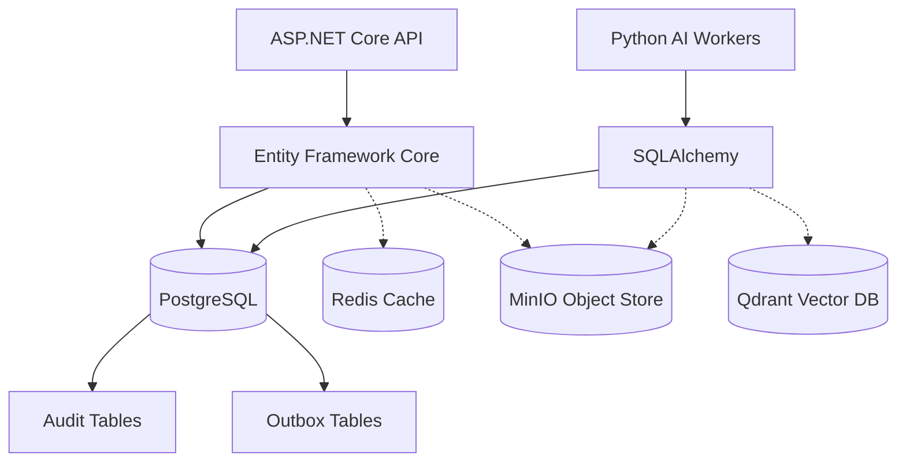
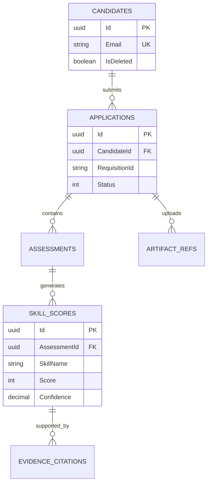
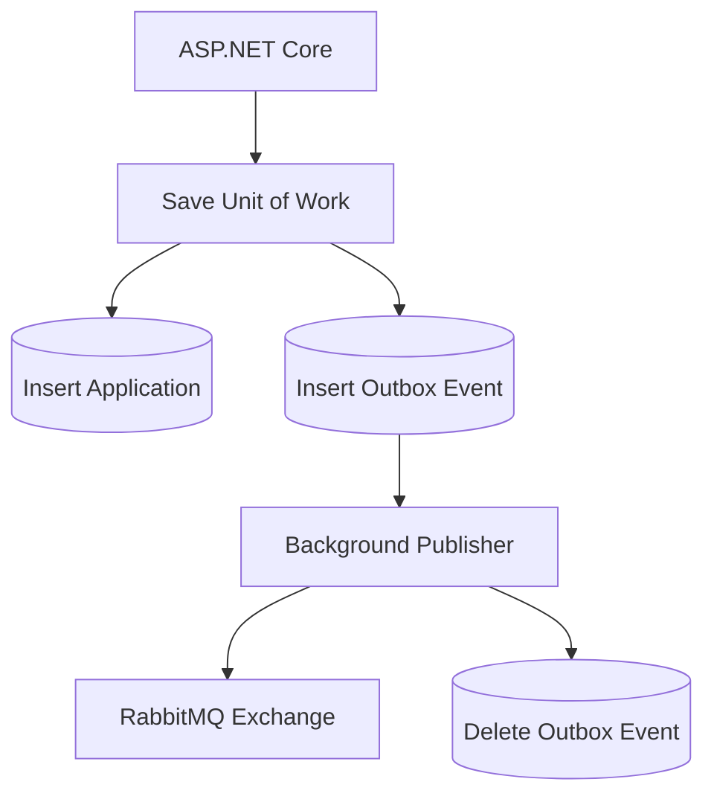

# DATABASE ARCHITECTURE SPECIFICATION

## DOCUMENT CONTROL
| Document ID | FACULTYIQ-DATA-001 |
|---|---|
| **Version** | 1.0.0 |
| **Status** | **APPROVED / BINDING** |
| **Classification** | Enterprise Confidential |
| **Owner** | Data Architecture Board |

> [!CAUTION]
> **AUTHORITATIVE DATA SPECIFICATION**
> This document defines the exact database structures, caching mechanisms, vector stores, and object hierarchies used by FacultyIQ. Every Entity Framework model, PostgreSQL table, Qdrant collection, and MinIO bucket MUST conform to this specification.

---

## 1 Executive Summary

### 1.1 Purpose
The FacultyIQ Database Architecture defines how the platform persists, indexes, and queries data across the relational database (PostgreSQL), the vector database (Qdrant), the object store (MinIO), and the cache (Redis).

### 1.2 Goals
- Guarantee strict ACID compliance for all business transactions.
- Provide a cryptographic-like chain of evidence via structured Evidence Graphs.
- Enable high-speed retrieval of semantic AI context using localized vector databases.

---

## 2 Data Architecture Philosophy

### 2.1 Data Integrity
The relational database is the single source of truth. No business state is permanently stored in Redis or RabbitMQ queues. 

### 2.2 Offline First
Because FacultyIQ processes highly sensitive PII (resumes) and proprietary institutional data (hiring rubrics), no data is permitted to be stored in managed cloud services (e.g., AWS RDS or Pinecone) during Phase 1. All databases must run locally in isolated Docker containers.

### 2.3 Normalization
Relational data must adhere strictly to 3rd Normal Form (3NF), prioritizing write-consistency and preventing update anomalies. Denormalization is only permitted in the read models (CQRS).

---

## 3 Data Platform Overview

The persistence tier relies on a polyglot persistence strategy.



---

## 4 Data Classification

1. **Transactional Data**: Candidates, Applications, Assessments (Postgres).
2. **Evidence Data**: Citations and Confidence Scores mapping AI outputs to source texts (Postgres).
3. **Knowledge Data**: Department rubrics and semantic embeddings (Qdrant).
4. **Binary Objects**: Uploaded PDF resumes, WebM interview videos (MinIO).
5. **Cached Data**: Idempotency keys, JWT revocation lists (Redis).

---

## 5 PostgreSQL Architecture

### 5.1 Database Organization
A single physical database named `facultyiq_db` will be used.

### 5.2 Schemas
To implement the Modular Monolith architecture, FacultyIQ uses logical PostgreSQL schemas to enforce boundaries:
- `auth`: Identity and access control.
- `candidate`: Application lifecycles.
- `evaluation`: AI evidence and skill scores.
- `outbox`: RabbitMQ event persistence.

### 5.3 MVCC & Transactions
PostgreSQL's Multi-Version Concurrency Control (MVCC) is heavily leveraged to ensure that long-running Read Models do not block transactional Writes.

---

## 6 Schema Design

### 6.1 `candidate` Schema
- **Purpose**: Tracks human applicants and their journey.
- **Tables**: `Candidates`, `Applications`, `ArtifactReferences`.

### 6.2 `evaluation` Schema
- **Purpose**: Stores the Evidence Graph generated by AI Agents.
- **Tables**: `Assessments`, `SkillScores`, `EvidenceCitations`.

### 6.3 `outbox` Schema
- **Purpose**: Guarantees at-least-once message delivery to RabbitMQ.
- **Tables**: `IntegrationEvents`.

---

## 7 Entity Definitions

### Entity: `candidate.Candidates`
- **Purpose**: Core applicant identity.
- **Columns**: `Id` (UUID, PK), `Email` (VARCHAR 255, Unique), `FirstName` (VARCHAR 100), `Status` (INT).
- **Audit Fields**: `CreatedAt` (TIMESTAMPTZ), `CreatedBy` (VARCHAR).
- **Soft Delete**: `IsDeleted` (BOOLEAN, default false).

### Entity: `evaluation.SkillScores`
- **Purpose**: Stores the numeric confidence of a candidate's ability.
- **Columns**: `Id` (UUID, PK), `ApplicationId` (UUID, FK), `SkillName` (VARCHAR 100), `Score` (INT), `Confidence` (DECIMAL).

---

## 8 Entity Relationship Diagrams

### Core Entity Relationships



---

## 9 Indexing Strategy

### 9.1 B-Tree Indexes
Applied to all Foreign Keys (e.g., `ApplicationId`) to prevent full table scans during cascade deletes or complex joins.

### 9.2 Unique Indexes
Applied to natural keys (e.g., `Candidate.Email`).

### 9.3 Partial Indexes
Applied to Soft Delete columns.
```sql
CREATE INDEX IX_Candidates_Email_Active ON candidate.Candidates(Email) WHERE IsDeleted = false;
```
*(This ensures uniqueness only among active records, allowing a deleted candidate to reapply).*

---

## 10 Query Optimization

- **Pagination**: Use Keyset Pagination (Cursor-based) for infinite scrolling dashboards. Avoid `OFFSET/FETCH` for large datasets to prevent degradation.
- **Connection Pooling**: PgBouncer must be deployed in front of PostgreSQL to handle high concurrent connections from ASP.NET Core and Python workers.

---

## 11 Transaction Strategy

### 11.1 Isolation Levels
FacultyIQ uses `Read Committed` by default. For financial or critically bound actions (e.g., assigning a final hire status), `Repeatable Read` is enforced.

### 11.2 Optimistic Concurrency
EF Core uses Concurrency Tokens (`RowVersion`) on aggregate roots (e.g., `Application`). If two recruiters attempt to modify the same candidate simultaneously, a `DbUpdateConcurrencyException` is thrown, returning HTTP 409 Conflict.

---

## 12 Redis Architecture

### 12.1 Purpose
- **Session Cache**: Storing stateless user sessions and JWT refresh tokens.
- **Idempotency Cache**: Storing the `EventId` of processed RabbitMQ messages (TTL: 24 hours) to guarantee exact-once execution logic.

### 12.2 Key Naming Convention
Format: `prefix:domain:identifier`
Example: `idempotency:resume-agent:evt_12345`

---

## 13 Qdrant Architecture

### 13.1 Collections
- `institutional_rubrics`: Contains embeddings for department hiring guidelines.
- `candidate_code_ast`: Future collection for indexing common coding anti-patterns.

### 13.2 Embeddings & Payload
- **Vector Size**: 384 dimensions (using `all-MiniLM-L6-v2`).
- **Payload**: Strict JSON metadata used for pre-filtering (e.g., `{"department_id": "CS"}`).

---

## 14 MinIO Architecture

### 14.1 Bucket Layout
- `facultyiq-resumes`: Immutable PDFs.
- `facultyiq-videos`: Raw WebM interview recordings.
- `facultyiq-exports`: Generated PDF/CSV reports.

### 14.2 Folder Strategy
`s3://facultyiq-resumes/{requisitionId}/{candidateId}/{artifact_uuid}.pdf`

### 14.3 Retention
Resumes must be purged exactly 365 days after the Requisition closes to comply with HR data retention policies.

---

## 15 Evidence Storage

The AI Pipeline produces Evidence Graphs. This is persisted relationally to allow complex SQL querying by recruiters (e.g., "Show me all candidates with a React confidence > 0.90").

- **Table**: `evaluation.EvidenceCitations`
- **Columns**: `Id`, `SkillScoreId`, `VerbatimQuote` (TEXT), `SourceArtifactId` (UUID).

---

## 16 AI Metadata

All system prompts used to evaluate a candidate are stored immutably to guarantee auditability.
- **Table**: `audit.PromptHistory`
- **Columns**: `Id`, `ApplicationId`, `ModelVersion` (e.g., "qwen2.5-coder:3b-v1"), `PromptHash`.

---

## 17 Data Lifecycle

1. **Creation**: Inserted by APIs or AI Agents.
2. **Archiving**: Closed Requisitions and their child Applications are moved to "Cold" storage (read-only views) after 6 months.
3. **Deletion**: Hard deletion is only executed via automated GDPR/CCPA erasure jobs.

---

## 18 Migration Strategy

### 18.1 EF Core Migrations
All schema evolution is managed via Entity Framework Core code-first migrations. 
- Migrations MUST be backward compatible (e.g., `ADD COLUMN` is safe; `DROP COLUMN` requires a multi-phase deployment).

---

## 19 Backup Strategy

- **Full Backups**: Nightly `pg_dump` to MinIO.
- **Point-in-Time Recovery (PITR)**: Write-Ahead Logs (WAL) archived every 5 minutes.
- **Qdrant**: Snapshots taken daily.

---

## 20 Security

- **Encryption at Rest**: PostgreSQL TDE (Transparent Data Encryption) or LUKS volume encryption at the OS level.
- **Encryption in Transit**: TLS 1.3 mandated for all connections (API -> PG, API -> Qdrant).
- **Least Privilege**: The AI Python workers connect using a restricted role that can only SELECT/INSERT into the `evaluation` schema.

---

## 21 Audit Architecture

- **Change Tracking**: Entity Framework Core overrides `SaveChangesAsync` to automatically write to `audit.AuditLogs` for any entity implementing `IAuditableEntity`.
- **Columns**: `TableName`, `PrimaryKey`, `OldValues` (JSONB), `NewValues` (JSONB), `ModifiedBy`.

---

## 22 Performance Strategy

- **JSONB Indexes**: Audit tables query against JSONB payloads using GIN indexing for fast retrieval of specific historical states.
- **Vacuuming**: Auto-vacuum is tuned aggressively on the `outbox.IntegrationEvents` table to prevent bloat from rapidly inserted/deleted messaging events.

---

## 23 Data Validation

- PostgreSQL `CHECK` constraints act as the absolute last line of defense.
- Example: `ALTER TABLE evaluation.SkillScores ADD CONSTRAINT CHK_ScoreRange CHECK (Score >= 1 AND Score <= 10);`

---

## 24 Multi-Tenant Evolution

While FacultyIQ begins as a single-institution deployment, all tables MUST include a `TenantId` column.
- EF Core Global Query Filters will automatically append `WHERE TenantId = @id` to all queries, paving the way for a future SaaS evolution without code rewrites.

---

## 25 Event Persistence (Outbox Pattern)

FacultyIQ guarantees that database commits and RabbitMQ messages do not get out of sync.



---

## 26 Analytics Architecture

Operational analytics (e.g., "Time to Hire", "AI Confidence Drift") are built using PostgreSQL Materialized Views, refreshed nightly, so heavy OLAP queries do not impact the transactional OLTP tables.

---

## 27 Database Monitoring

Prometheus exporters monitor PostgreSQL metrics:
- `pg_stat_activity` for connection pooling leaks.
- `pg_locks` to detect deadlocks between CQRS commands.

---

## 28 Capacity Planning

- **PostgreSQL**: 500GB SSD (Initial). Relational text data grows slowly.
- **MinIO**: 5TB HDD. Videos and PDFs consume vast space.
- **Qdrant**: 50GB SSD/RAM. Embeddings require fast memory access.

---

## 29 Future Evolution

- **Read Replicas**: As dashboard queries increase, CQRS queries will be routed to a synchronized Read Replica PostgreSQL instance.

---

## 30 Architecture Decision Records

- **ADR-DB-001: PostgreSQL over NoSQL**
  - *Decision*: Relational PostgreSQL selected over MongoDB.
  - *Context*: FacultyIQ data is highly structured, and ACID transactions across multiple aggregates are strictly required. JSONB provides sufficient NoSQL capability where flexibility is needed.

---

## 31 Traceability Matrix

| Business Domain | PostgreSQL Schema | Primary Aggregate |
|---|---|---|
| Identity | `auth` | `User` |
| Recruitment | `candidate` | `Application` |
| AI Reasoning | `evaluation` | `Decision` |

---

## 32 Glossary

- **GIN Index**: Generalized Inverted Index, highly efficient for JSONB queries in Postgres.
- **Outbox Pattern**: A pattern ensuring atomic consistency between database writes and message broker publishes.

---

## 33 Revision History

| Version | Date | Status | Approvals |
|---|---|---|---|
| **1.0.0** | 2026-07-19 | **APPROVED** | Data Architecture Board |
