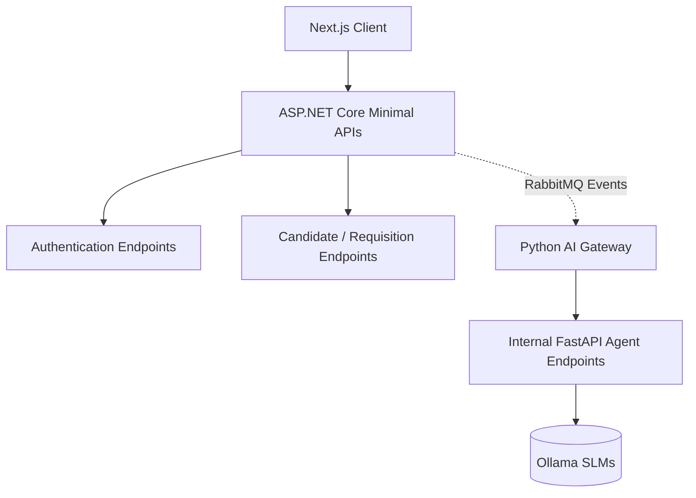

# API ARCHITECTURE AND CONTRACTS

## DOCUMENT CONTROL
| Document ID | FACULTYIQ-API-001 |
|---|---|
| **Version** | 1.0.0 |
| **Status** | **APPROVED / BINDING** |
| **Classification** | Enterprise Confidential |
| **Owner** | API Architecture Board |

> [!CAUTION]
> **AUTHORITATIVE API SPECIFICATION**
> This document defines every API contract exposed by FacultyIQ. Frontend developers, backend engineers, and AI Agent builders MUST conform exactly to the HTTP verbs, status codes, payload shapes, and routing conventions defined herein.

---

## 1 Executive Summary

### 1.1 Purpose
The API Architecture specification establishes a REST-first, OpenAPI-driven contract for the FacultyIQ platform. It guarantees seamless communication between the React/Next.js frontend, the ASP.NET Core backend, and the Python AI worker ecosystem.

### 1.2 Contract Philosophy
FacultyIQ embraces **Contract-First Development**. Code does not dictate the API; the API dictates the code. Breaking changes are prohibited without explicit version deprecation.

---

## 2 API Design Principles

- **RESTful State Transfer**: APIs must be resource-oriented (e.g., `/candidates/123/resumes`).
- **Statelessness**: No session state is held on the ASP.NET Core web servers. JWTs carry all necessary context.
- **Predictability**: A `GET` request must NEVER modify data. A `PUT` request must ALWAYS be idempotent.

---

## 3 API Architecture

The API topology isolates public web traffic from internal AI inference RPC calls.



---

## 4 API Standards

### 4.1 URL Naming
- Use `kebab-case` for URLs: `/api/v1/hiring-managers`.
- Resources MUST be plural: `/candidates` (not `/candidate`).

### 4.2 Standard HTTP Verbs
- `GET`: Retrieve a resource.
- `POST`: Create a resource or execute a complex query.
- `PUT`: Completely replace a resource.
- `PATCH`: Partially update a resource (must support JSON Patch RFC 6902).
- `DELETE`: Soft delete a resource.

### 4.3 Headers and Data Formats
- **Content-Type**: `application/json` (except for file uploads).
- **Dates**: Strict ISO 8601 formatting with UTC explicitly defined (`2026-07-19T14:30:00Z`).

---

## 5 Authentication APIs

### 5.1 Login
- **Method**: `POST /api/v1/auth/token`
- **Request**: `{ "email": "user@edu.com", "password": "..." }`
- **Response**: `{ "accessToken": "jwt...", "expiresIn": 3600 }`

### 5.2 RBAC Validation
All non-auth endpoints enforce strict RBAC via JWT Claims.
`[Authorize(Roles = "Recruiter, DepartmentHead")]`

---

## 6 Candidate APIs

### 6.1 Search Candidates
- **Method**: `GET /api/v1/candidates`
- **Query Params**: `?status=Evaluating&department=CS&page=1&size=20`
- **Response**: Standard Pagination Envelope (See Chapter 21).

### 6.2 Get Candidate Profile
- **Method**: `GET /api/v1/candidates/{id}`
- **Response**: Returns aggregated candidate data, minus heavy AI evidence structures.

---

## 7 Resume Intelligence APIs

### 7.1 Upload Resume
- **Method**: `POST /api/v1/candidates/{id}/resumes`
- **Headers**: `Content-Type: multipart/form-data`
- **Behavior**: Returns `202 Accepted` immediately, enqueuing the `ResumeAgent` via RabbitMQ. 

### 7.2 Get Resume Extraction Status
- **Method**: `GET /api/v1/candidates/{id}/resumes/{resumeId}/status`
- **Response**: `{ "status": "Parsing" | "Completed" | "Failed" }`

---

## 8 Knowledge APIs

### 8.1 Upload Rubric
- **Method**: `POST /api/v1/knowledge/rubrics`
- **Request**: `{ "departmentId": "uuid", "text": "Must know C# and React..." }`
- **Behavior**: Chunks the text, generates embeddings, and pushes to Qdrant.

---

## 9 Interview APIs

### 9.1 Generate Questions
- **Method**: `POST /api/v1/interviews/{id}/generate-questions`
- **Payload**: `{ "targetBloomLevel": "Analyzing" }`
- **Behavior**: Synchronously blocks while the `InterviewAgent` generates a contextual question based on the candidate's resume.

---

## 10 Coding APIs

### 10.1 Execute Code Submission
- **Method**: `POST /api/v1/coding-sessions/{id}/execute`
- **Payload**: `{ "language": "python", "code": "def solve(): pass" }`
- **Response**: `{ "stdout": "", "stderr": "", "executionTimeMs": 150 }`

---

## 11 Code Explanation APIs

### 11.1 Request AI Critique
- **Method**: `POST /api/v1/coding-sessions/{id}/critique`
- **Response**: Triggers the `CodeExplanationAgent` asynchronously. Returns `202 Accepted`.

---

## 12 Bloom Taxonomy APIs

### 12.1 Classify Artifact
- **Method**: `POST /api/v1/bloom/classify`
- **Payload**: `{ "text": "Candidate's answer string..." }`
- **Response**: `{ "bloomLevel": "Creating", "confidence": 0.92 }`

---

## 13 Decision APIs

### 13.1 Retrieve Final Recommendation
- **Method**: `GET /api/v1/decisions/{candidateId}`
- **Response**: Detailed aggregate of SkillScores, Evidence citations, and the ultimate `Hire / Reject / Review` recommendation.

---

## 14 Reporting APIs

### 14.1 Export PDF Report
- **Method**: `GET /api/v1/reports/candidates/{id}/export`
- **Headers**: `Accept: application/pdf`
- **Response**: Binary PDF stream.

---

## 15 Administration APIs

### 15.1 System Health
- **Method**: `GET /api/v1/admin/health`
- **Response**: Overall system status (Postgres: UP, Redis: UP, Qdrant: UP, Ollama: UP).

---

## 16 AI Gateway APIs (Python Internal)

These APIs are NOT exposed to the frontend. They are internal RPC routes hit by ASP.NET Core or RabbitMQ.

- **Base URL**: `http://facultyiq-ai-gateway:8000/internal/v1`
- **Endpoint**: `POST /infer/structured`
- **Payload**: `{ "model": "qwen2.5:3b", "prompt": "...", "schema": { ... } }`

---

## 17 AI Agent APIs (Internal Contracts)

### 17.1 Coding Agent RPC
- **Input**: `{ "sourceCode": "...", "astRequired": true }`
- **Output**: `{ "bigO": "O(N)", "cleanCodeScore": 8 }`

---

## 18 Internal APIs

### 18.1 Service-to-Service Authentication
All internal traffic between ASP.NET Core and Python MUST carry a signed internal JWT to prevent unauthorized spoofing of AI generation tasks.

---

## 19 Event APIs (RabbitMQ)

### 19.1 Event Envelope
All RabbitMQ messages must conform to CloudEvents 1.0 specifications.
```json
{
  "specversion": "1.0",
  "type": "com.facultyiq.candidate.resume.parsed",
  "source": "/api/v1/candidates/123",
  "id": "A234-1234-1234",
  "time": "2026-07-19T14:30:00Z",
  "data": { ... }
}
```

---

## 20 Request Models

- **Validation**: All models MUST use FluentValidation in C# or Pydantic in Python.
- **Nullability**: Optional fields MUST be explicitly typed as nullable (e.g., `string?`). Omitted JSON fields default to `null`.

---

## 21 Response Models

### 21.1 Standard Response Envelope
To prevent client-side parsing chaos, all successful non-paginated GET/POST requests return the raw JSON object. We do NOT wrap successful responses in a `{ "data": ... }` envelope unless it is paginated.

---

## 22 Error Model

All API errors MUST conform to **RFC 9457 Problem Details for HTTP APIs**.

```json
{
  "type": "https://facultyiq.com/errors/validation-error",
  "title": "Validation Failed",
  "status": 400,
  "detail": "One or more validation errors occurred.",
  "errors": {
    "CandidateId": ["CandidateId must be a valid UUID."]
  }
}
```

---

## 23 Pagination

For collections exceeding 100 items, **Cursor Pagination** is heavily preferred over Offset pagination for performance on large relational tables.

- **Request**: `GET /api/v1/candidates?cursor=eyJpZCI6MTIzfQ==&limit=20`
- **Response Structure**:
  ```json
  {
    "data": [ ... ],
    "metadata": {
      "nextCursor": "...",
      "hasNextPage": true
    }
  }
  ```

---

## 24 API Versioning

- **Strategy**: URL Versioning. Example: `/api/v1/...`
- **Deprecation**: V1 will remain active for at least 12 months after V2 is released. Deprecated endpoints must include the `Deprecation: true` HTTP header.

---

## 25 Security

### 25.1 Rate Limiting
- Public endpoints (Login): 5 requests per minute per IP.
- Internal Authenticated Endpoints: 100 requests per minute per User.

### 25.2 OWASP Guidelines
- Prevent **BOLA** (Broken Object Level Authorization): A Recruiter in Department A cannot query `/api/v1/candidates/{id}` for a candidate applying strictly to Department B.

---

## 26 Streaming APIs

For large AI generations (e.g., generating a long code critique), the Python AI Gateway streams Server-Sent Events (SSE) back to ASP.NET Core, which streams it to the React UI using `text/event-stream`.

---

## 27 File Upload APIs

- **Size Limits**: Resumes (10MB), Videos (500MB).
- **Validation**: ASP.NET Core MUST check magic numbers (file signatures) to verify a `.pdf` is actually a PDF, avoiding malicious payload execution.

---

## 28 API Documentation Standards

- The `FacultyIQ.Api` project uses Swashbuckle to auto-generate the **OpenAPI 3.1** specification.
- XML comments (`/// <summary>`) in C# map directly to Swagger descriptions.
- Every endpoint MUST define HTTP 200, 400, 401, 403, and 500 response types in Swagger.

---

## 29 Observability

- **Correlation IDs**: The ASP.NET Core Gateway generates an `X-Correlation-ID`. This header is passed to RabbitMQ, to Python, and to the database audit logs to trace a single request across the entire ecosystem.

---

## 30 Performance

- **Compression**: Brotli compression is enabled by default for all JSON responses over 1KB.
- **Connection Pooling**: Reused HTTP connections between ASP.NET Core and the Python Gateway are maintained to eliminate TCP handshake latency.

---

## 31 Testing

- **Contract Testing**: Any change to a C# DTO or a Python Pydantic model will cause the CI/CD pipeline to run a contract verification script ensuring the OpenAPI spec hasn't broken backward compatibility.

---

## 32 Future API Gateway

As FacultyIQ scales to Microservices, **YARP (Yet Another Reverse Proxy)** will be deployed in front of the ASP.NET Core APIs to handle SSL termination, central rate limiting, and service routing.

---

## 33 Third-Party Integration

Future Webhook subscriptions will allow University HR systems (e.g., Workday) to register a callback URL. FacultyIQ will POST a payload to that URL when a `DecisionGenerated` event occurs.

---

## 34 Architecture Decision Records

- **ADR-API-001: URL Versioning over Header Versioning**
  - *Decision*: API versions are explicitly in the URL (`/api/v1/`).
  - *Context*: While Header versioning is purer REST, URL versioning is vastly easier for clients to debug in browser network tabs.

---

## 35 Traceability Matrix

| Business Capability | API Group | Domain | Application Handlers |
|---|---|---|---|
| Candidate Upload | `/api/v1/candidates` | Candidate | `CreateCandidateCommand` |
| Rubric Lookup | `/api/v1/knowledge` | Knowledge | `SearchRubricQuery` |

---

## 36 Glossary

- **Idempotency**: An operation that produces the same result no matter how many times it is executed.
- **RFC 9457**: The internet standard for structuring error responses in HTTP APIs.

---

## 37 Revision History

| Version | Date | Status | Approvals |
|---|---|---|---|
| **1.0.0** | 2026-07-19 | **APPROVED** | API Architecture Board |
