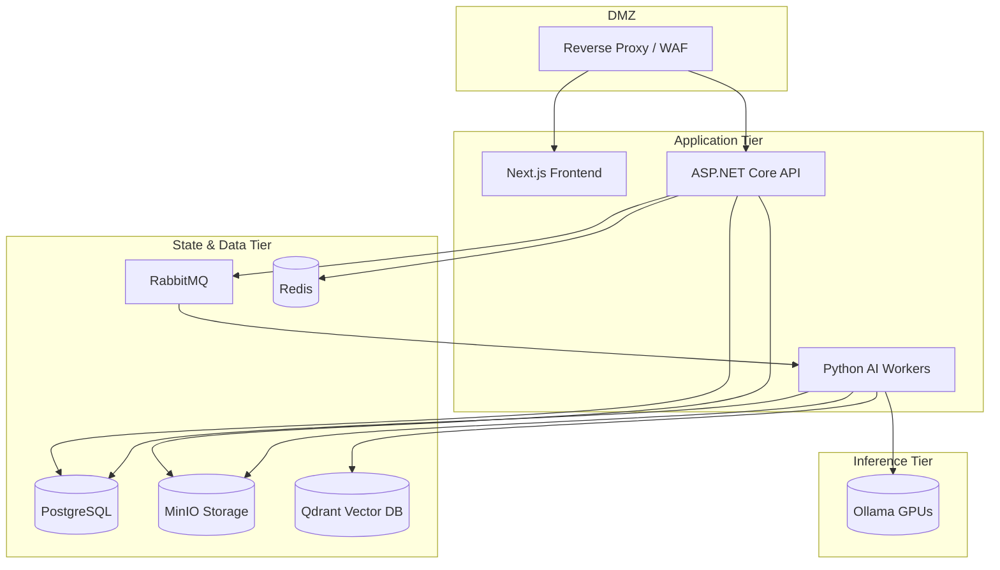

# DEPLOYMENT AND DEVOPS ARCHITECTURE SPECIFICATION

## DOCUMENT CONTROL
| Document ID | FACULTYIQ-OPS-001 |
|---|---|
| **Version** | 1.0.0 |
| **Status** | **APPROVED / BINDING** |
| **Classification** | Enterprise Confidential |
| **Owner** | Platform Engineering Board |

> [!CAUTION]
> **AUTHORITATIVE DEPLOYMENT SPECIFICATION**
> This document defines the exact operational footprint of FacultyIQ. Every Docker container, CI/CD pipeline, Git branching strategy, and infrastructure component MUST adhere strictly to this specification to ensure zero-downtime, secure, offline-first deployments.

---

## 1 Executive Summary

### 1.1 Purpose
The Deployment and DevOps Architecture provides the blueprint for transforming FacultyIQ source code into a running, resilient, offline-first enterprise application.

### 1.2 Operational Goals
- **Immutable Infrastructure**: Servers are never patched manually; they are replaced.
- **Air-Gapped Viability**: The entire stack, including AI inference, must be deployable on an intranet without outbound internet access.
- **Observability**: Guarantee 100% visibility into application health, AI timeouts, and infrastructure bottlenecks.

---

## 2 DevOps Philosophy

### 2.1 Infrastructure as Code (IaC)
Infrastructure is defined declaratively. ClickOps (manually configuring infrastructure via a web UI) is strictly prohibited. Docker Compose YAML (and future Kubernetes manifests) are treated as application code.

### 2.2 Security (DevSecOps)
Security is shifted left. Container image scanning and dependency auditing are blocking steps in the CI/CD pipeline. No vulnerable image may be pushed to the registry.

---

## 3 Environment Strategy

### 3.1 Local Development
Runs via a unified `docker-compose.yml`. Mocks the AI SLMs with smaller quantized variants (e.g., Qwen2.5 0.5B instead of 3B) to accommodate standard developer laptops.

### 3.2 Staging
An exact replica of Production, operating on anonymized data. Used for weekly User Acceptance Testing (UAT).

### 3.3 Production
The highly secured, air-gapped environment. Connects to dedicated GPU instances for Ollama inference.

---

## 4 Infrastructure Overview

### 4.1 Core Components

---

## 5 Docker Architecture

### 5.1 Container Boundaries
Each distinct architectural component runs in its own isolated container. The ASP.NET API runs separately from the Next.js frontend and the Python workers.

### 5.2 Base Images
- **ASP.NET**: `mcr.microsoft.com/dotnet/aspnet:9.0-alpine` (Minimal attack surface).
- **Python**: `python:3.11-slim` (Prevents bloated image sizes).
- **Node**: `node:20-alpine`.

### 5.3 Security & Layer Caching
- Containers MUST run as a non-root user (`USER appuser`).
- Multi-stage builds are mandatory to prevent compiler toolchains (e.g., .NET SDK) from leaking into the final production image.

---

## 6 Docker Compose Architecture

Phase 1 production deployments utilize Docker Compose on standalone Linux servers.

### 6.1 Service Definitions & Networks
The `docker-compose.yml` defines two isolated virtual networks:
1. `backend-net`: Connects API, Frontend, and Databases.
2. `ai-net`: Connects Python Workers to Ollama and Qdrant.

### 6.2 Restart Policies
All stateful services (Postgres, RabbitMQ, Redis) use `restart: unless-stopped`. Stateless APIs use `restart: on-failure`.

---

## 7 Kubernetes Readiness (Future Evolution)

While Phase 1 uses Docker Compose, the architecture is strictly designed for an eventual Kubernetes (K8s) migration.

- **Deployments**: Stateless apps (API, UI, Python Workers) map cleanly to K8s Deployments.
- **StatefulSets**: Postgres, Qdrant, and MinIO will migrate to StatefulSets utilizing Persistent Volume Claims (PVCs).
- **ConfigMaps**: Environment variables currently in `.env` files will translate directly to K8s ConfigMaps.

---

## 8 Configuration Management

### 8.1 Environment Variables
All configuration strictly follows the **Twelve-Factor App** methodology. Connection strings and feature flags are injected via Environment Variables. Hardcoded configurations are forbidden.

### 8.2 Secrets
Database passwords and API keys are loaded via Docker Secrets or secure Vaults. They are never committed to `.env` files in source control.

---

## 9 CI/CD Architecture

### 9.1 CI Pipeline (Continuous Integration)
Triggered on every Pull Request (PR):
1. **Lint & Build**: Compiles C# and Python.
2. **Test**: Runs xUnit and PyTest suites.
3. **Security Scan**: Runs Trivy for container vulnerabilities.
4. **Merge Block**: Fails the PR if coverage drops below 80% or CVEs are detected.

### 9.2 CD Pipeline (Continuous Deployment)
Triggered on merge to `main`:
1. **Tag**: Generates semantic version tag.
2. **Build Image**: Creates production Docker images.
3. **Push**: Uploads to private container registry.
4. **Deploy**: Issues a webhook to Staging to pull new images.

---

## 10 Git Strategy

FacultyIQ employs a strict **Trunk-Based Development** model.

- **Main Branch**: The single source of truth. Always deployable.
- **Feature Branches**: Short-lived branches off `main` (e.g., `feat/resume-parser`).
- **Merge Policies**: Rebase and squash. No merge commits. Fast-forward only.

---

## 11 Release Management

### 11.1 Semantic Versioning
- `MAJOR`: Incompatible API changes or AI logic rewrites.
- `MINOR`: New features added in a backward-compatible manner.
- `PATCH`: Backward-compatible bug fixes.

### 11.2 Rollback Strategy
Because deployments are immutable Docker images, rolling back simply entails repointing the `docker-compose.yml` image tag from `v1.2.0` to `v1.1.9` and executing `docker compose up -d`. (Note: Database rollbacks require explicit EF Core down-migrations).

---

## 12 Infrastructure Networking

### 12.1 Reverse Proxy (Nginx)
Nginx sits at the edge of the DMZ.
- Terminates SSL (TLS 1.3).
- Routes `/api/v1/` to the ASP.NET container.
- Routes `/` to the Next.js container.

### 12.2 Internal Communication
Containers communicate via internal Docker DNS using their service names (e.g., `http://postgres:5432`). IP addressing is entirely abstracted.

---

## 13 Persistent Storage

### 13.1 Volumes
Data directories are mounted as named Docker Volumes mapped to robust host storage (NVMe SSDs).
- `pg-data:/var/lib/postgresql/data`
- `minio-data:/data`
- `qdrant-data:/qdrant/storage`

### 13.2 Lifecycle
Volumes are never removed during standard deployment cycles (`docker compose down -v` is explicitly restricted to local dev).

---

## 14 Monitoring Architecture

### 14.1 Prometheus & Grafana
- **Infrastructure Monitoring**: Node Exporter tracks CPU, RAM, and disk space on the host.
- **Application Monitoring**: ASP.NET exposes `/metrics` detailing HTTP latencies.
- **AI Monitoring**: Python workers expose queue depth, inference latency, and VRAM utilization metrics.

---

## 15 Logging Architecture

### 15.1 Centralized Logging (ELK / Loki)
Logs from all containers are piped via the Docker logging driver into a centralized aggregator.
- **Correlation IDs**: Essential for tracing a request from the Nginx proxy, through the C# API, over RabbitMQ, and into the Python AI worker.

---

## 16 Health Checks

### 16.1 Liveness vs Readiness
- **Liveness Probes**: Ensure the container isn't deadlocked. If it fails, Docker restarts the container.
- **Readiness Probes**: Ensure the container is ready to accept traffic. If Postgres isn't up, the API readiness probe fails, preventing Nginx from routing traffic to it.

---

## 17 Backup and Recovery

### 17.1 Strategy
- **Postgres**: Nightly logical dumps (`pg_dump`) + WAL archiving.
- **MinIO**: Replicated to a secondary off-site backup server.
- **AI Models**: Raw `.gguf` weights are backed up to prevent re-download requirements in an offline environment.

### 17.2 Recovery Objectives
- **RTO (Recovery Time Objective)**: 4 hours.
- **RPO (Recovery Point Objective)**: 15 minutes.

---

## 18 Scaling Strategy

### 18.1 AI Worker Scaling
If the RabbitMQ depth for `ResumeParsingQueue` exceeds 100 messages, the operations team can execute `docker compose up --scale python-worker=5` to horizontally scale inference limits (assuming sufficient VRAM is available).

---

## 19 Performance Optimization

- **Image Optimization**: Multi-stage builds keep production image sizes under 300MB, allowing rapid deployments and minimizing registry bandwidth.
- **Resource Limits**: Every container in `docker-compose.yml` has strict `deploy.resources.limits` to prevent a runaway Python process from starving the Postgres database of RAM.

---

## 20 Security (DevSecOps)

- **SBOM**: A Software Bill of Materials is generated during the CI pipeline to track open-source dependencies.
- **Container Hardening**: Docker daemons are configured in rootless mode to mitigate container breakout attacks.

---

## 21 Observability

- **Tracing**: OpenTelemetry (OTel) spans trace the full lifecycle of an AI evaluation.
- **Dashboards**: Grafana visualizes the exact "Time-To-Hire" business metric alongside technical metrics like "Average Token Generation Speed."

---

## 22 DevSecOps

### 22.1 Secrets Detection
The CI pipeline uses `trufflehog` to scan all commits. If an API key or RSA private key is detected, the PR is instantly blocked and an alert is sent to the CISO.

---

## 23 Disaster Recovery

### 23.1 Total Datacenter Loss
In the event of total hardware loss, the entire environment can be rebuilt on fresh hardware via a single command:
1. `git clone` the Infrastructure repository.
2. Restore MinIO / Postgres volumes from offsite backup.
3. `docker compose up -d`.

---

## 24 Operational Runbooks

Standard Operating Procedures (SOPs) are maintained in the repository's `/docs/runbooks` folder:
- `SOP-001: Deploying a New AI Model Weight`
- `SOP-002: Re-indexing Qdrant Collections`
- `SOP-003: Purging Dead Letter Queues`

---

## 25 Maintenance Strategy

- **Zero Downtime Updates**: Reverse proxies (Nginx) execute rolling updates, draining connections from old containers before routing traffic to the new instances.
- **Database Migrations**: EF Core migrations are executed idempotently upon API startup.

---

## 26 Capacity Planning

- **GPU Forecast**: Each concurrent 3B parameter model requires ~2.5GB VRAM (quantized to 4-bit). Evaluating 10 concurrent resumes requires a single 24GB GPU (e.g., RTX 4090 or A10G).

---

## 27 Future Evolution (Enterprise SaaS)

When FacultyIQ transitions from an on-premise application to a multi-tenant cloud SaaS:
- **Docker Compose** will be replaced by **Kubernetes (EKS/AKS)**.
- **Nginx** will be replaced by an **Istio Service Mesh**.
- **GitOps** using **ArgoCD** will pull configuration state dynamically into the cluster.

---

## 28 Architecture Decision Records

- **ADR-OPS-001: Docker Compose over Kubernetes (Phase 1)**
  - *Decision*: Launch using Docker Compose on single robust bare-metal nodes.
  - *Context*: K8s introduces immense operational complexity. Docker Compose provides sufficient isolation and offline capability for Phase 1 without requiring dedicated DevOps engineering teams to manage control planes.

---

## 29 Traceability Matrix

| Component | Container | Infrastructure | Monitoring |
|---|---|---|---|
| Inference Engine | `ollama` | GPU Node | `gpu_memory_used` |
| Queue Manager | `rabbitmq` | CPU Node | `queue_depth` |

---

## 30 Glossary

- **IaC**: Infrastructure as Code. Managing infrastructure via machine-readable definition files.
- **OTel**: OpenTelemetry. A standard for instrumenting tracing and metrics.
- **RPO/RTO**: Recovery Point Objective (Data Loss Tolerance) / Recovery Time Objective (Downtime Tolerance).

---

## 31 Revision History

| Version | Date | Status | Approvals |
|---|---|---|---|
| **1.0.0** | 2026-07-19 | **APPROVED** | Platform Engineering Board |
