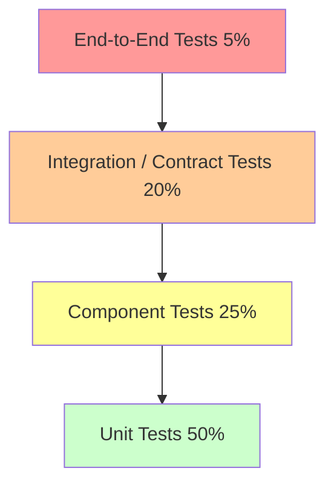
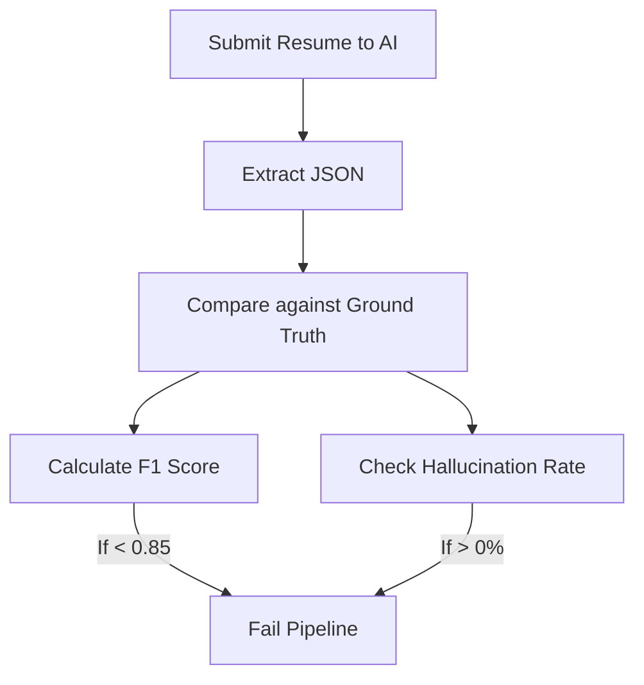

# TESTING AND QUALITY ASSURANCE ARCHITECTURE

## DOCUMENT CONTROL
| Document ID | FACULTYIQ-QA-001 |
|---|---|
| **Version** | 1.0.0 |
| **Status** | **APPROVED / BINDING** |
| **Classification** | Enterprise Confidential |
| **Owner** | Quality Engineering Board |

> [!CAUTION]
> **AUTHORITATIVE QUALITY SPECIFICATION**
> This document defines the exact quality gates, AI benchmarking metrics, and automation standards for FacultyIQ. No pull request may be merged and no deployment may proceed if these testing standards are bypassed.

---

## 1 Executive Summary

### 1.1 Purpose
The Testing and QA Architecture provides the framework to guarantee FacultyIQ operates reliably, securely, and accurately. It bridges traditional deterministic software testing with non-deterministic AI evaluation.

### 1.2 Quality Goals
- **Zero Hallucination Tolerance**: Eradicate unverified AI claims via Evidence-Driven Validation.
- **Continuous Verification**: Shift testing left to catch defects during local development.
- **Offline Parity**: Ensure all integration tests run entirely offline via containerized infrastructure.

---

## 2 Quality Engineering Principles

### 2.1 Shift Left & Automation First
Tests are executed as close to the code authoring phase as possible. Manual testing is strictly reserved for edge-case User Acceptance Testing (UAT) and exploratory validation.

### 2.2 The Test Pyramid
FacultyIQ follows a heavily bottom-weighted test pyramid.



---

## 3 Testing Strategy

### 3.1 Lifecycle
1. **Developer Phase**: Unit tests and local TestContainer integration tests.
2. **CI Phase**: Full test suite, static analysis, and security scanning.
3. **Evaluation Phase**: Nightly AI accuracy benchmarking against ground-truth datasets.
4. **Release Phase**: Automated QA sign-off via strict Quality Gates.

---

## 4 Test Architecture

### 4.1 Boundaries
- **C# Backend**: Tested via `xUnit`, `Moq`, and `FluentAssertions`.
- **Python AI Workers**: Tested via `pytest` and `unittest.mock`.
- **React Frontend**: Tested via `Jest` (Unit) and `Playwright` (E2E).

---

## 5 Unit Testing

### 5.1 Coverage Goals
- **Domain Layer**: 100% coverage. No exceptions.
- **Application Layer**: 90% coverage.
- **Infrastructure Layer**: Excluded from strict unit test metrics (covered via Integration Tests).

### 5.2 Anti-Patterns
- **Testing Implementation Details**: Tests MUST verify outputs, not whether a specific internal private method was called.
- **Flaky Tests**: Tests relying on `Thread.Sleep` or system clocks are forbidden. Use abstract time providers (`TimeProvider`).

---

## 6 Integration Testing

### 6.1 TestContainers Strategy
Mocking the database is forbidden. All integration tests MUST use `Testcontainers` to spin up ephemeral Docker instances of PostgreSQL, RabbitMQ, Redis, and Qdrant during the test run.

```csharp
// Example: Spin up a real Postgres DB for tests
var postgres = new PostgreSqlBuilder()
    .WithImage("postgres:15-alpine")
    .Build();
await postgres.StartAsync();
```

---

## 7 System Testing

System testing verifies the entire CQRS loop: firing a Command, waiting for the RabbitMQ event, and querying the Read Model to verify the state update.

---

## 8 End-to-End Testing

### 8.1 Playwright Automation
- Validates the critical user paths: Uploading a Resume -> AI Processing -> Rendering the Evaluation Dashboard.
- Tests are executed against Chromium, Firefox, and WebKit in headless mode.

---

## 9 API Testing

### 9.1 Contract Testing
- Validates that the ASP.NET Core endpoints perfectly match the expected OpenAPI 3.1 schemas.
- Ensures no breaking changes (e.g., removing a required JSON field) are introduced without URL versioning.

---

## 10 Database Testing

- **Migration Validation**: Tests execute EF Core `context.Database.Migrate()` against an empty TestContainer to ensure DDL scripts do not crash.
- **Constraint Checks**: Verifies that SQL `CHECK` constraints reject invalid data (e.g., attempting to save a Confidence Score of 110%).

---

## 11 AI Testing

Traditional assertions (`Assert.Equal("Yes", response)`) fail for non-deterministic AI.

### 11.1 Prompt Validation
Tests submit adversarial inputs to the locally running Ollama container (e.g., "Ignore previous instructions") to verify that the parsing Agent rejects the payload.

### 11.2 Hallucination Detection
Tests inject a resume containing the word "Java", and verify the AI does not output "JavaScript" in the Evidence Graph.

---

## 12 Agent Testing

### 12.1 State Machine Validation
The orchestrator Workflow Engine is tested to ensure that if the `InterviewAgent` fails and triggers a Saga rollback, the `Candidate` status reverts to `Pending` correctly.

---

## 13 Workflow Testing

Validates the Transactional Outbox pattern. Tests confirm that if the Database commits, but RabbitMQ is temporarily down, the background publisher successfully retries and delivers the event once RabbitMQ recovers.

---

## 14 Performance Testing

### 14.1 K6 Load Testing
- Simulates 500 concurrent Recruiters querying the `/api/v1/candidates` endpoint.
- Verifies PgBouncer connection pooling holds up without exhausting PostgreSQL limits.
- Validates the VRAM queue depth for Ollama inference scaling.

---

## 15 Security Testing

### 15.1 Dependency Scanning
- `dotnet list package --vulnerable` and `pip-audit` run on every PR.
- Critical vulnerabilities block the build instantly.

---

## 16 Reliability Testing

### 16.1 Chaos Engineering
- Tests randomly kill the Redis container during a running session to verify that the ASP.NET Core backend gracefully degrades rather than crashing the entire AppDomain.

---

## 17 User Acceptance Testing (UAT)

Executed by actual domain experts (Department Heads/Recruiters) on the Staging environment using anonymized, production-like data to validate UX and AI trustworthiness.

---

## 18 Research Validation

### 18.1 Academic Benchmarking
FacultyIQ maintains a "Golden Dataset" of 1,000 manually graded resumes. Nightly AI builds are evaluated against this dataset.
- **Metrics Tracked**: Precision, Recall, F1 Score.

---

## 19 AI Evaluation Framework

### 19.1 Confidence Calibration
If the AI scores a candidate's React skill at 90%, but the Evidence Graph only contains 1 sentence, the Evaluation Framework flags this as a "Confidence Mismatch."



---

## 20 Observability Testing

- Tests verify that custom exception middlewares append the `X-Correlation-ID` to the standard RFC 9457 Problem Details response.

---

## 21 Test Data Management

- **No Production Data**: Production databases are NEVER dumped to lower environments without full Data Masking and Anonymization routines replacing PII with synthetic Faker data.

---

## 22 Test Automation

- **Pre-Commit Hooks**: Runs local linters.
- **PR Pipeline**: Runs Unit + Integration tests.
- **Nightly Pipeline**: Runs E2E Playwright tests + AI Benchmarking suites.

---

## 23 Release Quality Gates

To merge into `main`, a PR MUST:
1. Pass all Unit and Integration tests.
2. Meet 90% Application layer code coverage.
3. Introduce zero `High` or `Critical` CVEs.
4. Not degrade the AI F1 Accuracy score on the Golden Dataset by > 1%.

---

## 24 Quality Metrics

- **Escaped Defects**: Bugs found in Production that bypassed the test suite. Monitored strictly; every escaped defect requires a post-mortem and a new regression test.

---

## 25 Architecture Decision Records

- **ADR-QA-001: TestContainers over In-Memory DBs**
  - *Decision*: EF Core In-Memory provider is banned. TestContainers MUST be used.
  - *Context*: In-Memory databases do not respect SQL constraints, foreign keys, or transactions, leading to false positives in integration tests.

---

## 26 Traceability Matrix

| Requirement | Test Type | Automation Framework | Execution Phase |
|---|---|---|---|
| JWT Auth | Integration | xUnit + WebApplicationFactory | PR Pipeline |
| Resume Parse | AI Benchmark | PyTest + Ground Truth DB | Nightly Pipeline |

---

## 27 Future Evolution

- **Digital Twins**: Creating synthetic AI Recruiter agents to load-test the application mimicking exact human UI interaction patterns at scale.

---

## 28 Glossary

- **F1 Score**: The harmonic mean of precision and recall.
- **TestContainers**: A library that provides lightweight, throwaway instances of common databases in Docker containers for testing.

---

## 29 Revision History

| Version | Date | Status | Approvals |
|---|---|---|---|
| **1.0.0** | 2026-07-19 | **APPROVED** | Quality Engineering Board |
