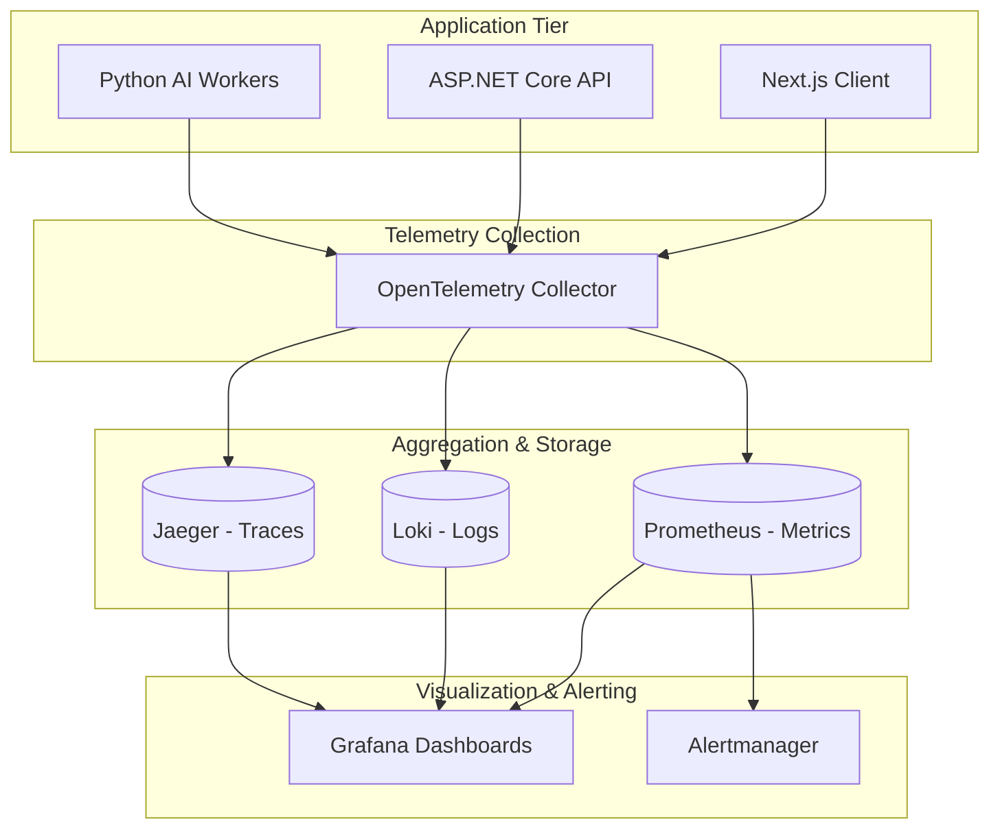
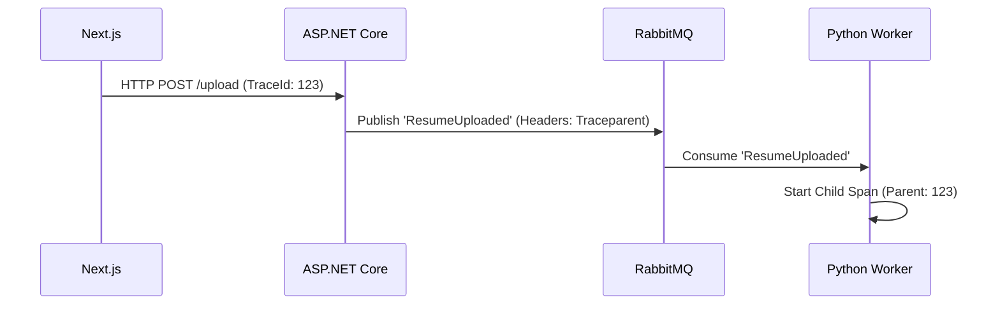

# OBSERVABILITY AND MONITORING ARCHITECTURE

## DOCUMENT CONTROL
| Document ID | FACULTYIQ-OBS-001 |
|---|---|
| **Version** | 1.0.0 |
| **Status** | **APPROVED / BINDING** |
| **Classification** | Enterprise Confidential |
| **Owner** | Reliability Engineering Board |

> [!CAUTION]
> **AUTHORITATIVE OBSERVABILITY SPECIFICATION**
> This document defines the exact tracing contexts, metric thresholds, and AI logging formats required for FacultyIQ. No API endpoint or background Python agent may be deployed to Production without implementing the structured telemetry defined herein.

---

## 1 Executive Summary

### 1.1 Purpose
The Observability and Monitoring Architecture establishes a "Zero Blind Spot" operational standard for FacultyIQ. It provides Site Reliability Engineers (SREs) and AI Operations teams with real-time intelligence on system health, AI hallucinations, and hardware exhaustion.

### 1.2 Observability Philosophy
- **Actionable Alerts**: If an alert fires, it must represent a real degradation requiring human intervention. No alert fatigue.
- **Offline First**: All telemetry, tracing, and log aggregation must remain within the secure, air-gapped intranet (e.g., local Prometheus/Grafana, not cloud Datadog).

---

## 2 Observability Principles

### 2.1 The Three Pillars (Plus One)
1. **Logs**: Immutable records of discrete events (Serilog, JSON formatted).
2. **Metrics**: Aggregated numerical data over time (Prometheus).
3. **Traces**: Request scopes crossing service boundaries (OpenTelemetry).
4. **AI Intelligence (The 4th Pillar)**: Capturing prompt iterations, confidence drift, and token generation speed.

---

## 3 Observability Architecture



---

## 4 Structured Logging

### 4.1 JSON Logging Standards
All logs MUST be written in strict JSON format. Plain text `Console.WriteLine` is forbidden.

```json
{
  "@t": "2026-07-19T14:30:00.000Z",
  "@mt": "Candidate {CandidateId} uploaded a resume.",
  "@l": "Information",
  "CandidateId": "f47ac10b-58cc-4372-a567-0e02b2c3d479",
  "TraceId": "00-4bf92f3577b34da6a3ce929d0e0e4736-00f067aa0ba902b7-01"
}
```

### 4.2 PII Protection
Logs MUST NOT contain candidate names, emails, or raw resume text. Logs must only contain system IDs (`CandidateId`) and metadata.

---

## 5 Distributed Tracing

### 5.1 OpenTelemetry (OTel) Integration
FacultyIQ implements W3C Trace Context propagation. A single `TraceId` travels from the Next.js frontend, through the ASP.NET Core API, into the RabbitMQ headers, and finally into the Python AI worker.



---

## 6 Metrics Architecture

### 6.1 RED Method (Services)
- **Rate**: Requests per second (e.g., `http_requests_total`).
- **Errors**: Failed requests (e.g., HTTP 5xx rates).
- **Duration**: Request latency distributions (Histograms).

### 6.2 USE Method (Infrastructure)
- **Utilization**: % of CPU/GPU in use.
- **Saturation**: RabbitMQ queue depth waiting to be processed.
- **Errors**: Disk read/write failures.

---

## 7 AI Telemetry

Because FacultyIQ relies on local Small Language Models (SLMs), granular AI telemetry is critical.

### 7.1 Tracked AI Metrics
- `ai_inference_duration_seconds`: Total time an LLM spends generating a response.
- `ai_tokens_per_second`: Hardware generation speed (GPU bound).
- `ai_confidence_score_gauge`: Tracks if models are losing confidence in their answers (drift).

---

## 8 Agent Monitoring

Agents (e.g., `ResumeAgent`, `CodingAgent`) are persistent Python worker processes.
- **Worker Health**: `/health` endpoint checks if the Agent can successfully ping the Ollama local runtime.
- **Retry Rates**: If a transient database lock occurs, the Agent's retry count is logged and monitored for saturation.

---

## 9 Workflow Monitoring

Sagas and Orchestrations span multiple minutes or hours.
- **Execution Time**: The time between `ApplicationSubmitted` and `EvaluationCompleted`. 
- **Stuck Workflows**: An alert fires if a Workflow State Machine remains in `Evaluating` for > 30 minutes without a checkpoint update.

---

## 10 Infrastructure Monitoring

- **cAdvisor**: Collects Docker container metrics (CPU, RAM).
- **GPU Stats**: `nvidia-smi` exporter pushes VRAM usage and GPU temperature to Prometheus to prevent thermal throttling of the inference hardware.

---

## 11 Database Monitoring

### 11.1 PostgreSQL
- **pg_stat_statements**: Exposes slow queries taking > 100ms.
- **Connections**: Monitors PgBouncer active/idle connection pools to prevent connection exhaustion during traffic spikes.

### 11.2 Qdrant
- **Vector Search Latency**: Ensures semantic searches return in < 50ms.

---

## 12 RabbitMQ Monitoring

- **Queue Depth**: The ultimate indicator of system saturation. If `ResumeQueue` > 500, workers are overwhelmed.
- **Dead Letter Queues (DLQ)**: Alert on ANY message entering a DLQ. DLQ messages represent fatal business logic failures (e.g., a toxic payload the Python worker cannot parse).

---

## 13 API Monitoring

- **Global Latency**: API requests must satisfy the SLA: 95th percentile (P95) latency < 200ms for standard CRUD operations.
- **Streaming Boundaries**: SSE (Server-Sent Events) for AI generation track "Time to First Token" (TTFT).

---

## 14 Frontend Monitoring

- Next.js exports custom Web Vitals via the `reportWebVitals` function directly to the OTel collector, tracking LCP (Largest Contentful Paint) and CLS (Cumulative Layout Shift).

---

## 15 Health Checks

ASP.NET Core exposes a composite health endpoint at `/health/ready`.
- It executes lightweight `SELECT 1` queries against Postgres and Redis.
- If ANY critical dependency fails, it returns HTTP 503, instructing the Docker daemon to halt traffic routing to that container.

---

## 16 Dashboards

### 16.1 Engineering Dashboard (Grafana)
Contains panels for HTTP latency histograms, CPU/RAM container utilization, and PostgreSQL transaction rates.

### 16.2 AI Operations Dashboard
Contains panels for VRAM utilization, average AI Confidence Scores per department, and Hallucination Detection rates.

---

## 17 Alerting

### 17.1 Alertmanager Rules (Prometheus)
- **Severity: Critical**: API 5xx error rate > 5% for 5 minutes. (Triggers PagerDuty/Internal Comms).
- **Severity: Warning**: `ResumeQueue` depth > 100 for 10 minutes. (Requires auto-scaling investigation).

---

## 18 Capacity Planning

- Prometheus metrics are stored with a 90-day retention to allow for linear regression forecasting. 
- If GPU VRAM growth trends indicate exhaustion within 30 days, a hardware procurement alert is generated for the SRE team.

---

## 19 Incident Management

1. **Detection**: Prometheus Alert fires.
2. **Mitigation**: SRE isolates the failing component (e.g., reverting a bad prompt model version).
3. **Postmortem**: Root Cause Analysis (RCA) is logged, and a new Prometheus alert is designed to catch the failure earlier next time.

---

## 20 Audit Analytics

- A distinct, write-once log stream is maintained for `SecurityEvents` (e.g., "Role changed for User X"). These are shipped to a SIEM or secured cold storage to guarantee compliance with HR data regulations.

---

## 21 Performance Analytics

- **Distributed Profiling**: SREs use Jaeger trace spans to pinpoint exactly where latency is introduced. Example: Discovering that a 2-second API response is caused by a slow 1.8-second MinIO PDF download inside a Python worker.

---

## 22 Business Analytics

While primary business reporting happens via the application UI, Observability data drives operational intelligence:
- "How many Resumes has the AI evaluated this week?"
- "What is the average Time-to-Hire processing time?"

---

## 23 AI Evaluation Monitoring

Model Drift tracking is mandatory.
- If the average `ConfidenceScore` assigned by the AI drops below 70% for three consecutive days, an alert is fired indicating that the Department's Knowledge Rubrics may be outdated or conflicting.

---

## 24 Reliability Metrics

- **SLA Tracking**: 99.9% uptime requirement during business hours.
- **MTTR**: Mean Time To Recovery goal is < 30 minutes for Critical alerts.

---

## 25 Security Monitoring

- The WAF/Reverse Proxy metrics track HTTP 401/403 rates. A sudden spike in 401 Unauthorized errors triggers an Active Brute Force alert.

---

## 26 Architecture Decision Records

- **ADR-OBS-001: OpenTelemetry over Vendor Agents**
  - *Decision*: Standardize entirely on OpenTelemetry SDKs rather than proprietary APM agents (e.g., New Relic).
  - *Context*: Guarantees vendor lock-in prevention and ensures the telemetry pipeline can run completely air-gapped using open-source collectors.

---

## 27 Traceability Matrix

| Metric Name | Threshold | Dashboard | Runbook |
|---|---|---|---|
| `rabbitmq_queue_messages` | > 500 (10m) | Queue Health | `SOP-Scale-Workers` |
| `ollama_vram_usage_bytes` | > 95% | AI Hardware | `SOP-Purge-Model-Cache` |

---

## 28 Glossary

- **TraceContext**: A standard format for propagating distributed tracing headers across network boundaries.
- **Dead Letter Queue (DLQ)**: A holding queue for messages that cannot be processed successfully after multiple retries.

---

## 29 Revision History

| Version | Date | Status | Approvals |
|---|---|---|---|
| **1.0.0** | 2026-07-19 | **APPROVED** | Reliability Engineering Board |
