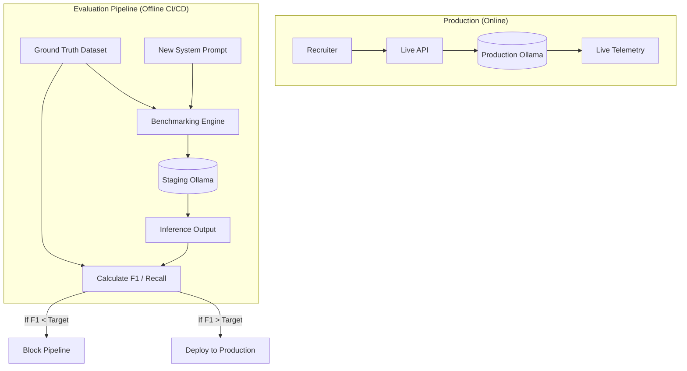
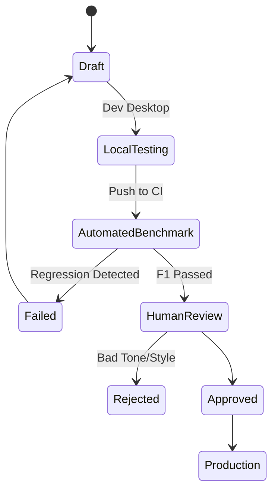
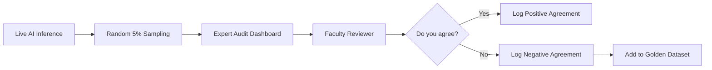

# AI EVALUATION AND BENCHMARKING FRAMEWORK

## DOCUMENT CONTROL
| Document ID | FACULTYIQ-AIEVAL-001 |
|---|---|
| **Version** | 1.0.0 |
| **Status** | **APPROVED / BINDING** |
| **Classification** | Enterprise Confidential |
| **Owner** | AI Governance and Evaluation Board |

> [!CAUTION]
> **AUTHORITATIVE EVALUATION SPECIFICATION**
> This document defines the exact evaluation metrics, hallucination detection limits, and Prompt Regression pipelines for FacultyIQ. No system prompt can be modified, and no Small Language Model (SLM) weights can be updated without passing the automated and Human-in-the-Loop (HITL) quality gates defined herein.

---

## 1 Executive Summary

### 1.1 Purpose
The AI Evaluation and Benchmarking Framework establishes a rigorous, quantitative, and reproducible pipeline to measure the intelligence, safety, and accuracy of FacultyIQ’s AI agents. It ensures that the offline-first models (Qwen2.5, Llama 3.2) perform at an enterprise-grade standard.

### 1.2 Evaluation Philosophy
- **Benchmark First**: Code is not deployed until the prompt has been benchmarked against a ground-truth dataset.
- **Evidence Driven**: "Vibes" are not a valid evaluation metric. All AI outputs must map definitively to an F1 Score, Precision, or Recall metric.

---

## 2 AI Evaluation Principles

1. **Repeatability**: The same prompt and the same input MUST yield a statistically similar output when evaluated across thousands of permutations (Temperature = 0 for evaluations).
2. **Explainability**: Every AI conclusion MUST map back to an exact quotation in the source text (Evidence Graph).
3. **Human Verification**: A percentage of all AI decisions are randomly audited by domain experts to track Human-AI Agreement metrics.

---

## 3 Evaluation Architecture

The architecture separates the live production inference from the offline evaluation pipelines.

---

## 4 Model Benchmarking

Before a new SLM (e.g., Llama 3.2 3B) is approved for the platform, it must pass hardware and quality benchmarking.

### 4.1 Hardware Thresholds
- **Latency**: Time To First Token (TTFT) MUST be < 1.5 seconds.
- **VRAM Usage**: Peak VRAM footprint MUST NOT exceed 3GB (using 4-bit quantization).
- **Inference Speed**: MUST sustain > 35 tokens/second on an RTX 4090 equivalent GPU.

---

## 5 Prompt Evaluation

### 5.1 Prompt Lifecycle Workflow

### 5.2 Prompt Drift
Monitors live telemetry to detect if the prompt is generating longer, less concise answers over time compared to historical baselines.

---

## 6 Resume Agent Evaluation

The Resume Agent extracts structured JSON from unstructured PDFs.

### 6.1 Core Metrics
- **Skill Extraction (Precision/Recall)**: 
  - *Dataset*: 500 manually tagged Computer Science resumes.
  - *Acceptance Threshold*: F1 Score > 0.88.
- **Experience Detection**: Accuracy of calculating total months of contiguous employment.

---

## 7 Knowledge Agent Evaluation

The Knowledge Agent handles RAG (Retrieval-Augmented Generation) against Department Rubrics.

### 7.1 Retrieval Metrics
- **Retrieval Precision**: Are the chunks retrieved actually relevant to the query?
- **Chunk Quality**: Measuring if semantic boundaries were respected during document shredding.

---

## 8 Interview Agent Evaluation

The Interview Agent conducts conversational Q&A based on the candidate's Resume.

### 8.1 Core Metrics
- **Difficulty Progression**: Does the model accurately escalate question difficulty if the candidate answers correctly?
- **Hallucination Detection**: Does the Agent ask about a skill (e.g., "Tell me about your Python experience") that was NEVER mentioned on the resume? (Threshold: < 0.01% hallucination rate).

---

## 9 Coding Agent Evaluation

The Coding Agent grades candidate code submissions.

### 9.1 Core Metrics
- **Compilation Success**: The Python runtime executes the code against unit tests. The Agent's static analysis MUST NOT conflict with the objective compilation result.
- **Optimization Rating**: Evaluates whether the Agent correctly identified `O(N^2)` inefficiencies.

---

## 10 Code Explanation Agent Evaluation

Evaluates the educational quality of the feedback given to the candidate.
- **Complexity Analysis**: Does the Agent accurately describe Cyclomatic Complexity?
- **Tone Alignment**: Is the feedback encouraging and academic rather than punitive?

---

## 11 Bloom Agent Evaluation

The Bloom Agent categorizes candidate responses against Bloom's Taxonomy.

### 11.1 Multi-Class Classification Accuracy
- *Dataset*: 1,000 pre-classified academic answers.
- *Acceptance Threshold*: > 85% accuracy in correctly tagging an answer as *Remembering*, *Applying*, or *Creating*.

---

## 12 Decision Agent Evaluation

The Decision Agent synthesizes all Evidence into a final recommendation.

### 12.1 Confidence Calibration
If the model outputs a Confidence Score of 90%, it should be objectively correct 90% of the time. Overconfident models (scoring 99% but failing ground-truth tests) are explicitly rejected.

---

## 13 Retrieval Evaluation (RAG Metrics)

### 13.1 Strict Information Retrieval Metrics
- **Recall@K (K=5)**: Does the correct Department Rubric chunk appear in the top 5 vector results? (Target: > 95%).
- **NDCG (Normalized Discounted Cumulative Gain)**: Is the most relevant chunk ranked #1, or did it fall to #4?
- **MRR (Mean Reciprocal Rank)**: Evaluates the average rank of the first correct chunk.

---

## 14 Hallucination Detection

### 14.1 Contradiction Detection
A secondary lightweight SLM (e.g., Qwen2.5 0.5B) acts as a Judge. It takes the original Source Text and the Primary AI's output, and returns `TRUE` if the output contains facts absent from the Source Text.

---

## 15 Explainability

All evaluations log the Evidence Mapping.
- **Decision Transparency**: If a candidate is flagged as a "Strong Hire," the evaluation framework requires an exact array of `SourceArtifactId` citations justifying the label.

---

## 16 Responsible AI

### 16.1 Bias and Fairness
The Evaluation Pipeline strips all PII (Names, Gender, Age, Ethnicity) from resumes before they enter the AI pipeline.
- *Metric*: **Demographic Parity**. The AI recommendation rates MUST NOT skew statistically based on the implicit demographic cues remaining in the text.

---

## 17 Human Evaluation

### 17.1 Human-in-the-Loop (HITL) Review Flow

### 17.2 Cohen's Kappa
Inter-rater reliability between the AI and human experts is tracked using Cohen's Kappa score. (Target: > 0.80 - Strong Agreement).

---

## 18 Benchmark Datasets

### 18.1 Governance
- **Golden Dataset**: The primary ground-truth dataset stored securely in PostgreSQL. Contains 5,000 highly curated, human-graded artifacts.
- **Synthetic Datasets**: Auto-generated adversarial datasets used to stress-test prompt injection defenses.

---

## 19 AI Regression Testing

Whenever a developer modifies a Python Agent's system prompt (e.g., to fix a bug with C# resume parsing), the CI pipeline automatically runs the prompt against the entire Golden Dataset. If the modification breaks Java parsing, the Regression Pipeline fails the build.

---

## 20 Performance Benchmarking

### 20.1 Concurrency Testing
- The framework submits 10 simultaneous API requests to the Python AI Gateway to monitor GPU memory spiking and ensure batch-inference queues degrade gracefully rather than crashing with OutOfMemory (OOM) errors.

---

## 21 Continuous Evaluation

- **Nightly Benchmarks**: Full execution of the Golden Dataset.
- **Model Drift Detection**: Alerts if the distribution of "Hire" vs "Reject" recommendations changes by > 10% month-over-month.

---

## 22 Evaluation Dashboards

Built in Grafana, fed by PostgreSQL Evaluation results.
- **Executive Dashboard**: Overall System Accuracy and Human Agreement rates.
- **Prompt Dashboard**: F1 Score tracking across different Git commit hashes.

---

## 23 AI KPIs

- **Accuracy**: (True Positives + True Negatives) / Total.
- **Precision**: True Positives / (True Positives + False Positives). (Highly critical to prevent bad hires).
- **Recall**: True Positives / (True Positives + False Negatives).

---

## 24 Architecture Decision Records

- **ADR-EVAL-001: Local LLM as a Judge (LLM-as-a-Judge)**
  - *Decision*: Use Qwen2.5 0.5B to autonomously score the outputs of Qwen2.5 3B.
  - *Context*: Manual human grading of 5,000 artifacts on every PR is impossible. A smaller, highly-tuned Judge model provides rapid directional feedback, while Humans verify the edge cases.

---

## 25 Traceability Matrix

| Business Goal | Agent | Evaluation Metric | Threshold |
|---|---|---|---|
| Fair Screening | Resume Agent | Demographic Parity | p-value > 0.05 |
| Accurate Tech Assesment | Coding Agent | Compilation Success | 100% Match |

---

## 26 Future Evolution

- **DSPy Integration**: Migrating from manual prompt engineering to algorithmic prompt optimization, where the system automatically discovers the mathematical optimal prompt to maximize the F1 Score.

---

## 27 Glossary

- **Ground Truth**: The objective, human-verified absolute correct answer for a given input.
- **NDCG**: A measure of ranking quality, critical for assessing how well the Knowledge Agent fetches rubrics.

---

## 28 Revision History

| Version | Date | Status | Approvals |
|---|---|---|---|
| **1.0.0** | 2026-07-19 | **APPROVED** | AI Governance and Evaluation Board |
