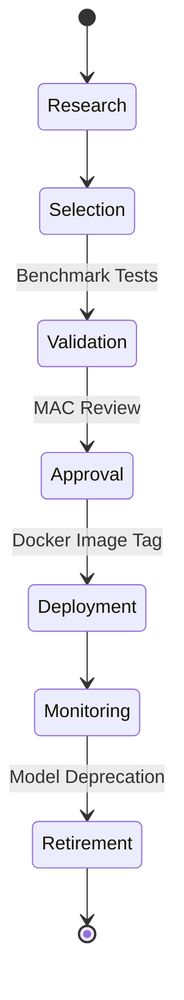

# AI GOVERNANCE AND MODEL LIFECYCLE

## DOCUMENT CONTROL
| Document ID | FACULTYIQ-AIGOV-001 |
|---|---|
| **Version** | 1.0.0 |
| **Status** | **APPROVED / BINDING** |
| **Classification** | Enterprise Confidential |
| **Owner** | AI Governance Board |

> [!CAUTION]
> **AUTHORITATIVE AI GOVERNANCE SPECIFICATION**
> This document defines the exact governance policies, approval flows, and risk management strategies for all Artificial Intelligence capabilities within FacultyIQ. No Model, Prompt, or Evaluation Dataset may be deployed to Production without explicit approval from the Governance Board as defined herein.

---

## 1 Executive Summary

### 1.1 Purpose
The AI Governance and Model Lifecycle document establishes the control framework for safely deploying non-deterministic Small Language Models (SLMs) in a highly regulated enterprise environment (Human Resources and Faculty Recruitment).

### 1.2 Governance Philosophy
- **Human Oversight**: AI does not make hiring decisions; it provides structured, evidence-backed recommendations to human experts.
- **Offline First**: Proprietary institutional data (resumes, department rubrics) must never leave the intranet boundary. Vendor API lock-in (e.g., OpenAI, Anthropic) is strictly prohibited.

---

## 2 AI Governance Principles

1. **Responsible AI**: Ensure AI systems are fair, transparent, and respectful of user privacy.
2. **Evidence-Driven Decisions**: No AI conclusion is accepted without an explicitly cited artifact from the Source Text.
3. **Accountability**: The AI Governance Board holds ultimate accountability for any disparate impact caused by the platform.

---

## 3 AI Governance Architecture

```mermaid
graph TD
    subgraph "Executive Layer"
        Board[AI Governance Board]
    end
    
    subgraph "Review & Approval Committees"
        MAC[Model Approval Committee]
        PRC[Prompt Review Committee]
        SRT[Security Review Team]
    end
    
    subgraph "Execution Layer"
        Res[AI Research Team]
        Eng[Platform Engineering]
    end
    
    Board --> MAC
    Board --> PRC
    Board --> SRT
    
    Res --> MAC: Submits New Models
    Eng --> PRC: Submits Prompt PRs
```

---

## 4 AI Organization Structure

- **AI Governance Board (AIGB)**: Chaired by the Chief AI Officer (CAIO). Owns ultimate risk acceptance.
- **Model Approval Committee (MAC)**: Evaluates raw SLMs (e.g., Qwen2.5 vs Llama 3.2) against VRAM, latency, and accuracy benchmarks.
- **Prompt Review Committee (PRC)**: Evaluates changes to System Prompts for semantic drift and jailbreak resilience.

---

## 5 AI Asset Inventory

FacultyIQ maintains a strict inventory of all AI Assets:
- **Models**: `qwen2.5:3b`, `qwen2.5-coder:3b`, `all-MiniLM-L6-v2`.
- **Agents**: Resume Agent, Interview Agent, Coding Agent.
- **Datasets**: `Golden_Resume_Set_v2`, `Adversarial_Injection_Set_v1`.

---

## 6 Model Lifecycle



---

## 7 Prompt Lifecycle

1. **Creation**: Engineered via DSPy or manual iteration.
2. **Testing**: Run against the Evaluation Dataset.
3. **Approval**: Code-reviewed by the PRC.
4. **Deployment**: Versioned and merged into the `main` branch.
5. **Deprecation**: Older prompts are sunset after 6 months to prevent technical debt.

---

## 8 Agent Lifecycle

Agents possess agency and multi-step reasoning capabilities.
- **Approval Gate**: Before an Agent is approved, it must undergo a bounded "Sandbox Test" proving that it cannot loop infinitely or trigger catastrophic costs (even hardware costs) via endless retries.

---

## 9 Dataset Governance

- **Ownership**: The Quality Engineering team owns the Golden Dataset.
- **Privacy (PII)**: All resumes entering the Golden Dataset MUST be manually scrubbed of PII (Names, Contact Info, Race, Gender) before being stored.
- **Retention**: Datasets are versioned and retained indefinitely for historical algorithm auditing.

---

## 10 Knowledge Base Governance

- **Knowledge Refresh**: Department Rubrics (stored as vectors in Qdrant) must be reviewed by the Department Head annually. Stale rubrics are flagged by the system automatically.
- **Citation Standards**: Every chunk in Qdrant MUST carry a `Document_ID` and `Paragraph_Index` to guarantee traceability.

---

## 11 Model Selection Policy

New models (e.g., Llama 4) may only be introduced if they meet the following:
- **Hardware Constraints**: Must fit inside 24GB of VRAM using 4-bit or 8-bit quantization.
- **Licensing**: Must have a permissive commercial license (e.g., Apache 2.0, MIT, Llama 3 License).

---

## 12 Prompt Governance

- **Prompt Libraries**: All prompts are stored in a centralized directory (`/src/FacultyIQ.AI/Prompts`).
- **Prompt Security**: Developers MUST NOT interpolate untrusted user data directly into a system prompt without explicit block delimiters (`=== START CANDIDATE DATA ===`).

---

## 13 AI Risk Management

- **Bias Risk**: The model favors resumes formatted in a specific structural layout. *Mitigation: PDF-to-Text extraction normalization.*
- **Security Risk**: Prompt Injection leading to SSRF. *Mitigation: Air-gapped SLMs with zero external internet access.*

---

## 14 Responsible AI

FacultyIQ strictly adheres to Educational Ethics guidelines.
- **Human Override**: A Department Head can override an AI's "Reject" recommendation at any time. The system logs this override for future retraining.

---

## 15 Model Versioning

All AI Assets follow Strict Semantic Versioning:
- **Model**: `qwen2.5:3b-v1.0.0`
- **Prompt**: `resume-parser-v2.1.4`
- **Dataset**: `golden-eval-v3.0.0`

---

## 16 AI Approval Workflow

1. **Technical Review**: Passes all F1 accuracy unit tests.
2. **Security Review**: Passes all adversarial prompt injection tests.
3. **Governance Approval**: The PRC signs off on the Pull Request.

---

## 17 AI Audit Framework

Every AI decision writes an immutable log to PostgreSQL containing:
- Model Version used.
- Prompt Version used.
- Candidate ID.
- Execution Timestamp.
- Raw JSON Output (The Evidence Graph).

---

## 18 Compliance

FacultyIQ aligns its AI operations with the **NIST AI Risk Management Framework (AI RMF)**, specifically addressing:
1. **Map**: Identifying context and risks.
2. **Measure**: Benchmarking and evaluating metrics.
3. **Manage**: Prioritizing risk and mitigating bias.
4. **Govern**: Establishing the AI Governance Board.

---

## 19 AI Operations

- **Rollbacks**: If Model Drift triggers a Critical Alert, SREs are authorized to execute an emergency `docker compose` rollback to the previous model version without waiting for MAC approval.

---

## 20 AI Monitoring

- **Confidence Drift**: If the average Confidence Score of the `DecisionAgent` drops by 10% week-over-week, an automatic investigation ticket is generated.

---

## 21 Incident Management

- **Hallucination Events**: If a Recruiter flags a recommendation as a "Severe Hallucination" (e.g., inventing a university degree), the incident is escalated to the AI Governance Board for a Root Cause Analysis (RCA).

---

## 22 Documentation Standards

### 22.1 Model Cards
Every SLM deployed to FacultyIQ must have a formalized Model Card documenting:
- Intended Use.
- Out-of-Scope Uses.
- Evaluation Results.
- Known Limitations.

---

## 23 Architecture Decision Records

- **ADR-GOV-001: Centralized Prompt Repository**
  - *Decision*: Prompts are stored as `.jinja2` files in the backend repository, not in a database.
  - *Context*: Allows prompts to be code-reviewed via standard GitHub Pull Requests, ensuring strict CI/CD integration.

---

## 24 Traceability Matrix

| Business Goal | Agent | Evaluation Metric | Approval Board |
|---|---|---|---|
| Mitigate Bias | Resume Agent | Demographic Parity | Governance Board |
| Accurate Parsing | Resume Agent | F1 Score > 0.85 | MAC / PRC |

---

## 25 Future Evolution

- **Model Marketplace**: Establishing a secure internal registry where different university departments can fine-tune (LoRA) their own variant of Qwen2.5 for specific departmental jargons.

---

## 26 Glossary

- **SLM**: Small Language Model (e.g., 3 Billion to 8 Billion parameters).
- **LoRA**: Low-Rank Adaptation (a technique for fine-tuning models cheaply).

---

## 27 Revision History

| Version | Date | Status | Approvals |
|---|---|---|---|
| **1.0.0** | 2026-07-19 | **APPROVED** | AI Governance Board |
