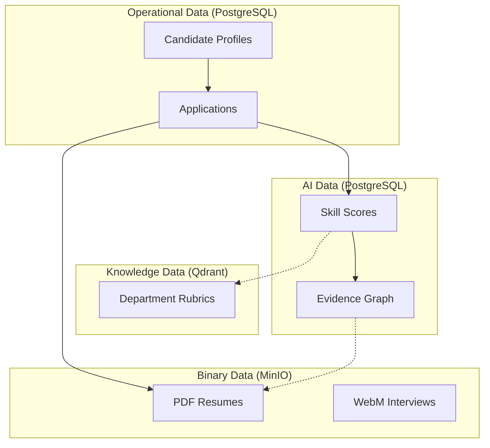
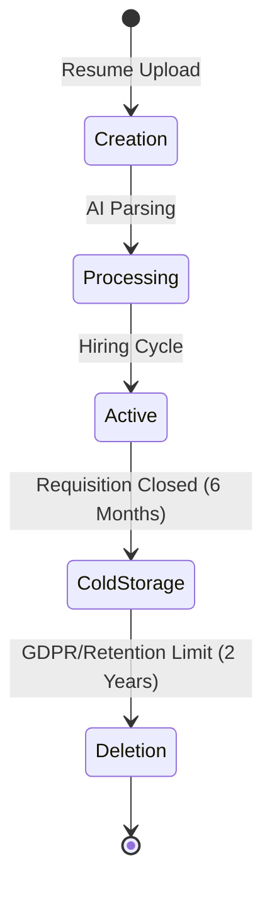
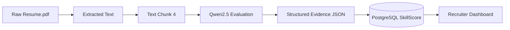

# DATA GOVERNANCE AND INFORMATION ARCHITECTURE

## DOCUMENT CONTROL
| Document ID | FACULTYIQ-DATAGOV-001 |
|---|---|
| **Version** | 1.0.0 |
| **Status** | **APPROVED / BINDING** |
| **Classification** | Enterprise Confidential |
| **Owner** | Enterprise Data Governance Board |

> [!CAUTION]
> **AUTHORITATIVE DATA GOVERNANCE SPECIFICATION**
> This document defines the exact lifecycle, retention, and security rules for all data within FacultyIQ. Every database schema, MinIO bucket, Qdrant collection, and analytical report MUST comply with these data governance standards to ensure FERPA and GDPR readiness.

---

## 1 Executive Summary

### 1.1 Purpose
The Data Governance and Information Architecture establishes how data is classified, protected, and utilized within FacultyIQ. It bridges the gap between physical database schemas and high-level enterprise privacy compliance.

### 1.2 Objectives
- Prevent the permanent leakage of Personally Identifiable Information (PII) into AI embeddings.
- Establish an unbreakable Data Lineage chain from a final Hiring Recommendation back to the original PDF resume text.

---

## 2 Data Governance Philosophy

### 2.1 Evidence Driven AI
AI outputs are not treated as truth; they are treated as *claims*. Every AI claim must be backed by a cryptographic-like pointer (Data Lineage) to a human-uploaded source artifact.

### 2.2 Privacy by Design
Data is isolated. Candidate demographic data is NEVER stored in the same PostgreSQL schema as AI evaluation data, preventing implicit algorithmic bias.

---

## 3 Information Architecture

### 3.1 Enterprise Information Model

---

## 4 Data Classification

FacultyIQ classifies data into four strict tiers:
1. **Public**: General university department descriptions.
2. **Internal**: Aggregated hiring metrics (No PII).
3. **Confidential (PII)**: Candidate Names, Emails, Phone Numbers. Requires strict RBAC.
4. **Restricted**: AI Confidence Scores and Hiring Recommendations prior to formal HR approval.

---

## 5 Data Domains

1. **Candidate Domain**: Owns identity and contact data.
2. **Recruitment Domain**: Owns Job Requisitions and Application states.
3. **Knowledge Domain**: Owns hiring rubrics and Bloom's Taxonomy logic.
4. **Evaluation Domain**: Owns AI-generated Skill Scores and the Evidence Graph.

---

## 6 Data Ownership

| Domain | Business Owner | Technical Custodian | Data Steward |
|---|---|---|---|
| Candidate | VP of Human Resources | Lead DB Architect | HR Compliance Officer |
| Knowledge | Dean of Faculty | Lead AI Engineer | Department Head |

- **Business Owners**: Approve retention policies.
- **Technical Custodians**: Execute database backups and masking.
- **Data Stewards**: Ensure daily data quality and resolve hallucination incidents.

---

## 7 Data Lifecycle

---

## 8 Master Data Management (MDM)

- **University Master**: The single source of truth for Department IDs and Names. Integrated via nightly sync from the University ERP (e.g., Workday).
- **Skill Taxonomy**: A centrally governed ontology (e.g., "React.js" and "React" are mapped to a single UUID representing the React competency).

---

## 9 Metadata Management

### 9.1 AI Metadata
Every AI-generated row in the database MUST include:
- `ModelVersion`: (e.g., "qwen2.5:3b-v1").
- `PromptHash`: SHA-256 hash of the exact system prompt used to generate the data.
- `ExecutionTimeMs`: Hardware latency tracking.

---

## 10 Data Quality Framework

### 10.1 Quality Scoring
- **Completeness**: Does a parsed Candidate record have a populated Education array?
- **Accuracy**: Is the Levenshtein distance between the AI-extracted text and the OCR PDF text zero?

---

## 11 Resume Data Governance

- **Resume Storage**: PDF Resumes are stored in MinIO. They are treated as Immutable. Once uploaded, they cannot be modified, only soft-deleted.
- **Retention Policy**: Raw PDFs MUST be hard-deleted 365 days after a Requisition closes. Anonymized AI scores are retained for longitudinal reporting.

---

## 12 Knowledge Governance

- **Chunk Governance**: When a Department Head uploads a 10-page hiring rubric, it is shredded into 512-token chunks in Qdrant. Each chunk retains a `ParentDocumentId` to maintain contextual lineage.
- **Knowledge Freshness**: Any Rubric older than 365 days triggers a "Stale Knowledge" warning requiring manual re-certification by the Department Head.

---

## 13 AI Data Governance

### 13.1 Inference Records
The AI's reasoning (the chain-of-thought output) is treated as a highly sensitive audit record. It is never exposed directly to the Candidate but is permanently logged for HR compliance auditing in the case of a hiring dispute.

---

## 14 Data Security

- **Masking**: When developers pull a database backup to local machines, a script MUST run replacing all `Candidate.Email` fields with `Faker` generated data.
- **Encryption**: All MinIO buckets containing Resumes enforce Server-Side Encryption (SSE-S3).

---

## 15 Data Privacy

### 15.1 Right to Delete (GDPR)
If a candidate requests deletion:
1. `Candidates` table record is hard-deleted.
2. `MinIO` PDF resumes are hard-deleted.
3. `SkillScores` are orphaned (Foreign Keys set to NULL) and retained purely as anonymous statistical data for algorithm bias tracking.

---

## 16 Data Retention

- **Transactional DB (Postgres)**: 7 Years (Anonymized).
- **Blob Storage (MinIO)**: 1 Year (Raw Resumes).
- **Audit Logs (Postgres JSONB)**: 7 Years (Immutable).

---

## 17 Data Integration

Data exchanged with University ERP systems happens asynchronously via RabbitMQ events to prevent tight coupling.
- **Contract**: The `CandidateHired` event publishes a strict JSON schema containing only the UUID and final state, forcing the ERP to query the API for PII, thereby enforcing API Gateway rate limits.

---

## 18 Data Lineage

*If a Recruiter clicks on a Skill Score in the UI, the system traverses this lineage backward to highlight the exact bounding box in the original PDF.*

---

## 19 Data Versioning

- **Database Schema**: Versioned strictly via Entity Framework Core Migrations.
- **Embeddings**: Qdrant collections are versioned (e.g., `rubrics_v1`, `rubrics_v2`). If the embedding model changes (e.g., from `all-MiniLM-L6-v2` to a newer model), a completely new collection is built, and the API router swaps to the new collection atomically.

---

## 20 Analytics Architecture

- **Operational Analytics**: Served directly from PostgreSQL Materialized Views (refreshed nightly).
- **Executive Dashboards**: Focus on aggregate time-to-hire and AI bias detection metrics.

---

## 21 Data Governance Processes

- **Data Requests**: If the Research Team requires production resumes to fine-tune a model, they must submit a request to the Data Governance Board. The data must be scrubbed of PII via an automated NER (Named Entity Recognition) pipeline before release.

---

## 22 Data Compliance

- **FERPA**: If a candidate is a current student applying for a faculty role, their academic records cannot be co-mingled with standard hiring evaluations without explicit consent tracking. FacultyIQ maintains a `ConsentAgreements` table.

---

## 23 Risk Management

- **Knowledge Drift**: The risk that Department Rubrics no longer reflect modern technology (e.g., requiring AngularJS instead of React). *Mitigation: Annual forced recertification of Knowledge Data.*

---

## 24 Architecture Decision Records

- **ADR-DAT-001: Soft Deletes vs Hard Deletes**
  - *Decision*: Candidates are soft-deleted (`IsDeleted = true`) by default to maintain referential integrity in Application records, except when explicitly mandated by a GDPR Right to Delete request.

---

## 25 Traceability Matrix

| Business Domain | Database | Data Classification | Retention Policy |
|---|---|---|---|
| Demographics | PostgreSQL | PII (Confidential) | 1 Year (or upon request) |
| System Prompts | PostgreSQL | Internal | Indefinite (Versioned) |
| Resumes | MinIO | PII (Confidential) | 1 Year |

---

## 26 Future Evolution

- **Enterprise Knowledge Graph**: Transitioning from disparate relational tables into a unified graph structure (e.g., Neo4j) to allow complex queries like "Find all candidates who have a strong connection to Machine Learning AND were evaluated by Model Version 2."

---

## 27 Glossary

- **Data Lineage**: The lifecycle that traces data from its origin to its destination, detailing every transformation.
- **MDM**: Master Data Management. Ensuring a single, accurate reference for core business entities.

---

## 28 Revision History

| Version | Date | Status | Approvals |
|---|---|---|---|
| **1.0.0** | 2026-07-19 | **APPROVED** | Enterprise Data Governance Board |
