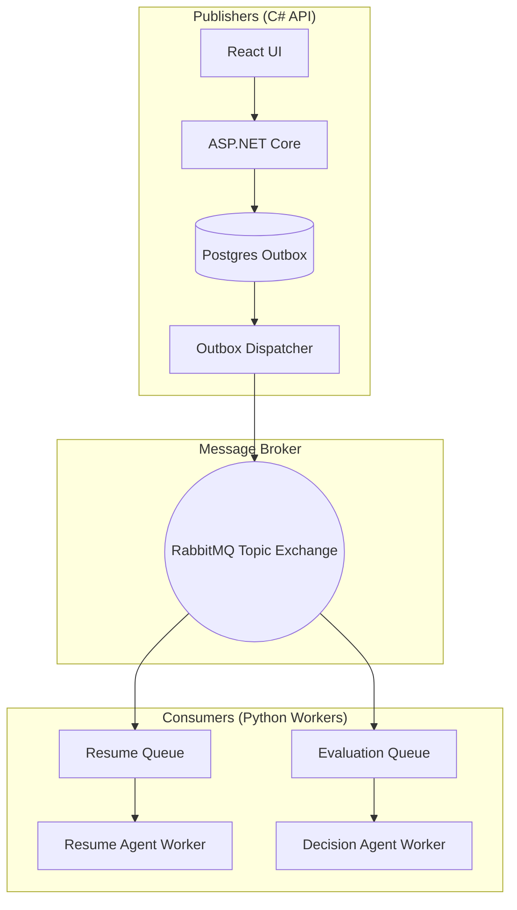
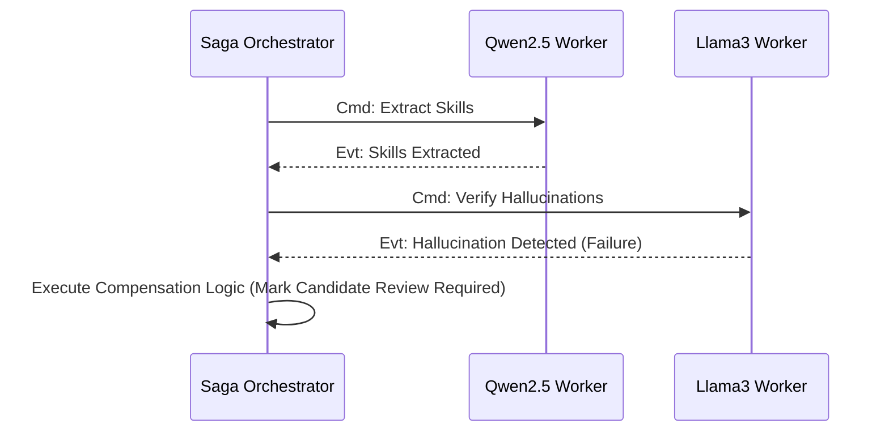
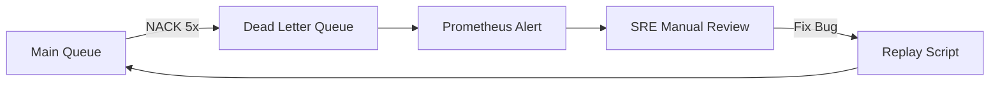

# EVENT-DRIVEN ARCHITECTURE AND MESSAGING

## DOCUMENT CONTROL
| Document ID | FACULTYIQ-EDA-001 |
|---|---|
| **Version** | 1.0.0 |
| **Status** | **APPROVED / BINDING** |
| **Classification** | Enterprise Confidential |
| **Owner** | Enterprise Integration Architecture Board |

> [!CAUTION]
> **AUTHORITATIVE MESSAGING SPECIFICATION**
> This document defines the exact asynchronous patterns, Dead Letter Queue (DLQ) behaviors, and Idempotency guarantees for FacultyIQ. No inter-service communication may bypass RabbitMQ for long-running or AI-inference tasks. Point-to-point synchronous REST calls between the API and Python Workers are explicitly forbidden.

---

## 1 Executive Summary

### 1.1 Purpose
The Event-Driven Architecture (EDA) specification ensures FacultyIQ can scale horizontally and survive localized component failures (e.g., Python worker crashes or GPU Out-of-Memory errors) without dropping candidate data or blocking the user interface.

### 1.2 Messaging Philosophy
- **Asynchronous First**: Any operation taking longer than 500ms (e.g., AI inference, PDF chunking) MUST be offloaded to a background worker via an Event or Command.
- **Dumb Pipes, Smart Endpoints**: RabbitMQ is used purely for routing. All business logic and Saga state management resides in the microservice code.

---

## 2 Event-Driven Principles

1. **Loose Coupling**: Publishers do not know who the Consumers are.
2. **Eventual Consistency**: The UI must be designed to reflect states like "Processing" rather than expecting immediate transactional consistency.
3. **Resilience**: If the AI Inference worker goes offline, RabbitMQ safely queues the messages until the worker recovers.

---

## 3 Event Architecture



---

## 4 Messaging Patterns

### 4.1 Publish/Subscribe (Pub/Sub)
Used for Domain Events (e.g., `CandidateHired`). Multiple independent consumers (e.g., Email Notification Service, ERP Sync Service) listen to the same event.

### 4.2 Competing Consumers
Used for Commands (e.g., `ParseResumeCommand`). A single queue is monitored by 5 identical Python Workers. RabbitMQ round-robins the messages, ensuring the PDF is only parsed once.

---

## 5 RabbitMQ Architecture

### 5.1 Topology
- **Exchanges**: FacultyIQ uses `Topic` exchanges exclusively to allow wildcard routing (e.g., `facultyiq.candidate.*`).
- **Queues**: All queues MUST be declared as `durable=true` to survive broker restarts.
- **Binding**: Queues bind to the exchange using specific routing keys.

### 5.2 Virtual Hosts (vhosts)
- `facultyiq_prod`: Production messaging.
- `facultyiq_dev`: Isolated local development messaging.

---

## 6 Event Catalog

### 6.1 Integration Events
Cross-boundary events meant for external systems or distinct bounded contexts.
- `CandidateApplicationSubmitted`
- `EvaluationCompleted`

### 6.2 Domain Events
Internal state changes used to trigger side-effects within the same bounded context.
- `ResumeParsingFailed`

---

## 7 Command Model

Commands represent an *intent* to mutate state. Unlike Events (which have already happened), Commands can fail and be rejected.
- **Routing**: Commands are routed directly to a specific Queue (Point-to-Point) rather than broadcasted.
- **Validation**: The consumer validates the Command payload before processing.

---

## 8 Workflow Orchestration

### 8.1 Resume Processing Workflow
1. User uploads PDF to ASP.NET Core.
2. API saves PDF to MinIO, writes `ProcessResumeCommand` to the Outbox.
3. Outbox Publisher drops the command onto RabbitMQ.
4. Python Resume Agent pulls the command, downloads the PDF, extracts JSON, and publishes `ResumeParsedEvent`.
5. ASP.NET Core consumes the event and updates PostgreSQL.

---

## 9 Saga Architecture

For distributed transactions lacking a two-phase commit (2PC), FacultyIQ utilizes the **Orchestration Saga** pattern.

### 9.1 Orchestration vs Choreography
- *Decision*: Orchestration.
- *Reason*: The ASP.NET Core backend acts as the central Orchestrator (State Machine). If step 3 of a 5-step AI evaluation fails, the Orchestrator explicitly issues Compensation Commands to roll back the state.



---

## 10 Idempotency

Network retries can cause the same message to be delivered twice.
- **Requirement**: All Consumers MUST be idempotent.
- **Implementation**: Every message includes an `Idempotency-Key` header (UUID). The consumer checks a Redis cache/Postgres table; if the key exists, the message is gracefully acknowledged without re-processing.

---

## 11 Event Versioning

- **Schema Evolution**: Events are serialized as JSON. Fields can be added (Forward Compatible). Existing fields MUST NEVER be deleted or renamed.
- **Versioning Strategy**: If a breaking change is required, a new event class is created (e.g., `CandidateHiredV2`), and publishers publish *both* V1 and V2 until all consumers migrate.

---

## 12 Message Contracts

Every payload MUST contain standard CloudEvents-style metadata envelopes.

```json
{
  "EventId": "9b1deb4d-3b7d-4bad-9bdd-2b0d7b3dcb6d",
  "EventType": "CandidateApplicationSubmitted",
  "Timestamp": "2026-07-19T14:45:00Z",
  "TraceId": "00-4bf92f3577b34da6a3ce929d0e0e4736",
  "Payload": {
    "CandidateId": "f47ac10b-58cc-4372-a567-0e02b2c3d479"
  }
}
```

---

## 13 Retry Strategy

### 13.1 Consumer Policies
If a Python worker encounters a transient error (e.g., Postgres connection timeout):
1. **Immediate Retry**: Up to 3 times in memory.
2. **Delayed Retry**: Message is NACK'd and routed to a delayed-exchange plugin, waiting 5 minutes before redelivery.
3. **Poison Pill**: After 5 failed attempts, it is routed to the Dead Letter Queue.

---

## 14 Dead Letter Queues (DLQ)



- **Operational Rule**: A DLQ must trigger an immediate Slack/PagerDuty alert. Messages in the DLQ represent stalled business processes.

---

## 15 Event Ordering

- **Default**: RabbitMQ does not guarantee absolute global ordering across multiple competing consumers.
- **Workaround**: If strict ordering is required (e.g., `ProfileUpdated` must follow `ProfileCreated`), the Aggregates in PostgreSQL use Optimistic Concurrency (RowVersions) to reject out-of-order updates.

---

## 16 Event Storage

While FacultyIQ is not a pure Event Sourced system, it leverages the **Transactional Outbox** pattern. All outgoing messages are stored in PostgreSQL first, within the same transaction as the business entity update, guaranteeing atomicity.

---

## 17 Background Workers

- **C#**: Implemented via `IHostedService` (`BackgroundService`).
- **Python**: Implemented via `FastStream` or Celery, maintaining persistent AMQP TCP connections to RabbitMQ.
- **Graceful Shutdown**: Workers listen for `SIGTERM` and finish processing the current in-flight message before closing the connection.

---

## 18 AI Event Processing

Because SLM inference on GPUs is highly resource-constrained, AI Queues utilize **Prefetch Count = 1**. This ensures a worker only pulls one Resume off the queue at a time, preventing VRAM overflow.

---

## 19 Reliability

- **High Availability**: RabbitMQ is deployed using Quorum Queues (Raft consensus) in the future Kubernetes environment, ensuring that a single node failure does not result in lost messages.

---

## 20 Security

- **Authentication**: Workers authenticate to RabbitMQ via strictly scoped usernames and passwords stored in Docker Secrets.
- **Queue Isolation**: The API user is granted `Write` permissions to exchanges, but `Read` permissions are denied. Python workers are granted `Read` access to specific queues only.

---

## 21 Monitoring

- **Prometheus Exporter**: The RabbitMQ Prometheus plugin exposes `rabbitmq_queue_messages_ready`.
- **Alerting Threshold**: If `queue_depth > 100` for > 15 minutes, auto-scaling alerts trigger.

---

## 22 Performance

- **Backpressure**: RabbitMQ natively applies TCP backpressure if publishers outpace consumers.
- **Throughput Goals**: The messaging backbone must sustain 5,000 msg/sec with sub-10ms broker latency.

---

## 23 Testing

- **Integration Testing**: Developers MUST use `Testcontainers` to spin up a real RabbitMQ instance during xUnit tests to verify consumer bindings and serialization logic. Mocking `IBus` is discouraged for integration flows.

---

## 24 Operational Runbooks

- **SOP-DLQ-01**: Triage DLQ messages. Identify if the failure is transient (e.g., DB down) or structural (e.g., malformed JSON). Run the Replay CLI utility once the root cause is patched.

---

## 25 Architecture Decision Records

- **ADR-EDA-001: RabbitMQ vs Kafka**
  - *Decision*: Standardize on RabbitMQ for Phase 1.
  - *Context*: FacultyIQ requires complex routing (Topic Exchanges) and Competing Consumers, which RabbitMQ excels at. Kafka's partition-based log replay is overkill for the current state-machine-driven architecture.

---

## 26 Traceability Matrix

| Business Event | Command Published | Target Queue | Consumer Agent |
|---|---|---|---|
| PDF Uploaded | `ParseResumeCommand` | `q.resume.parse` | Resume Agent (Python) |
| Interview Ended | `ScoreInterviewCmd` | `q.interview.score`| Interview Agent (Python)|

---

## 27 Future Evolution

- **MassTransit Migration**: Transitioning raw RabbitMQ C# clients to MassTransit to natively handle Saga Orchestration, Retry policies, and Outbox dispatching seamlessly.

---

## 28 Glossary

- **Saga**: A sequence of local transactions that update each service and publish a message/event to trigger the next local transaction.
- **Outbox Pattern**: Saving a message to a database table in the same transaction as the business entity, to be polled and published later.

---

## 29 Revision History

| Version | Date | Status | Approvals |
|---|---|---|---|
| **1.0.0** | 2026-07-19 | **APPROVED** | Enterprise Integration Architecture Board |
