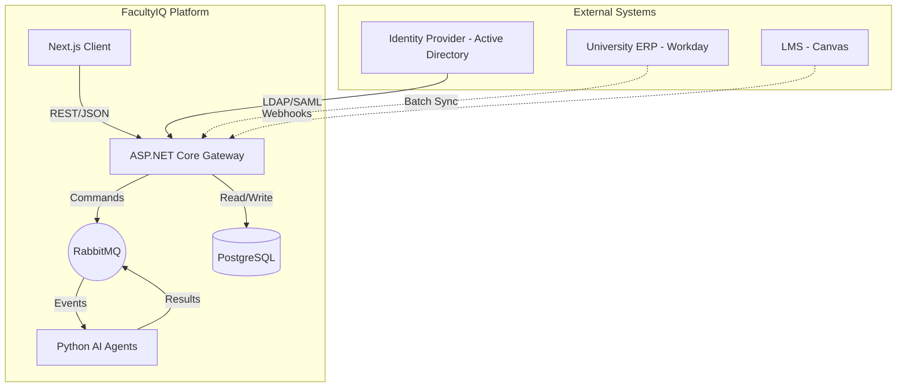
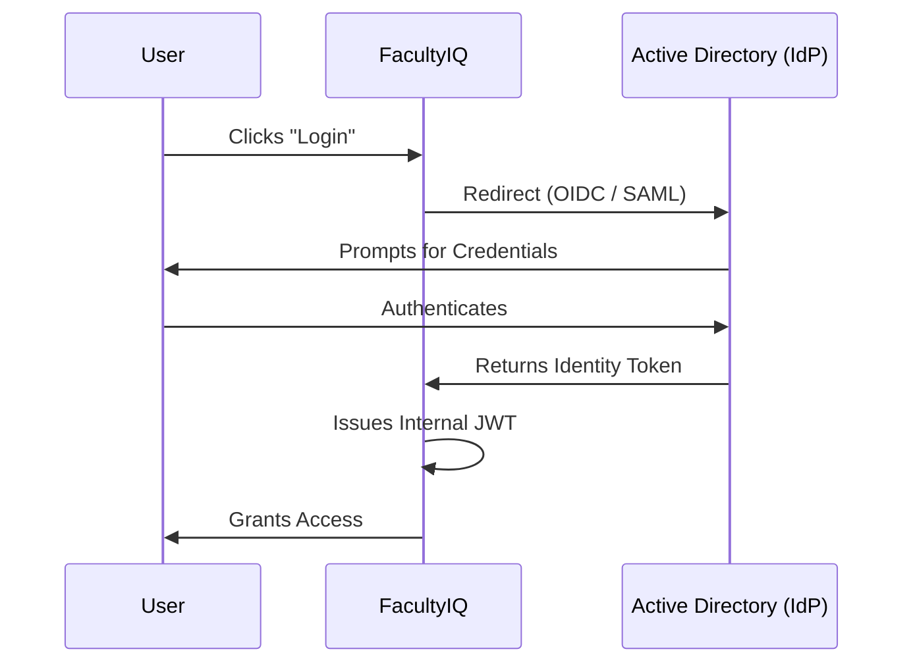
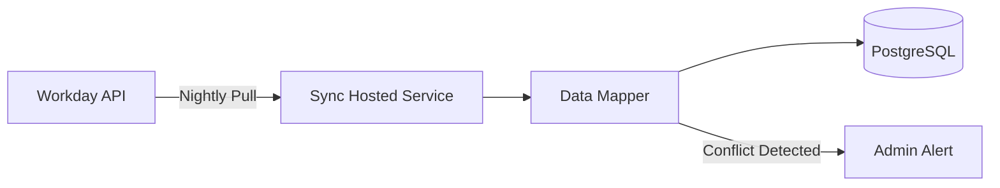

# ENTERPRISE INTEGRATION ARCHITECTURE

## DOCUMENT CONTROL
| Document ID | FACULTYIQ-INT-001 |
|---|---|
| **Version** | 1.0.0 |
| **Status** | **APPROVED / BINDING** |
| **Classification** | Enterprise Confidential |
| **Owner** | Enterprise Integration Board |

> [!CAUTION]
> **AUTHORITATIVE INTEGRATION SPECIFICATION**
> This document defines the exact boundaries, contracts, and security mechanisms for all integrations (Internal, ERP, LMS, Identity) within FacultyIQ. No external system may be connected, and no API endpoint may be exposed, without strict adherence to this architecture.

---

## 1 Executive Summary

### 1.1 Purpose
The Enterprise Integration Architecture defines how FacultyIQ communicates with the outside world (University ERPs, Identity Providers) and how its internal microservices interact. 

### 1.2 Integration Philosophy
- **API First**: Every internal capability must be exposed via a versioned REST API before a UI is built for it.
- **Offline First Compliance**: All external integrations (e.g., University Active Directory) MUST gracefully degrade if the external system becomes unavailable. FacultyIQ must never crash due to an external cloud dependency failure.

---

## 2 Integration Principles

1. **Loose Coupling**: Services communicate via interfaces and events, never by sharing a database.
2. **Backward Compatibility**: APIs must support older clients. Breaking changes require a formal URI version bump (`/v1/` to `/v2/`).
3. **High Cohesion**: Integrations are grouped by bounded contexts (e.g., HR, Identity, AI).

---

## 3 Enterprise Integration Architecture

---

## 4 Internal Integrations

- **Frontend ↔ Backend**: React communicates exclusively via REST over HTTPS with the ASP.NET Core API.
- **Backend ↔ AI Services**: Asynchronous communication via RabbitMQ. Python Workers consume messages, perform inference against local Ollama, and publish results back to RabbitMQ.
- **Backend ↔ MinIO**: Using the S3-compatible API via AWS SDK for .NET to stream PDF files.

---

## 5 External Integrations

### 5.1 University ERP (HR System)
- **Data Synced**: Job Requisitions (Inbound), Hiring Recommendations (Outbound).
- **Pattern**: Polling / Batch Sync nightly, or Webhooks if the ERP supports it.

### 5.2 Learning Management Systems (LMS)
- **Data Synced**: Faculty Teaching Evaluations.
- **Pattern**: REST API integration to ingest historical instructor scores to enrich Candidate Profiles.

---

## 6 Identity Integration

FacultyIQ acts as a Service Provider (SP) delegating authentication to the University's central Identity Provider (IdP).

---

## 7 API Integration

### 7.1 REST APIs
- All APIs MUST conform to OpenAPI 3.1 standards.
- Naming conventions use plural nouns (e.g., `/api/v1/candidates/{id}`).

### 7.2 Versioning
- Explicit URI versioning is mandatory (`/api/v1/...`). Header-based versioning is prohibited to ensure ease of testing and caching.

---

## 8 AI Service Integration

- **Ollama Integration**: Python workers interact with Ollama exclusively via local `http://localhost:11434` REST endpoints.
- **Streaming**: For real-time AI feedback in the UI, the Python worker streams tokens to Redis, and ASP.NET Core pushes them to the React frontend via Server-Sent Events (SSE).

---

## 9 Messaging Integration

- **RabbitMQ**: The central nervous system for all asynchronous tasks.
- **Retry Policies**: Standardized via Polly (in C#) and Tenacity (in Python) to handle network jitters automatically.

---

## 10 Storage Integration

- **MinIO**: Acts as the definitive Blob store.
- **Presigned URLs**: To download a resume, ASP.NET Core generates a time-limited Presigned URL, allowing the Next.js client to download the PDF directly from MinIO without bottlenecking the API bandwidth.

---

## 11 Email Integration

- **SMTP**: FacultyIQ integrates with the University's on-premise SMTP relay.
- **Templates**: All emails use pre-compiled Razor templates stored in the backend.

---

## 12 Notification Integration

- **Dispatch Flow**: An `InterviewScheduledEvent` triggers the Notification Service, which looks up the Recruiter's preferences and routes the message via Email, in-app Bell Notification, or SMS (Future).

---

## 13 Document Integration

- **PDF Processing**: Uploaded PDFs are sent to a dedicated Python worker equipped with OCR libraries (`pdfplumber`, `Tesseract`) to extract raw text robustly before AI parsing.

---

## 14 Knowledge Integration

- **Department Rubrics**: Faculty upload rubrics (DOCX/PDF). The system integrates with LangChain/LlamaIndex chunking pipelines to segment the documents and insert embeddings into Qdrant.

---

## 15 Reporting Integration

- **Exporting**: ASP.NET Core uses libraries like `ClosedXML` to generate native Excel files for end-of-year HR compliance reporting.

---

## 16 Security Integration

- **API Keys**: System-to-system integrations (e.g., a Python script written by a researcher) must use long-lived, cryptographically secure API Keys, which are revocable via the Admin UI.
- **TLS**: All internal traffic between containers (API to Postgres) MUST be encrypted via self-signed certificates managed by the orchestration platform.

---

## 17 Monitoring Integration

- **OTel Exporters**: Every service MUST push traces to the central OpenTelemetry Collector, which routes them to Jaeger (Traces) and Prometheus (Metrics).

---

## 18 Data Synchronization

### 18.1 ERP Sync Flow

- **Conflict Resolution**: If the ERP says a requisition is "Closed" but FacultyIQ says it is "Active", the ERP (Source of Truth) always wins.

---

## 19 Integration Error Handling

- **Circuit Breakers**: If the external ERP API is down (returns 5xx errors 5 times in a row), the Circuit Breaker trips to "Open". FacultyIQ stops polling the ERP for 5 minutes, preventing cascading network failures.

---

## 20 Plugin Architecture

- **Extension Points**: The system is designed to allow "Evaluation Plugins" in the future (e.g., integrating a 3rd party coding assessment platform like HackerRank).
- **Sandboxing**: Plugin code executes in a heavily restricted AppDomain or isolated Docker container to prevent memory leaks from crashing the core platform.

---

## 21 Enterprise Connector Framework

- Connectors are built on an Interface-driven architecture (e.g., `IErpConnector`). 
- Moving from Workday to SAP SuccessFactors simply requires injecting a new implementation of `IErpConnector` without touching core business logic.

---

## 22 Compliance

- Integrations must support Audit Logging. Any data synchronized from an external system is logged with a `SourceSystemID` and a `SyncTimestamp` to maintain a forensic trail for compliance audits.

---

## 23 Operational Runbooks

- **Credential Rotation**: Clear procedures for rotating the Service Account passwords used by FacultyIQ to authenticate against Active Directory.

---

## 24 Architecture Decision Records

- **ADR-INT-001: Presigned URLs for Object Storage**
  - *Decision*: Clients download files directly from MinIO using Presigned URLs instead of proxying files through the ASP.NET Core API.
  - *Context*: Massively reduces CPU and bandwidth load on the application tier.

---

## 25 Traceability Matrix

| Business Capability | Integration | Protocol | Error Handling |
|---|---|---|---|
| Single Sign-On | Active Directory | LDAP/SAML | Fallback to local admin |
| Resume Upload | MinIO | S3/HTTP | Exponential Backoff Retry |

---

## 26 Future Evolution

- **API Gateway**: Implementing Ocelot or Kong to manage rate limiting, API key validation, and routing across multiple backend microservices as the platform scales out of a modular monolith.

---

## 27 Glossary

- **SSO**: Single Sign-On.
- **OIDC**: OpenID Connect (modern authentication protocol built on OAuth2).
- **Circuit Breaker**: A design pattern used to detect failures and encapsulate the logic of preventing a failure from constantly recurring.

---

## 28 Revision History

| Version | Date | Status | Approvals |
|---|---|---|---|
| **1.0.0** | 2026-07-19 | **APPROVED** | Enterprise Integration Board |
