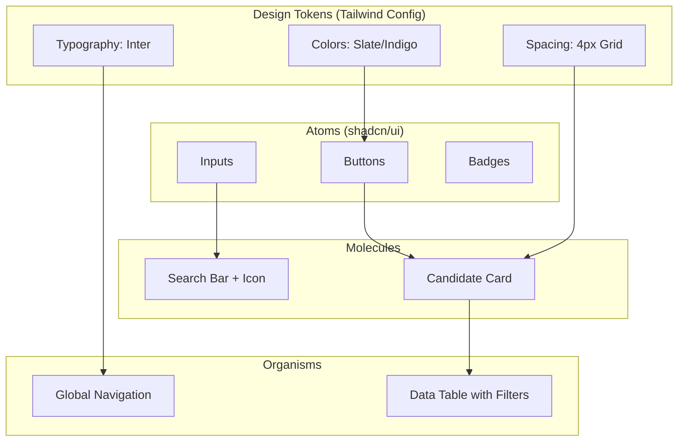
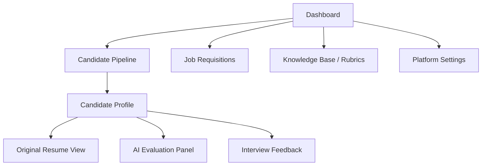
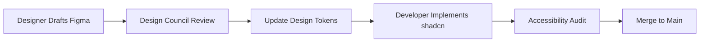

# UI/UX AND DESIGN SYSTEM ARCHITECTURE

## DOCUMENT CONTROL
| Document ID | FACULTYIQ-UX-001 |
|---|---|
| **Version** | 1.0.0 |
| **Status** | **APPROVED / BINDING** |
| **Classification** | Enterprise Confidential |
| **Owner** | Design System Council |

> [!CAUTION]
> **AUTHORITATIVE DESIGN SPECIFICATION**
> This document defines the exact accessibility mandates (WCAG 2.2 AA), component hierarchies (shadcn/ui), and AI Explainability interfaces for FacultyIQ. No frontend code may be merged into production if it deviates from these design tokens or violates the offline-first performance constraints.

---

## 1 Executive Summary

### 1.1 Purpose
The UI/UX and Design System Architecture establishes a unified visual language for FacultyIQ. It bridges the gap between enterprise data density and consumer-grade usability, specifically addressing the unique challenges of building trust in AI-generated evaluations.

### 1.2 UX Philosophy
- **AI Explainability**: The user must always know *why* the AI made a recommendation. Black-box UI is forbidden.
- **Minimal Cognitive Load**: Recruiters evaluating hundreds of resumes must be presented with high-signal, low-noise interfaces.
- **Accessibility First**: The platform must be fully usable via keyboard and screen readers (WCAG 2.2 AA).

---

## 2 Design Principles

1. **User-Centered Design**: Interfaces are built around the Recruiter's workflow, not the underlying database schema.
2. **Trust through Transparency**: AI Confidence Scores are prominently displayed alongside the exact text that triggered the score.
3. **Efficiency**: Optimistic UI updates ensure the application feels instantaneous, masking backend AI latency.

---

## 3 Design System Overview

### 3.1 Component Hierarchy

---

## 4 Brand Identity

- **Typography**: The primary typeface is **Inter**. It provides excellent legibility for dense data tables.
- **Color Palette**: 
  - *Primary*: Indigo (`#4F46E5`) - Used for primary actions and highlights.
  - *Neutral*: Slate (`#64748B`) - Used for text, borders, and backgrounds.
  - *Semantic*: Emerald (Success), Rose (Danger), Amber (Warning).
- **Motion Principles**: Animations (via Framer Motion) are restricted to micro-interactions (e.g., hover states, drawer slides) < 200ms. Lengthy animations are forbidden.

---

## 5 Information Architecture

---

## 6 User Personas

1. **Recruiters**: High-volume users. Need fast filtering, bulk actions, and high data density.
2. **Department Heads**: Low-volume, high-stakes users. Need deep dives into specific candidate AI evaluations and rubrics.
3. **Candidates**: External users. Need a frictionless, mobile-friendly application upload experience.

---

## 7 User Journey Maps

### 7.1 Candidate Evaluation Journey
1. **Upload**: Candidate submits a PDF via a drag-and-drop zone.
2. **Processing**: Recruiter sees a "Processing..." skeleton state while the Python workers parse the PDF.
3. **Review**: Recruiter opens the Candidate Profile. The left pane shows the original PDF. The right pane shows the AI's extracted skills and Confidence Scores.
4. **Action**: Recruiter clicks "Approve for Interview" or "Reject".

---

## 8 Navigation Architecture

- **Primary Navigation**: Left-aligned, collapsible sidebar.
- **Command Palette**: `Cmd+K` (or `Ctrl+K`) opens a global search overlay, allowing power users to instantly jump to a specific Candidate Profile without clicking through menus.
- **Breadcrumbs**: Always visible below the top header (e.g., `Home > Requisitions > Computer Science > John Doe`).

---

## 9 Page Templates

- **Dashboard**: Card-based KPI metrics at the top, followed by a recent activity feed.
- **Candidate Profile**: A split-screen layout. The left side is a fixed PDF viewer; the right side is a scrollable data panel.
- **Analytics**: Full-width data tables utilizing AG-Grid or TanStack Table for heavy filtering and sorting.

---

## 10 Component Library

FacultyIQ utilizes **shadcn/ui** built on Radix UI primitives.
- **Dialogs**: Used for destructive actions (e.g., "Are you sure you want to delete this requisition?"). Must trap focus.
- **Drawers**: Used for contextual editing (e.g., editing a Candidate's phone number) without losing the context of the underlying table.

---

## 11 Form Design Standards

- **Validation**: Client-side validation is executed via Zod schemas synchronized with the backend. Error messages appear instantly on `blur`.
- **Auto Save**: Long forms (e.g., Interview Feedback) auto-save to `localStorage` or a draft API endpoint every 30 seconds to prevent data loss.

---

## 12 Dashboard Design

- **Executive Dashboard**: Focuses on aggregate AI metrics (e.g., Average Time to Hire, Pipeline Conversion Rates).
- **Recruiter Dashboard**: Focuses on actionable tasks (e.g., "5 Candidates Pending Review", "2 Interviews Today").

---

## 13 AI Experience Design

### 13.1 Evidence Panels
If the AI scores a candidate a 9/10 in React.js, the UI MUST display a clickable "View Evidence" badge. Clicking the badge opens a popover highlighting the exact text snippet from the resume that justified the score.

### 13.2 Confidence Indicators
Scores < 70% confidence are styled in Amber and feature a warning icon, explicitly prompting human review.

---

## 14 Responsive Design

- **Mobile First**: All components are built for mobile first, then scaled up using Tailwind's `sm:`, `md:`, `lg:`, `xl:` breakpoints.
- **Data Tables**: On mobile, data tables collapse into vertically stacked Cards. Horizontal scrolling of data tables is strongly discouraged on mobile devices.

---

## 15 Accessibility (WCAG 2.2 AA)

- **Keyboard Navigation**: All interactive elements (buttons, links, form fields) must be accessible via the `Tab` key. Focus rings (`ring-2 ring-indigo-500`) must be clearly visible.
- **Color Contrast**: All text must pass a minimum contrast ratio of 4.5:1 against its background.
- **Screen Readers**: `aria-label` and `aria-live` regions are strictly required for dynamically updating AI states (e.g., alerting the screen reader when PDF extraction is complete).

---

## 16 Interaction Design

- **Optimistic Updates**: When a user clicks "Approve", the UI immediately reflects the approved state, and the API request happens in the background. If the API fails, the UI rolls back and displays a Toast error.
- **Loading States**: Skeleton screens matching the shape of the incoming data are used instead of generic spinning loaders to reduce perceived latency.

---

## 17 Data Visualization

- **Charts**: Use monochromatic or color-blind-safe palettes for Bar and Line charts (visualizing Recruitment Trends).
- **Empty States**: If a chart has no data, display a friendly illustration with a clear Call-to-Action (e.g., "Upload your first candidate to see analytics").

---

## 18 Notification Design

- **Toast Messages**: Used for transient success/error messages (e.g., "Candidate saved"). Dismiss automatically after 4 seconds.
- **System Alerts**: Banner alerts at the top of the screen used for critical system states (e.g., "Database connection lost. Running in offline mode.").

---

## 19 Performance UX

- **Lazy Loading**: Heavy components (e.g., the PDF viewer, Chart.js bundles) are dynamically imported in Next.js to ensure the initial First Contentful Paint (FCP) remains under 1.5 seconds.

---

## 20 Internationalization

- **Dates and Numbers**: Formatted using the browser's `Intl.DateTimeFormat` API.
- **RTL Readiness**: Logical CSS properties (e.g., `ps-4` instead of `pl-4`) are used throughout the Tailwind configuration to support future Right-to-Left languages.

---

## 21 Design Governance

No custom CSS classes are allowed outside of the `tailwind.config.js` token system.

---

## 22 Usability Testing

- **A/B Testing**: UI variations regarding AI Explainability displays are continually tested with Recruiters to measure "Time to Decision" and "Trust Calibration".

---

## 23 Architecture Decision Records

- **ADR-UX-001: Tailwind CSS + shadcn/ui over Material UI**
  - *Decision*: Adopt Tailwind CSS and copy-paste shadcn/ui components.
  - *Context*: Avoids the bloat and strict opinionation of Material UI, allowing complete customization of the enterprise brand identity without fighting CSS specificity wars.

---

## 24 Traceability Matrix

| Component | UX Rule | Accessibility Requirement |
|---|---|---|
| Search Bar | Command Palette (`Cmd+K`) | `aria-expanded` state tracking |
| Evidence Badge | AI Explainability (Ch. 13) | High contrast (4.5:1) |

---

## 25 Future Evolution

- **Conversational UI**: Integrating a chat interface within the Candidate Profile, allowing the Recruiter to "Chat with the Resume" (e.g., "Did this candidate ever mention leading a team?").

---

## 26 Glossary

- **Design Token**: The smallest atomic unit of design (e.g., a specific hex code or spacing value) stored as a variable.
- **Optimistic UI**: A pattern where the UI updates immediately, assuming a background network request will succeed.

---

## 27 Revision History

| Version | Date | Status | Approvals |
|---|---|---|---|
| **1.0.0** | 2026-07-19 | **APPROVED** | Design System Council |
