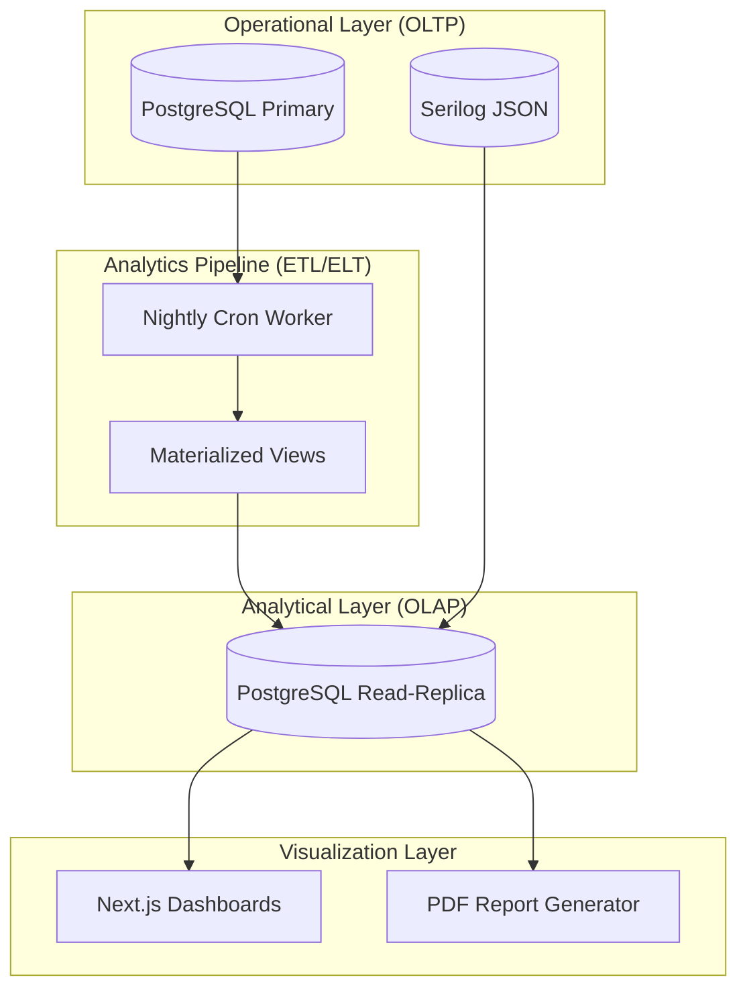
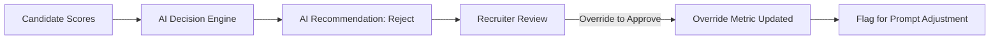

# BUSINESS INTELLIGENCE AND ANALYTICS ARCHITECTURE

## DOCUMENT CONTROL
| Document ID | FACULTYIQ-BI-001 |
|---|---|
| **Version** | 1.0.0 |
| **Status** | **APPROVED / BINDING** |
| **Classification** | Enterprise Confidential |
| **Owner** | Enterprise Analytics Council |

> [!CAUTION]
> **AUTHORITATIVE ANALYTICS SPECIFICATION**
> This document defines the exact definitions, calculation methods, and data pipelines for all FacultyIQ metrics. To prevent "Metric Drift" (different departments calculating Time-to-Hire differently), no analytical dashboard may be published to Production without conforming to the calculations defined herein.

---

## 1 Executive Summary

### 1.1 Purpose
The Business Intelligence (BI) and Analytics Architecture transforms raw operational data (resumes, AI scores, API logs) into actionable Decision Intelligence for University Deans, HR Directors, and System Administrators.

### 1.2 Analytics Vision
- **Decision Intelligence**: Analytics must prescribe action, not just describe history. If Time-to-Hire spikes, the dashboard must highlight the specific workflow bottleneck.
- **Offline First Compliance**: All analytics are computed entirely within the intranet using PostgreSQL Materialized Views and local charting libraries (Chart.js / Recharts) embedded in the Next.js UI.

---

## 2 Analytics Philosophy

1. **Single Source of Truth**: All BI data is derived from the centralized PostgreSQL read-replicas. Spreadmarts (rogue Excel spreadsheets) are actively discouraged via robust self-service reporting.
2. **AI-Assisted Analytics**: Natural language querying of data will be progressively introduced, allowing executives to "Chat with the Database" rather than writing SQL.

---

## 3 Enterprise Analytics Architecture

---

## 4 Data Analytics Pipeline

1. **Extraction**: Nightly background workers (via Hangfire/Quartz.NET) extract incremental data from the heavily normalized Operational tables.
2. **Transformation**: Denormalization occurs via PostgreSQL `REFRESH MATERIALIZED VIEW CONCURRENTLY`. Complex JSONB evidence graphs are flattened into columnar formats for fast aggregation.
3. **Visualization**: ASP.NET Core serves the pre-aggregated JSON to Next.js for client-side rendering.

---

## 5 KPI Framework

### 5.1 Strategic KPIs
- **Time-to-Hire**: Days from Requisition Open to Offer Accepted.
- **Cost-per-Hire**: Aggregate software, recruiter hour, and advertisement costs divided by hires.

### 5.2 AI Quality KPIs
- **Human Override Rate**: The % of times a Recruiter manually reverses an AI "Reject" recommendation. (Target: < 5%).

---

## 6 Executive Dashboards

### 6.1 Institution Dashboard (Provost Level)
- **Focus**: High-level macro trends.
- **Widgets**: Year-over-Year hiring volume by Department, Faculty Diversity metrics, and Total AI Processing hours saved.

### 6.2 Department Dashboard (Dean Level)
- **Focus**: Operational velocity.
- **Widgets**: Active Requisitions, Pipeline Drop-off Rates, and Top Needed Skills vs Current Candidate Pool.

---

## 7 Recruitment Analytics

- **Hiring Funnel**: 
  - Applied ➔ AI Screened ➔ Interviewed ➔ Offered ➔ Hired.
- **Screening Accuracy**: Correlating the AI's initial Resume Score with the final human Interview Score to prove predictive validity.

---

## 8 Resume Intelligence Analytics

By aggregating the JSON output of the Resume Agent across thousands of candidates, FacultyIQ provides macro-intelligence:
- **Skill Distribution**: "45% of applicants this semester listed PyTorch, up from 12% last year."
- **Confidence Analytics**: Average AI confidence scores parsed by document format (e.g., DOCX vs PDF) to detect OCR degradation.

---

## 9 Interview Analytics

- **Question Coverage**: Are interview panels strictly adhering to the generated AI question rubrics, or are they deviating to unstructured questions?
- **Panel Bias Analytics**: Tracking if specific interview panels consistently score candidates 20% lower than the institutional average.

---

## 10 Coding Assessment Analytics

For Computer Science and Engineering faculty roles:
- **Execution Success**: % of submitted code that compiles on the first attempt.
- **Complexity Trends**: Big-O Time Complexity distributions of candidate submissions.

---

## 11 Bloom Taxonomy Analytics

The Bloom Agent categorizes candidate responses:
- **Cognitive Level Distribution**: Ensuring that Senior Faculty interviews are heavily weighted toward *Evaluating* and *Creating* rather than mere *Remembering*.

---

## 12 AI Analytics

Tracking the health and efficiency of the local SLMs:
- **Tokens Per Second (TPS)**: Real-time gauge of GPU throughput.
- **Hallucination Metrics**: Aggregate counts of Contradiction events flagged by the LLM-as-a-Judge pipeline.
- **Fallback Statistics**: How often the system had to downgrade from Qwen2.5 3B to a simpler heuristic fallback due to queue saturation.

---

## 13 Decision Intelligence

Decision Intelligence bridges analytics with action.

---

## 14 Operational Analytics

Designed for the Site Reliability Engineering (SRE) team.
- **Queue Analytics**: RabbitMQ Dead Letter Queue volume.
- **Storage Growth**: Predicting when MinIO will exhaust physical disk space based on PDF upload trends.

---

## 15 User Analytics

- **Feature Adoption**: Measuring how often Recruiters click the "Explain this Score" button (Evidence Panel). Low engagement may indicate poor UX discoverability.

---

## 16 Security Analytics

- **Authentication Trends**: Spikes in HTTP 401 errors grouped by IP subnet.
- **Audit Analytics**: Tracking how many times Administrators export candidate PII data to CSV (DLP monitoring).

---

## 17 Data Visualization Standards

- **Tables over Pie Charts**: For > 5 data points, data tables with inline sparklines MUST be used instead of pie charts.
- **Color Blind Safe**: All chart palettes must use high-contrast, color-blind-accessible distinct hex codes (e.g., avoiding red/green adjacent boundaries).

---

## 18 Reporting Framework

- **Scheduled Reports**: ASP.NET Core background workers generate PDFs using headless Chromium (PuppeteerSharp/Playwright) and email them to Deans every Monday at 08:00 AM.
- **Format**: All tabular reports must offer a one-click "Export to CSV" function.

---

## 19 Predictive Analytics

- **Workload Forecasting**: Using simple linear regression on historical semester data to predict how many resumes will be uploaded in the upcoming Fall semester, allowing IT to pre-scale GPU instances.

---

## 20 Decision Support

- **Scenario Analysis (What-If)**: "If we raise the minimum AI Confidence Threshold for automatic progression from 80% to 85%, how many more candidates will require manual human review?"

---

## 21 Analytics Governance

- **Metric Ownership**: Every KPI in the system must have a named Business Owner. If a calculation bug is found in "Time-to-Hire", the HR Director must sign off on the SQL fix.
- **Versioning**: BI SQL scripts are treated as code and versioned in Git alongside the application.

---

## 22 Performance Optimization

- **Materialized Views**: Complex JOINs spanning Candidates, Scores, and Rubrics are strictly forbidden on the primary OLTP tables during business hours. They MUST query the Materialized Views refreshed at 02:00 AM.
- **Caching**: Dashboard JSON payloads are cached in Redis for 15 minutes to survive the 09:00 AM "login storm."

---

## 23 AI-Assisted Insights

- **Automated Summaries**: Instead of just showing a line chart trending downward, the UI uses the local SLM to generate a 2-sentence natural language summary: *"Application volume dropped 15% this week, primarily in the Mathematics department."*

---

## 24 Architecture Decision Records

- **ADR-BI-001: Next.js Native Charts vs PowerBI iFrames**
  - *Decision*: Build native React dashboards using Recharts/Chart.js instead of embedding PowerBI for the core application.
  - *Context*: Enforces the offline-first mandate, eliminates per-user licensing costs, and ensures UX consistency.

---

## 25 Traceability Matrix

| Business Goal | KPI | Visualization | Data Source |
|---|---|---|---|
| Speed to Hire | Time-to-Hire | Line Chart (Trend) | Postgres (Requisitions) |
| AI Trust | Human Override Rate | Scorecard (%) | Postgres (Audit Logs) |

---

## 26 Future Evolution

- **Text-to-SQL Analytics**: Allowing Deans to type "Show me the top 5 candidates for the Chemistry role" and having a dedicated Analytics SLM convert that to a secure, read-only SQL query against the Replica database.

---

## 27 Glossary

- **Materialized View**: A database object that contains the results of a query, physically storing the data to vastly improve read performance at the cost of slight staleness.
- **Decision Intelligence**: The application of AI and analytics to support, augment, and automate business decisions.

---

## 28 Revision History

| Version | Date | Status | Approvals |
|---|---|---|---|
| **1.0.0** | 2026-07-19 | **APPROVED** | Enterprise Analytics Council |
