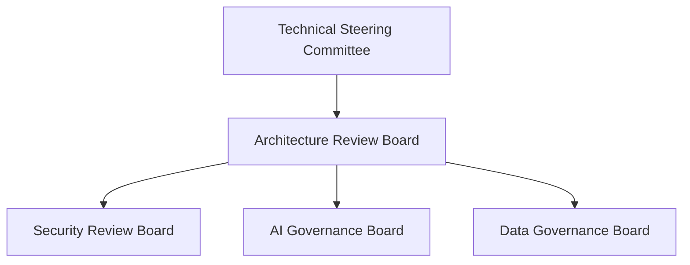
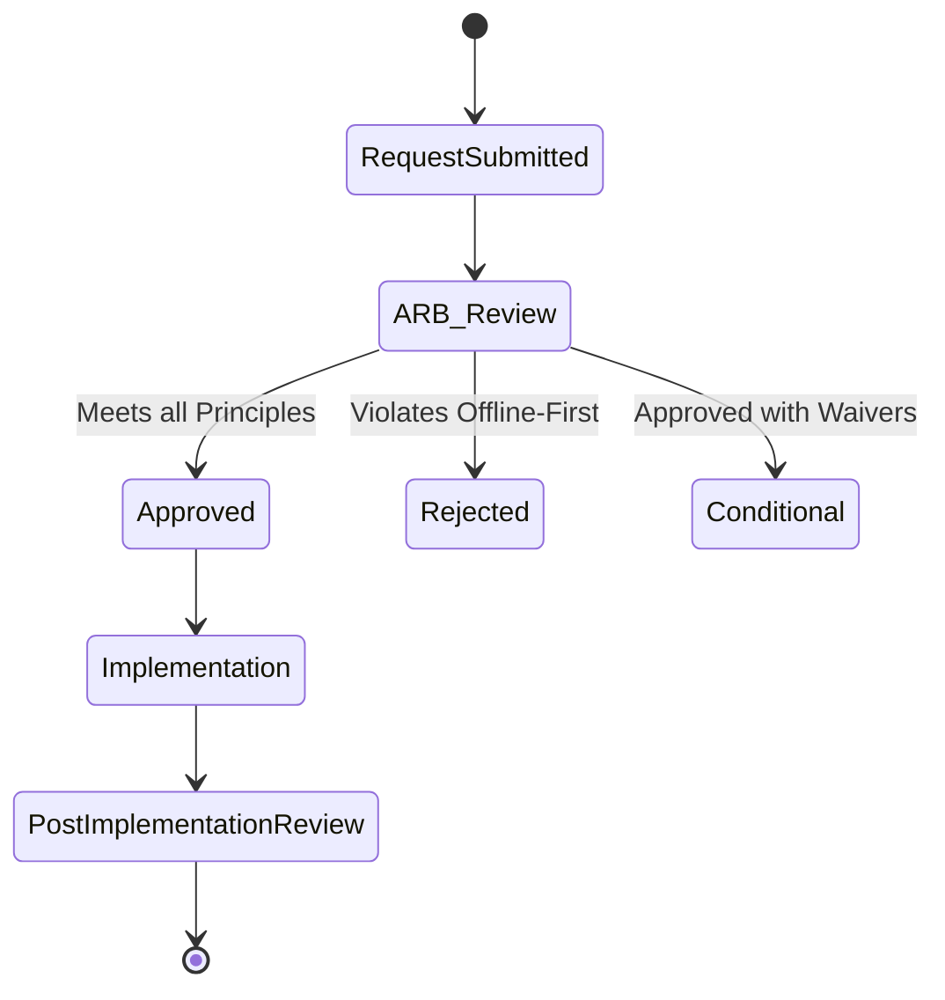
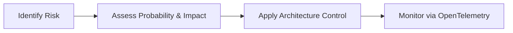

# ENTERPRISE ARCHITECTURE GOVERNANCE

## DOCUMENT CONTROL
| Document ID | FACULTYIQ-GOV-001 |
|---|---|
| **Version** | 1.0.0 |
| **Status** | **APPROVED / BINDING** |
| **Classification** | Enterprise Confidential |
| **Owner** | Architecture Review Board (ARB) |

> [!CAUTION]
> **AUTHORITATIVE GOVERNANCE SPECIFICATION**
> This document governs the lifecycle of every architectural decision, technology adoption, and codebase standard within FacultyIQ. No new database, programming language, external integration, or AI model may be deployed to Production without explicitly passing the governance gates defined herein.

---

## 1 Executive Summary

### 1.1 Purpose
The Enterprise Architecture Governance framework ensures that FacultyIQ evolves securely, sustainably, and in tight alignment with its Offline-First and AI-Native strategic goals.

### 1.2 Governance Objectives
- **Prevent Architecture Erosion**: Enforce Clean Architecture principles (Domain-Driven Design) to stop the Modular Monolith from decaying into a "Big Ball of Mud."
- **Standardize AI Adoption**: Ensure all SLMs (Small Language Models) are vetted for bias, performance, and hardware constraints before integration.

---

## 2 Enterprise Architecture Principles

1. **Strategic Alignment**: IT decisions MUST map directly to the University's recruitment objectives.
2. **Reuse Before Build**: Teams SHALL check the internal component registry before building new microservices or frontend components.
3. **Offline First**: Architecture SHALL NOT rely on external cloud vendors (AWS, Azure) for core operational features.
4. **Evidence Driven AI**: AI inferences SHALL NOT execute without maintaining an unbreakable cryptographic-like lineage to the human-uploaded source data.

---

## 3 Governance Organization

### 3.1 Board Structure

### 3.2 Roles & Responsibilities
- **Technical Steering Committee (TSC)**: C-Level oversight. Defines budget and strategic roadmaps.
- **Architecture Review Board (ARB)**: Principal Architects. Reviews and approves major technical designs.
- **AI Governance Board**: Specializes in AI ethics, prompt versioning, and Hallucination thresholds.

---

## 4 Governance Operating Model

- **Decision Lifecycle**: 
  1. *Draft* ➔ 2. *Proposed* ➔ 3. *Under Review* ➔ 4. *Approved / Rejected* ➔ 5. *Implemented* ➔ 6. *Deprecated*.
- **Exception Process (Waivers)**: If a team must violate a standard (e.g., bypassing RabbitMQ for a synchronous call due to extreme latency constraints), they MUST submit a formal Waiver to the ARB. Waivers expire after 6 months and mandate a Technical Debt remediation plan.

---

## 5 Architecture Domains

FacultyIQ aligns with TOGAF Enterprise Architecture domains:
1. **Business Architecture**: The recruitment processes and user journeys.
2. **Data Architecture**: PostgreSQL, Qdrant, MinIO, and data lineage.
3. **Application Architecture**: The ASP.NET Core Modular Monolith and Python AI Workers.
4. **Technology Architecture**: Docker, Linux, and hardware (GPU) infrastructure.

---

## 6 Standards Management

- **Coding Standards**: Enforced automatically via `.editorconfig` (C#) and `ruff` (Python) in CI pipelines.
- **Security Standards**: OAuth2 / OIDC for all identity federation.
- **AI Standards**: All prompts must reside in the PostgreSQL `Prompts` table, heavily versioned. Hardcoding prompts in application source code is strictly forbidden.

---

## 7 Architecture Review Process

### 7.1 Gating Workflow

---

## 8 Architecture Decision Records (ADRs)

- **Requirement**: Any decision that impacts the system's structural integrity, security, or deployment topology MUST be documented in an ADR.
- **Location**: ADRs are stored as Markdown files in the Git repository (`/docs/architecture/decisions/`).
- **Template**: Based on Michael Nygard's format (Title, Status, Context, Decision, Consequences).

---

## 9 Technology Governance

### 9.1 Technology Adoption Lifecycle
1. **Assess**: A developer wants to introduce a new tool (e.g., Redis).
2. **Trial**: Allowed only in local/Dev environments.
3. **Adopt**: Formally approved by ARB via ADR for Production.
4. **Hold**: Tool is discouraged for new projects.
5. **Retire**: Tool must be migrated away from.

---

## 10 Technical Debt Governance

- **Tracking**: Technical Debt is tracked as standard Jira Tickets flagged with `Type: TechDebt`.
- **Reduction Strategy**: Product Owners MUST allocate 20% of every Sprint's capacity specifically to resolving Technical Debt.
- **Risk Analysis**: Debt is categorized by severity (e.g., Security Debt vs UX Debt).

---

## 11 Documentation Governance

- **Documentation as Code**: All architectural blueprints (like this one) are stored in Git.
- **Review Cycles**: The ARB must review and re-certify the 20+ core architectural documents annually to ensure they match the physical implementation.

---

## 12 Quality Governance

- **Architecture Quality Gates**: SonarQube is integrated into the CI/CD pipeline. Any Pull Request that lowers Code Coverage below 80% or introduces a "Critical" code smell is automatically blocked from merging.

---

## 13 Compliance Governance

- **Educational Standards**: Enforcing FERPA compliance by ensuring Candidate data is isolated.
- **Audit Requirements**: All governance decisions (ARB meeting minutes, ADR approvals) are permanently archived for external auditors.

---

## 14 Risk Governance

- **AI Risks**: The risk of Model Drift or Prompt Injection is mitigated by the AI Evaluation Framework (Document 14).

---

## 15 Portfolio Governance

- **Dependency Management**: Managing the rollout of new FacultyIQ capabilities alongside the University's broader IT portfolio (e.g., ensuring FacultyIQ's HR Sync API goes live only after the University ERP completes its scheduled upgrade).

---

## 16 Change Management

- **Impact Analysis**: Before modifying a Core Domain (e.g., the Candidate Aggregate Root), developers must run an impact analysis script identifying all downstream RabbitMQ consumers that might break.

---

## 17 Innovation Governance

- **Proof of Concept (PoC)**: Timeboxed to 2 weeks. PoC code SHALL NEVER be deployed to Production. It must be thrown away and rewritten adhering to production standards if approved.

---

## 18 Metrics and KPIs

- **Standard Adoption**: % of micro-frontends utilizing the `shadcn/ui` standardized component library.
- **Review Efficiency**: Average lead time for an ARB review (Target: < 3 business days).

---

## 19 Governance Dashboards

- The SRE team maintains a Grafana "Governance Dashboard" highlighting:
  - Expiring Security Waivers.
  - Active Technical Debt ticket volume.
  - Test Coverage metrics across all Git repositories.

---

## 20 Architecture Maturity Model

| Level | Name | Description |
|---|---|---|
| 1 | Initial | Ad-hoc architecture. No ARB. |
| 2 | Managed | Basic ADRs exist. Manual reviews. |
| 3 | Defined | **(Current FacultyIQ Goal)** Standardized frameworks, CI/CD integration. |
| 4 | Measured | Metrics automatically track architectural drift. |
| 5 | Optimized | Continuous, automated refactoring and AI-assisted governance. |

---

## 21 Future Enterprise Evolution

- **Microservice Migration**: FacultyIQ is currently a Modular Monolith. When the development team scales beyond 50 engineers, the ARB will govern the extraction of internal C# modules into standalone Kubernetes-hosted microservices.

---

## 22 Architecture Decision Records

- **ADR-GOV-001: Git-centric Governance**
  - *Decision*: All architecture diagrams, ADRs, and documentation will reside in Git as Markdown and Mermaid text.
  - *Context*: Eliminates the "Wiki Rot" problem where external documentation portals drift away from the actual source code.

---

## 23 Traceability Matrix

| Business Strategy | Architecture Principle | Enforcing Standard |
|---|---|---|
| Enterprise Privacy | Offline First | External API Ban |
| Fair Hiring | Evidence Driven AI | Lineage Audit Logging |

---

## 24 Glossary

- **TOGAF**: The Open Group Architecture Framework.
- **ARB**: Architecture Review Board.
- **Technical Debt**: The implied cost of additional rework caused by choosing an easy (limited) solution now instead of using a better approach that would take longer.

---

## 25 Revision History

| Version | Date | Status | Approvals |
|---|---|---|---|
| **1.0.0** | 2026-07-19 | **APPROVED** | Enterprise Architecture Board |
