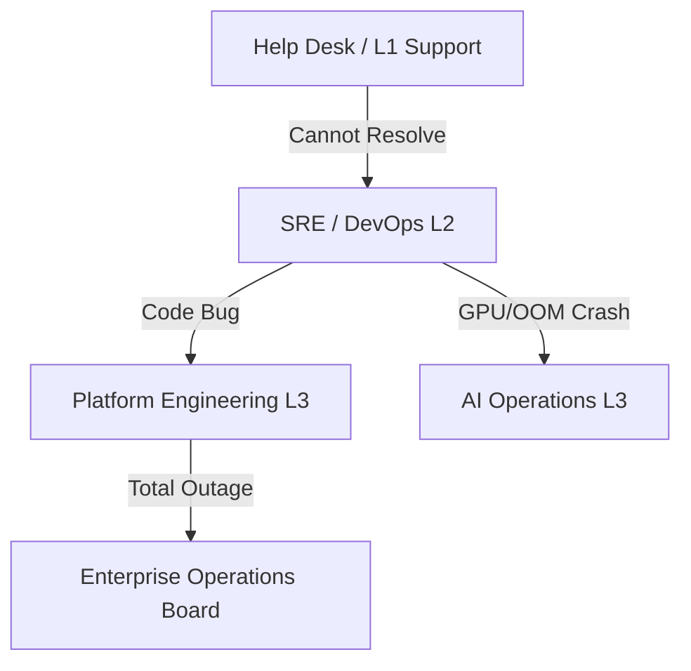
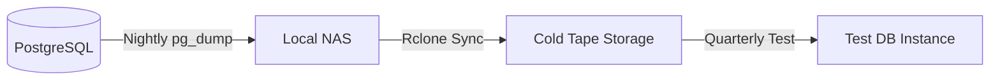

# ENTERPRISE OPERATIONS MANUAL

## DOCUMENT CONTROL
| Document ID | FACULTYIQ-OPS-001 |
|---|---|
| **Version** | 1.0.0 |
| **Status** | **APPROVED / BINDING** |
| **Classification** | Enterprise Confidential |
| **Owner** | Enterprise Operations Board |

> [!CAUTION]
> **AUTHORITATIVE OPERATIONS SPECIFICATION**
> This manual defines the exact procedures for resolving outages (Runbooks), executing database backups, and managing AI Hallucination incidents. Under no circumstances may an SRE bypass Change Management protocols to hot-patch Production, unless executing an approved Sev-1 Disaster Recovery runbook.

---

## 1 Executive Summary

### 1.1 Purpose
The Enterprise Operations Manual provides the standard operating procedures (SOPs) necessary to maintain 99.9% uptime for the FacultyIQ platform.

### 1.2 Operations Philosophy
- **Reliability Driven**: We treat operations as a software problem. If a task is performed manually three times, it MUST be automated via an SRE script.
- **Offline First Preparedness**: The platform must survive complete isolation from the public internet. Runbooks SHALL NOT rely on external SaaS tools (like downloading a recovery script from GitHub) during a crisis.

---

## 2 Operations Organization

### 2.1 Escalation Matrix

### 2.2 Roles
- **AI Operations**: A specialized SRE role responsible for monitoring GPU VRAM, managing Ollama processes, and updating Qdrant vector indices.

---

## 3 Daily Operations

- **08:00 AM Health Verification**: L1 Support reviews the Grafana "Morning Health" dashboard.
- **Queue Monitoring**: Verify RabbitMQ `q.resume.parse` depth is < 50.
- **AI Model Verification**: Send a test ping to `localhost:11434/api/tags` to ensure the local Ollama daemon is responsive.

---

## 4 Operational Checklists

### 4.1 Release Checklist
Prior to any Friday deployment:
- [ ] Database backup taken (`pg_dump`).
- [ ] Redis cache flush script staged.
- [ ] New Docker images pulled to the local registry.
- [ ] Feature Flags configured for Dark Launch.

---

## 5 System Administration

- **User Management**: Active Directory groups automatically sync to FacultyIQ Roles (`Recruiter`, `Admin`). Manual permission overrides via the Admin UI are flagged for weekly Security Operations review.
- **Feature Flags**: Managed via the internal ASP.NET Core Feature Management library. Flags must be removed from the codebase within 30 days of 100% rollout to prevent technical debt.

---

## 6 AI Operations

- **Model Updates**: Downloading a new SLM (e.g., transitioning from Qwen2.5 3B to 7B) requires a 4-hour scheduled maintenance window due to the VRAM allocation shift and the subsequent warm-up period.
- **Fallback Verification**: If the GPU fails, AI Operations MUST verify the system successfully downgraded to CPU-based heuristic parsing.

---

## 7 Database Operations

- **Vacuum**: PostgreSQL `VACUUM ANALYZE` runs automatically, but SREs must manually trigger a `VACUUM FULL` during the Winter Break maintenance window to reclaim disk space from Candidate soft-deletes.
- **Backup**: `pg_basebackup` runs nightly. WAL (Write-Ahead Logs) are archived every 5 minutes to MinIO.

---

## 8 RabbitMQ Operations

- **Dead Letter Queues (DLQ)**: If a message hits the DLQ, it triggers a PagerDuty alert.
- **Maintenance**: Upgrading RabbitMQ Erlang versions requires spinning up a new node, joining the cluster, migrating the Quorum Queues, and safely draining the old node.

---

## 9 Docker Operations

- **Container Lifecycle**: Containers are immutable. SREs SHALL NOT `docker exec` into a container to install patches. The image must be rebuilt and redeployed.
- **Volume Management**: Persistent volumes (MinIO data, PostgreSQL data) are mounted to redundant RAID arrays.

---

## 10 Monitoring Operations

- **Incident Detection**: Prometheus scrapes metrics every 15 seconds. If `http_requests_total{status="500"}` spikes above 5% over a 1-minute rolling window, a Sev-2 incident is automatically declared.

---

## 11 Backup Operations

- **Restore Testing**: A full restoration of the production database into an isolated staging environment is mandated quarterly. The time to restore is measured and reported as a KPI.

---

## 12 Incident Management

| Severity | Definition | Response SLA | Resolution Target |
|---|---|---|---|
| **Sev-1** | Total system outage. Cannot upload resumes. | 15 Mins | 2 Hours |
| **Sev-2** | AI inference is down; system running on fallbacks. | 30 Mins | 4 Hours |
| **Sev-3** | Individual candidate profile glitch. | 4 Hours | Next Business Day|
| **Sev-4** | Cosmetic UI bug. | 24 Hours | Next Sprint |

---

## 13 Problem Management

- **Root Cause Analysis (RCA)**: A blameless RCA document is required for all Sev-1 and Sev-2 incidents within 72 hours of resolution. It must utilize the "5 Whys" methodology.

---

## 14 Change Management

- **Emergency Changes**: Can bypass the Change Advisory Board (CAB) if approved by the Operations Manager on duty, but must be retroactively documented within 24 hours.

---

## 15 Release Operations

- **Rollback**: Every deployment must have a documented rollback plan. If Database Migrations are involved, the rollback plan must specify if the schema changes are backward-compatible.

---

## 16 Performance Operations

- **Capacity Planning**: If GPU VRAM utilization averages > 85% for a week, SREs must procure and provision a new node before the start of the next hiring cycle.

---

## 17 Security Operations

- **Certificate Rotation**: Internal TLS certificates (securing traffic between ASP.NET Core and Postgres) are rotated every 90 days via automated shell scripts.

---

## 18 AI Incident Operations

- **Hallucination Events**: If a recruiter reports that the AI completely hallucinated a skill (e.g., claimed the candidate knew "React" when the resume said "Nuclear Reactor"), AI Operations must immediately pull the Prompt Hash and the Raw Text Chunk to reproduce the error locally.

---

## 19 Disaster Recovery Operations

- **Recovery Priorities**: 
  1. Identity / Authentication (Active Directory Link)
  2. Database (PostgreSQL)
  3. UI / Backend API (Next.js / .NET)
  4. Blob Storage (MinIO)
  5. AI Inference (Python Workers) - *Lowest priority, as the system can operate without AI.*

---

## 20 Operational Runbooks

### 20.1 SOP-001: Resume Pipeline Failure
- **Symptom**: Resumes are uploaded, but remain stuck in "Processing" state.
- **Step 1**: Check RabbitMQ `q.resume.parse` for backup.
- **Step 2**: If queue is backed up, check Docker status of the `facultyiq-worker-resume` container.
- **Step 3**: Check container logs for `CUDA Out of Memory`.
- **Step 4**: Restart container. If failure repeats, purge queue to DLQ and investigate poison PDF.

---

## 21 SLA and SLO Management

- **Availability Target**: 99.9% uptime during business hours (08:00 to 18:00). Planned maintenance happens exclusively on Sundays at 02:00 AM.

---

## 22 Operational Reporting

- **Monthly Reports**: The Operations Board reviews the MTTR (Mean Time to Recovery) and MTBF (Mean Time Between Failures) metrics on the first Monday of every month.

---

## 23 Continuous Improvement

- **Chaos Engineering**: Annually, SREs intentionally kill the RabbitMQ container in the Staging environment to verify that the C# API Outbox pattern successfully queues messages in PostgreSQL until RabbitMQ recovers.

---

## 24 Architecture Decision Records

- **ADR-OPS-001: Immutable Infrastructure**
  - *Decision*: Host servers will not be patched via SSH. They will be destroyed and rebuilt using Infrastructure as Code (Ansible/Terraform).
  - *Context*: Prevents configuration drift across the 4 environments (Dev, Test, Staging, Prod).

---

## 25 Traceability Matrix

| Operational Process | System Component | Runbook | SLA Target |
|---|---|---|---|
| Database Failover | PostgreSQL | SOP-DB-02 | < 5 minutes |
| GPU Restart | Ollama | SOP-AI-01 | < 10 minutes |

---

## 26 Future Evolution

- **Self-Healing Infrastructure**: Implementing automated Kubernetes operators that detect frozen AI Python workers and restart them without human SRE intervention.

---

## 27 Glossary

- **SRE**: Site Reliability Engineering. Applying software engineering practices to operations.
- **MTTR**: Mean Time To Recovery.

---

## 28 Revision History

| Version | Date | Status | Approvals |
|---|---|---|---|
| **1.0.0** | 2026-07-19 | **APPROVED** | Enterprise Operations Board |
