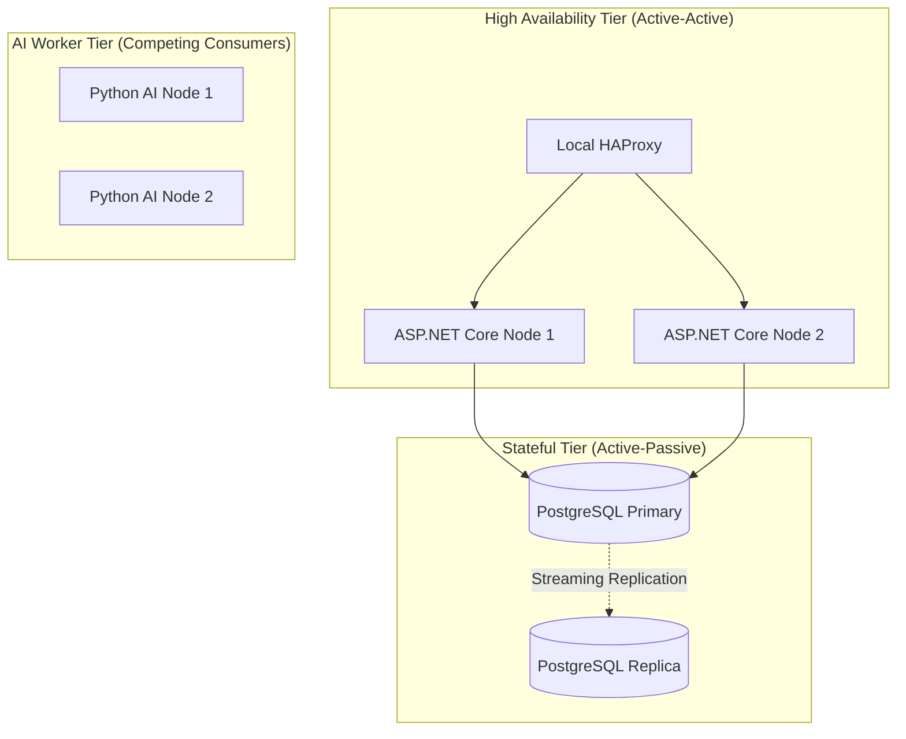
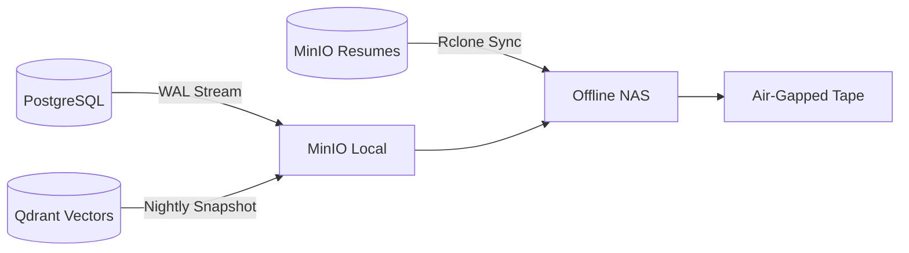
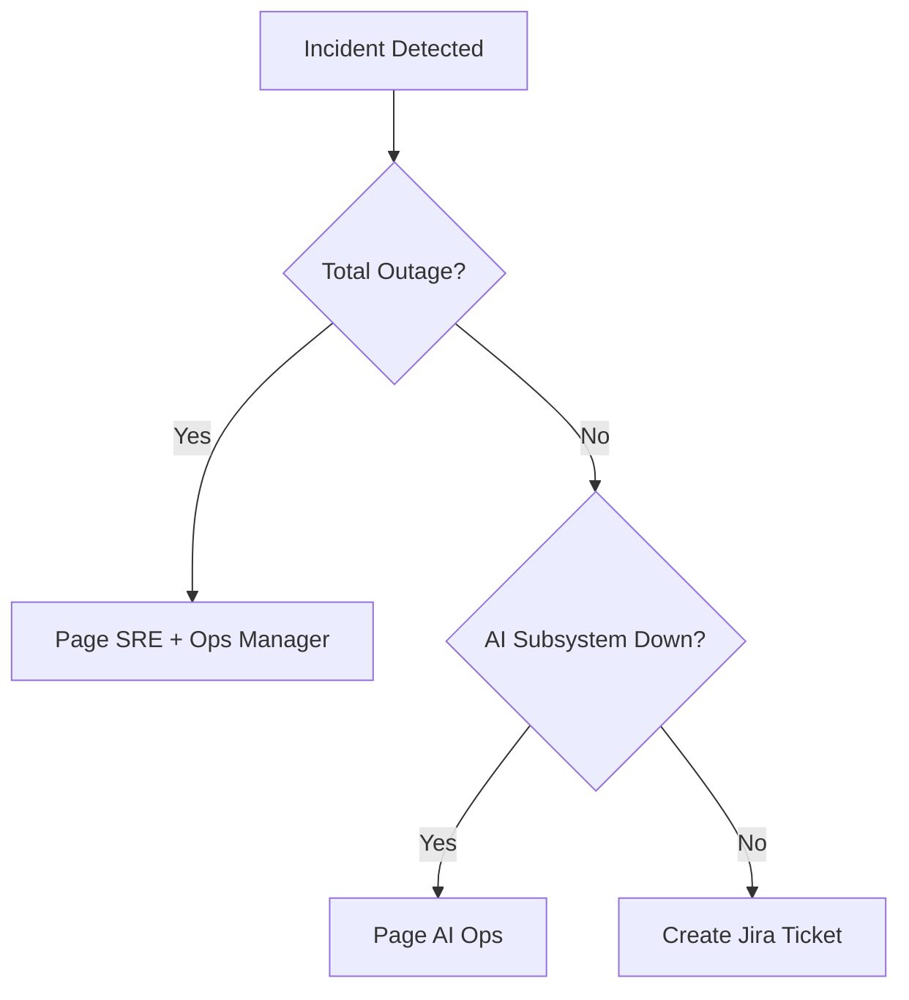

# DISASTER RECOVERY, BUSINESS CONTINUITY, AND RESILIENCE ARCHITECTURE

## DOCUMENT CONTROL
| Document ID | FACULTYIQ-DR-001 |
|---|---|
| **Version** | 1.0.0 |
| **Status** | **APPROVED / BINDING** |
| **Classification** | Enterprise Confidential |
| **Owner** | Business Continuity and Resilience Board |

> [!CAUTION]
> **AUTHORITATIVE RESILIENCE SPECIFICATION**
> This document defines the exact Recovery Time Objectives (RTO), Recovery Point Objectives (RPO), and Disaster Recovery workflows for FacultyIQ. All system architecture must support the Offline-First continuity mandate. Graceful degradation is mandatory: if the AI models fail, the core application MUST remain available for manual human recruitment.

---

## 1 Executive Summary

### 1.1 Purpose
The Resilience Architecture guarantees that FacultyIQ can withstand, adapt to, and rapidly recover from internal component failures, external network partitions, and total data center outages.

### 1.2 Resilience Vision
- **Assume Failure**: Hardware will burn out, GPUs will exhaust memory, and network switches will drop packets. The architecture must self-heal.
- **Offline First Preparedness**: The platform must be recoverable without relying on external cloud endpoints (e.g., pulling Docker images from DockerHub during a WAN outage). All dependencies must be mirrored locally.

---

## 2 Resilience Principles

1. **Graceful Degradation**: If the high-parameter SLM (Qwen2.5 3B) fails, the system falls back to a simpler, faster heuristic model. If that fails, it falls back to manual human review. The UI must never crash.
2. **Fault Isolation (Bulkheads)**: A poison message crashing the `Resume Parsing Worker` MUST NOT impact the `Interview Scoring Worker`.
3. **Recovery by Design**: Databases are backed up using Continuous Archiving (WAL) to allow Point-in-Time Recovery (PITR) down to the millisecond.

---

## 3 Enterprise Resilience Architecture

---

## 4 Business Continuity Strategy

### 4.1 Business Impact Analysis (BIA)
| Critical Business Process | Impact of Outage | RTO | RPO |
|---|---|---|---|
| Job Requisition Creation | Medium | 12 Hours | 1 Hour |
| Candidate Application (UI) | High | 4 Hours | 5 Mins |
| AI Resume Parsing | Low | 24 Hours | N/A (Reprocessable) |

---

## 5 Disaster Recovery Strategy

- **Recovery Site**: A "Cold Site" is maintained in a geographically separate on-premise data center.
- **Recovery Level 1 (Component Failure)**: Auto-healed by Docker/Kubernetes restarts.
- **Recovery Level 2 (Node Failure)**: Traffic routes to HA redundant nodes.
- **Recovery Level 3 (Site Failure)**: Manual DNS cutover to the DR Cold Site and tape restoration.

---

## 6 High Availability

- **Application Redundancy**: ASP.NET Core APIs are stateless and deployed with a minimum of 3 replicas.
- **Queue Redundancy**: RabbitMQ utilizes Quorum Queues, requiring at least 3 broker nodes to maintain a Raft consensus. If 1 node dies, message delivery continues uninterrupted.

---

## 7 Backup Architecture

- **Prompt Backups**: AI System Prompts are stored as records in PostgreSQL, ensuring they are backed up synchronously with the transaction data.

---

## 8 Recovery Procedures

- **Database Recovery (PITR)**: To recover from a dropped table (Human Error), the DBA utilizes `pg_waldump` and `pg_restore` to rebuild the database to the exact millisecond before the `DROP` command was issued.
- **Knowledge Recovery**: If Qdrant is completely corrupted, it is NOT restored from tape. Instead, a CLI command is executed to force the Python workers to re-chunk and re-embed all Rubrics from the primary PostgreSQL database, ensuring absolute consistency.

---

## 9 Failure Scenarios

### 9.1 CUDA Out of Memory (OOM)
- **Detection**: Python worker logs `RuntimeError: CUDA out of memory`.
- **Response**: Worker intentionally crashes (Fail Fast). Docker restarts the container.
- **Resilience**: The RabbitMQ message is NACK'd and returned to the queue. When the container restarts, it attempts processing again.

### 9.2 Split-Brain Network Partition
- **Scenario**: Network link between RabbitMQ Node 1 and Node 2 severs.
- **Response**: Quorum Queues pause writes on the minority partition, protecting data consistency over availability (CP in CAP theorem).

---

## 10 Incident Classification

---

## 11 Recovery Automation

- **Health Checks**: Every container exposes an `/health` endpoint. If the endpoint returns HTTP 500 three consecutive times, the orchestrator issues a `SIGKILL` and spins up a fresh container.

---

## 12 Data Integrity

- **Checksum Validation**: All PDF resumes uploaded to MinIO are hashed (SHA-256). The hash is stored in Postgres. During quarterly DR testing, a script verifies that the recovered MinIO blobs perfectly match the Postgres hashes.

---

## 13 AI Resilience

- **Graceful AI Degradation**:
  1. Primary Model (e.g., Qwen2.5 3B via GPU) times out after 30 seconds.
  2. Circuit Breaker opens.
  3. API automatically routes the inference request to a lighter, CPU-bound heuristic parser.
  4. The UI displays an alert: *"AI Evaluation running in degraded mode."*

---

## 14 Messaging Resilience

- **Event Reconstruction**: If the RabbitMQ broker disk is physically destroyed, the system can rebuild the queues by scanning the PostgreSQL `Outbox` table for all messages marked `Status = 'Pending'`.

---

## 15 Infrastructure Recovery

- **Host Recovery**: Physical servers are treated as cattle. If a Linux host's OS corrupts, SREs PXE-boot a fresh image and re-apply configuration via Ansible playbooks stored in the local Git server.

---

## 16 Security During Disasters

- **Emergency Access**: "Break Glass" administrative accounts are stored in an offline, physical safe. Their usage triggers an immediate SMS alert to the CISO.
- **Audit Continuity**: During a disaster, if the central ELK logging stack is down, applications MUST fall back to logging to local disk to preserve the forensic trail.

---

## 17 Business Continuity Testing

- **Chaos Engineering**: On the 1st of every month, an automated script randomly terminates 10% of the active Docker containers in the Production environment to prove that the High Availability architecture self-heals without impacting end users.

---

## 18 Crisis Communication

- **Communication Matrix**: In the event of a Sev-1 Outage, the Ops Manager must email the `Executive_Deans` mailing list within 30 minutes, providing the current status and estimated Time to Recovery.

---

## 19 Capacity Resilience

- **Knowledge Growth Forecasting**: Qdrant vector storage requirements grow linearly with the number of department rubrics. A Prometheus alert fires if Qdrant disk space reaches 70%, allowing procurement time for new drives before an outage occurs.

---

## 20 Operational Runbooks

- **SOP-DR-01: Disaster Declaration**: Only the VP of IT or the Enterprise Operations Board can formally declare a "Disaster", initiating the shift from local HA failovers to the secondary Cold Site.

---

## 21 Service Level Objectives (SLOs)

- **Platform Availability**: 99.9% (Maximum downtime of 43.8 minutes per month).
- **AI Inference RTO**: 4 Hours.
- **Relational Data RPO**: 5 Minutes.

---

## 22 Architecture Decision Records

- **ADR-RES-001: Quorum Queues over Classic Mirrored Queues**
  - *Decision*: RabbitMQ will use Quorum Queues.
  - *Context*: Classic mirrored queues are prone to data loss during network partitions. Quorum Queues use Raft consensus, mathematically guaranteeing consistency during network failures.

---

## 23 Traceability Matrix

| Failure Scenario | Recovery Procedure | Target RTO | Monitoring Alert |
|---|---|---|---|
| Primary Postgres Failure | Promote Replica to Primary | 5 Minutes | `pg_down` |
| Ollama GPU Hang | Docker Container Restart | 2 Minutes | `ollama_timeout` |

---

## 24 Future Evolution

- **Multi-Region Active-Active**: When the University expands to a second data center, the architecture will evolve to synchronous CockroachDB/YugabyteDB replication to achieve an RPO of 0 across physical sites.

---

## 25 Glossary

- **RTO (Recovery Time Objective)**: The maximum acceptable length of time that a computer, system, network, or application can be down after a failure.
- **RPO (Recovery Point Objective)**: The maximum acceptable amount of data loss measured in time (e.g., losing the last 5 minutes of data).
- **Chaos Engineering**: The discipline of experimenting on a software system in production in order to build confidence in the system's capability to withstand turbulent and unexpected conditions.

---

## 26 Revision History

| Version | Date | Status | Approvals |
|---|---|---|---|
| **1.0.0** | 2026-07-19 | **APPROVED** | Business Continuity and Resilience Board |
