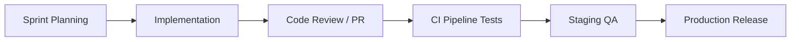
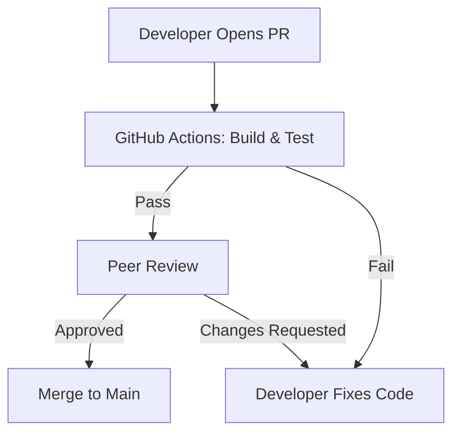

# SOFTWARE DEVELOPMENT LIFECYCLE AND ENGINEERING STANDARDS

## DOCUMENT CONTROL
| Document ID | FACULTYIQ-SDLC-001 |
|---|---|
| **Version** | 1.0.0 |
| **Status** | **APPROVED / BINDING** |
| **Classification** | Enterprise Confidential |
| **Owner** | Engineering Excellence Board |

> [!CAUTION]
> **AUTHORITATIVE ENGINEERING SPECIFICATION**
> This document dictates the exact Git workflows, Pull Request requirements, and coding standards for all FacultyIQ engineers. Bypassing CI/CD Quality Gates or merging code without the required approvals is grounds for formal disciplinary review. 

---

## 1 Executive Summary

### 1.1 Purpose
The SDLC and Engineering Standards ensure that FacultyIQ's codebase remains scalable, secure, and maintainable over a multi-decade lifespan, avoiding the typical decay of enterprise software.

### 1.2 Engineering Vision
- **Quality First**: Testing is not an afterthought; it is the primary driver of architecture (TDD).
- **Automation Everywhere**: If a developer performs a task twice, it MUST be automated via a script or CI/CD pipeline step.

---

## 2 Engineering Principles

1. **SOLID**: All Object-Oriented code (C#) MUST adhere to SOLID principles, primarily the Single Responsibility Principle.
2. **KISS & YAGNI**: Keep It Simple, Stupid. You Aren't Gonna Need It. Do not over-engineer abstractions for hypothetical future use cases.
3. **Clean Code**: Code is read 10x more than it is written. Optimize for readability over cleverness.

---

## 3 Software Development Lifecycle



---

## 4 Development Workflow

- **Sprint Planning**: 2-week sprints. All Jira tickets must be sized using story points. No ticket should take longer than 3 days; if it does, it must be broken down further.
- **Definition of Done (DoD)**:
  - Code compiles without warnings.
  - Unit Test coverage is > 80%.
  - PR approved by at least 1 Senior Engineer.
  - Deployed to Staging environment successfully.

---

## 5 Engineering Organization

- **Backend Engineers (.NET)**: Responsible for Domain logic, API controllers, and EF Core migrations.
- **AI Engineers (Python)**: Responsible for integrating with local Ollama models, writing LangChain pipelines, and evaluating prompt accuracy.
- **Frontend Engineers (React)**: Responsible for UI/UX implementation using Tailwind and shadcn/ui.

---

## 6 Coding Standards

### 6.1 C# & ASP.NET Core
- Enforced via `.editorconfig`.
- Use `PascalCase` for classes/methods, `camelCase` for local variables, and `_camelCase` for private fields.
- Interfaces MUST start with `I` (e.g., `IResumeService`).

### 6.2 Python
- Enforced via `ruff` and `black`.
- Maximum line length is 88 characters.
- Type hints are MANDATORY for all function signatures.

---

## 7 Solution Structure

FacultyIQ adheres to **Clean Architecture**.

```text
src/
├── FacultyIQ.Domain/         (No external dependencies)
├── FacultyIQ.Application/    (Use Cases / CQRS Handlers)
├── FacultyIQ.Infrastructure/ (EF Core / RabbitMQ / MinIO)
├── FacultyIQ.Api/            (ASP.NET Core Controllers)
```
*Rule: Infrastructure can reference Application, but Application MUST NEVER reference Infrastructure.*

---

## 8 Git Standards

### 8.1 Branching Strategy (GitHub Flow)
- `main`: The eternal, deployable production branch.
- `feature/TICKET-123-short-desc`: Feature branches branch off `main` and merge back via PR.
- `hotfix/TICKET-999-desc`: Emergency fixes branched directly from `main`.

### 8.2 Commit Standards
- Commits MUST follow Conventional Commits specification:
  - `feat(api): add candidate parsing endpoint`
  - `fix(ui): correct modal overflow bug`

---

## 9 Code Review Standards

### 9.1 Pull Request Workflow


- **Approval Rules**: 
  - 1 Approval required for non-critical services.
  - 2 Approvals (including 1 from a Security Champion) required for Identity/Auth modules.

---

## 10 Documentation Standards

- **Code Comments**: Do NOT write comments explaining *what* the code does (the code should be self-documenting). Write comments explaining *why* a specific, non-obvious business decision was made.
- **ADRs**: Architectural Decision Records are stored in `docs/architecture/decisions/`.

---

## 11 Dependency Management

- **Version Pinning**: All dependencies in `package.json`, `.csproj`, and `requirements.txt` MUST be pinned to specific versions to guarantee deterministic builds.
- **Security Validation**: `Dependabot` or `Renovate` runs weekly to detect CVEs in third-party libraries.

---

## 12 Configuration Standards

- **Options Pattern**: ASP.NET Core MUST use the strongly typed `IOptions<T>` pattern. Raw string lookups via `IConfiguration["Key"]` are forbidden.
- **Secrets**: Passwords, API Keys, and Connection Strings SHALL NEVER be committed to Git. They must be injected via Environment Variables or an offline secure Vault.

---

## 13 Error Handling Standards

- **RFC 7807**: All REST APIs MUST return errors using the `ProblemDetails` standard format.
- **Global Exception Middleware**: ASP.NET Core catches all unhandled exceptions, logs the StackTrace internally, and returns a generic 500 error to the client with a `TraceId` to prevent information leakage.

---

## 14 Logging Standards

- **Structured Logging**: All logs are written in JSON format via Serilog.
- **Correlation IDs**: Every incoming HTTP request is assigned a `TraceId` (W3C standard), which is passed down through RabbitMQ messages to the Python workers to enable distributed end-to-end tracing.

---

## 15 Performance Engineering

- **N+1 Query Prevention**: Entity Framework Core queries MUST utilize `.Include()` or `.AsSplitQuery()` to prevent N+1 performance degradation on deep object graphs.
- **Async All The Way**: All I/O operations (Database, File System, Network) MUST use `async/await`. Synchronous blocking calls (`.Result`) are forbidden.

---

## 16 Secure Development

- **OWASP Top 10**: All engineers undergo annual OWASP training.
- **Input Validation**: Executed strictly at the API controller boundary using FluentValidation (C#) and Zod (TypeScript).

---

## 17 AI-Assisted Development

- **GitHub Copilot**: Approved for usage.
- **Governance**: Developers remain 100% legally and functionally responsible for any code generated by an AI. "The AI wrote it" is not a valid defense for a bug or a security vulnerability.
- **Validation**: All AI-generated code MUST have accompanying human-written unit tests.

---

## 18 Testing Standards

- **Unit Testing**: Tests the smallest unit of code in isolation (Mocking DBs). (Target: 80% coverage).
- **Integration Testing**: Uses `Testcontainers` to spin up ephemeral Postgres and RabbitMQ Docker instances to test the actual data access layer.
- **AI Testing**: Prompt evaluations are managed via the framework defined in the AI Evaluation Architecture (Document 14).

---

## 19 Build Standards

- **Quality Gates**: SonarQube runs on every PR. If the "Technical Debt Ratio" exceeds 5%, the PR is blocked.
- **Artifacts**: Docker images are the only acceptable release artifact. They are tagged with the Git SHA (`registry/facultyiq-api:a1b2c3d`).

---

## 20 Release Engineering

- **Deployment**: Handled exclusively via CI/CD pipelines (e.g., GitHub Actions / GitLab CI). Developers do NOT have SSH access to Production to manually deploy code.
- **Rollback**: Every deployment must be capable of a 1-click rollback to the previous Docker image tag.

---

## 21 Technical Debt Management

- **Tracking**: Tracked in Jira using the `Technical Debt` issue type.
- **Governance**: If Technical Debt exceeds acceptable thresholds (measured by SonarQube), the Engineering Director can declare a "Hardening Sprint" where no new features are built.

---

## 22 Engineering Metrics

- **DORA Metrics**:
  - **Deployment Frequency**: Target is multiple times per week.
  - **Lead Time for Changes**: Target is < 48 hours from commit to production.
  - **Change Failure Rate**: Target is < 5%.
  - **Time to Restore Service**: Target is < 2 hours.

---

## 23 Continuous Improvement

- **Retrospectives**: Conducted at the end of every 2-week Sprint.
- **Blameless Culture**: Post-mortems focus on identifying systemic failures in the CI/CD pipeline or testing strategy, rather than punishing individual engineers.

---

## 24 Architecture Decision Records

- **ADR-ENG-001: Trunk-Based Development vs GitFlow**
  - *Decision*: Adopt GitHub Flow (Short-lived feature branches merging into `main`).
  - *Context*: GitFlow is too heavy for a Continuous Deployment pipeline. Short-lived branches prevent massive merge conflicts.

---

## 25 Traceability Matrix

| Requirement | Implementation | Testing | Validation |
|---|---|---|---|
| Offline AI | Python Worker | PyTest (Integration) | SonarQube Gate |
| GDPR Delete | C# CQRS Handler | xUnit (Unit) | PR Review |

---

## 26 Future Evolution

- **Autonomous Code Reviews**: Integrating local LLMs into the CI pipeline to perform first-pass security and style reviews before a human reviewer is assigned.

---

## 27 Glossary

- **CI/CD**: Continuous Integration / Continuous Deployment.
- **DORA**: DevOps Research and Assessment metrics.
- **SOLID**: Five design principles intended to make software designs more understandable, flexible, and maintainable.

---

## 28 Revision History

| Version | Date | Status | Approvals |
|---|---|---|---|
| **1.0.0** | 2026-07-19 | **APPROVED** | Engineering Excellence Board |
