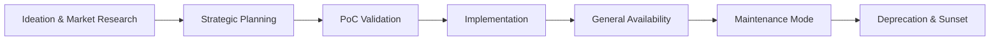
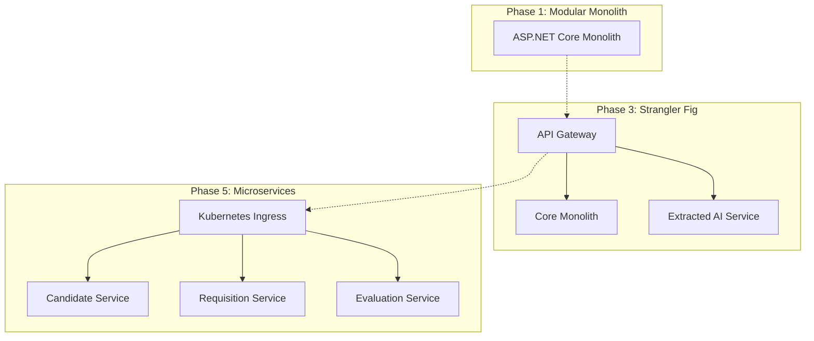

# PRODUCT EVOLUTION, MAINTENANCE, AND ROADMAP

## DOCUMENT CONTROL
| Document ID | FACULTYIQ-ROADMAP-001 |
|---|---|
| **Version** | 1.0.0 |
| **Status** | **APPROVED / BINDING** |
| **Classification** | Enterprise Confidential |
| **Owner** | Product Strategy & Enterprise Architecture Council |

> [!CAUTION]
> **AUTHORITATIVE ROADMAP SPECIFICATION**
> This document defines the official multi-year evolution of FacultyIQ. No feature, architecture migration, or AI model upgrade may be prioritized on the engineering backlog unless it maps directly to one of the strategic phases defined in this Roadmap.

---

## 1 Executive Summary

### 1.1 Purpose
The Product Evolution, Maintenance, and Roadmap specification establishes how FacultyIQ will mature over the next decade. It ensures the platform remains technologically relevant, operationally stable, and aligned with the University's long-term talent acquisition strategy.

### 1.2 Technology Vision
- **Evolutionary Architecture**: The system is designed to embrace change. We start with a Modular Monolith for speed and cohesion, strategically extracting bounded contexts into microservices only when scaling bottlenecks dictate.

---

## 2 Product Philosophy

1. **Incremental Delivery**: We deliver value in thin, vertical slices. "Big Bang" releases are strictly forbidden.
2. **Backward Compatibility**: Core APIs must support an N-2 versioning strategy to ensure external integrations (like Workday ERP) do not break during platform upgrades.
3. **Research Enablement**: The platform must capture high-fidelity metadata (e.g., Prompt Hashes, Inference Latency) to enable internal academic research on AI-assisted hiring bias.

---

## 3 Product Lifecycle

---

## 4 Product Roadmap

### 4.1 Phase 1: MVP (Year 1)
- **Focus**: Local deployment, core Resume Parsing using local Qwen2.5 3B, offline-first compliance.
- **Goal**: End-to-end recruitment pipeline for the Computer Science department.

### 4.2 Phase 2: Enterprise (Year 2)
- **Focus**: Integrating with the University ERP (Workday/Banner) via RabbitMQ.
- **Goal**: Rollout to all STEM departments. Implementation of Role-Based Access Control (RBAC).

### 4.3 Phase 3: AI Expansion (Year 3)
- **Focus**: Multi-modal AI (Video interview analysis, GitHub repository analysis).
- **Goal**: Full university rollout. Implementation of automated Bloom's Taxonomy rubrics.

### 4.4 Phase 4: Multi-Institution (Year 4)
- **Focus**: Multi-tenant architecture (logical database separation).
- **Goal**: Onboarding sister universities within the state system.

### 4.5 Phase 5: SaaS (Year 5+)
- **Focus**: Cloud-Native migration. Kubernetes orchestration.
- **Goal**: Launching FacultyIQ as a commercial SaaS product for higher education globally.

---

## 5 Feature Evolution Strategy

- **Feature Flags**: All new features MUST be wrapped in a feature flag. This enables A/B testing, Dark Launching, and instant kill-switches if an AI feature hallucinates in production.
- **Deprecation**: Features with < 5% adoption over a 6-month period enter a Deprecation Review to reduce codebase bloat.

---

## 6 Technology Evolution

- **ASP.NET Core**: Upgrades to the latest Long Term Support (LTS) version occur within 6 months of Microsoft's release.
- **Next.js**: The frontend team upgrades React/Next.js dependencies annually to leverage compiler optimizations (e.g., Turbopack).
- **PostgreSQL**: Evolution involves migrating from basic partitioned tables to Citus (distributed PostgreSQL) during Phase 5 (SaaS).

---

## 7 AI Evolution Strategy

- **Model Retirement**: Local SLMs (Small Language Models) age rapidly. A model is marked for retirement when an open-weights alternative achieves a 15% higher score on the internal FacultyIQ Benchmark Dataset while maintaining equal or lower VRAM constraints.
- **Knowledge Evolution**: Qdrant vector dimensions must remain consistent. If the embedding model is upgraded (e.g., transitioning to a 1024-dimension model), all historical rubrics must be re-embedded in a background migration job.

---

## 8 Architecture Evolution

### 8.1 Strangler Fig Pattern (Monolith to Microservices)

---

## 9 Data Evolution

- **Schema Versioning**: Handled exclusively via Entity Framework Core Migrations.
- **Archiving**: Resumes older than 2 years are moved from hot MinIO storage to cold AWS S3 Glacier (or local offline tape) to control storage costs.

---

## 10 API Evolution

- **Versioning**: URIs include the version (e.g., `/api/v1/candidates`).
- **Consumer Communication**: Deprecation of a v1 API requires 6 months' notice to all internal and external consumers before the endpoints return HTTP 410 Gone.

---

## 11 Security Evolution

- **Zero Trust Enhancements**: Transitioning from network-perimeter security (VPNs) to identity-aware proxies (e.g., BeyondCorp model) for all administrative interfaces.
- **AI Security**: Expanding Prompt Injection firewalls as attack vectors against local SLMs become more sophisticated.

---

## 12 DevOps Evolution

- **GitOps Readiness**: Moving away from imperative CI/CD pipelines (Jenkins) to declarative GitOps (ArgoCD), where the state of the Kubernetes cluster is defined entirely by the Git repository.

---

## 13 UX Evolution

- **Progressive Web App (PWA)**: Transforming the Next.js frontend into an installable PWA for offline-capable mobile reviewing by Department Heads.
- **Voice Interfaces**: Exploring Speech-to-Text integration to allow Recruiters to dictate interview feedback directly into the platform.

---

## 14 Scalability Roadmap

| Metric | Phase 1 (MVP) | Phase 3 (Expansion) | Phase 5 (SaaS) |
|---|---|---|---|
| Concurrent Users | 50 | 500 | 10,000 |
| AI Inference RPS | 2 | 20 | 500 |
| Storage | 500 GB | 5 TB | 100 TB |

---

## 15 Maintenance Strategy

- **Preventive**: Monthly dependency scanning and patching (Dependabot/Renovate).
- **Corrective**: Hotfixes deployed via the `hotfix` branching strategy.
- **Maintenance Windows**: Fixed to Sundays between 02:00 AM and 04:00 AM local time.

---

## 16 Technical Debt Strategy

- **Measurement**: SonarQube's "Technical Debt Ratio".
- **Investment Strategy**: Product Owners MUST dedicate 20% of every Sprint's story points to non-functional requirements (Refactoring, Tech Debt, Security).

---

## 17 Innovation Management

- **Technology Radar**: Maintained by the Architecture Board (Categorized into: *Adopt, Trial, Assess, Hold*).
- **Proof of Concepts (PoCs)**: Time-boxed to 2 weeks. Must answer a specific technical hypothesis (e.g., "Can Llama 3 8B run fast enough on our current VRAM limits?").

---

## 18 Product Governance

- **Stakeholder Management**: The Product Steering Committee meets quarterly to review roadmap progress against the allocated budget.
- **Feature Approval**: Requires sign-off from the CISO (for security) and the Chief AI Officer (for bias mitigation).

---

## 19 Product Metrics

- **Engineering Velocity**: Measured by Lead Time for Changes (Commit to Production).
- **AI Accuracy**: Correlating AI Confidence Scores with final human hiring decisions.

---

## 20 Risk Management

- **Vendor Risk**: Mitigated by the Offline-First mandate. If OpenAI raises prices or changes their API, FacultyIQ is immune because it relies strictly on local open-weights models (Ollama).

---

## 21 Future Vision

- **Multi-Agent Collaboration**: Evolving from single-agent processing to a swarm of AI agents (e.g., a "Diversity Agent", a "Technical Agent", a "Culture Fit Agent") that debate a candidate's merits before presenting a final unified recommendation to the human recruiter.

---

## 22 Architecture Decision Records

- **ADR-ROAD-001: Modular Monolith First**
  - *Decision*: Start with a Modular Monolith instead of Microservices.
  - *Context*: The "Microservice Premium" (operational complexity) is too high for Phase 1. Strict domain boundaries within the Monolith allow for easy extraction in Phase 5.

---

## 23 Traceability Matrix

| Vision | Phase | Initiative | Architectural Enabler |
|---|---|---|---|
| Enterprise Scaling | Phase 2 | Workday Integration | RabbitMQ Event Bus |
| SaaS Transition | Phase 5 | Multi-Tenancy | Kubernetes + Citus DB |

---

## 24 Glossary

- **Strangler Fig Pattern**: Incrementally migrating a legacy system by gradually replacing specific pieces of functionality with new applications and services.
- **Dark Launching**: Releasing a feature to production but hiding it from users via a Feature Flag to test backend load.

---

## 25 Revision History

| Version | Date | Status | Approvals |
|---|---|---|---|
| **1.0.0** | 2026-07-19 | **APPROVED** | Product Strategy & Enterprise Architecture Council |
