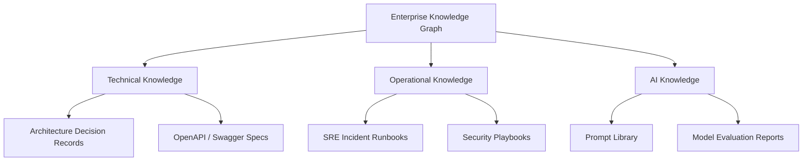
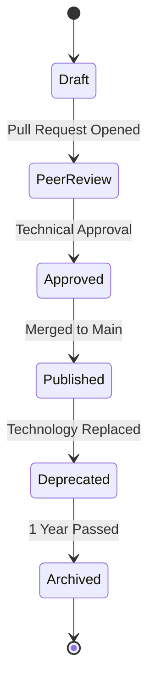

# ENTERPRISE KNOWLEDGE MANAGEMENT AND DOCUMENTATION FRAMEWORK

## DOCUMENT CONTROL
| Document ID | FACULTYIQ-KM-001 |
|---|---|
| **Version** | 1.0.0 |
| **Status** | **APPROVED / BINDING** |
| **Classification** | Enterprise Confidential |
| **Owner** | Enterprise Knowledge Governance Board |

> [!CAUTION]
> **AUTHORITATIVE KNOWLEDGE SPECIFICATION**
> This document dictates how knowledge is captured, formatted, reviewed, and preserved across FacultyIQ. "Documentation First" is a strict mandate. Code merged without corresponding documentation updates (e.g., updating ADRs or Runbooks) is considered incomplete and will be rejected at the CI/CD Quality Gates.

---

## 1 Executive Summary

### 1.1 Purpose
The Enterprise Knowledge Management and Documentation Framework ensures that FacultyIQ avoids tribal knowledge. It guarantees that architectural intent, operational procedures, and AI prompt engineering choices are permanently preserved and instantly discoverable by any authorized engineer, even decades into the platform's lifecycle.

### 1.2 Knowledge Vision
- **Documentation as Code**: All technical documentation is stored alongside the source code in Git, written in Markdown, and subjected to the exact same Pull Request review process as production code.

---

## 2 Knowledge Management Principles

1. **Single Source of Truth**: Knowledge MUST NOT be duplicated. If a Database Schema is documented, it exists in one place (e.g., `Data Dictionary`), and all other documents must hyperlink to it.
2. **Versioned Knowledge**: Documentation must be version-controlled in Git. A developer viewing the `release/1.2` branch sees the documentation exactly as it was when version 1.2 was deployed.
3. **Evidence-Based Documentation**: AI Prompt documentation must include the quantitative evaluation scores (Evidence) that justified their deployment.

---

## 3 Knowledge Architecture

---

## 4 Documentation Architecture

- **Architecture Documents**: The 20+ core pillars (e.g., `03_SYSTEM_ARCHITECTURE.md`) that define the structural integrity of FacultyIQ.
- **System Documentation**: High-level overviews of bounded contexts (e.g., The Resume Parsing Module).
- **Developer Guides**: Local environment setup instructions (`README.md`).
- **Administrator Documentation**: Guides for Department Heads on configuring RBAC and Feature Flags.

---

## 5 Knowledge Lifecycle

---

## 6 Documentation Standards

- **Markdown Standards**: All documents MUST use GitHub Flavored Markdown (GFM).
- **Diagrams**: All diagrams MUST be written in Mermaid.js. Binary images (PNG, JPEG) for diagrams are strictly forbidden as they cannot be version-controlled or text-searched.
- **Frontmatter**: All documents MUST begin with YAML frontmatter denoting `Owner`, `Version`, and `Last Updated Date`.

---

## 7 Knowledge Ownership

- **Architects**: Own the Master Architecture Documents and ADRs.
- **SRE / DevOps**: Own the Runbooks, Deployment Guides, and Incident Post-mortems.
- **AI Engineers**: Own the Prompt Library, Evaluation Reports, and Model Configuration Histories.
- **Accountability**: If an SRE Runbook fails during a Sev-1 incident because it was outdated, the assigned Owner is held accountable during the Post-mortem.

---

## 8 Knowledge Governance

- **Knowledge Quality Gates**: CI/CD pipelines include Markdown link checkers (e.g., `markdown-link-check`). If a PR introduces a broken internal hyperlink in a `.md` file, the build fails.
- **Review Frequency**: The Knowledge Governance Board mandates that all "Tier 1" documentation (Architecture, Security, Runbooks) is reviewed and re-certified annually.

---

## 9 AI Knowledge Management

- **Prompt Library**: System Prompts are not just strings in code; they are treated as standalone knowledge assets. They MUST be documented with their exact token count, intended purpose, and the baseline LLM they were optimized for (e.g., Qwen2.5 3B).
- **AI Decision Logs**: A log detailing *why* the AI Governance Board accepted a specific False Positive rate for the Interview Scoring Agent.

---

## 10 Organizational Learning

- **Blameless Postmortems**: After every Sev-1 or Sev-2 incident, a postmortem document is created. It focuses on systemic failures, not human error.
- **Knowledge Sharing Sessions**: Bi-weekly "Lunch and Learns" where engineers present recent ADRs or newly adopted design patterns.

---

## 11 Architecture Knowledge

- **ADRs (Architecture Decision Records)**: Mandatory for any decision that affects the system's structure, dependencies, or deployment topology.
- **Format**: `Title`, `Status` (Proposed/Accepted/Deprecated), `Context`, `Decision`, `Consequences`.

---

## 12 Operational Knowledge

- **Runbooks**: Step-by-step CLI commands required to restore a failed service.
- **Rule**: Runbooks MUST assume an Offline-First environment. They cannot link to external StackOverflow answers; the solution must be documented inline.

---

## 13 Development Knowledge

- **Coding Standards**: Documented in `24_SOFTWARE_DEVELOPMENT_LIFECYCLE_AND_ENGINEERING_STANDARDS.md`.
- **Engineering Playbooks**: Guides on how to write a new RabbitMQ consumer or how to add a new Entity Framework Core migration.

---

## 14 Security Knowledge

- **Threat Models**: STRIDE threat models documented for every new bounded context.
- **Compliance Evidence**: Immutable records proving that PII data deletion requests (GDPR/FERPA) were successfully executed by the system.

---

## 15 Data & Analytics Knowledge

- **Data Dictionary**: Defines every column in the PostgreSQL database. Maintained as a Markdown table generated automatically from the database schema comments during CI.
- **KPI Definitions**: The exact mathematical formula used to calculate "Time to Hire" or "AI Evaluation Accuracy".

---

## 16 Search & Discovery

- **Knowledge Graph**: In the future (Phase 3), all Markdown documents will be parsed and embedded into the local Qdrant vector database.
- **Semantic Search**: Engineers will be able to query the internal documentation portal using natural language (e.g., *"How do I restart the Ollama container when it OOMs?"*), powered by the local SLM.

---

## 17 Knowledge Quality

- **Freshness**: Any document not updated or explicitly re-certified within 365 days is flagged with a red "STALE" badge in the internal documentation portal.
- **Accuracy**: Code samples in Markdown documents (e.g., API requests) MUST be validated by the CI pipeline using tools like `mdoc` to ensure they actually compile/execute.

---

## 18 Knowledge Preservation

- **Release Archives**: When a major version (e.g., v1.0) is released, a PDF snapshot of all architectural documentation is generated and stored in cold MinIO storage for permanent auditability.

---

## 19 Documentation Automation

- **API Documentation Generation**: Swagger/OpenAPI specifications are generated automatically from C# controller attributes. Manually writing API documentation is forbidden.
- **Database Documentation**: Automatically generated from `EXEC sys.sp_addextendedproperty` equivalents in Postgres.

---

## 20 Knowledge Security

- **Confidentiality**: Certain documents (e.g., Penetration Testing Results, Active Threat Models) are stored in a separate Git repository with strict RBAC limiting access to the Security Review Board.

---

## 21 Knowledge Metrics

- **Documentation Coverage**: % of C# public methods that contain valid XML documentation comments.
- **Documentation Debt**: Number of documents flagged as "STALE" (> 365 days without review).

---

## 22 Knowledge Governance Dashboard

- Maintained by the SRE team in Grafana, visualizing:
  - Markdown CI build failures.
  - Number of Active vs Deprecated ADRs.
  - API endpoint documentation coverage.

---

## 23 Architecture Decision Records

- **ADR-KNOW-001: Documentation as Code (Markdown in Git)**
  - *Decision*: Reject Confluence/SharePoint in favor of Markdown files stored in the same Git repo as the source code.
  - *Context*: Prevents "Wiki Rot". When developers change a feature, they can update the documentation in the exact same Pull Request, ensuring the code and docs are never out of sync.

---

## 24 Traceability Matrix

| Business Capability | Knowledge Domain | Document Type | Owner | Review Cycle |
|---|---|---|---|---|
| Resume Parsing | AI Knowledge | Prompt Specs | AI Lead | 6 Months |
| User Login | Security Knowledge | Threat Model | CISO | 12 Months |

---

## 25 Future Evolution

- **Autonomous Documentation Assistants**: Utilizing the local Qwen2.5-Coder model to automatically draft PR descriptions, update ADR consequences, and suggest Runbook improvements based on recent incident logs.

---

## 26 Glossary

- **ADR**: Architecture Decision Record.
- **Single Source of Truth (SSOT)**: The practice of structuring information models and associated data schema such that every data element is mastered (or edited) in only one place.

---

## 27 Revision History

| Version | Date | Status | Approvals |
|---|---|---|---|
| **1.0.0** | 2026-07-19 | **APPROVED** | Enterprise Knowledge Governance Board |
