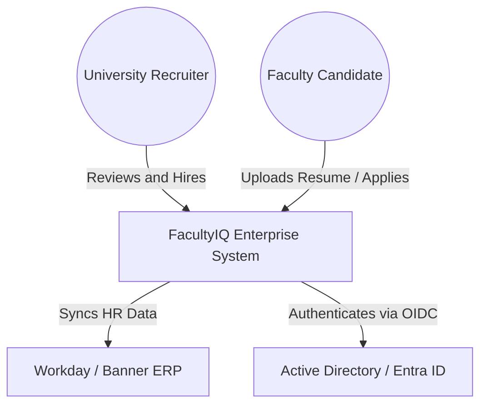
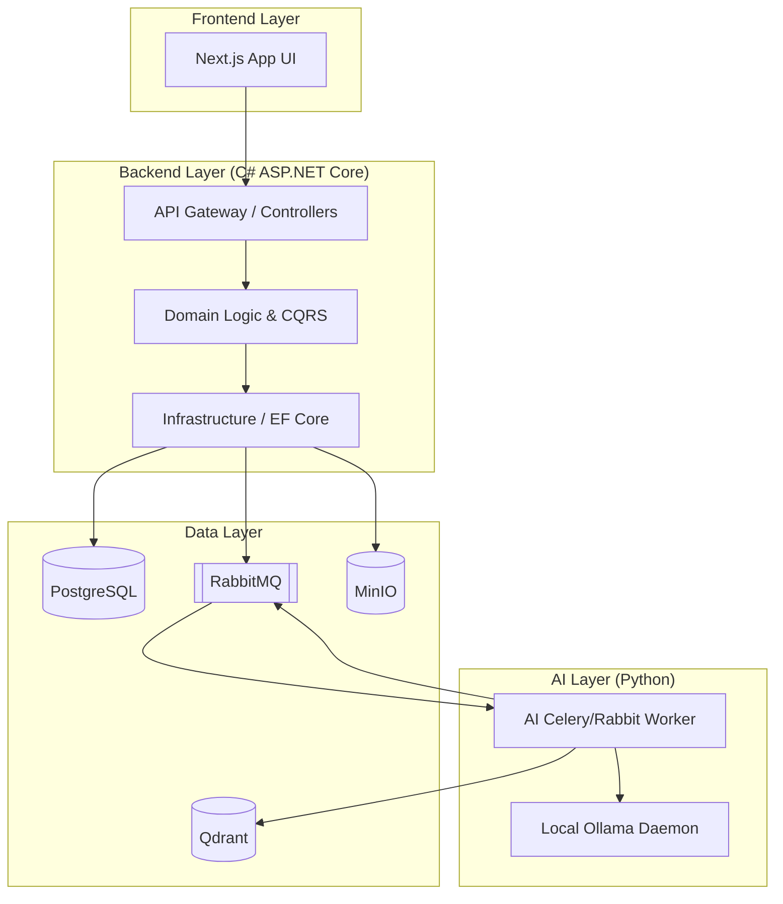

# ENTERPRISE REFERENCE ARCHITECTURE AND MASTER BLUEPRINT

## DOCUMENT CONTROL
| Document ID | FACULTYIQ-ERA-001 |
|---|---|
| **Version** | 1.0.0 |
| **Status** | **APPROVED / BINDING** |
| **Classification** | Enterprise Confidential |
| **Owner** | Enterprise Architecture Council |

> [!CAUTION]
> **THE CAPSTONE AUTHORITY**
> This document is the **single highest-level architectural artifact** for FacultyIQ. It consolidates all 26 underlying architectural specifications into one unified blueprint. Every subsystem, workflow, deployment strategy, and AI agent MUST align with the topology and principles established in this document.

---

## 1 Executive Summary

### 1.1 Vision
To revolutionize academic talent acquisition by providing a secure, offline-first, AI-native platform that eliminates hiring bias, automates tedious manual reviews, and preserves total data sovereignty for the University.

### 1.2 Enterprise Principles
1. **Offline First**: The core system SHALL function without reliance on public cloud APIs.
2. **AI Native**: AI is not a bolt-on feature; it is the core evaluation engine driving the recruitment workflow.
3. **Clean Architecture**: Domain logic is strictly isolated from infrastructure concerns via the Modular Monolith pattern.
4. **Research Grade**: The platform must capture cryptographic-level data lineage to support ongoing academic research into AI fairness.

---

## 2 Enterprise Context

### 2.1 C4 Level 1: System Context Diagram

---

## 3 Enterprise Architecture Overview

The FacultyIQ Architecture is composed of interconnected domains mapped to TOGAF methodologies:
- **Business Architecture**: Applicant Tracking, Resume Parsing, Interview Scoring.
- **Data Architecture**: Relational state (PostgreSQL) + Vector state (Qdrant) + Blob state (MinIO).
- **Application Architecture**: C# ASP.NET Core Modular Monolith + Python AI Workers.
- **Technology Architecture**: Docker Compose (MVP) ➔ Kubernetes (Future SaaS).
- **Security Architecture**: Zero Trust, JWT Authentication, and RBAC via Active Directory.

---

## 4 End-to-End System Blueprint

### 4.1 The Complete Resume Journey
1. Candidate uploads PDF via Next.js Frontend.
2. Next.js calls ASP.NET Core API. API saves PDF to MinIO.
3. API publishes `ResumeUploadedEvent` to RabbitMQ.
4. Python AI Worker consumes event, extracts text from PDF.
5. Python AI Worker invokes local Qwen2.5 3B model to score against Rubrics retrieved from Qdrant.
6. AI Worker publishes `ResumeScoredEvent` back to RabbitMQ.
7. ASP.NET Core API consumes event, saves scores to PostgreSQL.
8. SignalR pushes live UI update to the Recruiter.

---

## 5 Complete Capability Map

| Capability Domain | Sub-Capabilities |
|---|---|
| **Knowledge Management** | Rubric Generation, Bloom's Taxonomy Mapping, Vector Indexing |
| **Applicant Tracking** | Resume Parsing, Pipeline Management, Automated Reject/Offer |
| **AI Evaluation** | Coding Assessment Scoring, Interview Transcript Analysis, Sentiment Check |
| **Administration** | Feature Flag Toggles, RBAC Assignment, System Health Monitoring |

---

## 6 Unified Component Architecture

### 6.1 C4 Level 2: Container Diagram

---

## 7 Complete AI Ecosystem

### 7.1 Agent Collaboration Swarm
FacultyIQ does not rely on a single monolithic LLM call. It utilizes a Multi-Agent Swarm architecture:
1. **Resume Agent**: Specialized in extracting structured JSON (Skills, Education) from unstructured PDF text.
2. **Bloom Agent**: Specialized in analyzing a syllabus to determine its Bloom's Taxonomy cognitive level.
3. **Coding Agent**: Specialized in evaluating candidate code submissions for Big-O efficiency (powered by Qwen2.5-Coder).
4. **Decision Agent (Meta-Agent)**: Reviews the output of the previous 3 agents and generates a unified "Hire / No Hire" recommendation with an associated Confidence Score.

---

## 8 Unified Data Architecture

- **Operational Data (PostgreSQL)**: The absolute source of truth. Uses UUIDv7 for primary keys to allow distributed insertion without index fragmentation.
- **Vector Data (Qdrant)**: Stores embeddings of University grading rubrics. Must be regenerated from PostgreSQL if the embedding model is upgraded.
- **Audit Data**: Stored in PostgreSQL using temporal tables, ensuring that any modifications to a candidate's score are permanently recorded with the Editor's AD identity.

---

## 9 Unified Integration Architecture

- **Event Bus (RabbitMQ)**: All cross-boundary communication occurs asynchronously.
- **Transactional Outbox Pattern**: When the ASP.NET Core API updates a candidate's status, it simultaneously writes a `CandidateStatusChanged` event to an `Outbox` table in Postgres in the same transaction. A background worker reads the outbox and dispatches to RabbitMQ, guaranteeing absolute eventual consistency even if RabbitMQ crashes.

---

## 10 Enterprise Security Overview

- **Zero Trust Architecture**: Internal networks are treated as hostile. Traffic between the C# API and the PostgreSQL database MUST be encrypted via TLS.
- **Threat Protection**: The Next.js frontend implements strict CSP (Content Security Policy) headers. The API implements ASP.NET Core Rate Limiting to prevent brute-force attacks on the local AI models.

---

## 11 Deployment Blueprint

- **Current State (MVP)**: Docker Compose on a single massive bare-metal Linux server equipped with dual NVIDIA RTX GPUs.
- **Future State (SaaS)**: Kubernetes cluster with horizontal Pod autoscaling. GPU nodes are isolated using Kubernetes Taints and Tolerations so only the Python AI Workers are scheduled onto them.

---

## 12 Operational Blueprint

- **Observability**: OpenTelemetry standardizes traces, metrics, and logs. Data is exported to Prometheus and visualized in Grafana.
- **Incident Response**: SREs utilize the `22_ENTERPRISE_OPERATIONS_MANUAL.md` Runbooks. All Sev-1 incidents require a blameless postmortem stored in the Enterprise Knowledge Graph.

---

## 13 Analytics Blueprint

- **Decision Intelligence**: Dashboards correlate AI Confidence Scores with eventual human hiring decisions. If the AI is consistently overridden by human recruiters for a specific demographic, the AI Governance Board is automatically alerted to investigate potential Model Bias.

---

## 14 Governance Blueprint

- **Architecture Review Board (ARB)**: No new database technology (e.g., MongoDB) or programming language (e.g., Go) may be introduced to the stack without an approved Architecture Decision Record (ADR) from the ARB.

---

## 15 Cross-Cutting Concerns

- **Feature Flags**: Evaluated in-memory via the ASP.NET Core `Microsoft.FeatureManagement` library.
- **Caching**: Distributed caching via Redis. Cache keys MUST include the Tenant ID to prevent cross-tenant data leakage.

---

## 16 Enterprise Standards

- **Coding**: SOLID, DRY, and Clean Architecture for C#. Black/Ruff formatting for Python.
- **Documentation as Code**: All architectures (like this one) are stored in Markdown in the Git repository alongside the source code.

---

## 17 Reference Models

- **Reference Architecture**: Modular Monolith.
- **Reference UI Component**: `shadcn/ui` based on Tailwind CSS.
- **Reference API**: RESTful, Level 2 Richardson Maturity Model, returning RFC 7807 Problem Details on error.

---

## 18 Architecture Views

- **Logical View**: Classes, Interfaces, and CQRS Handlers.
- **Process View**: RabbitMQ message flow and Celery worker distribution.
- **Physical View**: Docker containers running on Linux host machines.

---

## 19 Architecture Decision Catalog (Master Index)

| ADR ID | Decision | Component Impacted |
|---|---|---|
| **ADR-001** | Use Modular Monolith over Microservices | System Architecture |
| **ADR-002** | Enforce Offline-First (No AWS/OpenAI) | AI Architecture |
| **ADR-003** | Use RabbitMQ Quorum Queues | Event-Driven Architecture |
| **ADR-004** | Use Qdrant for Vector Storage | Data Architecture |

---

## 20 Traceability Matrix

| Enterprise Goal | Capability | Component | Metric |
|---|---|---|---|
| Unbiased Hiring | Resume Parsing | Python AI Worker | AI Fairness Score |
| Data Sovereignty | Offline Models | Local Ollama Daemon | External API Calls (Must be 0) |

---

## 21 Enterprise Roadmap Summary

- **Phase 1**: MVP. Single Department. Bare-metal Docker.
- **Phase 2**: Enterprise Rollout. All Departments. Active Directory Sync.
- **Phase 3**: Strangler Fig Pattern. Extracting AI Python Workers into distinct microservices.
- **Phase 4**: Multi-Tenant SaaS. Kubernetes migration.

---

## 22 Future Enterprise Vision

FacultyIQ aims to evolve from a passive recruitment tracker into an **Autonomous AI Decision Engine**. Future iterations will introduce "Digital Faculty Twins"—simulated personas that can autonomously test the coding assessments created by human applicants before they are officially submitted to the grading queue.

---

## 23 Master Glossary

- **ADR**: Architecture Decision Record.
- **C4 Model**: A framework for describing software architecture (Context, Containers, Components, Code).
- **RAG**: Retrieval-Augmented Generation. Combining vector search (Qdrant) with an LLM (Ollama) to ground AI responses in factual data.
- **Modular Monolith**: A software architecture that is deployed as a single unit but internally structured into strictly isolated bounded contexts.

---

## 24 Master Revision History

| Version | Date | Status | Approvals |
|---|---|---|---|
| **1.0.0** | 2026-07-19 | **APPROVED** | Enterprise Architecture Council |
