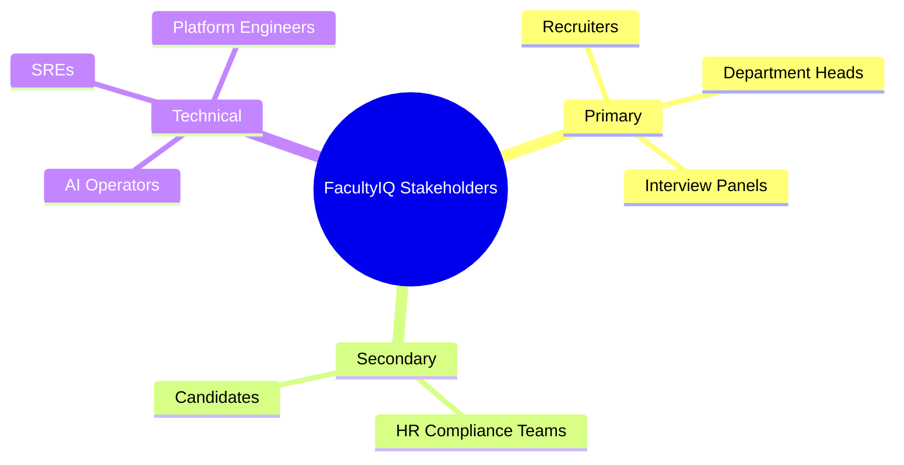
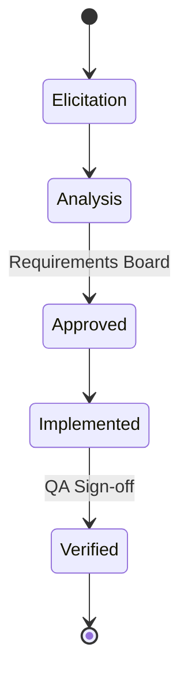

# MASTER REQUIREMENTS AND TRACEABILITY SPECIFICATION

## DOCUMENT CONTROL
| Document ID | FACULTYIQ-REQ-001 |
|---|---|
| **Version** | 1.0.0 |
| **Status** | **APPROVED / BINDING** |
| **Classification** | Enterprise Confidential |
| **Owner** | Enterprise Requirements Board |

> [!CAUTION]
> **AUTHORITATIVE TRACEABILITY SPECIFICATION**
> This document establishes the strict traceability matrix for FacultyIQ. No feature may be developed, no API endpoint exposed, and no AI model deployed unless it directly traces back to an approved Business or Functional Requirement documented herein. "Orphan code" is strictly prohibited.

---

## 1 Executive Summary

### 1.1 Purpose
The Master Requirements and Traceability Specification ensures that FacultyIQ is built precisely to solve the University's academic hiring challenges. It aligns engineering execution with stakeholder intent, ensuring compliance, security, and AI fairness are systematically verified.

### 1.2 Document Relationships
This document bridges the gap between Business Strategy and the 27 underlying Architecture Blueprints (e.g., Security Architecture, AI Governance, System Architecture).

---

## 2 Business Requirements

- **REQ-BUS-001 [Unbiased Evaluation]**: The system MUST evaluate faculty candidates based strictly on objective merit mapped to departmental rubrics, minimizing human cognitive bias.
- **REQ-BUS-002 [Operational Efficiency]**: The system MUST reduce the manual time required to screen a resume from 15 minutes to < 2 minutes.
- **REQ-BUS-003 [Data Sovereignty]**: The system MUST NOT transmit any applicant PII to external third-party cloud AI vendors (e.g., OpenAI, Anthropic).

---

## 3 Stakeholder Analysis

---

## 4 Functional Requirements

- **REQ-FUN-001 [Authentication]**: The system SHALL authenticate internal users via OIDC integrating with the University's Active Directory.
- **REQ-FUN-002 [Resume Ingestion]**: The system SHALL accept PDF uploads up to 10MB and store them securely.
- **REQ-FUN-003 [Automated Scoring]**: The system SHALL assign a numeric score (0-100) to each candidate based on their alignment with the job requisition's vector-embedded rubric.

---

## 5 AI Requirements

- **REQ-AI-001 [Local Inference]**: All AI inference MUST execute locally on University-owned GPUs using open-weights models.
- **REQ-AI-002 [Hallucination Prevention]**: The AI MUST cite the exact line number from the source PDF when justifying a candidate's score. (RAG grounded extraction).
- **REQ-AI-003 [Deterministic Fallback]**: If the AI model confidence score falls below 80%, the system MUST route the candidate to a human reviewer.

---

## 6 Non-Functional Requirements

- **REQ-NFR-001 [Availability]**: The system SHALL maintain 99.9% uptime during standard university business hours.
- **REQ-NFR-002 [Performance]**: The Next.js frontend UI SHALL render within 200ms at the 95th percentile.
- **REQ-NFR-003 [Offline Capability]**: The system SHALL continue to process resumes even if the external WAN connection is severed.

---

## 7 Security Requirements

- **REQ-SEC-001 [Encryption at Rest]**: All PostgreSQL and MinIO storage volumes MUST be encrypted using AES-256.
- **REQ-SEC-002 [Role-Based Access]**: A `Recruiter` SHALL NOT be able to view candidate data assigned to a different department unless explicitly authorized.

---

## 8 Data Requirements

- **REQ-DAT-001 [Retention]**: Candidate data MUST be permanently purged 3 years after the requisition closes to comply with state data retention laws.
- **REQ-DAT-002 [Vector Sync]**: The Qdrant vector database MUST remain mathematically synchronized with the relational PostgreSQL rubrics.

---

## 9 API Requirements

- **REQ-API-001 [REST Standards]**: All internal APIs SHALL adhere to the Richardson Maturity Model Level 2.
- **REQ-API-002 [Error Handling]**: APIs SHALL return RFC 7807 Problem Details formatting for all HTTP 4xx and 5xx responses.

---

## 10 Infrastructure Requirements

- **REQ-INF-001 [Containerization]**: All application components SHALL be packaged as immutable Docker containers.
- **REQ-INF-002 [Message Brokering]**: The system SHALL use RabbitMQ with Quorum Queues to guarantee at-least-once delivery of Resume Parsing events.

---

## 11 User Interface Requirements

- **REQ-UI-001 [Accessibility]**: The frontend MUST comply strictly with WCAG 2.2 AA standards to ensure accessibility for visually impaired recruiters.
- **REQ-UI-002 [Responsive Design]**: The dashboard MUST be fully functional on tablet resolutions (1024x768) for mobile Interview Panels.

---

## 12 Analytics Requirements

- **REQ-ANA-001 [Bias Dashboards]**: The system SHALL generate real-time reports comparing AI scoring demographics against human scoring demographics.

---

## 13 Operational Requirements

- **REQ-OPS-001 [Observability]**: All microservices and monoliths MUST emit W3C-compliant Trace IDs to Jaeger via OpenTelemetry.
- **REQ-OPS-002 [Disaster Recovery]**: The database MUST support Point-in-Time Recovery (PITR) with an RPO of < 5 minutes.

---

## 14 Compliance Requirements

- **REQ-CMP-001 [FERPA]**: Student candidates applying for adjunct roles MUST have their educational records shielded in compliance with FERPA.

---

## 15 Acceptance Criteria

| Requirement ID | Acceptance Criteria |
|---|---|
| REQ-AI-001 | Disconnect server from internet. Attempt to parse a resume. Parsing must succeed. |
| REQ-FUN-001| Login via Active Directory test account. Verify JWT token contains correct roles. |

---

## 16 Requirements Prioritization

FacultyIQ uses MoSCoW prioritization:
- **Must Have**: REQ-BUS-001, REQ-AI-001 (Core offline AI evaluation).
- **Should Have**: REQ-ANA-001 (Bias reporting).
- **Could Have**: Video Interview analysis.
- **Won't Have**: External integration with LinkedIn API (Violates offline-first).

---

## 17 Requirements Lifecycle

---

## 18 Verification & Validation

- **Requirements Validation**: Does the requirement solve the business need?
- **Requirements Verification**: Does the deployed code fulfill the documented requirement? (Proved via xUnit Integration Tests).

---

## 19 Complete Traceability Matrix

| Business Req | Functional Req | Architecture Doc | Component | Test Case |
|---|---|---|---|---|
| REQ-BUS-003 (Sovereignty) | REQ-AI-001 (Local AI) | `07_AI_AGENT_ARCHITECTURE` | `Ollama Daemon` | `TC-AI-001 (Offline Test)` |
| REQ-BUS-002 (Speed) | REQ-FUN-003 (Auto Score) | `08_DATA_ARCHITECTURE` | `Qdrant Index` | `TC-FUN-003 (Scoring SLA)` |

---

## 20 Architecture Mapping

Every requirement maps to a corresponding architecture blueprint:
- **REQ-SEC-*** ➔ `05_SECURITY_ARCHITECTURE.md`
- **REQ-INF-*** ➔ `11_DEPLOYMENT_ARCHITECTURE.md`
- **REQ-OPS-*** ➔ `22_ENTERPRISE_OPERATIONS_MANUAL.md`

---

## 21 Risks and Assumptions

- **Technical Risk**: The local GPUs (NVIDIA RTX) may not have enough VRAM (24GB) to run Qwen2.5 7B concurrently with the embedding models. 
- **Mitigation**: The system is strictly bound to the Qwen2.5 3B model (REQ-AI-001) to stay within hardware constraints.

---

## 22 Future Requirements

- **REQ-FUT-001 [Multi-Tenancy]**: In Phase 5, the system SHALL support logical database isolation to allow sister universities to utilize the same Kubernetes cluster.

---

## 23 Glossary

- **Traceability Matrix**: A grid that links business requirements to their corresponding functional requirements, architectures, and tests to ensure no requirement is lost during development.
- **MoSCoW**: Must have, Should have, Could have, Won't have.

---

## 24 Revision History

| Version | Date | Status | Approvals |
|---|---|---|---|
| **1.0.0** | 2026-07-19 | **APPROVED** | Enterprise Requirements Board |
