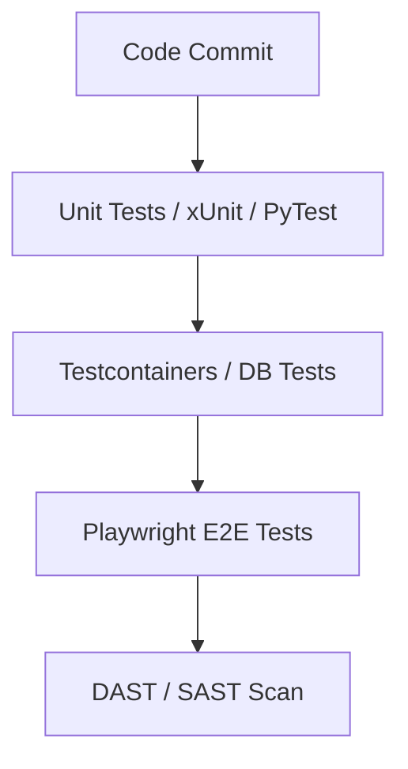

# IMPLEMENTATION PLAYBOOK AND EXECUTION GUIDE

## DOCUMENT CONTROL
| Document ID | FACULTYIQ-EXEC-001 |
|---|---|
| **Version** | 1.0.0 |
| **Status** | **APPROVED / BINDING** |
| **Classification** | Enterprise Confidential |
| **Owner** | Engineering Delivery Office |

> [!CAUTION]
> **AUTHORITATIVE IMPLEMENTATION SPECIFICATION**
> This document defines the exact order of operations for building the FacultyIQ platform. Engineering teams SHALL NOT skip phases or build UI components before the underlying Domain Logic and Unit Tests have passed the CI/CD Quality Gates.

---

## 1 Executive Summary

### 1.1 Purpose
The Implementation Playbook transforms the 28 Enterprise Architecture blueprints into an executable project plan. It details the step-by-step process for initializing the repositories, configuring local Docker environments, and delivering vertical slices of value.

### 1.2 Implementation Philosophy
- **Vertical Slice Architecture**: We do not build "The Database Layer" in Month 1 and "The UI Layer" in Month 2. We build a single feature (e.g., "Upload Resume") from the UI down to the Database in a single sprint.
- **Risk-Driven Delivery**: The highest risk feature—Local AI inference on GPU hardware—must be proven in Phase 1 before building administrative CRUD screens.

---

## 2 Implementation Strategy

- **Documentation-Driven Development**: Developers MUST write the XML doc comments and update the internal Wiki/Markdown files *before* they write the C# implementation logic.
- **Continuous Validation**: Every commit triggers a full suite of automated tests. A broken build immediately stops the line.

---

## 3 Team Organization

| Team | Focus Area | Tech Stack |
|---|---|---|
| **Backend** | Domain Logic, API, CQRS | C#, ASP.NET Core 9, EF Core |
| **Frontend** | UI, UX, Accessibility | Next.js, React, Tailwind, shadcn |
| **AI** | Inference, RAG, Parsing | Python, Ollama, LangChain |
| **Platform**| CI/CD, K8s, Docker | Ansible, Terraform, GitHub Actions|

---

## 4 Environment Preparation

### 4.1 Local Developer Setup (docker-compose)
Every developer machine (Windows/WSL2 or macOS) MUST run the core dependencies locally via `docker-compose.yml`. No external cloud dependencies are allowed.

```yaml
# Local Dev Stack
services:
  postgres:
    image: postgres:16
  redis:
    image: redis:7
  rabbitmq:
    image: rabbitmq:3-management
  minio:
    image: minio/minio
  qdrant:
    image: qdrant/qdrant
  ollama:
    image: ollama/ollama
    deploy:
      resources:
        reservations:
          devices:
            - driver: nvidia
              count: 1
              capabilities: [gpu]
```

---

## 5 Repository Setup

- **Mono-repo Structure**: 
  - `/src/frontend` (Next.js)
  - `/src/backend` (.NET Core)
  - `/src/ai-workers` (Python)
  - `/deploy` (Docker/Terraform)
- **Branch Protection**: `main` requires 2 approving PR reviews, passing SonarQube gates, and 100% passing tests. Direct pushes to `main` are disabled.

---

## 6 Phase-Based Development Plan

```mermaid
gantt
    title FacultyIQ Implementation Roadmap
    dateFormat  YYYY-MM-DD
    section Core Infrastructure
    Phase 1: Foundation           :active, p1, 2026-08-01, 14d
    Phase 2: Authentication       :p2, after p1, 14d
    section AI Processing
    Phase 3: Resume Pipeline      :p3, after p2, 21d
    Phase 4: Knowledge Base       :p4, after p3, 21d
    section Advanced Features
    Phase 5: Interview Engine     :p5, after p4, 21d
    Phase 6: Coding Assessment    :p6, after p5, 14d
```

### 6.1 Core Phases
- **Phase 1 (Foundation)**: Local Docker setup, EF Core migrations, empty API shell.
- **Phase 3 (Resume Pipeline)**: The critical path. Hooking the UI to the API, triggering RabbitMQ, and returning AI inference from Ollama.

---

## 7 Sprint Planning

- **Definition of Ready (DoR)**: The Jira ticket has a clear acceptance criteria, UI mockups (if applicable), and is sized < 5 Story Points.
- **Definition of Done (DoD)**: Feature is deployed to Staging, Unit Tests > 80% coverage, and Documentation is updated.

---

## 8 Backend Implementation Order

Backend engineers MUST implement features in the following strict order (Outside-In):
1. **Domain Layer**: Create Entities (e.g., `Candidate.cs`) and Business Rules.
2. **Application Layer**: Create CQRS Commands/Queries (`ParseResumeCommand.cs`).
3. **Infrastructure Layer**: Write EF Core Configurations and RabbitMQ Publishers.
4. **API Layer**: Create the `CandidateController.cs` to expose the Application layer.
5. **Testing**: Write xUnit Integration tests wrapping the controller.

---

## 9 Frontend Implementation Order

1. **Design System**: Import `shadcn/ui` components (Buttons, Modals).
2. **Layouts**: Define the global Navigation and Sidebar in Next.js `layout.tsx`.
3. **State Management**: Integrate React Query for fetching API data.
4. **Pages**: Assemble the specific routed pages (e.g., `/candidates/[id]`).

---

## 10 AI Implementation Order

1. **Resume Agent**: The foundational capability. Extracts JSON from PDF text.
2. **Bloom Agent**: Evaluates syllabi against Bloom's Taxonomy.
3. **Decision Agent**: The meta-agent that aggregates scores from the previous agents to output a final "Hire" confidence score.

---

## 11 Database Implementation

- **Migrations**: Executed strictly via `dotnet ef migrations add`. Manual SQL schema changes are forbidden.
- **Seed Data**: A `SeedData.cs` script must populate the Dev database with 10 dummy candidates and 2 fake departments to allow UI testing upon container startup.

---

## 12 API Development Workflow

- **Contract-First**: Before writing C# code, backend devs must define the OpenAPI (Swagger) spec and share it with the Frontend team so they can begin mocking the UI concurrently.

---

## 13 Integration Milestones

- **Milestone 1**: ASP.NET Core successfully writes a message to RabbitMQ and the Python Celery worker picks it up.
- **Milestone 2**: Python worker successfully invokes the local Qwen2.5 3B model via the Ollama REST API and returns a generated response to Postgres.

---

## 14 Testing Execution



---

## 15 Deployment Readiness

- **Configuration**: Devs must ensure `appsettings.json` is devoid of secrets. All connection strings must be injected via Kubernetes Secrets / Environment Variables.
- **Health Checks**: The `.NET HealthChecks` middleware must report `Healthy` for Postgres, RabbitMQ, and Redis before the Load Balancer routes traffic to the container.

---

## 16 Quality Gates

1. **Architecture Gate**: ArchUnitNET ensures the `Domain` layer does not reference the `Infrastructure` layer.
2. **Security Gate**: OWASP Dependency-Check fails the build if a NuGet/NPM package contains a High CVE.
3. **Performance Gate**: K6 load tests must prove the Resume Parsing endpoint handles 50 concurrent requests without crashing.

---

## 17 Risk Management

- **Technical Risk (OOM)**: If the Python AI Worker crashes with a CUDA Out of Memory error, the mitigation is to implement RabbitMQ Dead Letter Queues (DLQ) and retry with a smaller context window.

---

## 18 Progress Tracking

- **Velocity**: Tracked in Jira. If the team's velocity drops by > 20% sprint-over-sprint, the Scrum Master must escalate to the Delivery Office to investigate blocker issues (usually environment configuration).

---

## 19 Delivery Governance

- **Sprint Reviews**: Held every alternating Friday. The Product Owner must physically click through the UI to accept the feature; PowerPoint presentations are rejected as proof of completion.

---

## 20 Implementation Checklists

### 20.1 Go-Live Checklist (DevOps)
- [ ] TLS Certificates installed.
- [ ] PostgreSQL nightly backup cron job verified.
- [ ] Active Directory OIDC Federation secret rotated.
- [ ] Qwen2.5 3B Model pre-pulled onto the production GPU nodes.

---

## 21 Architecture Decision Records

- **ADR-EXEC-001: Vertical Slices over Horizontal Layers**
  - *Decision*: Teams will deliver fully functional features (UI to DB) per sprint.
  - *Context*: Prevents the classic "Backend is done, waiting on Frontend" gridlock.

---

## 22 Traceability Matrix

| Requirement | Phase | Sprint | Component | Verification |
|---|---|---|---|---|
| Offline AI Parsing | Phase 3 | Sprint 4 | Python AI Worker | PyTest Mock Inference |
| Active Directory SSO | Phase 2 | Sprint 2 | ASP.NET Identity | E2E Playwright Login |

---

## 23 Future Evolution

- **Continuous Delivery**: Automating the promotion of Docker images from Staging to Production without manual QA intervention, relying entirely on AI-driven synthetic UI testing.

---

## 24 Glossary

- **DoD**: Definition of Done. The criteria a user story must meet before it is considered complete.
- **Vertical Slice**: A portion of a system that includes all layers (UI, business logic, database) necessary to deliver a single piece of business value.

---

## 25 Revision History

| Version | Date | Status | Approvals |
|---|---|---|---|
| **1.0.0** | 2026-07-19 | **APPROVED** | Engineering Delivery Office |
