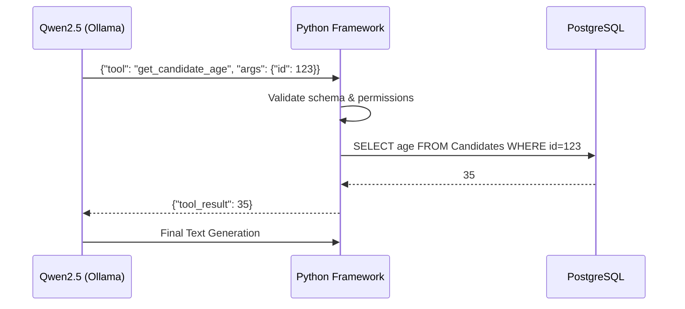

# AGENT ORCHESTRATION, TOOL CALLING, AND WORKFLOW EXECUTION STANDARD

## DOCUMENT CONTROL
| Document ID | FACULTYIQ-ORC-001 |
|---|---|
| **Version** | 1.0.0 |
| **Status** | **APPROVED / BINDING** |
| **Classification** | Enterprise Confidential |
| **Owner** | AI Workflow Engineering Council |

> [!CAUTION]
> **AUTHORITATIVE ORCHESTRATION SPECIFICATION**
> This document dictates how multi-agent workflows are executed in FacultyIQ. Agents SHALL NOT call each other synchronously via blocking HTTP calls. All inter-agent communication and task delegation MUST occur asynchronously via the RabbitMQ event bus to guarantee fault tolerance and prevent cascading failures.

---

## 1 Executive Summary

### 1.1 Purpose
The Agent Orchestration Standard ensures that FacultyIQ's Multi-Agent Swarm operates as a highly reliable distributed system. It establishes the rules for workflow state management, task delegation (Fan-Out/Fan-In), and secure Tool Invocation by LLMs.

### 1.2 Workflow Philosophy
- **Deterministic Execution**: Workflows must be repeatable. The state machine orchestrating the AI agents is purely deterministic (code-driven), even if the AI outputs themselves are probabilistic.
- **Retry by Design**: Assume local inference will eventually crash (CUDA OOM). Workflows MUST be designed to resume precisely from their last checkpointed state.

---

## 2 Orchestration Principles

1. **Idempotency**: Every task executed by a Worker Agent MUST be idempotent. Processing the same `EvaluateResumeCommand` twice must yield the same database state without duplicating records.
2. **Event Driven**: Orchestration is choreographed via Domain Events (`ResumeParsed`, `ScoreCalculated`) rather than imperative orchestration scripts.
3. **Least Privilege Tool Calling**: Agents are granted access only to the explicit Tools required for their bounded context (e.g., the Bloom Agent cannot access the SQL Database Tool).

---

## 3 Multi-Agent Architecture

### 3.1 Orchestration Hierarchy
```mermaid
graph TD
    Supervisor[Decision Agent (Supervisor)]
    Worker1[Resume Agent (Worker)]
    Worker2[Bloom Agent (Worker)]
    Worker3[Coding Agent (Worker)]
    
    Supervisor -->|Delegates Task (RabbitMQ)| Worker1
    Supervisor -->|Delegates Task (RabbitMQ)| Worker2
    Supervisor -->|Delegates Task (RabbitMQ)| Worker3
    
    Worker1 -.->|Returns JSON (RabbitMQ)| Supervisor
    Worker2 -.->|Returns JSON (RabbitMQ)| Supervisor
    Worker3 -.->|Returns JSON (RabbitMQ)| Supervisor
```

---

## 4 Workflow Lifecycle

1. **Definition**: Workflows are defined as Directed Acyclic Graphs (DAGs) in Python (via Celery).
2. **Execution**: The Workflow Engine executes tasks in topological order.
3. **Failure Recovery**: If a node in the DAG fails, the engine retries with exponential backoff before routing to a Dead Letter Queue (DLQ).
4. **Archival**: Completed workflow trace IDs are archived in PostgreSQL for 3 years.

---

## 5 Task Model

- **Task Definition**: A JSON payload containing the `workflow_id`, `task_id`, `agent_type`, and `payload`.
- **Dependencies**: Tasks define their upstream prerequisites. (e.g., The Decision Agent's aggregation task cannot begin until both the Resume and Bloom tasks reach a `Completed` state).
- **Timeouts**: Every task MUST enforce a strict timeout (Default: 60 seconds) to prevent frozen GPU resources.

---

## 6 Agent Communication

- **Task Requests**: Asynchronous RPC calls over RabbitMQ.
- **Context Exchange**: Agents DO NOT pass raw PDF strings to each other over the message bus (which would exceed message size limits). They pass a `document_id` and the receiving agent pulls the document directly from MinIO.

---

## 7 Tool Calling Framework

### 7.1 Tool Invocation Pipeline
When an LLM (Qwen2.5) decides it needs to invoke a Tool (e.g., `QueryPostgres`):
1. LLM outputs a JSON Tool Invocation request.
2. The Agent Framework intercepts the output, **pauses generation**, and validates the JSON schema.
3. The Agent Framework executes the actual Python tool function.
4. The result of the Python function is injected back into the LLM context.
5. The LLM resumes generation.



---

## 8 Execution Engine

- **Fan-Out**: When evaluating 50 candidate resumes, the API publishes 50 events. 50 Celery Python workers consume them in parallel.
- **Fan-In (Barrier)**: A final `CalculateCohortRank` task waits until all 50 Fan-Out tasks report completion to the Redis state backend before executing.

---

## 9 Agent Coordination

- **Decision Agent (Supervisor)**: Evaluates the output of all Worker Agents. If the Decision Agent detects conflicting information (e.g., Resume Agent says "No Python", but Coding Agent says "Expert Python"), it publishes a `ConflictResolutionEvent` requiring Human intervention.

---

## 10 State Management

- **Checkpointing**: The Celery/Redis backend checkpoints task status (`PENDING`, `STARTED`, `SUCCESS`, `FAILURE`). 
- **Recovery State**: If the Docker host is hard-rebooted, Celery reads unacknowledged messages from RabbitMQ and resumes processing without dropping data.

---

## 11 Planning Strategies

- **Static Planning**: FacultyIQ currently utilizes DAG-based Static Planning. The sequence of agent operations (Resume ➔ Bloom ➔ Decision) is hardcoded in Python.
- **Adaptive Planning**: (Phase 5) Agents will dynamically plan their own DAGs based on the prompt complexity. (Currently restricted due to safety and determinism constraints).

---

## 12 Failure Recovery

- **Dead Letter Queue (DLQ)**: If a task fails 3 retries (due to persistent LLM hallucination or schema violation), the message is routed to the DLQ. 
- **Human Escalation**: An alert is triggered to the SRE/HR Admin team to manually review the DLQ payload and evaluate the candidate manually.

---

## 13 Tool Categories

- **OCR Tools**: `extract_text_from_pdf` (PyMuPDF).
- **Knowledge Tools**: `query_qdrant_rubric` (Vector Search).
- **Database Tools**: `get_candidate_metadata` (Read-only SQL).
- **Rule**: Agents SHALL NEVER be granted tools capable of mutating (`INSERT/UPDATE/DELETE`) the operational database. State mutation is handled exclusively by the C# API consuming final Agent events.

---

## 14 Workflow Security

- **Prompt Injection Defense**: If a malicious resume tricks the LLM into invoking the `query_qdrant_rubric` tool with malicious SQL arguments, the Python tool wrapper MUST sanitize all inputs before execution.
- **Execution Isolation**: AI Workers run in isolated Docker containers with no network egress to the public internet.

---

## 15 Performance Engineering

- **Concurrency**: Governed by GPU VRAM. If the host has 24GB VRAM and Qwen2.5 3B takes 4GB, the Celery worker concurrency MUST be strictly capped at 5 to prevent CUDA OOM panics.

---

## 16 Observability

- **Tracing**: Multi-Agent workflows span multiple queues. W3C Traceparent headers MUST be propagated from the Next.js frontend, through the C# API, across RabbitMQ, and into the Python AI Workers, allowing Grafana Tempo to visualize the entire End-to-End trace.

---

## 17 Testing

- **Chaos Testing**: SREs will randomly kill the Ollama Docker container during a Fan-Out execution. The system passes if 0 resumes are lost and the processing resumes upon container restart.

---

## 18 Governance

- **Tool Registration**: Adding a new Tool to an Agent's capabilities requires an Architectural Review to verify it does not violate the Read-Only mutation rule or the Offline-First mandate.

---

## 19 Architecture Decision Records

- **ADR-ORC-001: RabbitMQ/Celery over Temporal.io**
  - *Decision*: We will use Celery with RabbitMQ for workflow orchestration instead of Temporal.
  - *Context*: Temporal is superior for massive distributed workflows, but its infrastructure overhead (Cassandra/Elasticsearch) violates the lightweight, deploy-anywhere mandate of the Phase 1 MVP.

---

## 20 Traceability Matrix

| Business Process | Task | Agent | Tool | Output State |
|---|---|---|---|---|
| Resume Review | Parse Document | Resume Agent | `extract_pdf` | `JSON Schema` |
| Rubric Mapping | Vector Search | Bloom Agent | `query_qdrant` | `JSON Schema` |

---

## 21 Future Evolution

- **Agent Swarms (Hierarchical)**: Evolving into a full Swarm architecture where a "Department Head Agent" coordinates multiple "SME Agents" (Subject Matter Experts) who vote on a candidate's viability in a simulated committee meeting.

---

## 22 Glossary

- **DAG (Directed Acyclic Graph)**: A conceptual representation of tasks where data flows in one direction and never loops back on itself.
- **DLQ (Dead Letter Queue)**: A holding queue for messages/tasks that cannot be processed successfully after a defined number of retries.
- **Idempotency**: The property of certain operations in mathematics and computer science whereby they can be applied multiple times without changing the result beyond the initial application.

---

## 23 Revision History

| Version | Date | Status | Approvals |
|---|---|---|---|
| **1.0.0** | 2026-07-19 | **APPROVED** | AI Workflow Engineering Council |
