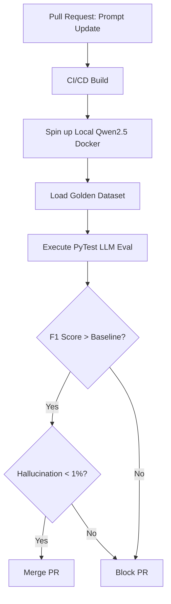

# AI EVALUATION, DATASETS, AND BENCHMARK STANDARD

## DOCUMENT CONTROL
| Document ID | FACULTYIQ-EVAL-001 |
|---|---|
| **Version** | 1.0.0 |
| **Status** | **APPROVED / BINDING** |
| **Classification** | Enterprise Confidential |
| **Owner** | AI Evaluation Council |

> [!CAUTION]
> **AUTHORITATIVE EVALUATION SPECIFICATION**
> This document dictates the mathematical and scientific rigor required to certify an AI model or prompt for production use. No AI component may be merged into the `main` branch without mathematically passing the Regression Thresholds against the Golden Dataset as defined in this specification.

---

## 1 Executive Summary

### 1.1 Purpose
The AI Evaluation Standard ensures that FacultyIQ behaves predictably, fairly, and accurately. It establishes the testing frameworks required to catch Prompt Drift, measure Model Hallucination, and quantify RAG retrieval accuracy before candidates are ever evaluated.

### 1.2 Evaluation Philosophy
- **Deterministic Validation**: AI is inherently non-deterministic. To test it, our evaluation pipelines must enforce determinism by setting `temperature=0` during tests and measuring variance over `N=10` iterations.
- **Evidence-Based Assessment**: "It looks good" is not a valid evaluation metric. Every prompt change must generate a mathematical diff (e.g., *Precision increased by +0.02, Latency increased by +150ms*).

---

## 2 AI Evaluation Principles

1. **Repeatability**: If the same benchmark script is run twice against the exact same Golden Dataset, the F1 Score variance MUST be less than 0.5%.
2. **Offline Validation**: All benchmark datasets MUST be stored locally. Test scripts CANNOT pull evaluation data from public S3 buckets.
3. **Continuous Benchmarking**: Evaluation is not a one-time event. Nightly pipelines MUST evaluate the current `main` branch models to detect infrastructure-induced regressions.

---

## 3 Evaluation Architecture

### 3.1 Continuous Benchmark Pipeline

---

## 4 Golden Dataset Framework

- **Dataset Design**: The Golden Dataset is a manually curated, immutable CSV/JSONL file containing exactly 1,000 edge-case inputs mapped to human-verified correct outputs.
- **Dataset Versioning**: Managed via DVC (Data Version Control) in a dedicated Git repository. Changing the dataset requires approval from the AI Evaluation Council.

---

## 5 Resume Evaluation Dataset

- **Ground Truth Labels**: For the Resume Parsing benchmark, a row in the Golden Dataset looks like:
  - `Input`: Raw text of Resume #402.
  - `Ground_Truth_Output`: `{"years_experience": 12, "phd_status": "Complete", "skills": ["Python", "TensorFlow"]}`.
- **Evaluation**: The AI Agent's JSON output is checked against the `Ground_Truth_Output` using strict semantic equivalence tests.

---

## 6 Knowledge Evaluation Dataset

- **Goal**: To evaluate the RAG pipeline's ability to retrieve the correct University Policy.
- **Structure**: 500 hand-crafted questions (e.g., *"What is the max adjunct teaching load?"*) paired with the exact `document_id` and `chunk_id` that contains the answer.

---

## 7 Interview Evaluation Dataset

- **Adaptive Scenarios**: Transcripts of mock interviews generated by Faculty.
- **Ground Truth Rubrics**: The dataset contains the exact "Score (1-5)" assigned by human faculty to the interview transcript. The AI must attempt to match this human baseline.

---

## 8 Coding Evaluation Dataset

- **Complexity Analysis**: Datasets containing suboptimal Python algorithms. The Ground Truth label specifies the exact Big-O Time and Space complexity. The Coding Agent is evaluated on its ability to mathematically derive the correct Big-O.

---

## 9 Bloom Taxonomy Dataset

- **Difficulty Distribution**: 600 syllabi objectives evenly distributed across the 6 cognitive levels of Bloom's Taxonomy (Remember, Understand, Apply, Analyze, Evaluate, Create).
- **Expert Validation**: Each objective was labeled by a minimum of 3 human pedagogical experts who reached consensus.

---

## 10 Decision Agent Evaluation

- **Recommendation Accuracy**: Measures how often the AI's final "Hire / No Hire" recommendation aligns with the historical decision made by the Human HR Committee on that specific resume.
- **Goal**: > 85% alignment with human consensus.

---

## 11 Retrieval Evaluation

- **Recall@5**: Out of 100 questions, how often was the correct ground-truth chunk present in the top 5 chunks returned by Qdrant? (Target: > 95%).
- **MRR (Mean Reciprocal Rank)**: Measures how high up the correct chunk appeared in the results. If the correct chunk is consistently #4 or #5, the MRR will be low, indicating poor Cross-Encoder re-ranking. (Target: > 0.85).

---

## 12 Prompt Evaluation

- **Instruction Following**: Using `Promptfoo`, assert that the output contains no conversational filler (e.g., `assert not contains "Here is the JSON:"`).
- **Cost / Latency**: Measure the average token count of the prompt context and the time-to-first-token (TTFT).

---

## 13 Hallucination Evaluation

- **Citation Validation**: If the LLM claims *"Candidate published 5 papers"*, the evaluation script extracts the `citation_id` provided by the LLM, reads that specific chunk, and runs a separate NLI (Natural Language Inference) model (e.g., `roberta-large-mnli`) to mathematically verify if the chunk entails the claim.

---

## 14 Model Benchmarking

- **Comparison Matrix**: When evaluating a new local model to replace `Qwen2.5 3B`, it MUST be benchmarked against `Llama 3.2 3B` using the FacultyIQ Golden Dataset, not public benchmarks like MMLU.
- **Hardware Requirements**: The model MUST fit within 12GB of VRAM (using 4-bit quantization if necessary) to leave room for the Embedding models on the same GPU.

---

## 15 Performance Benchmarking

- **Concurrent Requests**: Load testing the Ollama backend via `K6`. The system must maintain < 2 second inference latency for the Resume Agent while processing 10 concurrent requests.
- **GPU Utilization**: `nvidia-smi` metrics are tracked to ensure VRAM does not spike above 90% during peak Fan-Out execution.

---

## 16 Regression Testing

- **Prompt Regression**: When modifying a prompt to fix an edge case (e.g., parsing European date formats), the PR must run the full 1,000-resume benchmark.
- **Gate Rule**: If the overall F1 Score drops by > 0.5%, the PR is automatically failed by the CI/CD pipeline, even if it fixed the specific date edge case.

---

## 17 Human Evaluation

- **Inter-Rater Reliability**: Once a quarter, a random sample of 50 AI evaluations is blindly graded by human faculty. Cohen's Kappa score is calculated to measure agreement between the AI and the Humans. A Kappa < 0.6 triggers a mandatory prompt review.

---

## 18 AI Quality Metrics

- **Precision**: (True Positives) / (True Positives + False Positives). Critical for avoiding hallucinated skills.
- **Recall**: (True Positives) / (True Positives + False Negatives).
- **F1 Score**: The harmonic mean of Precision and Recall. The primary KPI for the Resume Agent.
- **BERTScore**: Used to measure the semantic similarity of the AI's generated reasoning against the human ground-truth reasoning.

---

## 19 Benchmark Dashboard

- **Executive Dashboard**: A Grafana view showing the live F1 Score of the `main` branch models against the Golden Dataset, proving continuous quality.
- **Agent Dashboard**: Tracks the 95th percentile latency of the Bloom Agent vs the Coding Agent.

---

## 20 Evaluation Automation

- **Scheduled Benchmarks**: Every Saturday at 02:00 AM, the CI/CD pipeline runs the complete 10,000+ test matrix against all models, generating an automated HTML report attached to the Weekly Architecture Review agenda.

---

## 21 Architecture Decision Records

- **ADR-EVAL-001: Deterministic Golden Datasets over LLM-as-a-Judge**
  - *Decision*: FacultyIQ will use static, human-labeled Golden Datasets for primary regression testing rather than using `GPT-4` as an automated judge.
  - *Context*: Relying on an external cloud API (GPT-4) for CI/CD gating violates the Offline-First mandate and introduces external API latency/cost into the daily developer workflow.

---

## 22 Traceability Matrix

| Requirement | Dataset | Prompt | Metric | Threshold |
|---|---|---|---|---|
| Unbiased Parsing | Academic Resumes v1.2 | `resume_extract_v3` | F1 Score | > 0.92 |
| Safe Reasoning | Malformed Docs v1.0 | `decision_agg_v1` | Hallucination Rate | < 0.01 |

---

## 23 Future Evolution

- **Autonomous Benchmarking**: In Phase 6, the system will automatically fork itself, swap the underlying Ollama model to a newer version (e.g., `Qwen-Next`), run the benchmark, and automatically generate a PR proposing the model upgrade if the math proves it is superior.

---

## 24 Glossary

- **F1 Score**: A measure of a test's accuracy that considers both precision and recall.
- **Recall@K**: A metric evaluating if the relevant item appeared in the top K results.
- **NLI (Natural Language Inference)**: Determining whether a "hypothesis" is true, false, or undetermined given a "premise". Used for hallucination checking.

---

## 25 Revision History

| Version | Date | Status | Approvals |
|---|---|---|---|
| **1.0.0** | 2026-07-19 | **APPROVED** | AI Evaluation Council |
