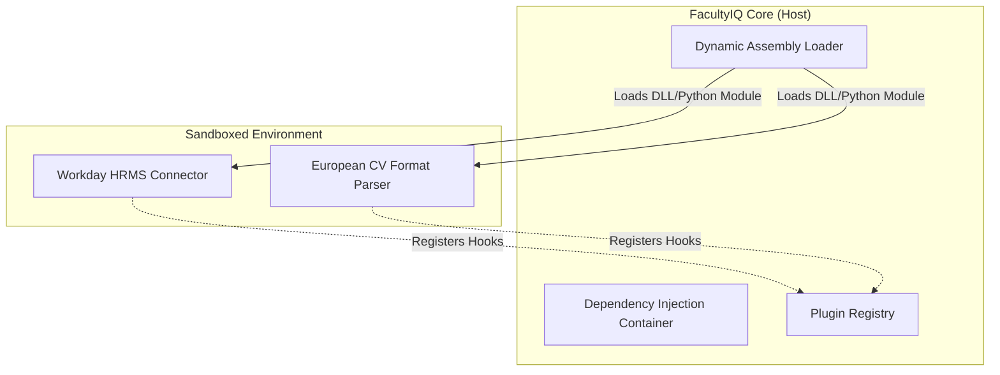

# PLUGIN, EXTENSION, SDK, AND INTEGRATION DEVELOPMENT FRAMEWORK

## DOCUMENT CONTROL
| Document ID | FACULTYIQ-EXT-001 |
|---|---|
| **Version** | 1.0.0 |
| **Status** | **APPROVED / BINDING** |
| **Classification** | Enterprise Confidential |
| **Owner** | Platform Engineering Council |

> [!CAUTION]
> **AUTHORITATIVE EXTENSIBILITY SPECIFICATION**
> This document enforces the structural boundaries for extending FacultyIQ. The core monolith is strictly closed for modification. All university-specific integrations, bespoke HRMS connectors, and specialized academic parsers MUST be implemented as isolated plugins using the FacultyIQ SDK.

---

## 1 Executive Summary

### 1.1 Purpose
FacultyIQ must serve hundreds of diverse academic institutions, each with proprietary HR systems (Workday, Oracle) and custom evaluation criteria. This framework dictates how developers build secure, backwards-compatible extensions without altering the core AI platform.

### 1.2 Extensibility Philosophy
- **Open for Extension, Closed for Modification**: The core C# API and Python AI Workers are immutable across tenant deployments.
- **Offline Capability**: Plugins must be designed to execute within air-gapped university environments; reliance on external SaaS API calls is strongly discouraged and must be explicitly declared in the Plugin Manifest.

---

## 2 Extensibility Principles

1. **Isolation**: A crashing plugin MUST NOT crash the host application.
2. **Backward Compatibility**: The SDK API contracts are strictly versioned. A plugin compiled against SDK v1.0 must run flawlessly on Host v1.5.
3. **Security by Design**: Plugins execute with the Principle of Least Privilege. A CV Parser plugin cannot access the PostgreSQL connection string.

---

## 3 Plugin Architecture

### 3.1 Core Architecture


---

## 4 Plugin Lifecycle

1. **Discovery**: The Host scans the `/plugins` directory on startup.
2. **Validation**: The Host reads the `manifest.json` and verifies the Cryptographic Signature.
3. **Registration**: The Host registers the plugin's exposed interfaces with the DI Container.
4. **Execution**: The Host delegates specific domain events (e.g., `OnResumeParsed`) to the plugin.
5. **Deprecation**: Deprecated plugins generate console warnings and telemetry alerts before being uninstalled in the next major release.

---

## 5 Plugin Categories

- **AI Agent Plugins**: (Python) Custom models for specialized faculty (e.g., a "Medical School Agent" trained on hospital residencies).
- **Document Processing Plugins**: (Python) Custom OCR logic for highly specific archival formats.
- **Institution Plugins**: (C#) Custom Active Directory or SAML/OIDC authentication mappers specific to a university's IT department.

---

## 6 SDK Architecture

- **Backend SDK (C# Nuget)**: Exposes `IFacultyIqPlugin`, `IEventPublisher`, and `ILogger` interfaces.
- **Python SDK (PyPI)**: Exposes `BaseAgent`, `ToolRegistry`, and `RAGContext` base classes for writing custom AI Agents.
- **REST SDK (OpenAPI)**: For legacy systems that cannot host plugins, providing traditional webhook/API integration points.

---

## 7 Extension Points

- **Domain Layer**: E.g., `ICandidateScorer`. A university can inject a custom scoring algorithm that overrides the default AI scoring weightings.
- **Workflow Layer**: E.g., `IPostDecisionHook`. A plugin can intercept a final hiring decision and automatically trigger a background check via an external API.

---

## 8 Connector Framework

- **HRMS Connectors**: Plugins that implement the `IEmployeeSync` interface. They run on a scheduled Cron job (via Celery/Hangfire) to pull faculty position requisitions from Workday or SAP SuccessFactors.
- **Cloud Storage Connectors**: Plugins overriding the default MinIO storage provider to use Azure Blob or AWS S3 (for universities without strict air-gapped requirements).

---

## 9 Plugin Manifest

Every plugin MUST contain a `manifest.json` at its root.
```json
{
  "id": "com.facultyiq.connector.workday",
  "version": "1.2.0",
  "min_host_version": "2.0.0",
  "entry_point": "WorkdayConnector.dll",
  "permissions": ["Network.Outbound", "Database.Read"],
  "signature": "SHA256:abcd1234..."
}
```

---

## 10 Configuration Framework

- **Secrets**: Plugins NEVER read raw environment variables or local `.env` files. They must request configuration via the SDK: `host.Configuration.GetSecret("WORKDAY_API_KEY")`. The host manages retrieving this securely from HashiCorp Vault.

---

## 11 Dependency Management

- **Conflict Resolution**: To prevent DLL Hell, C# plugins are loaded into isolated `AssemblyLoadContext`s. Python plugins utilize isolated `virtualenvs`. A plugin requiring `Newtonsoft.Json v11` will not conflict with the Host's use of `v13`.

---

## 12 Security Model

### 12.1 Sandboxing & Isolation
- **Code Signing**: The Host will aggressively refuse to load any Plugin that is not cryptographically signed by the university's IT Admin or the FacultyIQ Platform Team.
- **Input Validation**: Data passed from a Plugin back to the Host is treated as untrusted and MUST pass through strict Pydantic/FluentValidation schemas.

---

## 13 Plugin Communication

- **Event Driven**: Plugins should avoid synchronous RPC calls to the Host. Instead, they subscribe to RabbitMQ Domain Events (e.g., `CandidateRejectedEvent`).
- **Context Passing**: Trace IDs MUST be preserved across the Plugin boundary to maintain Distributed Tracing observability.

---

## 14 Versioning Strategy

- **Semantic Versioning**: SDKs adhere strictly to SemVer. A breaking change to the `IFacultyIqPlugin` interface dictates a Major version bump (v2.0.0).
- **Deprecation Policy**: An interface method marked `[Obsolete]` will remain supported for exactly 12 months before being physically removed from the SDK.

---

## 15 Testing Standards

- **Integration Testing**: Plugin developers MUST use the `FacultyIQ.TestHost` SDK package to spin up a mock Host environment in their xUnit/PyTest suites to verify DI registration and event publishing.
- **Security Testing**: Plugins MUST pass Static Application Security Testing (SAST) for OWASP Top 10 vulnerabilities before being signed.

---

## 16 Monitoring & Observability

- **Plugin Health**: The Host continuously pings the `IHealthCheck` interface of every loaded plugin.
- **Metrics**: Plugin execution times are tagged in Grafana (e.g., `plugin_id=com.facultyiq.workday`). If a plugin begins averaging >5 seconds of latency and blocking a core thread, the Host will automatically unload it.

---

## 17 Marketplace Readiness

- **Plugin Catalog**: (Phase 4) A centralized repository where universities can share non-proprietary plugins (e.g., "The EU GDPR Compliance Plugin").
- **Distribution**: Plugins are packaged as `.fiq` files (which are standard ZIP archives containing the compiled code and the `manifest.json`).

---

## 18 Governance

- **Review Process**: Any plugin developed by a third-party vendor MUST pass a manual source-code audit by the Platform Engineering Council to ensure it does not include malicious prompt injections or telemetry trackers.

---

## 19 Architecture Decision Records

- **ADR-PLG-001: AssemblyLoadContext over gRPC Microservices**
  - *Decision*: In-process C# plugins will use `.NET AssemblyLoadContext` for isolation rather than forcing all plugins to run as separate gRPC microservices.
  - *Context*: While gRPC provides superior security isolation, the latency overhead for high-frequency RAG context hooks is too high. AppDomains/AssemblyLoadContext provides sufficient isolation with near-zero latency overhead.

---

## 20 Traceability Matrix

| Business Capability | Extension Point | Implementing Plugin Example |
|---|---|---|
| Authenticate via Canvas LMS | `IAuthenticationProvider` | `CanvasSAMLPlugin.dll` |
| Sync Hires to Oracle | `IPostDecisionHook` | `OracleERPConnector.dll` |

---

## 21 Future Evolution

- **WebAssembly (Wasm) Plugins**: Transitioning Python and C# plugins to compile to Wasm. This provides perfect, mathematically proven memory sandboxing and allows plugins to run securely on the server, the edge, or directly within the recruiter's browser.

---

## 22 Glossary

- **AssemblyLoadContext (ALC)**: A .NET construct that allows code to be loaded and unloaded dynamically while maintaining dependency isolation.
- **SDK (Software Development Kit)**: The libraries, contracts, and testing tools provided to developers to build extensions.

---

## 23 Revision History

| Version | Date | Status | Approvals |
|---|---|---|---|
| **1.0.0** | 2026-07-19 | **APPROVED** | Platform Engineering Council |
