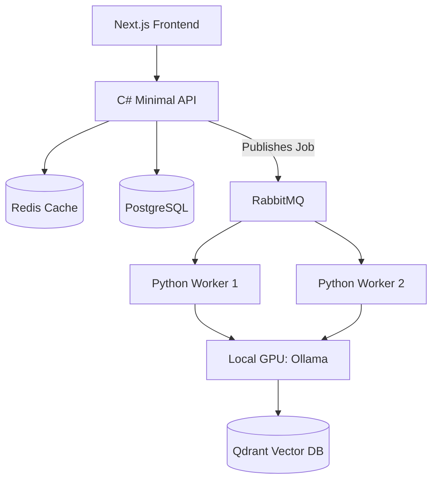

# PERFORMANCE, CAPACITY, AND SCALABILITY GUIDE

## DOCUMENT CONTROL
| Document ID | FACULTYIQ-PERF-001 |
|---|---|
| **Version** | 1.0.0 |
| **Status** | **APPROVED / BINDING** |
| **Classification** | Enterprise Confidential |
| **Owner** | Performance Engineering Council |

> [!CAUTION]
> **AUTHORITATIVE PERFORMANCE SPECIFICATION**
> This document enforces strict resource management for FacultyIQ. Because the system is designed to run "Offline First" on constrained local university hardware (e.g., dual 24GB GPUs), unoptimized Python inference code or unbounded PostgreSQL queries that trigger Out-of-Memory (OOM) killer panics are considered critical architectural failures.

---

## 1 Executive Summary

### 1.1 Purpose
To provide the definitive engineering rules for squeezing maximum throughput out of constrained local hardware while maintaining sub-second latency for UI interactions.

### 1.2 Capacity Planning Philosophy
- **Predictability Over Raw Speed**: It is better to strictly queue 100 resumes and process them in 10 minutes at a predictable memory ceiling than to process them concurrently and crash the GPU.
- **Resource Efficiency**: Data should only cross the C# ➔ Python ➔ Ollama boundary when absolutely necessary.

---

## 2 Performance Engineering Principles

1. **Scalability by Design**: The architecture MUST support scaling horizontally (adding more Docker Python workers) without locking contention on the PostgreSQL database.
2. **Offline First**: We cannot rely on AWS Auto-Scaling Groups. Capacity planning must account for peak "Hiring Season" loads using static local hardware.
3. **Observability**: Performance tuning is impossible without telemetry. OpenTelemetry tracing MUST be enabled on every microservice boundary.

---

## 3 Performance Architecture

### 3.1 End-to-End Scalability Flow

---

## 4 Performance Targets

All services MUST meet or exceed these p95 (95th percentile) SLAs under full load:
- **API Response Times (CRUD)**: `< 200ms`.
- **Knowledge Retrieval (Qdrant + CrossEncoder)**: `< 500ms`.
- **AI Inference (Resume Parsing - Qwen 3B)**: `< 15 seconds per document`.
- **UI Rendering (Next.js)**: First Contentful Paint (FCP) `< 1.0s`.

---

## 5 Capacity Planning

- **Growth Projections**: A typical R1 University processes 10,000 faculty applications per year. Peak load occurs between September and November (up to 500 applications per day).
- **GPU Capacity**: Dual RTX 3090/4090s (48GB VRAM total) can comfortably host the Embedding model (2GB), Cross-Encoder (1GB), and Qwen2.5 7B (6GB), leaving 39GB for context window KV caching and concurrent inference batches.

---

## 6 Infrastructure Sizing

- **Baseline Environment (Single Institution)**:
  - **CPU**: 16 Cores / 32 Threads.
  - **Memory (RAM)**: 64GB DDR4/DDR5.
  - **GPU**: 2x 24GB VRAM (NVIDIA Ampere/Ada generation).
  - **Disk**: 2TB NVMe Gen4 (Strictly required; spinning HDDs will cripple PostgreSQL and Qdrant IOPS).

---

## 7 AI Performance

- **Context Window Management**: LLM memory consumption scales quadratically with context length. RAG prompts MUST NOT exceed 4,000 tokens to prevent sudden VRAM exhaustion.
- **Model Quantization**: Local models MUST be quantized to 4-bit (e.g., AWQ/GGUF) to reduce memory footprint by 70% with negligible loss in accuracy.
- **Batch Processing**: Ollama does not natively batch concurrent requests well. RabbitMQ MUST enforce concurrency limits (e.g., `prefetch_count=4`) to serialize GPU execution.

---

## 8 Database Optimization

- **Connection Pooling**: PgBouncer MUST be deployed as a sidecar to PostgreSQL to multiplex 500+ C# async connections down to 50 physical database connections.
- **Indexes**: Every foreign key in PostgreSQL MUST have a corresponding B-Tree index. 
- **Vacuum Strategy**: Autovacuum is tuned aggressively (`autovacuum_vacuum_scale_factor = 0.05`) to prevent bloat in the highly-mutated `WorkflowTasks` table.

---

## 9 Vector Database Optimization

- **HNSW Indexing**: Qdrant uses Hierarchical Navigable Small World graphs. 
- **Memory Usage**: The `resumes_col` vectors MUST be kept in RAM (mmap) for sub-millisecond distance calculation, while the raw text payloads can remain on the NVMe disk to save RAM.

---

## 10 Caching Strategy

- **Redis Application Cache**: HTTP GET requests for static institutional configurations (e.g., Department hierarchies) are cached in Redis for 1 hour.
- **Embedding Cache**: To save GPU cycles, if an identical query is submitted to the RAG pipeline, the previously calculated embedding vector is pulled from Redis.
- **Invalidation**: Cache invalidation is handled via C# MediatR domain events (e.g., `DepartmentUpdatedEvent` flushes the cache key).

---

## 11 Messaging Performance

- **Backpressure**: RabbitMQ implements backpressure via Celery `worker_prefetch_multiplier`. If the workers are overwhelmed, RabbitMQ stops sending messages, preventing the Python workers from consuming all available RAM.
- **Priority Queues**: Tasks flagged as "Interactive Chat" bypass the bulk "Resume Parsing" queues to guarantee low latency for human recruiters waiting on the UI.

---

## 12 File Storage Performance

- **MinIO Chunking**: Resume PDFs (> 10MB) and interview videos MUST be uploaded via pre-signed S3 URLs directly from the Next.js frontend to MinIO, bypassing the C# API entirely to prevent memory bloat and thread starvation.

---

## 13 Frontend Performance

- **Virtualization**: Tables displaying 1,000+ candidate applicants MUST use React Virtualization (e.g., `TanStack Virtual`) to render only the DOM rows currently visible in the viewport.
- **Asset Compression**: All static assets must be served with Brotli compression.

---

## 14 Backend Performance

- **Asynchronous Processing**: The C# API MUST be 100% asynchronous (`async/await`). Blocking calls (`.Result` or `.Wait()`) are strictly forbidden as they cause thread pool starvation under high load.
- **Minimal APIs**: .NET 9 Minimal APIs are used for high-throughput webhook endpoints to avoid MVC Controller allocation overhead.

---

## 15 Scalability Strategy

- **Vertical Scaling**: Easiest path for universities. Upgrading from 1 GPU to 2 GPUs linearly doubles the throughput of the Celery Python workers.
- **Horizontal Service Scaling**: If CPU bounds are hit, the C# API and Python Workers can be replicated via Docker Swarm (`docker service scale api=3`), sitting behind a HAProxy or Nginx load balancer.

---

## 16 Benchmarking

- **Load Testing (K6)**: A 15-minute K6 script simulating 100 concurrent recruiters searching for candidates, filtering rubrics, and downloading resumes.
- **Acceptance Criteria**: The API MUST maintain `< 500ms` p95 latency and a `0.00%` HTTP 500 error rate during the K6 stress test before a release is approved.

---

## 17 Monitoring

- **Prometheus & Grafana**: The standard observability stack.
- **Key Dashboards**: 
  1. `GPU VRAM Usage` (Spikes indicate context window breaches).
  2. `RabbitMQ Queue Depth` (Indicates if AI workers are falling behind API ingestion).
  3. `PostgreSQL Cache Hit Ratio` (Must remain > 99%).

---

## 18 Performance Optimization

- **Bottleneck Analysis**: When an API endpoint violates the 200ms SLA, engineers MUST review the OpenTelemetry Jaeger trace to identify if the delay is in Entity Framework (SQL), Redis network latency, or RabbitMQ serialization.

---

## 19 Cost Optimization

- **Model Selection**: Do not route simple classification tasks to a 32B parameter model. Routing to a 3B model executes 10x faster and uses a fraction of the electricity.

---

## 20 Governance

- **Performance Audits**: Prior to major semantic releases (e.g., v2.0), the Performance Engineering Lead must sign off on the Load Testing Benchmark report.

---

## 21 Architecture Decision Records

- **ADR-PRF-001: MinIO Direct Uploads**
  - *Decision*: Next.js clients will upload directly to MinIO using pre-signed S3 URLs.
  - *Context*: Proxying large PDF/Video uploads through the C# API causes massive GC (Garbage Collection) pressure and thread starvation in .NET Kestrel.

---

## 22 Traceability Matrix

| Requirement | Performance SLA | Hardware Implementation | Optimization |
|---|---|---|---|
| Responsive UI | `< 200ms` API Latency | Redis Caching | Query Plan Tuning |
| Fast AI Review | `< 15s` per Resume | Dual RTX 4090s | AWQ Quantization |

---

## 23 Future Evolution

- **Predictive Scaling**: If the platform is eventually migrated to a multi-tenant cloud environment (e.g., Azure AKS), KEDA (Kubernetes Event-driven Autoscaling) will be used to automatically scale Python workers based on RabbitMQ queue depth.

---

## 24 Glossary

- **OOM (Out Of Memory)**: When a process demands more RAM/VRAM than is physically available, causing the OS to terminate it.
- **AWQ (Activation-aware Weight Quantization)**: A technique to compress LLMs into 4-bit precision to save VRAM while preserving output quality.

---

## 25 Revision History

| Version | Date | Status | Approvals |
|---|---|---|---|
| **1.0.0** | 2026-07-19 | **APPROVED** | Performance Engineering Council |
