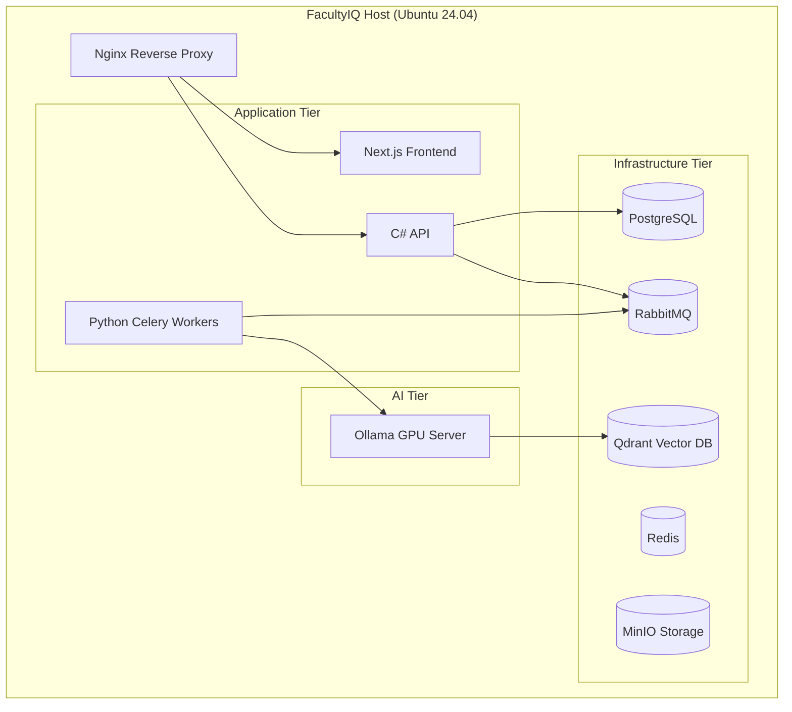

# INSTALLATION, DEPLOYMENT, AND ADMINISTRATOR GUIDE

## DOCUMENT CONTROL
| Document ID | FACULTYIQ-ADM-001 |
|---|---|
| **Version** | 1.0.0 |
| **Status** | **APPROVED / BINDING** |
| **Classification** | Enterprise Confidential |
| **Owner** | Platform Operations Council |

> [!CAUTION]
> **AUTHORITATIVE DEPLOYMENT SPECIFICATION**
> This document enforces the operational runbooks for FacultyIQ. Because the system is deployed within air-gapped university networks, administrators MUST follow the exact sequence of initialization defined herein. Improperly starting the AI workers before the RabbitMQ broker is fully synchronized will result in unrecoverable workflow states.

---

## 1 Executive Summary

### 1.1 Purpose
The Administrator Guide provides the exact blueprint for University IT departments to install, secure, monitor, and recover the FacultyIQ platform using solely local, air-gapped resources. 

### 1.2 Deployment Philosophy
- **Offline First**: The installation artifacts (Docker images, Ollama `.gguf` weights, NuGet/PyPI dependencies) must be fully packaged into a single deployable tarball. The host server must not require internet access during or after installation.

---

## 2 System Requirements

- **Supported Operating Systems**: Ubuntu 24.04 LTS Server (Recommended), Windows Server 2022 (Supported via WSL2).
- **Minimum Hardware**: 
  - CPU: 8 Cores
  - RAM: 32GB
  - GPU: 1x 24GB VRAM (NVIDIA RTX 3090/4090 or A10G)
- **Enterprise Hardware (Recommended)**:
  - CPU: 16 Cores
  - RAM: 64GB
  - GPU: 2x 24GB VRAM
  - Storage: 2TB NVMe SSD

---

## 3 Software Prerequisites

The Host OS requires the following base dependencies installed before running the initialization script:
- `docker-ce` (>= 24.0)
- `docker-compose-plugin` (>= 2.20)
- `nvidia-container-toolkit` (Required for GPU passthrough to Docker)
- `openssl` (For generating local TLS certificates)

---

## 4 Installation Architecture

### 4.1 Single Server Topology

---

## 5 Installation Procedures

### 5.1 Offline Installation Workflow
1. **Download Artifact**: On an internet-connected machine, download the `facultyiq-release-v1.0.tar.gz` bundle (contains all Docker images and `.gguf` AI models).
2. **Transfer**: Move the artifact to the air-gapped University Host via secure USB/SCP.
3. **Load Images**: Run `docker load -i facultyiq-images.tar`.
4. **Load AI Models**: Copy the `.gguf` files into the `./volumes/ollama/models` directory.
5. **Initialize**: Execute `bash ./install.sh`. This script creates the `.env` file, initializes Vault secrets, and runs `docker compose up -d`.

---

## 6 Environment Configuration

- **Configuration Files**: Stored in `./config/`.
- **Secrets Management**: FacultyIQ relies on HashiCorp Vault. During the `install.sh` run, Vault is initialized, unsealed, and the root token is exported to a secure `/root/vault_keys.txt` file. **The administrator MUST physically backup this file and delete it from the server.**

---

## 7 Database Deployment

1. **PostgreSQL Boot**: The database container starts first.
2. **Migration Execution**: The C# API container is configured to run Entity Framework Core migrations automatically upon startup (`dotnet ef database update`).
3. **Validation**: The system administrator can verify schema deployment by querying the `__EFMigrationsHistory` table.

---

## 8 AI Platform Deployment

1. **Ollama CUDA Validation**: Before starting the workers, the administrator MUST run `docker exec ollama nvidia-smi` to verify that the Docker container has successfully mounted the host's GPUs.
2. **Model Registration**: The Python initialization script issues API calls to Ollama to create the `facultyiq-qwen2.5` model from the local `.gguf` weights, setting the required `stop` tokens and XML delimitations.

---

## 9 Infrastructure Services

- **RabbitMQ**: Deployed with the Management Plugin enabled on port `15672` (restricted to `localhost` or SSH tunnel).
- **MinIO**: Acts as the local S3 replacement. The initialization script automatically creates the `resumes` and `backups` buckets and provisions the initial Access Keys.

---

## 10 Application Deployment

- **Startup Sequence**: Strict Dependency orchestration in `docker-compose.yml`:
  1. Infrastructure (PG, Redis, RMQ)
  2. AI (Ollama, Qdrant)
  3. Backend (C# API, Celery)
  4. Frontend (Next.js)
- **Health Checks**: Docker natively polls the `/health` endpoint of the C# API. The container is marked as `unhealthy` if PostgreSQL or RabbitMQ is unreachable.

---

## 11 Security Configuration

- **Reverse Proxy**: Nginx is configured strictly to enforce TLS 1.3. HTTP traffic on port 80 is unconditionally redirected to HTTPS on 443.
- **Firewall**: The Host OS `ufw` must be configured to deny all ingress traffic EXCEPT ports 443 (HTTPS) and 22 (SSH for administrators). Port 5432 (PostgreSQL) MUST NOT be exposed to the university LAN.

---

## 12 Administrator Dashboard

- **Grafana**: Available at `https://facultyiq.university.edu/admin/grafana`.
- **Pre-configured Dashboards**:
  - `Node Exporter`: CPU/RAM usage of the Host.
  - `Nvidia DCGM Exporter`: Real-time VRAM usage and GPU temperatures.
  - `RabbitMQ Exporter`: Queue depth for Resume Parsing tasks.

---

## 13 Operational Procedures

- **Daily**: Check Grafana for RabbitMQ Dead Letter Queue (DLQ) backups. If resumes are failing, investigate the traceback in the Celery logs.
- **Weekly**: Execute `docker exec postgres vacuumdb -a -z` to clear database bloat.
- **Monthly**: Rotate HashiCorp Vault intermediate certificates if necessary.

---

## 14 Backup & Recovery

- **Database Backup**: A Cron job executes `pg_dump` every 6 hours, pushing the encrypted `.sql.gz` file into the MinIO `backups` bucket.
- **Knowledge Base Backup**: Qdrant collections are snapshotted nightly using the Qdrant Snapshot API.
- **Disaster Recovery**: To restore a completely destroyed server, install a fresh OS, copy the MinIO bucket files, and execute the `restore.sh` script to rebuild PostgreSQL and Qdrant states.

---

## 15 Monitoring

- **Log Aggregation**: Docker containers log to `stdout`, which is captured by the Docker Daemon and forwarded to a local `Seq` or `ELK` container for centralized searching.
- **Alerts**: Prometheus AlertManager is configured to send SMTP emails to the IT Helpdesk if GPU temperature exceeds 85°C or if disk space drops below 10%.

---

## 16 Troubleshooting Guide

- **Symptom**: C# API returns `503 Service Unavailable`.
  - *Action*: Run `docker logs facultyiq-api`. Look for Vault unseal errors. If the server was rebooted, Vault must be manually unsealed using the keys generated during installation.
- **Symptom**: AI evaluations are failing / Resumes are stuck in "Processing".
  - *Action*: Check RabbitMQ queue depth. Run `docker logs facultyiq-celery`. Look for `CUDA Out of Memory` errors. If found, restart the Ollama container and reduce the `CELERY_CONCURRENCY` variable in `.env`.

---

## 17 Upgrade Procedures

- **Application Upgrade**:
  1. Pull the new `tar.gz` release.
  2. Load new images (`docker load`).
  3. Execute `docker compose up -d`. Docker will seamlessly recreate the API and Frontend containers while leaving the Database volumes intact.
- **Rollback Strategy**: If the new C# API fails to boot, immediately revert the `docker-compose.yml` image tag back to the previous version and run `docker compose up -d`.

---

## 18 Multi-Institution Administration

- **Tenant Provisioning**: The SuperAdmin CLI allows the creation of new Departments/Colleges within the university. `dotnet run create-tenant --name "College of Engineering"`.
- **Storage Isolation**: MinIO buckets use Path-Based isolation to ensure the Physics department cannot access Computer Science resumes.

---

## 19 Governance

- **Runbook Management**: Any modification to the `docker-compose.yml` or `install.sh` files MUST be approved by the Platform Operations Council and merged via Git. Manual edits on the production host are strictly prohibited.

---

## 20 Architecture Decision Records

- **ADR-ADM-001: Docker Compose over Kubernetes**
  - *Decision*: Phase 1 will use Docker Compose for single-server orchestration rather than forcing Universities to build Kubernetes clusters.
  - *Context*: Many university IT departments lack the resources to maintain complex K8s clusters. Docker Compose is universally understood, significantly lowering the barrier to entry for the Offline-First deployment.

---

## 21 Traceability Matrix

| Requirement | Implementation Component | Administrator Runbook |
|---|---|---|
| Zero Trust Secrets | HashiCorp Vault | Unseal Vault on Host Reboot |
| AI Hallucination Defense | Qdrant Vector DB | Nightly Snapshot Backups |

---

## 22 Future Evolution

- **Infrastructure-as-Code (IaC)**: Providing official Terraform providers and Ansible playbooks to allow automated provisioning of FacultyIQ across VMWare vSphere or Proxmox clusters.
- **Kubernetes Migration**: In Phase 4, transitioning the raw `docker-compose` files to Helm Charts for Universities that possess internal OpenShift or K8s infrastructure.

---

## 23 Glossary

- **Air-Gapped**: A security measure that involves isolating a computer or network and preventing it from establishing an external connection.
- **OOM (Out Of Memory)**: A critical state requiring manual or automated restart of affected services.
- **Dead Letter Queue (DLQ)**: A holding queue in RabbitMQ for messages that failed processing multiple times.

---

## 24 Revision History

| Version | Date | Status | Approvals |
|---|---|---|---|
| **1.0.0** | 2026-07-19 | **APPROVED** | Platform Operations Council |
