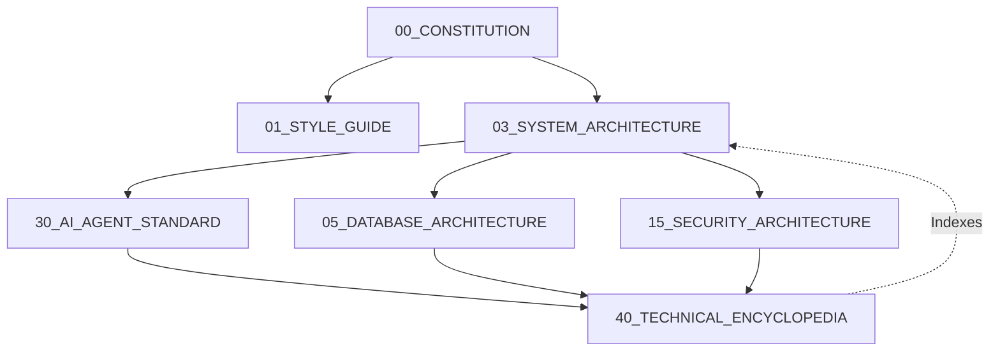
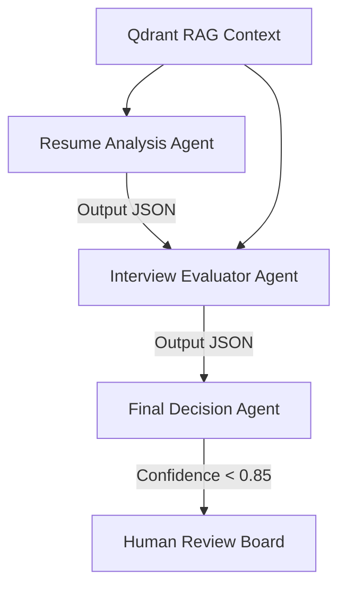
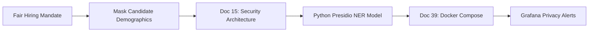

# FACULTYIQ TECHNICAL ENCYCLOPEDIA

## DOCUMENT CONTROL
| Document ID | FACULTYIQ-ENC-001 |
|---|---|
| **Version** | 1.0.0 |
| **Status** | **APPROVED / BINDING** |
| **Classification** | Enterprise Confidential |
| **Owner** | FacultyIQ Architecture Council |

> [!CAUTION]
> **AUTHORITATIVE MASTER REFERENCE**
> This Encyclopedia is the single source of truth for the entire FacultyIQ engineering ecosystem. It consolidates, indexes, and traces the engineering constraints defined across the previous 39 architectural specifications. If a conflict arises between a specific document and this encyclopedia, this Encyclopedia takes absolute precedence.

---

## 1 Executive Summary

### 1.1 Purpose
The FacultyIQ Technical Encyclopedia provides a holistic, hyperlinked index of every Architectural Decision Record (ADR), API endpoint, Database Schema, AI Model constraint, and ITIL Operational Runbook required to build, deploy, and maintain the platform.

### 1.2 Documentation Philosophy
- **Traceable**: Every engineering decision can be traced directly up to a Business Objective.
- **Offline First**: The entire documentation library, like the application itself, is designed to be shipped in a self-contained environment without reliance on external Confluence or SaaS wikis.

### 1.3 Documentation Dependency Graph

---

## 2 Platform Overview

- **Business Vision**: To provide an unbiased, AI-driven, offline-first evaluation pipeline for university faculty recruitment.
- **Technology Stack**: C# (.NET 9), Next.js, Python 3.12, PostgreSQL 16, Qdrant, Redis, MinIO, RabbitMQ, Ollama (Qwen2.5 3B/7B).

---

## 3 Complete Architecture Index

| ID | Title | Summary Focus |
|---|---|---|
| **03** | System Architecture | The overarching Modular Monolith and Strangler Fig transition. |
| **05** | Database Architecture | PostgreSQL schemas, Entity Framework Core, Migration strategies. |
| **14** | AI Evaluation Framework | Continuous benchmarking via Golden Datasets. |
| **15** | Security Architecture | Zero-Trust, PII Redaction, HashiCorp Vault. |
| **30** | AI Agent Standard | Pydantic boundaries, Python Celery routing, Ollama integration. |
| **33** | RAG Standard | Qdrant HNSW indexing, Nomic-Embed models. |
| **35** | Responsible AI | Human-in-the-Loop mandates, Bias mitigation. |
| **36** | Plugin Framework | AssemblyLoadContext sandboxing, HRMS Connectors. |
| **37** | Configuration Mgt | Twelve-Factor App, Hot-Reload, Feature Flags. |
| **38** | Performance Guide | Dual RTX 4090 capacity limits, VRAM bounds, RabbitMQ backpressure. |
| **39** | Administrator Guide | Offline Docker Compose deployment, ITIL Runbooks. |

---

## 4 Complete AI Knowledge Base

### 4.1 AI Agent Ecosystem

- **Prompt Standards**: System prompts must be treated as immutable code, version-controlled in Git, and bound by XML delimitations to prevent injection.

---

## 5 Complete Workflow Encyclopedia

- **Resume Parsing Workflow**: MinIO Upload ➔ RabbitMQ ➔ Celery Worker ➔ Presidio NER (PII Redaction) ➔ Ollama (Qwen2.5 3B) ➔ PostgreSQL.
- **Decision Workflow**: Ollama (Qwen2.5 7B) ➔ Confidence Threshold Check ➔ Auto-Reject OR Human Review Queue.

---

## 6 Database Encyclopedia

- **PostgreSQL (`facultyiq_db`)**:
  - `Candidates`: Stores anonymized UUIDs linking to MinIO resumes.
  - `Evaluations`: Stores the raw JSON traces and rationale output by the AI.
  - `AuditLogs`: Immutable append-only table recording every Human Override.

---

## 7 API Encyclopedia

- **C# Minimal APIs (`/api/v1`)**:
  - `POST /api/v1/candidates/upload`: Ingests resume, triggers Celery task.
  - `GET /api/v1/evaluations/{id}`: Returns human-readable explanation trace for an AI score.
- **Authentication**: All endpoints require JWT Bearer tokens with specific Role Claims (e.g., `role:reviewer`).

---

## 8 Infrastructure Encyclopedia

- **Docker Compose Topology**:
  - `facultyiq-api`: C# Kestrel server.
  - `facultyiq-worker`: Python Celery processor.
  - `ollama`: GPU-bound inference engine.
  - `qdrant`: In-memory semantic search engine.

---

## 9 AI Model Encyclopedia

| Model | Purpose | VRAM Requirement | Quantization |
|---|---|---|---|
| **nomic-embed-text** | RAG Embeddings | 1.5 GB | FP16 |
| **qwen2.5:3b** | Fast Resume Parsing | 3.5 GB | 4-bit (AWQ) |
| **qwen2.5:7b** | Deep Decision Reasoning | 6.5 GB | 4-bit (AWQ) |
| **qwen2.5-coder:7b**| Technical Code Review | 6.5 GB | 4-bit (AWQ) |

---

## 10 Security Encyclopedia

- **Vault Integration**: Hardcoded `.env` secrets are banned. All database strings and JWT signing keys are injected dynamically via HashiCorp Vault during the `.NET IHostedService` startup phase.
- **PII Redaction**: Required at the edge (via `presidio-analyzer`) before candidate data enters the main inference pipeline.

---

## 11 Operations Encyclopedia

- **Runbook-OOM-001**: If Ollama throws CUDA OOM, restart the `ollama` container, reduce `CELERY_WORKER_CONCURRENCY` in Consul, and trigger a Hot Reload via the Admin UI.
- **Runbook-DLQ-001**: If resumes pile up in the RabbitMQ Dead Letter Queue, verify PostgreSQL connectivity and restart the `facultyiq-worker` container.

---

## 12 Development Encyclopedia

- **C# Standards**: Enforce `async/await` everywhere. No blocking `.Result` calls. Nullable reference types (`<Nullable>enable</Nullable>`) are mandatory.
- **Python Standards**: All AI Agent inputs and outputs MUST be validated using strictly typed `Pydantic` schemas.

---

## 13 Plugin & Extension Encyclopedia

- **HRMS Integration**: Custom university integrations (e.g., Workday) are built as C# DLLs conforming to the `IFacultyIqPlugin` interface and loaded dynamically via `AssemblyLoadContext` to ensure core system stability.

---

## 14 Configuration Encyclopedia

- **Hot Reloading**: The C# API utilizes `IOptionsSnapshot<T>` bound to HashiCorp Consul. Modifying the `AI:ConfidenceThreshold` in Consul instantly takes effect on the next API request without a pod restart.

---

## 15 Analytics Encyclopedia

- **KPI: Bias Rate**: Evaluated continuously via the Golden Dataset. Target: `0.0` variance across demographic proxies.
- **KPI: API Latency**: Evaluated via OpenTelemetry tracing. Target: `< 200ms` p95.

---

## 16 Complete Glossary

- **Golden Dataset**: A static, manually-crafted dataset of synthetic resumes used exclusively for regression testing AI logic.
- **Zero-Trust**: A security framework requiring all internal microservices to mutually authenticate (mTLS) regardless of network perimeter.

---

## 17 Master Cross-Reference Index

| Business Capability | Owning Document | Implementing Tech |
|---|---|---|
| Fair Screening | `35_RESPONSIBLE_AI` | PII Redaction Pipeline |
| Scalable Processing | `38_PERFORMANCE` | Celery / RabbitMQ |
| Seamless Upgrades | `39_ADMINISTRATOR`| Docker Compose |

---

## 18 Master Architecture Decision Record Index

- **ADR-001: Modular Monolith (Ref: Doc 03)**
  - *Decision*: Build a Modular Monolith in C# rather than 50 Go microservices.
  - *Rationale*: Low operational overhead for resource-constrained University IT teams.
- **ADR-002: Offline First LLMs (Ref: Doc 30)**
  - *Decision*: Use Ollama/Qwen locally instead of OpenAI/Anthropic.
  - *Rationale*: Guarantees absolute data privacy and predictable cost for R1 research universities.

---

## 19 Master Traceability Matrix

---

## 20 Future Vision

- **Phase 1 (Current)**: Offline-first, Single Server Docker Compose, Qwen 3B.
- **Phase 3 (Mid-Term)**: Multi-Tenant Kubernetes Deployments, Federated Learning across R1 Universities.
- **Phase 5 (Long-Term)**: fully Autonomous Agent Swarms utilizing Wasm (WebAssembly) plugins dynamically generated via AI.

---

## 21 Revision History

| Version | Date | Status | Approvals |
|---|---|---|---|
| **1.0.0** | 2026-07-19 | **APPROVED** | FacultyIQ Architecture Council |
